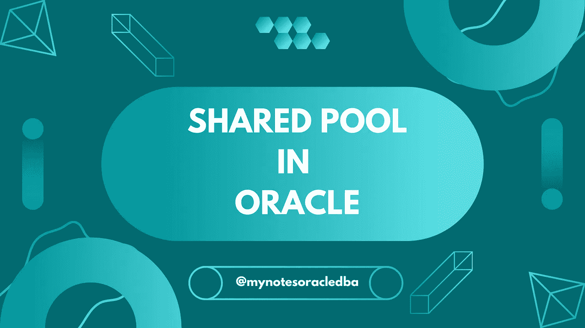
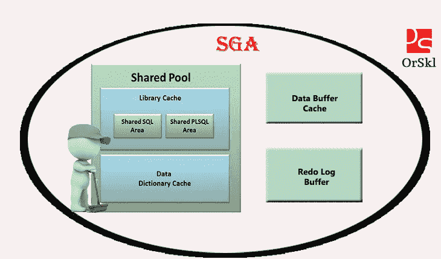

# Oracle 中的共享池是什么？

> 原文：<https://medium.com/nerd-for-tech/what-is-a-shared-pool-in-oracle-e7f4cf104ddd?source=collection_archive---------0----------------------->

在这里，我们将了解共享池的子内存

**共享池:**

*   共享池是 SGA 组件之一。SGA 有一些为所有会议所共享的组件。
*   共享池也有一些子内存。库缓存、数据字典缓存、结果缓存和其他一些缓存。
*   让我们看看所有子缓存的细节

甲骨文 **PC 中的 SGA:orskl**

**数据字典:**

*   第一个是数据字典缓存。在一个中等规模的数据库中，一秒钟内会有成百上千的会话在进行一些操作。关键是，他们中的大多数都在做非常相似的事情。
*   例如，如果您的数据库有一个薪金表，那么大多数客户都会使用不同的参数从薪金表中进行查询。
*   当我们运行 SQL 查询时，需要在执行之前完成一些步骤。但是现在，让我简单地给你解释一下。
*   当我们运行 SQL 查询时，数据库首先需要检查您键入的表或列是否为真。即这些是否在数据库中。或者，检查您是否有访问这些对象的权限。或者，如果使用选择星号，数据库需要知道表中代表哪些列。
*   所以没有必要去光盘上一遍又一遍地检查这些数据。
*   对于单个用户来说看起来这么快，但是如果我们想到每秒几千个用户，那代价就非常大了。
*   因此，数据字典缓存存储了数据库对象及其权限的定义。

**结果缓存:**

*   共享池的下一个子内存区域是结果缓存。
*   如果某个查询在时间上被重复使用，则该查询的结果将被存储在结果缓存中，并用于下一次调用。
*   此外，我们已经实时意识到，如果我们第一次运行查询，它会在几秒钟内返回。
*   但是如果我们再次运行相同的查询，它会立即返回。因为第二次是直接从结果缓存返回结果，而不是读盘。
*   它太快了。因为结果缓存不仅存储查询结果，还存储函数结果。
*   如果一个函数被重复使用并返回相同的结果，它也将被存储在这里，并在下一次调用结果缓存时被处理。
*   结果缓存存储最常用的数据，这取决于分配的大小和执行的不同查询或函数的数量。
*   当达到最大内存时，它会删除最少使用的内存，并插入新的内存。因此，将数据存储在结果缓存中可以大大提高性能。
*   但这不是我们做的事情。这是由数据库自动完成的。

**库缓存:**

*   下一个子内存区域是库缓存。
*   正如我之前提到的，当您运行 SQL 查询时，数据库不会直接进入光盘并开始读取。因为数据库中可能有万亿字节的数据，而我们的表中可能有千兆字节的数据。
*   所以尝试直接阅读效率不会那么高。
*   为此，Oracle 创建了一些关于如何从磁盘或缓冲区高速缓存中读取数据的执行计划。
*   它可能会使用一些索引，或者读取整个表会更好，或者通过哪种类型的连接方法来连接表会更有效等等。
*   有数百种方法来执行您的查询，服务器需要找到最佳的计划。所以生成这个计划是一个昂贵的操作。
*   服务器需要查找许多位置、视图、统计数据等。来产生它。
*   所以这需要一些时间和许多 I/O 操作。但是大多数时候，我们看到许多这样的查询都非常相似。或者有时是一样的。
*   所以这需要一些时间和许多 I/O 操作。但是大多数时候，我们看到许多这样的查询都非常相似。或者有时是一样的。
*   因此，对类似的查询使用相同的执行计划会更有效。
*   为此，Oracle 将这些执行计划存储在库缓存中。
*   实际上，在库缓存中的共享 SQL 区域中，当另一个会话或者您的会话使用相同的查询时，它知道如何轻松地读取数据。
*   所以这将大大提高性能。除了查询及其执行计划，库缓存还存储过程和包，以及像锁这样的控制结构

**结论:**

*   共享池中还有其他一些子内存区域。我们不需要了解他们。完美！综上所述，共享池检查字典缓存。如果我们的查询是合适的，那么检查库缓存，看是否有之前为这个查询创建的任何执行计划。
*   如果是，它将直接使用该计划。并检查该查询的结果缓存中是否有任何结果。它返回那个结果。
*   如果没有，它将根据执行计划转到磁盘或缓冲区高速缓存。
*   如果库缓存中没有执行计划，它会创建一个新的计划，并带着新的计划转到磁盘或缓冲区缓存。