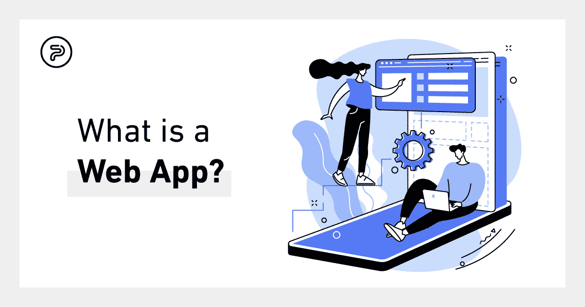

# 什么是 Web App？

> 原文：<https://medium.com/nerd-for-tech/what-is-a-web-app-be5888421956?source=collection_archive---------21----------------------->

网络应用—PopWebDesign.net

尽管我们日复一日地使用这种数字礼物，但并不是所有人都理解数字世界中的事物是如何运作的。或许，我们都听说过诸如网站、浏览器和网络服务之类的术语，但是当谈到解释这些东西是什么以及它们如何工作时，我们大多数人都很难给出一个实际的定义。

因此，在这篇文章中，我们将探索术语“web 应用程序”以及与之相关的所有知识。

# 定义

简而言之，web app(或应用程序)可以定义为通常存储在远程服务器上并借助浏览器界面通过互联网交付的应用程序。通常，根据定义，web 服务是 web 应用程序，而且网站也可能包含 web 应用程序。一些专家通常说，网站上任何能够为用户执行特定功能的组件都可以称为 web 应用程序。

从本质上来说，这些应用程序可以服务于各种各样的目的，并可以根据任何需求进行定制，无论是用于商业还是个人目的。一些最流行的网络应用程序包括简单的东西，如在线计算器、网络邮件功能，以及更复杂的功能，如电子商务商店。此外，其中一些功能可能只能从特定的浏览器访问，而大多数功能是通用的。

# 它们是如何工作的？

为了使用它们，这些应用程序不需要下载，而是通过网络访问，更具体地说，是通过网络浏览器，如 Safari、Google Chrome 或 Mozilla Firefox。

为了运行这些应用程序，它们需要一个应用服务器、一个 web 服务器和一个数据库。web 服务器负责管理来自客户端的请求，然后应用服务器完成请求的任务。最后，数据库通常存储所需的信息。

在大多数情况下，这些 web 应用程序的开发周期更短，一个更小的[开发团队](https://www.popwebdesign.net/popart_blog/en/2021/03/programming-outsourcing-revealing-strengths-and-weaknesses/)就足以完成这样一个项目。这些应用程序大多是用 SCC、JavaScript 或 HTML5 编写的。通常，客户端编程利用这些语言，它们也有助于创建应用程序的前端。另一方面，服务器端编程通常用于创建网页需要使用的必要脚本。服务器端编程语言大多包括 Ruby，Java，或者 Python。

# 网站和网络应用的区别

大多数时候，人们也很难区分网络应用和网站。将两者混为一谈并不罕见，因此在本节中，我们将指出它们之间的主要区别。

通常，专家将网站定义为一组相互链接的网页，这些网页可以从世界各地访问，并共享相同的域名。网站不是为典型的网站所有者保留的，他们可以由企业、组织和个人经营，他们可以满足各种不同的目的。一个伟大的(可能是最简单的)网站的例子是博客。

图片来源:Unsplash

可以通过网络经由 IP 地址访问网站，如互联网或局域网。

通常，它们托管在一台服务器上，但是，它们也可以同时托管在几台服务器上。

这些是用户通过网络浏览器访问的程序或软件。与移动应用不同，没有用于开发的特定 SDK。

在大多数情况下，web 应用程序开发是网站实际的一部分。应用程序本身不能被认为是一个完整的网站，但通常比网站执行更复杂和错综复杂的功能。

因此，它也是大多数网站上的一个“活跃”功能。最终用户能够操纵的东西。在大多数情况下，对于简单的网站，用户仅被限制阅读页面内容，并且大多数情况下无法以任何其他方式与网站进行交互。

# 有什么好处？

如上所述，这些应用程序有无数不同的功能，它们可以在几个方面给网站/网站所有者/企业带来好处。

*   用户不需要安装它们。
*   该应用程序可以由多个用户同时使用。
*   可以通过多种设备(台式机、笔记本电脑、移动设备)和浏览器访问它们。
*   他们有可能减少基于订阅的网络应用的盗版问题(SaaS)。
*   它们还可能降低企业和用户的成本，因为网站所有者需要的维护和支持较少，而且一般来说，对最终用户计算机的要求也较低。

# Web 应用程序。与其他应用类型相比

很有可能，你也听说过这些年不同类型的应用程序。诸如本地应用、混合应用等术语。在这一节中，我们将花一点时间来关注每一个问题。

**移动应用:**这些应用是根据特定的平台构建的，最常见的是 iOS 和 Android。你通常需要使用应用商店服务来下载和安装它们，而且通常情况下，应用程序需要访问你的相机、GPS 和其他功能才能运行。它们存在并在设备本身上运行。这些应用程序的典型例子包括 Snapchat、Facebook Messenger、Instagram、谷歌地图和无数其他应用程序，如手机游戏。如你所见，原生移动应用之间的最大区别是它们在专用设备上运行。Web 应用程序不是本地的，可以通过简单的浏览器从任何设备上访问，无需下载或安装。Web 应用程序的开发也考虑到了设备的响应能力，这通常会在 web 应用程序与移动应用程序的争论中造成最大的混乱。

图片来源:Unsplash

更准确地说，大多数网络应用程序能够适应访问它们的设备的要求和尺寸。当你通过手机上的浏览器访问一个网络应用程序时，界面看起来很可能与该程序的专用手机应用程序版本非常相似。一个很好的例子就是 Yelp 或脸书这样的平台。

**混合应用:**正如你可能已经猜到的，这些是结合了原生移动应用和网络应用元素的移动应用类型。您可以下载它们并安装在您的设备上，也可以通过您的网络浏览器运行它们。它们通常是用后端代码和本机 shell 构建的。后者使它可以下载。

当谈到这些应用类型时，专家们一致认为它们可以带来相当多的优势。其中包括:

*   另一方面，这些相同类型的应用程序也有一些小缺点。
*   由于这些应用程序不仅仅依赖 CSS 或 JavaScript 运行，它们需要更多的动力。更准确地说，他们需要与专用的混合**耗时的学习曲线:** [web 应用程序开发](https://www.popwebdesign.net/apps.html)框架集成，如 Cordova、Ionic 或 React Native。“问题是”，所有这些框架都需要一些时间来学习如何使用，它们可能需要“新”开发团队更长的开发周期，这些团队还没有任何使用这些平台的经验。

首先，在大多数情况下，你不能从应用商店获得它们，它们很容易定制，通常比混合应用提供更好的速度。

像本地网络应用一样，它们也可以离线工作，加载速度也相当快。

# 把所有的放在一起

如今，web 应用是互联网的支柱，因为它们使用户能够更多地参与在线内容，使他们能够在数字世界中扮演更积极的角色，将他们从旁观者的位置上推下来。Web 应用程序也为企业提供了很好的服务，因为它们改善了与用户的沟通，改善了整体用户体验，并使企业能够创建虚拟商店，开辟了无数不同的可能性，并加快了购买过程。网络应用只是让互联网变得更加令人兴奋和有趣。

对于企业来说，它们可以说是在不断变化的数字环境中保持竞争力的“必备功能”。

*原载于 2021 年 7 月 9 日*[*https://www.popwebdesign.net*](https://www.popwebdesign.net/popart_blog/en/2021/07/what-is-a-web-app/)*。*