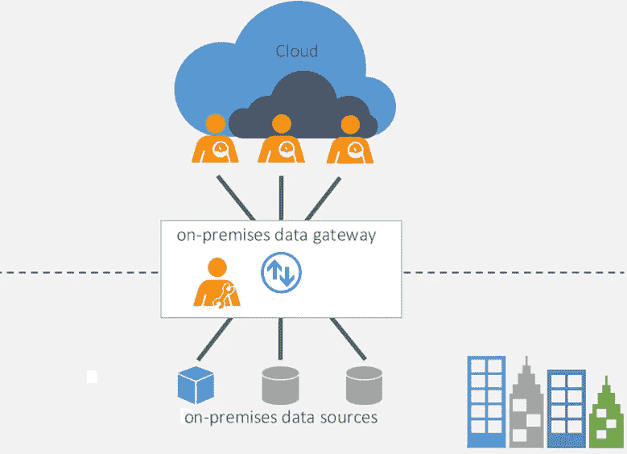
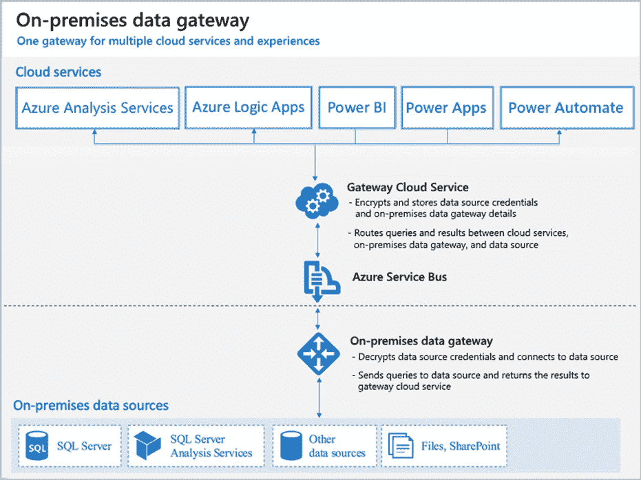

# Power BI 中的内部数据网关是什么？

> 原文：<https://medium.com/nerd-for-tech/what-is-an-on-premises-data-gateway-in-power-bi-4030ce6eccc1?source=collection_archive---------3----------------------->

大家好，我们将讨论什么是 on-prims 数据网关以及如何在 Power BI 中工作。当您基于内部数据创建 Power BI 报告并在线发布它们时，您将需要一种方法来访问您的内部数据源以刷新您的数据集。
另有网关！

大多数情况下，要共享您在 Power BI Desktop 中创建的报告，您需要将它们发布到云中的 Power BI 服务。当这种情况发生时，数据集更改的刷新机制是云，而不是您的机器，应该访问您的数据源。

Gateway 将云连接到您的 on-prims 数据源。您不仅可以访问本地数据源，还可以为 Power BI 服务中发布的数据集设置刷新调度程序。

**Power BI Gateway 有两种安装方式:**

**1)** **On-primes 数据网关:**

它将可供访问服务器的多个用户使用。

它可以用于 Power BI 中的刷新调度程序和实时查询。

您还可以将其用于 PowerApps、Logic Apps 和 Microsoft Flow。

这个网关非常适合多个用户访问多个数据源的复杂场景。

**2)** **On-primes 数据网关(个人模式):**

此网关的访问权限有限。只是，你可以使用它，你可以在 Power BI 中设置刷新定时器。

这种模式只能授权一个用户连接到源，不能与其他用户一起发布。

此模式仅在 Power BI 中可用。

这个网关非常适合于只有您一个人创建报表，并且不需要与他人共享任何数据源的场景。

不支持实时连接模式、PowerApps、Logic Apps、Microsoft Flow。

**注:**

1.在同一台计算机上，每种模式最多只能设置一个网关。

2.要成功进行计划的刷新，必须打开 Power BI 网关，并且必须打开所需的本地计算机并连接到互联网。如果计算机在刷新过程中处于睡眠状态，刷新将会失败。

**本地数据网关架构**

**当我们与连接到内部数据源的项目进行交互时会发生什么？**

1)云服务为内部数据源生成查询和加密凭证。查询和凭证被发送到网关队列进行处理。

2)网关云服务分析查询并将请求转发给 Azure 服务总线。

3)Azure 服务总线向网关发送挂起的请求。

4)网关接收查询，解密凭证，并使用这些凭证连接到一个或多个数据源。

5)网关将查询发送给数据源执行。

6)结果数据从源到网关，然后到云服务。该服务然后使用结果。

**注意:**在步骤 6 中，Power BI 刷新和 Azure Analysis Services 刷新等查询会返回大量数据。这种查询的数据临时存储在网关机器上。这种数据存储一直持续到从数据源中检索到所有数据。然后数据被发送回云服务。这个过程称为假脱机。