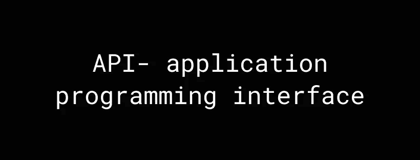

# 什么是 API？—了解它的好处

> 原文：<https://medium.com/nerd-for-tech/what-is-api-learn-its-benefits-f3c540865a20?source=collection_archive---------4----------------------->

API 如何帮助我们？我必须知道它是如何工作的吗？使用 API 有什么好处？。本文涵盖了所有这些问题的答案，并用一些最常见的例子来解释 API。

# 从术语本身你能理解什么？

应用程序编程接口是作为两方之间的接口或桥梁的应用程序？为了充分理解这一点，让我们举几个例子。用来解释 API 的最常见的例子是服务员例子。

当你去餐馆的时候，你读菜单，选择一道菜，然后把它传达给餐馆的服务员。然后服务员充当你和厨师之间的信使。他通知厨师所选的菜，并把食物送到你的桌子上。同样，API 充当信使，通知用户想要从数据库中访问什么。

# 什么是数据库？

数据库是相关数据的集合。彼此相关的原始事实是一个数据库。学生是一个实体，而学生的姓名、出生日期、地址是它的属性。

**谷歌地图 API**

像优步和 ola 这样的应用程序向我们显示出租车的预计到达时间和当前位置。这些公司使用谷歌地图的 API 来显示我们出租车的位置。这项工作变得容易了。我该怎么说呢？

像 ola、uber 或 swiggy 这样的用户不关心数据是如何组织的，也不关心用什么表来创建数据库。这些复杂性是隐藏的，我们有一个术语叫做数据抽象。

有些 API 是免费的，有些则需要付费。为了保护数据或防止滥用数据，向用户提供了一个 API 密钥，以便我们可以跟踪数据的使用情况。

**网上订票**

在网上订票的情况下，我们使用 MakeMyTrip/goibibo 等平台订票，而不是直接使用这些组织的网站。这些平台可以访问组织的 API。

如果您正在使用 MakeMyTrip 预订一个度假村，那么特定度假村的 API 将提供关于房间可用性和每晚费用的信息，并最终提供给您，即用户。这些平台利用它们的 API 收集许多这类度假胜地的信息，让你更容易预订房间。

**在线支付**

现在，让我们以网上支付为例。现在很多网站都使用 Instamojo 作为他们的支付合作伙伴。这些公司没有创建自己的支付路径和整个数据库，而是获得了 Instamojo 的 API 密钥，他们的工作就完成了。Instamojo 会检查付款细节和用户凭证，付款完成后，我们会返回到我们的采购网站。

有更多的真实世界的例子来理解什么是 API。我们到处都在使用 API，但是理解 API 如何工作比知道如何使用它更重要和必要。