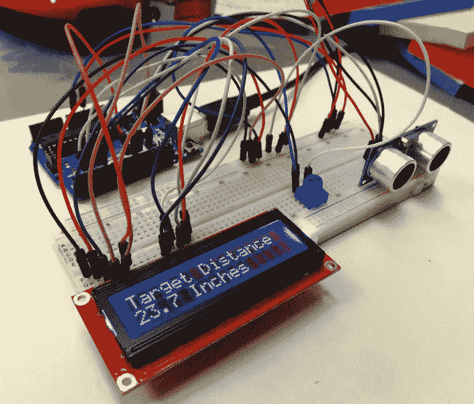
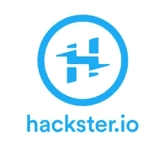
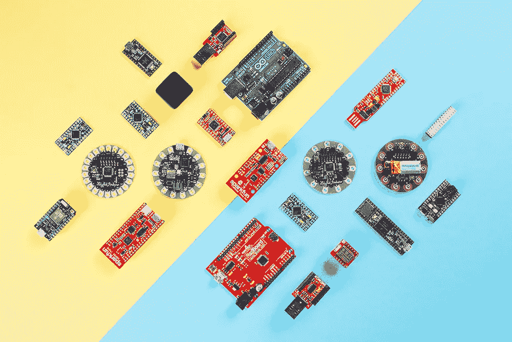
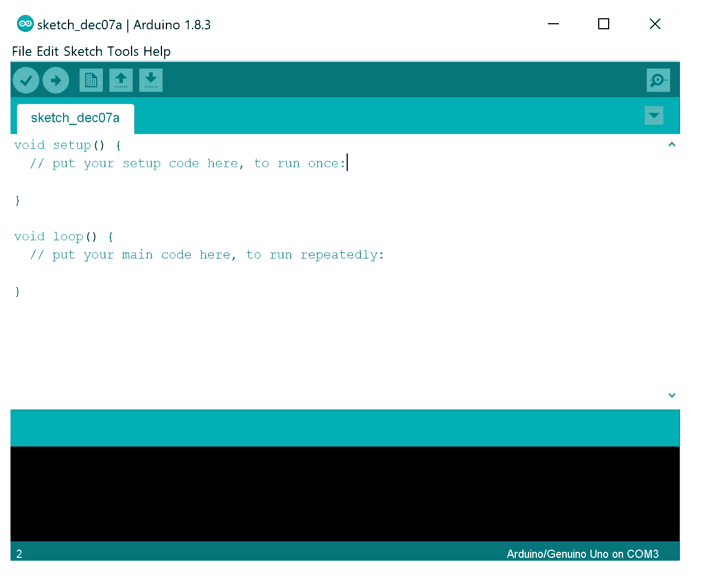

# ARDUINO 是什么？

> 原文：<https://medium.com/nerd-for-tech/what-is-arduino-3187b726dc28?source=collection_archive---------3----------------------->

今天，世界发展如此之快。但问题是，我们是吗？

今天令人惊叹的技术每天都在被我们使用。有时，我们自己也着迷于只需点击一个按钮就能做的事情。但是，如果我们可以自己制造所有这些东西呢？

# I 简介

所以，问题来了，我怎样才能创造出迷人的技术？

答案很简单:学电子。

还有，怎么入手呢？

答案是: **ARDUINO**

答所有对机器人或硬件工程感兴趣的人可能都熟悉 Arduino，除非你还没有用它做过任何东西。Arduino 是一个基于易于使用的硬件和软件的开源(向公众开放)电子平台。换句话说(为了更简单的定义)， **Arduino** 指的是一种开源电子板和用于对其编程的软件。Arduino 是任何人学习机器人、硬件工程和编程的绝佳途径。多年来，Arduino 一直是数千个项目的大脑，从日常用品到复杂的科学仪器。Arduino 板能够读取输入——传感器上的光、按钮上的手指或 Twitter 消息——并将其转化为输出——激活电机、打开 LED 或在线发布一些东西。

一个使用 Arduino 和更多组件制作的目标距离计算器！

学起来兴奋吗？开始了。

# 历史

Arduino 项目始于位于意大利伊夫雷亚的交互设计研究所伊夫雷亚(IDII)。该项目的目标是创建简单、低成本的工具来创建数字项目。当时，学生们使用一个 50 美元的基本 Stamp 微控制器，这对许多学生来说是一笔相当大的开支。2003 年，Hernando Barragán 在 Massimo Banzi 和 Casey Reas 的指导下，创建了开发平台 *Wiring* 作为 IDII 大学的硕士论文项目。连线对 Arduino 很重要，因为它是基于软件和编程语言的连线。2005 年，Massimo Banzi 与 IDII 大学的另一名学生 David Mellis 和 David Cuartielles 一起，通过增加对更便宜的 ATmega8 微控制器的支持，扩展了布线。这个新项目从布线中分出来，被称为 Arduino。

MASSIMO BANZI(ARDUINO 的创造者之一)

> “硬件成为一种文化，任何人都可以在此基础上发展，就像一首诗或一首歌一样。”
> 
> 马西莫·班齐

# 为什么是 ARDUINO？

我们知道什么是 Arduino，但为什么要选择它。有很多其他的选择，为什么选择 Arduino:

1.  Arduino 是一个**开源**的电子平台。这意味着，公众不仅可以公开使用软件和硬件，还可以不断更新和修改硬件和软件，证明 Arduino 是多种多样的电路板。事实上，各种社区的人们已经制作了大量的软件库，以使 Arduino 能够随着越来越多的电子组件的出现而更好地工作和表现。

2.除此之外，Arduino 也是最克隆的微控制器板之一。这意味着 Arduino 出乎意料的便宜。此外，Arduino 在构建您的项目时提供了许多选项供您选择。它有几块板，有的小，有的大，各有特色。

3.不仅如此，Arduino IDE(集成开发环境)是一个一体化的软件 IDE，它允许我们使用同一种语言进行编程，几乎适用于所有 Arduino 主板！这很有帮助，因为我们不必每次购买不同的 Arduino 板时都下载不同的 IDE。

Hackster，arduino 的开源社区

4.由于 Arduino 是一个开源的电子平台，一个由学生、业余爱好者、艺术家、程序员和专业人士组成的全球社区已经聚集在这个平台周围，他们的贡献已经积累了令人难以置信的大量可访问的知识，对新手和专家都有很大的帮助:)

> “只在学校受教育的孩子是未受教育的孩子”
> 
> —未知

# 五金器具

一个 rduino 是开源硬件。这意味着某些硬件版本的布局和生产文件也是可用的。虽然 arduino 板的硬件和软件设计在 copyleft 许可下可以免费获得，但开发者要求“*Arduino”*这个名称只能用于官方产品，未经许可不得用于衍生作品。大多数 Arduino 板由 Atmel 8 位 AVR 微控制器(ATmega8、ATmega168、ATmega328、ATmega1280 或 ATmega2560)组成，具有不同数量的闪存、引脚和功能。最著名和最常见的主板包括 Arduino UNO、Arduino Mega 和 Arduino Nano。这些板使用单排或双排引脚或母接头，便于编程和集成到其它电路中。这允许电线与阳头的连接以及屏蔽的连接。这里的 Shields 是指特殊的 arduino 板，可以附着在其他板上，以增加其功能。一些 arduino 板也包括以太网连接，而一些只有你的拇指那么小！像 arduino Lily 这样的特殊 Arduino 板也可以缝在衣服上，制成可穿戴设备。

一些 ARDUINO 板

# 软件

没有软件，任何硬件都是无用的。我们需要有人向董事会解释我们需要他们做什么。为此，我们必须使用董事会的语言。这种语言被称为机器代码，它以一系列 1 和 0 的形式存在于电路板或计算机的内存中。尽管机器代码对计算机来说可能很棒，但对人类来说却很难理解。20 世纪 40 年代和 50 年代的早期计算机拥有所谓的*汇编程序。这个汇编人员的工作是将汇编语言翻译成机器代码。用户可以用数字和看起来像单词的东西为计算机编写指令。虽然它仍然很难理解，但这种语言对每种类型的计算机来说也是独一无二的。这比写机器码要好，但是不得不为每台新电脑写汇编和学习一套新的指令是相当*繁重的*。因此，人们在 20 世纪 50 年代开始创造高级编程语言，如 COBOL、Lisp 和 Fortran。这些语言不用计算机的母语交流，而是依靠一个*编译器*将高级语言翻译成计算机可以理解的东西。编译器只是一个完成上述工作的程序。当你用 Arduino 编写程序时，你是用 C 和 C++的组合来编写的，c++是一种用于构造 Arduino 指令的高级编程语言。Arduino 有一个特殊的软件，称为 Arduino IDE(集成开发环境的缩写)，它为我们提供了一个将代码写入并上传到 Arduino 板的环境。*

Arduino IDE UI(用户界面)！

这都是关于 Arduino 的，相信我，这只是一个介绍。此外，我们将深入这个由电线和 pcb 组成的奇妙的电子世界！

不要忘记关注并与您的朋友和同事分享。敬请关注进一步的更新！

到那时，
继续创新！！