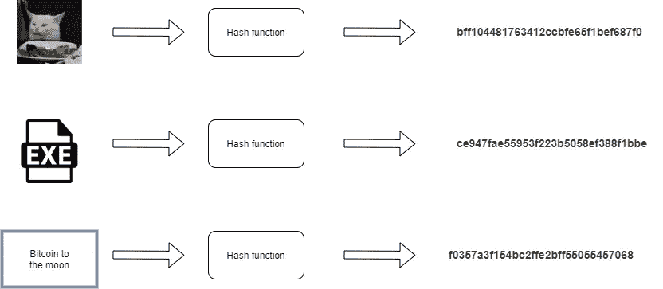
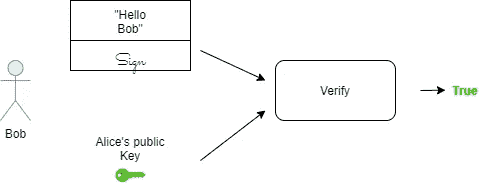

# 什么是区块链？

> 原文：<https://medium.com/nerd-for-tech/what-is-blockchain-c1f290d60342?source=collection_archive---------23----------------------->

这篇文章不是关于比特币的。这是关于比特币背后的技术。如果你想透过炒作，从技术角度理解比特币的工作原理，那么你来对地方了。本文不会告诉你是否应该投资比特币。然而，这将有助于你在这个问题上形成自己的观点。此外，区块链的应用远不止比特币。

# 第一个区块链是什么时候开始的？

比特币于 2008 年发行，让区块链成为众人瞩目的焦点。然而，第一个区块链始于 1995 年。他们每周在《纽约时报》上发布他们的区块链的哈希值。在他们 1991 年名为[“如何给一份数字文件打上时间戳”](https://link.springer.com/article/10.1007/BF00196791)的论文中，Haber 和 Stornetta 为今天所知的区块链奠定了基础。他们并没有试图开发一种去中心化的货币，而是试图解决一个更无聊的问题，即如何用数字方式给一份文件打上时间戳。

斯图尔特·哈伯拿着写有哈希值的 NYT 页面

本文涵盖了上述论文和[“提高数字时间戳的效率和可靠性”](https://link.springer.com/chapter/10.1007/978-1-4613-9323-8_24) (1995，Haber 和 Stornetta)的创新之处。我还会谈到这些论文与比特币的关系。

在开始之前，我们需要理解两个加密概念，即加密哈希函数和数字签名。

# 加密哈希函数

**散列函数**是满足以下特性的函数:

1.  **灵活的输入大小:**其输入可以是任意大小。
2.  **定长输出:**定长输出。出于我们的目的，我们假设这是 256 位。
3.  **高效:**计算效率高。用更专业的术语来说，这意味着对于大小为 *n* 的输入字符串，计算时间为 *O(n)* 。

示例哈希函数。它为任何输入生成固定长度的输出。

对于被称为**加密哈希函数**的哈希函数，还需要满足以下属性:

1.  **碰撞阻力:**这意味着对于任何输入 *x* 使得 *h(x)= y* ，我们不容易找到另一个输入，比如 z，使得 *y = h(z)。*
2.  **计算上不可逆:**给定一个散列函数的输出，很难找到计算该输出的输入。
3.  **字谜友好:**给定一个哈希函数的输入输出对，不传达任何其他输入输出对的信息。这是加密哈希函数的一个重要属性，比特币很大程度上依赖于此。

我们不会深入讨论散列函数是如何创建的。为了我们的目的，说这样一个功能存在就足够了。最常用的散列函数之一是 **SHA-256。**

作为旁注，我只列出了与区块链和比特币相关的哈希函数的属性。在散列函数的不同应用中，可能需要稍微不同的属性。

# 数字签名

数字签名是一种验证消息真实性的方案。有效的签名有两个目的:

1.  它验证消息的发送者。
2.  它验证消息的完整性，即消息在传输过程中未被更改。

这两个特性对区块链来说都很重要。下面我将简要介绍数字签名是如何工作的。

爱丽丝生成了一个密钥和一个公钥，这样她就可以加入区块链网络

假设爱丽丝决定加入我们的区块链网络。为此，她需要生成一个公共密钥(pk)和一个秘密密钥(sk)，公共密钥是网络上的每个人都知道的，而秘密密钥是她自己保留的。请注意，公钥可以兼作 Alice 的唯一用户名，充当匿名层。很难从 Alice 的公钥来识别她的身份。

现在，Alice 想向同样在网络上的 Bob 发送一条消息。

艾丽丝签署了一条信息并传送出去

她首先在消息上附上自己的签名，然后将它发送给鲍勃。

Bob 验证该传输来自 Alice

Bob 可以使用 Alice 的公钥验证消息和签名。如果消息或签名无效，那么 Bob 将知道有问题，并可以要求 Alice 重新传输消息。

注意，Bob 只知道 Alice 的公钥就足够了，不需要她的私钥来验证她的消息和签名。这是基于一个被称为非对称加密的加密分支。这方面的细节超出了本文的范围。

# 数字时间戳问题

我们生活在一个数字化的世界，以数字形式消费音乐、电影和文件。在很多情况下，创建文档的时间很重要。很难防止有人在数字内容后添加日期或在数字内容前添加日期，因为数字世界中的东西很容易被复制。

## 天真的解决方案

一个可能的解决方案是让一个中央机构在创建时存储数字内容。如果有争议，可以要求中央机关检查他们的记录。这种方法可行，但有以下缺点:

*   **带宽和存储**:需要传输和存储大文件
*   **信任**:无法检查中央机关是否腐败
*   **无能**:中央机关可能在文件的时间戳或处理过程中出错。
*   **隐私**:文件可能在传输过程中泄露。此外，中央机构可能会遭到黑客攻击。

通过一点加密技术，我们能够得到一个更好的解决方案。

## 解决方案的改进

第一个变化是将文档的散列而不是文档本身传输到中央机构。这就解决了带宽和存储的问题。它还解决了隐私问题。

中央机构在接收到散列值时附加它接收散列的时间。它对该序列进行数字签名，并将签名发送回客户端。这充当客户的收据，允许他验证文档被正确接收和处理。这是第二个变化。这就解决了信任问题。

我们仍然有无能的问题。例如，中央机构可能分配错误的时间戳。即使客户端可以通过签名找到时间戳，他也很难在没有争议的情况下纠正这一点。为了解决这个问题，我们使用了一个链接结构，其中一个文档只能添加到链的末端。

由中央权威机构存储的区块链样本

中央机构在接收到文档散列时附加客户 ID、交易 ID 和时间戳。这叫做块。收到新请求时，它会附加上一个块的哈希，并附加所有新信息以形成新块。这形成了一连串的石块，被称为区块链。

概括来说，我们的时间戳服务工作如下:

1.  客户端向中央机构发送文档的散列。
2.  中央机构通过将该散列附加到先前的散列、客户端和事务 ID 以及时间戳来形成该散列的块。该块被附加到由中央机构存储的现有链中。
3.  中央授权机构将该块的数字签名发送回客户端，以验证该文档已被正确处理。

在这种设置中，如果中央机构试图改变特定的时间戳，它将不得不改变连续块的所有散列。它还必须向每个客户发放新的签名。

如果挑战者希望检查文档的时间戳，可以向客户机请求文档的散列并在区块链中找到它。

## 分散的解决方案

到目前为止，我们一直在谈论建立一个依赖于中央权威的区块链。然而，区块链成功的一个主要因素是它的分散性。这就是比特币论文为我们提供的:一个去中心化的区块链框架。

但是如果区块链是分散的，它会被存放在哪里呢？

一个想法是让一个对等网络存储区块链的副本。这给我们带来了两个问题:

1.  **添加新块**:谁可以向链中添加新块？这是怎么做到的？
2.  **同步**:区块链如何在对等网络中同步？

我们讨论一个可能的协议来解决这个问题。关键思想是计算工作是有价值的。具有更多计算工作的区块链被认为是正确的。

当用户想要添加新文档时，他可以向对等网络广播该文档的散列。为了将这个文档添加到链中，对等点需要做一些计算工作。其思想是将一个比特序列附加到块中，这样散列总是以一定数量的零开始。由于散列函数的字谜友好特性，找到该序列的最佳策略是使用强力策略。

零的数量取决于区块链的实现。比特币改变了零的数量，因此计算它大约需要 10 分钟。请注意，这也是比特币消耗如此多能量并且每秒只能处理大约 7 笔交易的原因(相比之下，visa 每秒可以处理 30，000-70，000 笔交易)。

有工作证明的区块链

一旦找到这个位序列，就可以将该块添加到链中。如果对等体之间有两个不同版本的链，我们可以只使用最长的链作为我们的事实点，因为它投入了最多的工作。如果两个不同的链在网络上有相同的长度，只要等到其中一个变得更长，并使用它作为真理的观点。

# 结论

区块链使用密码学和计算机科学的一系列现有概念来提出一种新的协议。理解每个概念，理解区块链的各种设计选择和应用是很重要的。

我们已经看到区块链被应用于许多领域。社区目前正在探索其中的一些方法。区块链将在未来几年影响我们的生活。只有时间会告诉我们这种影响会有多大。