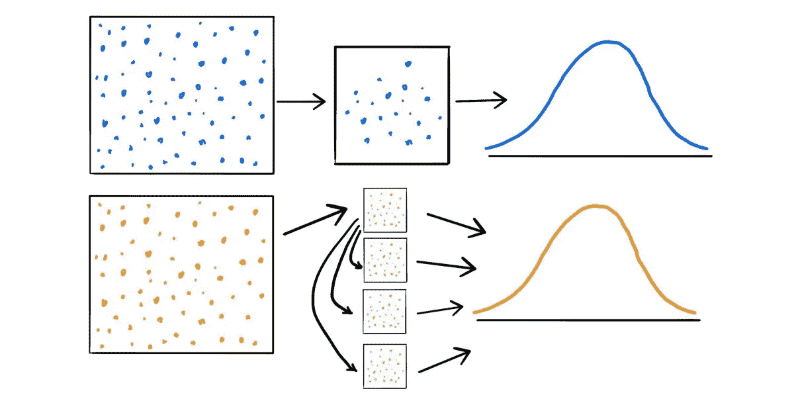
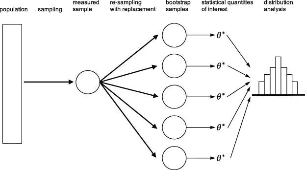

# 什么是统计学中的 Bootstrap 方法？

> 原文：<https://medium.com/nerd-for-tech/what-is-bootstrap-method-in-statistics-9197c291d5ad?source=collection_archive---------6----------------------->

# 介绍

统计学中的 Bootstrap 方法是一种统计实践，通过对许多小数据样本进行或多或少的近似来评估总体数字。Bootstrapping 为样本近似值分配精度度量。这种方法允许使用随机抽样方法估计几乎任何统计数据的抽样分布。

Bootstrap 方法估计估计量的性质，例如，通过测量从相似分布中抽样时的那些东西来估计它的变化。相似分布的唯一标准选择是实验数据的经验分布函数。在一组观察值可能预期来自自治的和相同分散的群体的情况下，这可以通过建立大量替换实验数据集的重采样来应用。

它同样被用来进行假设检验。当一个参数模型的假设有疑问时，或者当参数的含义是不可忍受的或者需要复杂的公式来计算标准误差时，它经常被用作建立在该假设上的统计推断的另一种方法。

# 描述

bootstrap 方法可以用来估计总体的数量。这是通过不断采集小样本来完成的。这是通过计算统计数据并对计算出的统计数据取平均值来实现的。我们可以将这一过程简化如下:

1.  选择要执行的多个引导示例
2.  取一个样本
3.  对于每个引导样本:(1)用选定的大小替换抽取一个样本(2)评估样本的统计数据
4.  分析计算样本统计的平均值。

更恰当地说，自举确实管用:

*   通过给出真实概率分布 J 的推断，
*   给定原始数据，
*   例如类似于经验分布ĵ的推断，
*   给定重新采样的数据。

使用重采样数据进行的关于ĵ的推论的正确性可以用我们所知道的ĵ.来评估如果ĵ是 j 的一个合理的近似，在那个时刻，j 上的推论的质量可以反过来被推断出来。

例如，假设我们想知道全世界人们的平均身高。我们可能无法估计全球人口中的所有人；因此，在它的位置上，我们只取样它的一小部分，并测量它。假设样本大小为 N；也就是；我们扩展了 N 个人的高度。[从单个样本中只能得到一个均值估计。我们需要对我们计算出的令人满意的平均值的可变性有所了解，以便对总体进行推理。](https://www.technologiesinindustry4.com/)

适度的自举方法包括获取原始的高度数据集。它还指定使用计算机，从它的测试组中形成大小也为 n 的新样本。通过使用替换采样，从原始样本中占用引导样本。因此，假设 N 足够大，对于所有实际驱动器，它与原始样本匹配的概率几乎为零。我们计算它的平均值，因为这个过程频繁很多次，并且对于所有这些 bootstrap 样本。我们现在可以制作一个自举平均值的直方图。该直方图给出了样本均值分布形式的估计，由此我们可以回答样本间均值差异有多大的问题。

# 引导程序的概要

在进行自举时，必须选择两个参数:样本的大小和要执行的程序的重复次数。

**样本量**

通常在机器学习中使用与原始数据集相似的样本大小。如果数据集很大并且计算能力是个问题，可以使用较少的样本，例如数据集大小的 50%或 80%。

**重复次数**

重复的次数必须足够多，以保证可以对样本进行有意义的统计。例如，平均值、标准偏差和标准误差。最少可能是 20 和 30 次重复。可以使用减少的值，这将更多地增加对估计值的样本计算的统计的方差。[在理想的世界中，给定时间资源，猜测的样本将尽可能大，通过成百上千次重复](https://www.technologiesinindustry4.com/)。

# 优势

*   bootstrap 的一大优点是简单。
*   这是一种直接的方法，可以导出分布的复杂估计量(即百分位、比值比、比例和相关系数)的标准误差和确信度的估计值。
*   自举同样是控制和检查结果稳定性的合适方法。
*   虽然对于大多数问题来说，很难知道真实的置信区间。Bootstrap 比使用样本方差和正态假设得到的标准区间更正确。
*   Bootstrapping 也是一种合适的方法，可以避免重复实验以获得其他组样本数据的成本。

# 缺点

*   [Bootstrap](https://machinelearningmastery.com/a-gentle-introduction-to-the-bootstrap-method/) 不提供整体有限样本保证。
*   结果可以依赖于代表性样本。
*   表面上的简单可能掩盖了这样一个事实，即在进行 bootstrap 分析时做出了重要的假设，而这些假设在其他方法中会得到更恰当的陈述。
*   此外，引导可能很耗时。

欲了解更多详情，请访问:[https://www . technologiesinindustry 4 . com/2021/07/bootstrap-method-in-statistics . html](https://www.technologiesinindustry4.com/2021/07/bootstrap-method-in-statistics.html)