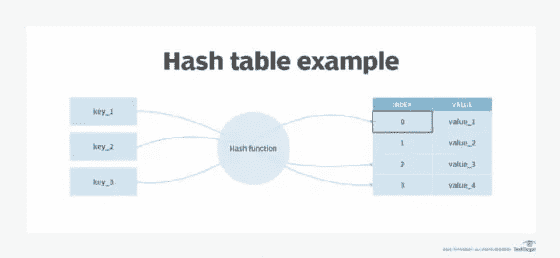
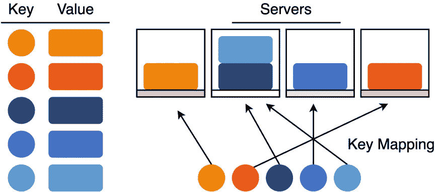
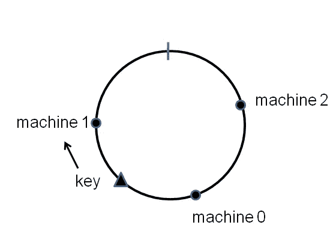

# 什么是一致性哈希？

> 原文：<https://medium.com/nerd-for-tech/what-is-consistent-hashing-ca99d1fc111b?source=collection_archive---------0----------------------->

# 首先什么是哈希？

哈希是一种使用哈希函数将键和值映射到哈希表的技术或过程。这样做是为了更快地访问元素。映射的效率取决于所使用的散列函数的效率。

设一个散列函数 H(x)映射数组中索引 x%10 处的值 x。例如，如果值列表是[11，12，13，14，15]，它将分别存储在数组或哈希表中的位置{1，2，3，4，5}。

# 向外扩展:分布式哈希

现在我们已经讨论了散列，我们准备研究分布式散列。

在某些情况下，可能需要将哈希表分成几个部分，由不同的服务器托管。这样做的主要动机之一是绕过使用单台计算机的内存限制，允许构建任意大的哈希表(给定足够多的服务器)。

在这种情况下，对象(和它们的键)分布在几个服务器中，因此命名为着色数据库或分布式缓存。

这种设置由一个缓存服务器池组成，该池托管许多键/值对，用于提供对最初存储(或计算)在其他地方的数据的快速访问。例如，为了减少数据库服务器上的负载，同时提高性能，可以将应用程序设计为首先从缓存服务器获取数据，只有当数据不在那里时(这种情况称为缓存未命中)，才求助于数据库，运行相关查询并用适当的关键字缓存结果，以便下次需要时可以找到它。

分配是如何发生的？使用什么标准来确定将哪些密钥托管在哪些服务器上？

最简单的方法是取服务器数量的散列模。即 server = hash(key) mod N，其中 N 是池的大小。为了存储或检索密钥，客户端首先计算散列，应用模 N 运算，并使用产生的索引来联系适当的服务器(可能通过使用 IP 地址的查找表)。注意，用于密钥分发的散列函数在所有客户端上必须是相同的，但是它不需要与缓存服务器内部使用的散列函数相同。

# 重复使用问题

这个分配方案简单、直观，并且运行良好。也就是说，直到服务器数量发生变化。如果其中一台服务器崩溃或变得不可用，会发生什么？当然，需要重新分配密钥来解决丢失的服务器。如果一个或多个新服务器被添加到池中，这同样适用；需要重新分配密钥以包含新的服务器。这对于任何分发方案都是正确的，但是我们的简单模分发的问题是，当服务器的数量改变时，大多数散列模 N 将会改变，因此大多数密钥将需要被移动到不同的服务器。因此，即使删除或添加了一个服务器，所有的密钥都可能需要重新散列到不同的服务器中。

在前面的例子中，如果我们删除了服务器 C，我们必须使用哈希模 2 而不是哈希模 3 来重新散列所有的键。

请注意，所有的键位置都发生了变化，不仅仅是服务器 c 中的键位置。

在我们之前提到的典型用例(缓存)中，这意味着突然之间，这些键就找不到了，因为它们还没有出现在新的位置。

因此，大多数查询都会导致未命中，并且原始数据可能需要再次从源中检索以重新散列，从而给源服务器(通常是数据库)带来沉重的负载。这很可能会严重降低性能，并可能导致原始服务器崩溃。

# 一致散列法

这个问题的解决方案是**一致散列**我们需要一个不直接依赖于服务器数量的分发方案，这样，当添加或删除服务器时，需要重新定位的密钥的数量将被最小化。一致散列是解决方案，在 1997 年的一篇[学术论文](https://www.cs.princeton.edu/courses/archive/fall09/cos518/papers/chash.pdf)中首次描述。

一致哈希是一种分布式哈希方案，它通过在抽象圆或哈希环上为服务器或对象分配一个位置，独立于分布式哈希表中的服务器或对象的数量进行操作。这允许服务器和对象在不影响整个系统的情况下进行扩展。

假设我们将散列输出范围映射到一个圆的点上。这意味着最小可能散列值 0 对应于角度 0，最大可能值(我们称之为 INT_MAX)对应于 2𝝅弧度(或 360 度)。所有其他散列值将线性地介于两者之间。所以，我们可以用一个键，计算它的散列，找出它在圆边上的位置。假设 INT_MAX 为 1010，以获得我们需要的服务器，我们将计算该值的度数，并找出哪个服务器具有该度数的范围。

# 我们也可以对我们的一致散列进行一些操作

**添加一个节点**:假设我们有 A，B，C，我们通过计算 hash 在环中添加一个新的节点 D。只有那些值在 D 和 c 之间的键才会被重新分配。现在它们不会指向 A，而是指向 D，这样可以避免重新排列所有节点

**删除一个节点**:假设我们删除了环中的节点 C。只有那些值在 C 和 b 之间的键会被重新分配，现在它们不会指向 C，而是指向 a。

# 如果一台机器离开了会发生什么？

使用一致散列，我们假设机器可以随着时间的推移离开和加入。如果一台机器离开了，我们不会丢失数据吗？为了避免这种情况，我们通常会让机器互为备份。一种策略是让每台机器复制存储在它后面的机器上的数据，给我们一个备份副本。
同样，这也是你希望向面试官提及的实施细节，即使你不会说出整个实施过程。

# 结论

一致散列是帮助我们横向扩展和管理任何分布式系统的最重要的算法之一。该算法不仅在阴影系统中工作，而且在负载平衡、数据分区、管理基于服务器的粘性会话、路由算法等方面也有应用。许多数据库的规模、性能和处理海量负载的能力都归功于一致性散列。