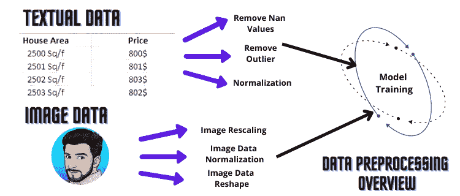

# 什么是数据预处理，我们为什么需要 That❓

> 原文：<https://medium.com/nerd-for-tech/what-is-data-preprocessing-why-we-need-that-2846b8b04bc4?source=collection_archive---------0----------------------->

P 再加工顾名思义，就是在某些场景下，对某样东西在使用或进料前的处理。因此，数据预处理意味着，在数据馈送到深度学习模型之前进行处理。在每一个机器学习或其他问题中，我们的主要因素是数据，数据预处理起着重要的作用，包括数据标准化、数据重定比例、数据整形、数据扩充、从数据中移除离群值或从数据中移除无用点等。

数据预处理技术可以随着不同的数据域而变化，即图像数据的预处理技术可以不同于文本数据的预处理技术。但是主要取决于用例。

**数据预处理**

一般来说， ***数据*** 是关于机器学习模型的性能和准确性的首要和主要因素之一。

我们为什么需要它？

有时，我们在处理一个数据集，这个数据集以前没有被任何机器学习模型使用或调整过，它来自真实世界，其中的数据及其洞察力正在定期变化。在这种情况下，数据科学家或数据工程师将需要理解数据并从中发现见解，并做出可以与现实世界数据集成的东西。但是❓
*机器学习模型不知道什么是真实数据，他们只知道机器语言。因此，在这种情况下，工程师需要以某种方式提炼和清理数据，以便可以用机器学习模型进行训练，然后在现实世界中轻松使用。*

**不同的数据预处理技术**

有许多数据预处理技术，它们的使用随着问题的角度而变化。下面我讨论了基本的数据预处理技术，这些技术可以帮助机器学习模型从数据中学习不同的特征。

**数据归一化:**这种技术很常见，在很多问题中都有广泛的应用，其中我们要将数据点转换到一个 ***特定的范围内。即【0，1】***。使用欧几里德距离的机器学习模型可以提供数据归一化的最佳结果。

**图像大小调整:**当我们处理 ***图像分类和*** 模型时，这种技术有时被标记为必要的。这里，我们需要调整图像的大小，使其尺寸与机器学习模型的输入尺寸相匹配。

**删除 Nan 值:**当一些 ***Nan*** 值出现在数据内部时，此技术主要用于文本数据。要么我们需要删除它们，要么我们需要用某些值替换它们，所以很多时候，我们用整列值的中值 ***或平均值*** 替换这些值。已经注意到，有时它对我们的结果有很大影响。

**去除异常值:**这种技术很少见，主要用于我们数据中的一些值，这些值没有被太多注意到，或者具有异常性质，并且会影响我们的结果。因此，为了达到更好的效果，我们删除了它们。

*以上是关于* ***“什么是数据预处理，我们为什么需要它？”*** *。您可以在自己的数据上尝试这些技术。*

*   利用卷积神经网络进行图像分类: [*文章链接*](/nerd-for-tech/image-classification-using-transfer-learning-vgg-16-2dc2221be34c)
*   图像分类采用迁移学习: [*文章链接*](/nerd-for-tech/image-classification-using-transfer-learning-vgg-16-2dc2221be34c)
*   从视频创建数据集:[*文章链接*](/nerd-for-tech/extraction-of-frames-from-a-single-video-2b9fdd901208)
*   yolov5 的超参数如何工作: [*文章链接*](/nerd-for-tech/how-hyperparameters-of-yolov5-works-ec4d25f311a2)
*   自定义物体检测器培训标注数据: [*文章链接*](/nerd-for-tech/labeling-data-for-object-detection-yolo-5a4fa4f05844)
*   图像分类使用迁移学习 PyTorch (Resnet18): [*文章链接*](/nerd-for-tech/image-classification-using-transfer-learning-pytorch-resnet18-32b642148cbe)

**关于我** ❓

我有超过 1 年半的软件开发经验。目前，我是一名软件工程师，通过使用零售分析、建立大数据分析工具、创建和维护模型以及加入引人注目的新数据集，为我们的客户改进产品和服务。之前，我是 Spark 基金会的计算机视觉实习生，在那里我体验了来自不同开源平台(如 kaggle、google images、open images 等)的视觉数据分析。)，并在该数据上训练不同的深度学习模型。

*   [*在 LinkedIn* 上和我联系](https://www.linkedin.com/in/muhammadrizwanmunawar/)
*   [*与我协商*](https://www.upwork.com/services/product/consultation-1477666319161577472?ref=project_share)
*   [*我的 yolov5 服务*](https://www.upwork.com/services/product/you-will-get-image-classification-projects-using-machine-learning-with-python-1323963101029052416?ref=project_share)

***如有任何问题，欢迎在下方评论***