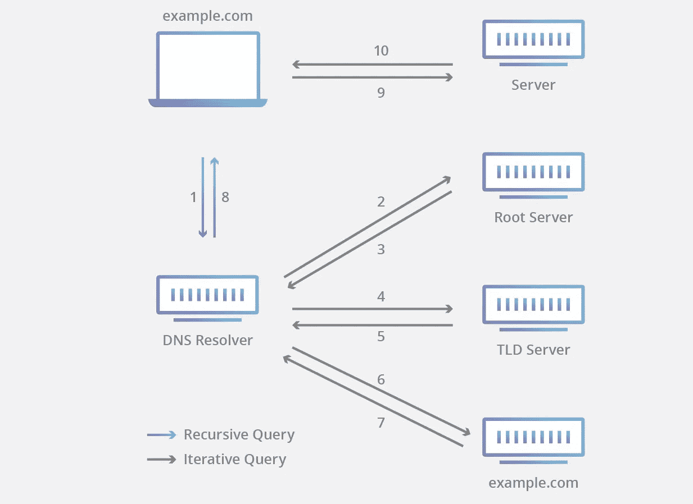
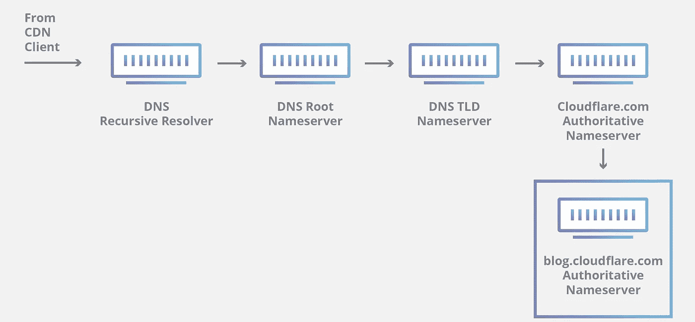
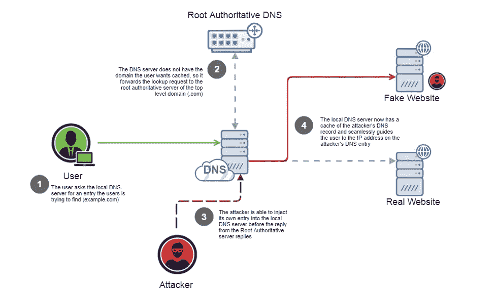
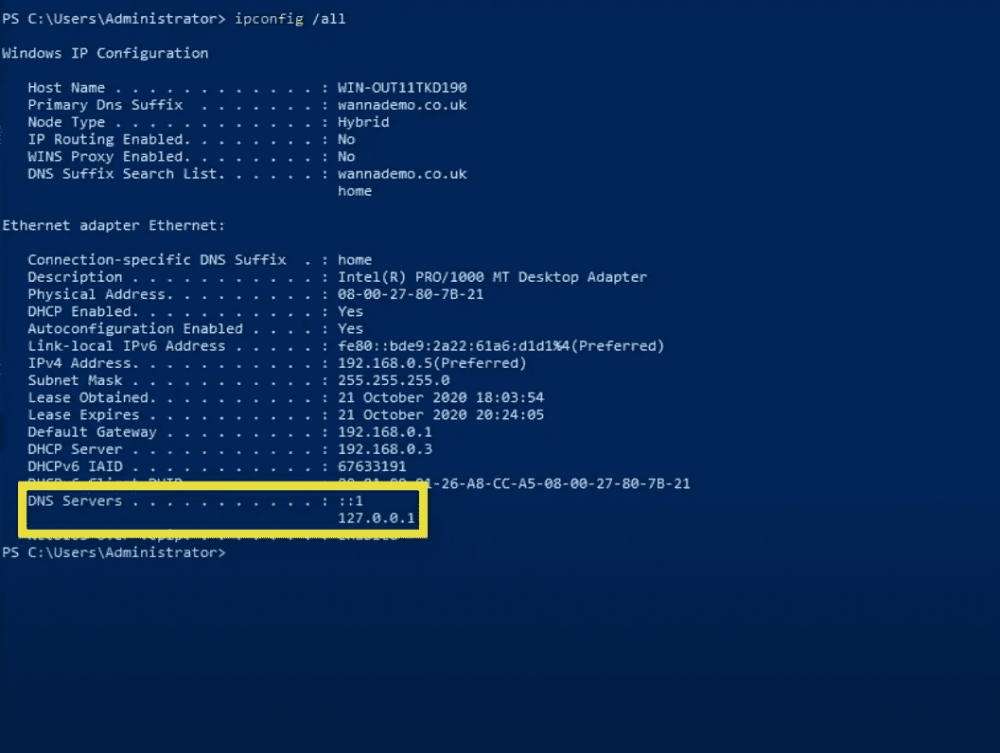
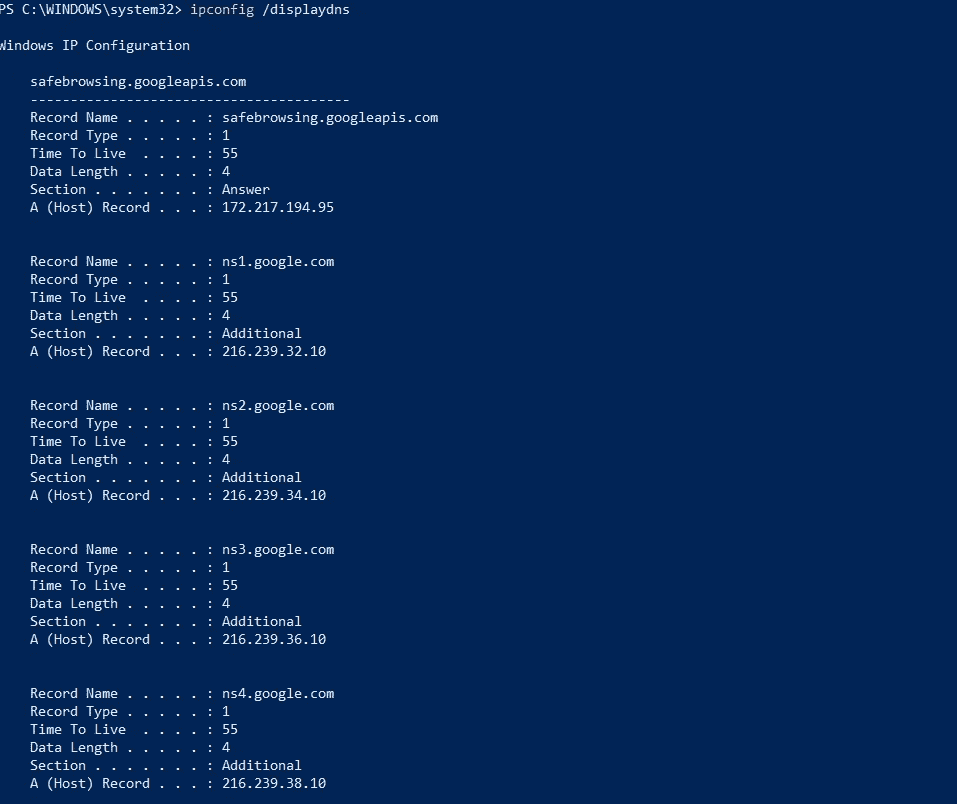

# 什么是 DNS 中毒？？

> 原文：<https://medium.com/nerd-for-tech/what-is-dns-poisoning-cd8f62e50038?source=collection_archive---------14----------------------->

来源([https://www.plixer.com/blog/dns-poisoning-fix/](https://www.plixer.com/blog/dns-poisoning-fix/))

在谈论 DNS 中毒之前，我们将了解什么是 DNS 以及它是如何工作的。通常，作为人类，我们通过 google.com、youtube.com 等域名访问网站上的信息。但是网络浏览器和计算机不能理解这些域名，因为它们与 IP 地址相互作用。因此 **DNS(域名系统)**负责在网络浏览器或计算机向指定的目的地网站发出请求之前，将该人工键入的域名和子域名翻译成 IP 地址。事实上，域名系统(DNS)就像互联网的电话簿。互联网上的所有设备都有一个唯一的 IP 地址，使每个设备之间能够进行通信。DNS 服务器消除了人们记忆 IP 地址(如 IPv4)或更复杂的字母数字 IP 地址(如 IPv6)的需要。加载网页涉及四个 DNS 服务器；

*   **DNS 递归解析器:**当客户端(计算机或 web 浏览器)在其缓存中找不到 DNS 记录时，它会向 DNS 递归解析器发出请求，要求查找给定域名的 IP。通常，DNS 递归解析器负责发出额外的请求来满足客户端的 DNS 查询。这很可能是由我们的 ISP 管理的。
*   根域名服务器:根域名服务器位于 DNS 层级的顶端。他们可以将请求提交给顶级域名(TDL)服务器。如果 DNS 递归解析器在其缓存中找不到客户端 DNS 查询详细信息，它将被定向到根名称服务器。然后根域名服务器提供对顶级域名服务器如**的引用。com** ，**。组织**，**。网**等。可以把它想象成图书馆中指向不同书架的索引。
*   **TLD 域名服务器:**顶级域名可以被认为是图书馆中一个特定的书架。DNS 递归解析器从根域名服务器获取 TDL 参考详细信息。然后在搜索特定 IP 地址时将查询转发给特定的 TDL 域名服务器，它托管主机名的最后一部分(在 google.com，TLD 服务器是 **com** )。TDL 仍然不知道我们需要的确切 IP 地址，但是它会知道权威域名服务器的位置。它包含具有特定扩展名的域的信息。com，。组织，。网等。
*   **权威域名服务器:**保存他们所服务的域名的 DNS 记录信息。这通常是 DNS 过程的最后一步，提供请求的答案。它会将所请求主机名的 IP 地址返回给发出初始请求的 DNS 递归解析器。权威名称服务器可以被认为是书架上的一本字典，其中特定的名称可以被翻译成它的定义。

图 1:完整的 DNS 查找过程概述

图 2:http://blog.cloudflare.com/T3[T5【DNS 查询流程】](http://blog.cloudflare.com/)

# DNS 中毒

DNS 中毒是 DNS 协议中的一个缺陷，攻击者可以在域名服务器中注入恶意的 IP 地址。因此攻击者可以将用户路由到恶意网站。当 DNS 协议开始为某个用户解析域名时，它将遍历 DNS 递归解析器、根域名服务器、TLD 域名服务器和权威域名服务器，并带有由 DNS 递归解析器发出的一些查询 Id。由于这一过程需要一点时间，攻击者有一些时间用不同的随机查询 ID 来暴力破解请求流，希望用他的恶意域名服务器 IP 地址替换域名解析器的用户查询 ID。容易猜测查询 ID 的原因是，在 21 世纪初，对于域名服务器收到的查询请求，它对每个新的查询 ID 使用递增机制。为了避免这个问题，他们后来引入了查询 id 的随机化和源端口的随机化，这就产生了 DNS 查询。但是 DNS 目前使用 UDP 作为传输层协议，所以没有对域名服务器收到的 DNS 信息进行验证。因此，伪造对域名服务器的暴力攻击仍然是可能的，尽管这很难。攻击者还必须知道或猜测几个因素来实施 DNS 中毒攻击；

*   目标 DNS 递归解析程序未缓存的查询。
*   DNS 递归解析器使用的端口号，因为现在它们对每个查询使用随机端口。
*   查询 ID(请求 ID)号。
*   查询将转到的权威名称服务器。

图 DNS 中毒过程概述

要查看我们的 DNS 服务器的 IP 地址，我们可以发出 **ipconfig /all** 命令。要查看我们计算机中的 DNS 缓存，我们可以使用 **ipconfig /displaydns** 命令。如果您想清除计算机中的 DNS 缓存，您可以发出 **ipconfig /flushdns** 命令。

图 4:查看 DNS 服务器的 IP 地址

图 5:如何查看计算机上的 DNS 缓存

# 防止 DNS 缓存中毒的方法

1.  DNS 欺骗检测工具的使用
2.  端到端加密
3.  域名系统的安全扩展
4.  虚拟专用网络(VPN)的使用
5.  不要点击你不认识的链接
6.  定期扫描您的计算机中的恶意软件
7.  刷新您的 DNS 缓存
8.  虚拟专用网络(VPN)的使用

除此之外，2005 年， **DNSSEC** 被引入，它代表**域名系统安全扩展**。DNSSEC 旨在验证 DNS 协议中数据和来源的完整性。DNS 最初设计时没有这种验证。这就是为什么像 DNS 中毒这样的攻击是可能的。为了在 DNS 协议中验证和认证数据，它**通过数字签名信息**使用公钥加密，就像在 SSL 和 TLS 中一样。但是，DNSSEC 仍然没有被大多数域名服务器采用，因为公钥加密有点耗时，使得 DNS 仍然容易受到攻击。

# 参考

要进一步了解详情，请查看这些资源；

*   [https://www . cloud flare . com/learning/DNS/DNS-cache-poisoning/](https://www.cloudflare.com/learning/dns/dns-cache-poisoning/)
*   [https://www.cloudflare.com/learning/dns/what-is-dns/](https://www.cloudflare.com/learning/dns/what-is-dns/)
*   [https://www . network world . com/article/3268449/what-is-DNS-and-how-it-work . html](https://www.networkworld.com/article/3268449/what-is-dns-and-how-does-it-work.html)
*   [https://www.plixer.com/blog/dns-poisoning-fix/](https://www.plixer.com/blog/dns-poisoning-fix/)
*   [https://www.kaspersky.com/resource-center/definitions/dns](https://www.kaspersky.com/resource-center/definitions/dns)
*   [https://www.youtube.com/watch?v=7MT1F0O3_Yw](https://www.youtube.com/watch?v=7MT1F0O3_Yw)