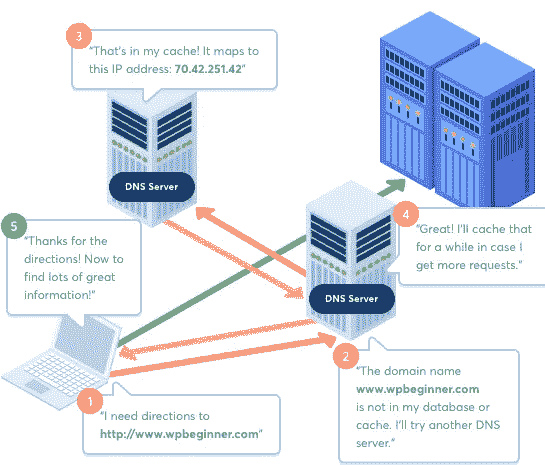
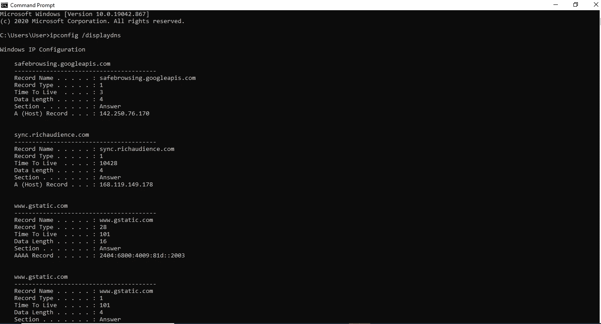
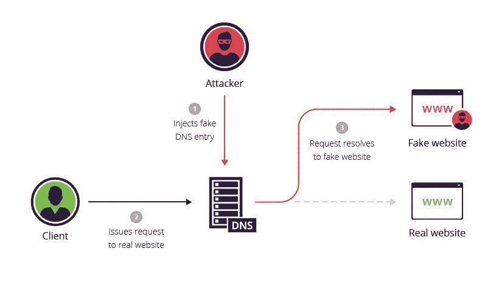

# 什么是 DNS 欺骗？

> 原文：<https://medium.com/nerd-for-tech/what-is-dns-spoofing-30108232fba7?source=collection_archive---------32----------------------->


你听说过 DNS 欺骗吗？如果没有，这篇文章会让你很好地理解 DNS 欺骗。在我们学习 DNS 欺骗之前，首先让我们了解什么是 DNS 服务器，因为不知道 DNS 服务器及其工作原理，很难理解 DNS 欺骗。

# 什么是 DNS 服务器

还记得当你还是个孩子的时候，当你有了第一台连接互联网的台式机/笔记本电脑时，你搜索的第一个网站是什么吗？假设你进入 google.com 或 YouTube.com。这样更容易记住域名或主机名。但是很难记住那个网站的 IP 地址号码，因为大多数人更擅长记住名字。所以当你想访问一个网站时，你只需要输入网址就可以了，对吗？那到底是怎么回事呢？



当您搜索网站名称时，您需要一种机制来将名称转换为 IP 地址。因此，这是 DNS 服务器发挥作用的时候了。看一下上面的图片，它请求一个特定网站的 IP 地址。由于该 DNS 服务器没有该网站的 IP 地址，它将从另一个 DNS 服务器请求并获得 IP 地址，然后将其发送给用户。因此，简单地说，域名系统(DNS)服务器所做的就是**将域名转换成 IP 地址**，这样浏览器就可以加载互联网资源。加载网页涉及 4 个 DNS 服务器:

1.  **DNS 递归器**

DNS 递归器是响应 DNS 查询并向另一个 DNS 服务器请求地址的服务器，或者已经保存了站点的 IP 地址。

**2。根域名服务器**

根名称服务器是根区域的名称服务器。它将通过顶级域名的权威域名服务器列表来响应直接请求。

**3。TLD 域名服务器**

顶级域服务器(TLD)代表顶级域服务器，承载主机名的最后一部分。

**4。权威名称服务器**

权威名称服务器是 DNS 查询的最后一站。权威名称服务器拥有该请求的 DNS 记录。

# 什么是 DNS 缓存

在上面的场景中，让我们再次假设你以前没有去过 google.com 或 YouTube.com。假设你有了第一台台式机/笔记本电脑，你首先输入 google.com 或 YouTube.com，但你的电脑不知道 google.com 或 YouTube.com 的 IP 地址，因为你以前没有访问过这些网站。这意味着它在本地 DNS 缓存中不可用。接下来发生的是，你的计算机向 DNS 服务器发送并执行 DNS 查询，询问 google.com 或 YouTube.com 的 IP 地址是什么。然后服务器用 IP 地址响应。然后在 DNS 缓存中存储这些记录。 **DNS 缓存是所有最近访问和试图访问网站和其他互联网域的记录的临时存储。**保留一份 DNS 查询的本地副本可以让您的操作系统或浏览器快速检索它，从而可以更高效地将网站的 URL 解析为相应的 IP。

要查看我们的 DNS 服务器的 IP 地址和我们计算机中的 DNS 缓存，我们可以使用下面的命令。

```
**To see the IP address of our DNS server
IPconfig/all - In Windows****To see DNS Cache
ipconfig /displaydns -In Windows**
```



# DNS 中毒

**DNS 缓存中毒，也称为 DNS 欺骗**是攻击者向 DNS 缓存中输入虚假信息的行为，因此 DNS 查询返回不正确的响应，用户被定向到错误的网站。攻击者可以利用这一点来重定向在线流量或窃取用户凭据或用户敏感信息。



所以我就简单解释一下。在上图中，攻击者首先向 DNS 服务器注入虚假的 DNS 条目，然后客户端向 DNS 服务器请求一个网站，DNS 服务器给出攻击者控制下的虚假网站的 IP 地址。用户将被定向到虚假网站。大多数时候，黑客会得到一个原始网站的副本，并把它放在一个不同的服务器上，这个服务器有不同的 IP 地址，这意味着是一个假网站。让我们说，在上面的例子中，用户想去 facebook.com，然后攻击者得到一个 facebook.com 真实网站前端的副本，然后把它放在一个不同的服务器上，这个服务器有不同的 IP 地址。所以用户没有认出它，因为它和原来的网站一样。但是，当用户提供他/她的凭据时，黑客将获得用户凭据，并将用户重定向到原来的 facebook.com 网站。然后，用户会认为他/她会输入错误的密码，并再次尝试，此时用户将登录。

# DNS 中毒的风险

1.  数据失窃

攻击者可能窃取个人信息(登录凭证、帐户详细信息、信用卡号)。

2.恶意软件感染

当用户被定向到攻击者的虚假网站时，攻击者可能会在他们的服务器上安装病毒或恶意软件。所以使用者会受到伤害。

# 如何防止 DNS 中毒

当我们考虑预防的时候。为了防止 DNS 欺骗，用户端保护是有限的。网站所有者和服务器提供商更有能力保护他们自己和他们的用户。为了适当地保证每个人的安全，双方必须尽量避免欺骗。

服务器提供商和网站所有者的预防措施如下:

1.  使用工具进行 DNS 欺骗检测
2.  端到端加密
3.  使用域名系统安全扩展(DNSSEC)

针对终端用户的预防措施如下:

1.  不要点击未识别的链接。
2.  每天扫描我们的系统中的病毒或恶意软件。
3.  通过刷新我们的 DNS 缓存解决中毒问题。
4.  使用 VPN(虚拟专用网)

如果你正在读这篇文章，你已经到了这篇博客的结尾，所以我希望你了解 DNS 服务器和 DNS 中毒。然后不断学习，保持联系。

# 参考

[https://www.cloudflare.com/learning/dns/what-is-dns/](https://www.cloudflare.com/learning/dns/what-is-dns/)

[](https://www.keycdn.com/support/dns-cache) [## 什么是 DNS 缓存以及如何刷新它-key dn 支持

### 我们已经讨论过什么是 DNS 服务器的话题，并解释了它们是如何工作的。基本上，DNS 服务器是…

www.keycdn.com](https://www.keycdn.com/support/dns-cache) [](https://www.imperva.com/learn/application-security/dns-spoofing/) [## 什么是 DNS 欺骗|缓存中毒攻击示例| Imperva

### 域名服务器(DNS)欺骗(也称为 DNS 缓存中毒)是一种攻击，在这种攻击中，被篡改的 DNS 记录被用来…

www.imperva.com](https://www.imperva.com/learn/application-security/dns-spoofing/)