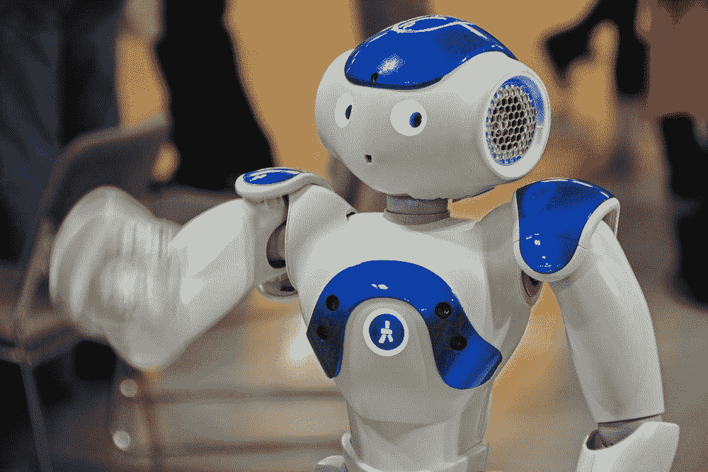

# 现代汽车的机器人项目在收购波士顿动力后在做什么？—第三部分

> 原文：<https://medium.com/nerd-for-tech/what-is-hyundai-motors-robotics-program-doing-after-the-acquisition-of-boston-dynamics-part3-af449d2aaefd?source=collection_archive---------0----------------------->

## **更先进的移动机器人**

不仅围绕汽车和机器人的概念，而且在布局元宇宙的过程中，也进行了一些创新和改变。

现代发现，纯机器人在空间体验方面似乎不够灵活或多样化。因此在“物联网(MoT)的概念下，现代还推出了基于核心机器人技术的新 PnD (Plug & Drive)模块平台。

新的 PnD 平台旨在为所有对象提供移动性。

一切都可以放在即插即用(PnD)和驱动和电梯(DnL)模块化单轮平台。PnD 平台由一个由电动马达驱动的单轮组成，带有传感器和激光雷达，允许轻松转向、制动和自主移动。有趣的是，由于标准的整体机器人一般由 4 个由电机驱动的独轮车组成，所以实际上，PnD 服务平台可以按百分比放大或缩小，每个机器人都支持智能操作和处理应用程序。这意味着它可以手动刹车，自动移动，这表明了它对机器人控制的理解。

现代汽车移动服务项目负责人 Chang-Hyeon Song 说:“移动性的核心概念是大大减少室内和室外的空间、时间和距离。“智能机器人将重塑和丰富人们的日常生活。”

在这一理念下，现代从小到大绘制了未来出行解决方案的蓝图。PnD 不仅仅是为移动性而生，它还可以作为室内和室外交通解决方案，用于人们的最后一英里，独立于更大的公共交通系统。

PnD 平台可以服务于交通，可以放置一切，这使得帮助人们在酒店存放行李，在办公环境中布置家具，以及作为急救和救援的工具或车辆成为可能。当然，这个平台更大的可能性还有待探索。

或者正如现代机器人实验室负责人 Dong Jin Hyun 所说:“在未来的世界中，我们不会移动自己的东西，但随着 PnD 模块使传统的无生命物体移动，这些东西实际上将在我们周围移动。”这无疑是一个更加令人兴奋的未来。

## **新理念下的未来**

就整个产品体系而言，可以说现代汽车想要表达的全新的机动性愿景并不局限于汽车、机器人或元宇宙。它更像是为了满足人类无限自由运动的欲望而设定的一个大目标，具体的实现方式还在探索中。

在未来，链接元宇宙和现实的机器人无疑将使人类超越距离和空间，而元宇宙的特点也可以最大程度地摆脱时间的束缚，构建无限的 IOT 科技生态系统，拓展人类的生存空间和想象空间。

## **AI 数据:帮助人工智能打破新壁垒**

从人工智能技术的研究方向来看，无论是在传统的机器学习领域还是深度学习领域，基于训练数据的监督学习仍然是一种主要的模型训练方法。尤其是在深度学习领域，需要更多的标记数据来提高模型的有效性。

目前，各行业对最优质的 AI 训练数据需求迫切。人工智能应用于各个领域，如教育、法律、智能驾驶、银行和金融等。每个领域都有细分和专业化的要求。

# 结束

将您的数据标注任务外包给[字节桥](https://tinyurl.com/yfvr5m4s)，您可以更便宜、更快速地获得高质量的 ML 训练数据集！

*   无需信用卡的免费试用:您可以快速获得样品结果，检查输出，并直接向我们的项目经理反馈。
*   100%人工验证
*   透明标准定价:[有明确定价](https://www.bytebridge.io/#/?module=price)(含人工成本)

为什么不试一试呢？

来源:https://www . robot-China . com/news/202201/13/69451 . html