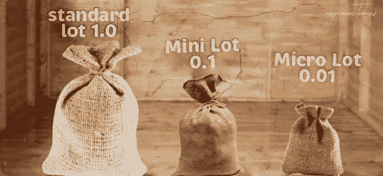
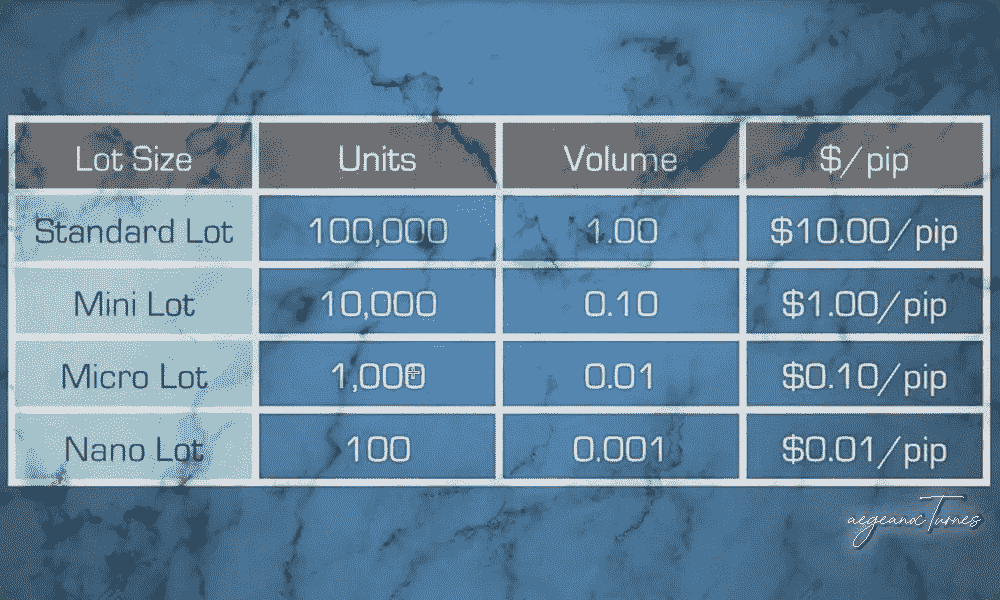

# 什么是外汇交易量？

> 原文：<https://medium.com/nerd-for-tech/what-is-lot-meaning-on-forex-market-203dd0802746?source=collection_archive---------7----------------------->

## 理想的批量应该是多少？

如果你对外汇交易感兴趣，你一定遇到过 LOT 这个词。决定你在外汇市场交易量的单位是手。正如你可能已经经历过的，外汇交易领域有很多不同的交易量。这确实给了你作为外汇交易者选择适合你的投资金额的灵活性，并且在交易中保持良好的风险管理水平。在这篇文章中，我将告诉你什么是批量，以及不同类型的批量。

图片来源:[https://unsplash.com/@austindistel](https://unsplash.com/@austindistel)

从我们文明的一开始，我们人类就为我们买卖的每样东西指定了特定的单位。从燃油到黄金，一切都是用特定的单位来衡量的，你可以用这些特定的单位来买卖。
假设你外出购买啤酒，你如何衡量你购买的啤酒数量？

很明显，你将不得不以加仑或升来购买。同样，当你在外汇市场上买卖任何东西时，你都是以一个叫做“手”的单位来做的。当你第一次在没有任何外汇交易知识的情况下进入外汇市场时，你一定遇到过 lot 这个词，并且一定一直在想它到底是什么意思。
手是交易者在外汇市场上买卖货币的单位。有不同的批量大小，每个批量大小都有一个特定的值。例如，如果你必须购买 10.000 单位的任何货币，你使用最小批量，并基于此你有利润和损失。在这篇文章中，我将为你提供所有你需要的关于批量的信息。

## 但是在开始使用 LOT 之前，最好先回顾一下 pip 问题。**pip 是什么？**

一点是货币对变动时的基本计量单位或价值。小数点后的第四个数字是点。

**举几个例子会更好理解:**

如果欧元/美元货币显示 **1.2127** ，那么这里的点是什么？
**第 7 个**是画中画。如果从 1.2127 移动到 1.2126，这意味着我们向下移动了一个点。

**再举一个例子**
美元兑日元现在在我的市场屏幕上看起来像 **108，64** ，那么这里的点是什么呢？
小数点后第二位数字。在这种情况下，第 4 个就是 pip。

在外汇市场上，这意味着什么？

## **有四种批量类型:**

> 1.标准批次
> 2。小批量
> 3。微批次
> 4。纳米批次

1.  **标准批量(1.0) [1 点= 10 美元]**

一个标准手数等于你买卖的任何货币的十万单位。这意味着当你在外汇市场购买 1 个标准手时，你将购买 100.000 单位的相关货币。例如，如果你以一个标准的手数持有美元/日元的多头头寸，这意味着你买入了十万单位的美元。
作为第二个例子，如果您以欧元/美元汇率开立 1 手买入头寸，您将买入 100.000 欧元。

所以当你使用一个标准的批量，每个点子给你 10 美元。如果你用标准手赚了 10 点，这意味着你赚了 100 美元。如果你用 20 手标准手赚了 10 点，这意味着你赚了 200 美元。

此外，标准批量比小型批量大 10 倍。

**2。最小批量(0.1) [1 点= 1 美元]**

小批量相当于 1 个标准批量的 1/10。所以才显示为 0.1。迷你很多是最常见的交易单位之一，也是经纪人的最爱之一。一个迷你手的大小相当于 10.000 个单位的你正在买卖的货币。这意味着，如果你开了一个 1 手的交易头寸，你就买了 10.000 单位的那种货币。例如，如果您以澳元/美元汇率开立 1 个小批量买入头寸，您将买入 10，000 澳元。

如果您建立的交易头寸的手数为 0.10(标准手数)，那么您购买的是 10.000 单位的该货币。

此外，小批量是小批量的 10 倍。而且，基本上每一个小批量的 pip 给你一美元。

**3。小批量(0.01) [1 点= 0.10 美元]**

一个微批量等于一千个单位。这意味着，如果您以 0.01 的手数开立交易头寸，您将获得 1000 单位的该货币。换句话说，1 个微量批次对应于 1%的批次。所以才显示为 0.01。例如，如果您以美元/尝试汇率开立 1 个小额买入头寸，您将买入 1000 美元。此外，如果您使用 x100 杠杆，您的 1 微手交易将被打开，如果您提供 10 美元作为保证金。

这里有一些例子，如果你以 0.01 的一个小批量开立英镑/日元的买入交易，这意味着你买入了 1000 单位英镑。
如果你一手交易赚了 10 点，那值多少钱？那就值一美元。
如果你在 5 手小额交易中赚了 10 点，你赚了 0.5 美元。10 点等于 1 美元，或者如果你在土耳其交易，10 点等于 1 里拉，或者如果你在英国账户，10 点等于 1 英镑。

简而言之，你赚了 10 个点，每个点值 10 美分。如果我们以 10 美分计算每一点，总共就是 1 美元。

而且，基本上每一个小批量的 pip 给你 0.10 美元或花费你 0.10 美元。

**4。纳米批量(0.001) [1 点= 0.01 美元]**

由于它对应的是非常小的单位，所以它是一个你在每个外汇公司都找不到的交易单位。虽然很少有经纪人允许你用纳米手交易，但如果你是一个初学者，想用很少的初始投资开始外汇交易，这是非常有用的。
如果您以瑞郎/ TRY 汇率开立 1 纳米手多头头寸，您将买入 100 瑞郎。
一个纳米手量相当于你所买卖货币的 100 个单位。这意味着，如果你开了一个手数为 0.001 的交易头寸，你就买了 100 单位的该货币。因此，如果你以一个纳米手量开立英镑/日元的买入头寸。这意味着你买了 100 单位的英镑。

而且，基本上一个纳米批量的每一个点子给你 0.01 美元(1 美分)或花费你 0.01 美元。

外汇批次含义表

## **为什么批量很重要？**

没有稳定的风险管理计划，你永远不会在外汇交易中获胜。交易者应该始终意识到交易中的风险，以及基于账户他可以承担的风险。

在小账户上使用较大的批量通常会导致你的账户过度杠杆化，这样做可能会在眨眼之间毁掉你的账户。因此，交易者必须知道如何正确使用手数，这样他才能有效地管理风险。

## **如何计算批量？**

你必须根据风险管理、机会中的潜在风险和其他因素来计算你的交易量。

例如，对外汇交易者来说，合理的风险管理是每次交易只承担账户 3%的风险。如果你像我一样是一个风险上瘾者，如果你像我一样血液快速流动，你可以将这个比例从 3%提高到 7%。但不能超过 7%。

所以，让我们假设你有一个 1000 美元的账户。你的信用风险是 30 点。因此，根据上述信息，您可以使用的批量大小为 0.10。

## **计算**

> 1000 美元的 3% = 30 美元
> 
> 30 点 [@0](http://twitter.com/0) .10 = $30

所以，你可以在这个交易中使用 0.10 的手数，因为使用小手数，你每次交易的风险只有你账户的 3%。

**商品 1 手多少钱呢？** 黄金、白银、石油、天然气等商品。这些货物一批多少钱？在黄金中，也就是在 XAU，1 手被确定为 100 盎司。另外，1 盎司相当于 31.10 克。在白银中，1 手相当于 5000 盎司。在石油中，1 批石油相当于 100 桶。在天然气中，1 手等于 10 万立方米。

> 现在，您已经获得了关于**批次**的必要信息，并且您已经将误开大宗交易的可能性降至零。

***祝你们几个日子红火。
敬请期待，Aegeanocturne。***