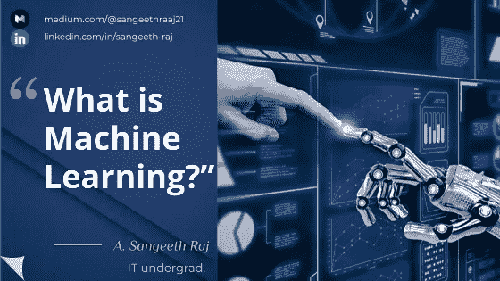
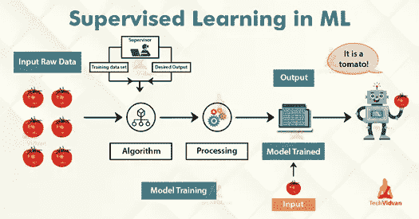
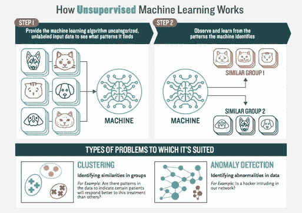
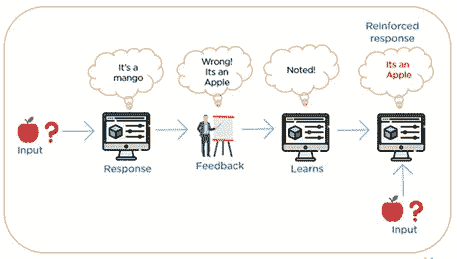

# 什么是机器学习？

> 原文：<https://medium.com/nerd-for-tech/what-is-machine-learning-132510de7d88?source=collection_archive---------17----------------------->

博客横幅

**机器学习**是一种自动建立分析模型的数据分析方法。它是人工**智能**的一个分支，基于系统可以从数据中学习、识别模式并在最少人工干预的情况下做出决策的想法。

*“机器学习是一门让计算机在没有明确编程的情况下行动的科学”——亚瑟·萨缪尔，1959 年*

## 不同的机器学习方法

## **1。监督学习**

虽然学习机器是在监督下进行的，但这种类型的训练被称为监督学习。这到底意味着什么？我们用大量关于特定案例研究的信息来训练机器，还提供案例结果。结果被称为标记数据，而其余的信息被用作输入特征。数据集(标记数据)被用作使用机器学习算法预测其他未标记数据的分类的基础。我们向机器展示了客户拖欠贷款的 100 个案例和客户没有拖欠贷款的 100 个案例。这里，违约/非违约是结果，因此是标记的数据，而所有其他特征，如姓名、年龄、工资、贷款金额、未偿金额、其他贷款历史等。是输入要素。在这种情况下，机器由标记数据监督，以了解违约结果和借款人信息之间的关系和依赖性。

监督学习

监督学习可以分为两种重要的技术:

**1)分类**

**2)回归**

分类的重点是通过分析数据和识别模式来预测定性反应，其中包括:

*K-最近邻*

*决策树*

*支持向量机*

回归技术，通常用于预测、预报和寻找定量数据之间的关系。它是最早的学习技巧之一，至今仍被广泛使用，其中一些划分是:

*逻辑回归，*

*线性判别*

## **2。** **无监督学习**

与监督学习相反，我们给出未标记或未标记的数据集，以获得数据集的输出。通常我们可以使用聚类来发现数据中的类。例如，无监督学习方法可以将一组手写数字的图像作为输入。假设它找到 10 组数据。这些簇可以分别对应于 0 到 9 的 10 个不同的数字。然而，由于训练数据没有被标记，学习的模型不能告诉我们找到的聚类的语义意义。这种技术类似于人类大脑如何组织或分类事物，因此被称为人工智能。在这个过程中，人为干预是最小的，模型必须在观察之前学会映射数据集，并给出有意义的输出。

无监督学习

无监督学习可以分为两种重要的技术:

**1)聚类**

**2)异常检测**

**3)降维**

**4)联想学习**

聚类分析会自动将数据分成聚类或相似项目的组。聚类的指导原则是，聚类内部的项目应该彼此非常相似，但与外部的项目非常不同，其中一些项目是:

*K-表示*

*数据库扫描*

*HCA*

异常检测用于检测以前未见过的罕见物体或事件，而事先对此没有任何了解。唯一可用的信息是数据集中的异常百分比很小，通常不到 1%,其中一些是:

*一类——SVM*

*隔离林*

降维这些类型算法的主要目标是研究数据的内在和隐藏结构，以便获得有意义的见解，将数据集分成相似的组或简化它们，其中一些算法是:

*PCA*

*内核 PCA*

*t-SNE*

关联学习规则允许您在大型数据库中的数据对象之间建立关联。这项技术是关于在大型数据库中发现变量之间有趣的关系。例如，购买新房的人最有可能购买新家具。

*先验*

*Eclat*

## **3。** **强化学习**

简而言之，强化学习是从过去的错误中学习，并在没有任何预定义数据集(标记或未标记)的情况下为未来采取预防措施。这种方法最大的特点就是没有主管，只有一个实数或者奖励信号。只有两种类型

1)积极——对于积极的事物，积极的观点

2)消极——对于消极的事情消极点

强化学习

*例如:基于代理的系统*