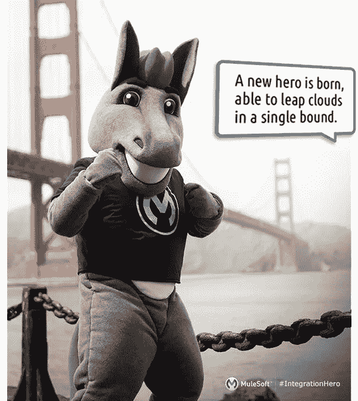
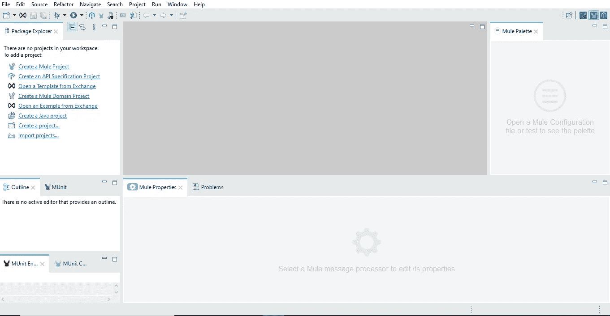
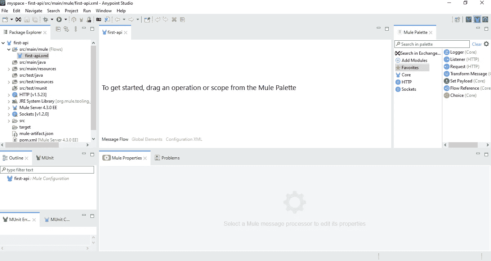
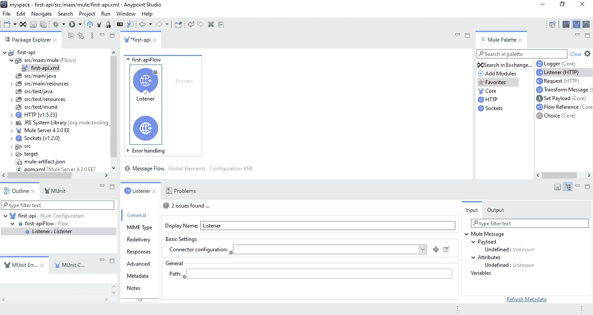
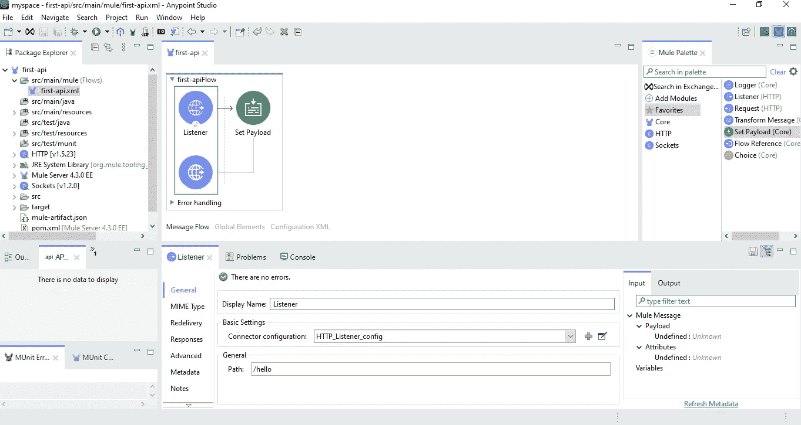
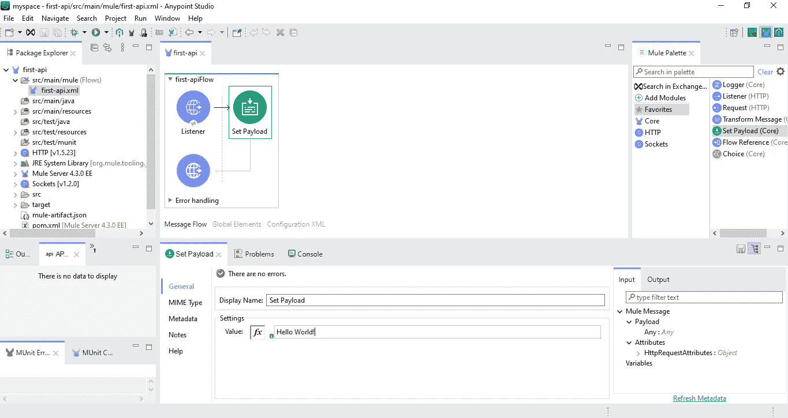
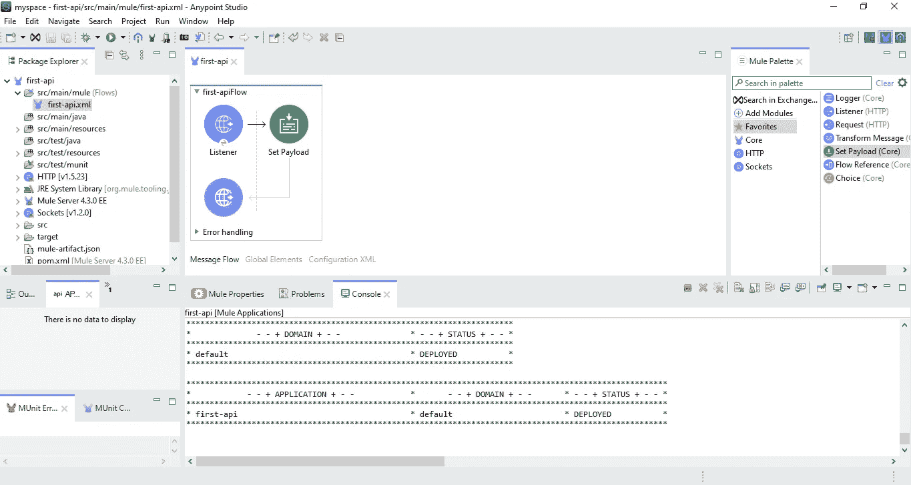
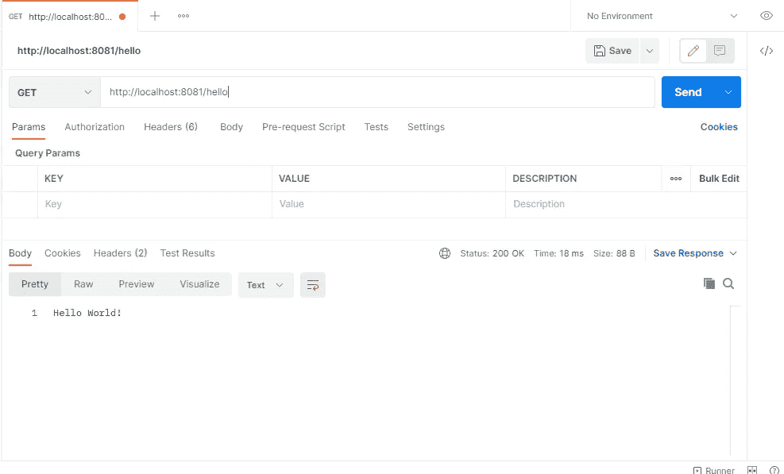

# MuleSoft 简介和在 Anypoint Studio 中编写您的第一个 API

> 原文：<https://medium.com/nerd-for-tech/what-is-mulesoft-design-your-first-api-using-anypoint-studio-c0917005b2c4?source=collection_archive---------11----------------------->

# **什么是 MuleSoft？**

随着技术的不断变化和市场上不断增长的工具，将不同的服务集成到主应用程序中并提取特定用例所需的内容已经成为一项非常令人厌倦的任务。

例如，假设有三个不同的服务 SAP、SalesForce 和 Workday。您需要将这些集成到您的应用程序中。现在，这项任务将涉及三名不同的 IT 专业人员，他们分别开发各自的 API，他们之间的通信需要大量时间，为了简单起见，还需要额外的开销来保持相同的数据格式。

有没有一个平台可以单独访问这些服务，然后根据用例合并它们，而不是经历所有这些麻烦？

MuleSoft 使用 API 主导的方法，使开发人员能够通过将服务和数据库集成到单个解决方案中来构建健壮的 web 服务，这样他们就可以致力于实际问题的解决，而不必担心与其他单个服务、数据格式等的集成。让我们在下一节看看创建 REST API 的简单步骤。

# **在 Anypoint studio 上开发你的第一个 API/Mule 应用**

Anypoint Studio 是用于构建 Mule 应用程序的软件。Mule 是 Java 企业服务总线的一个实现，因此被称为 Mule ESB。Anypoint Studio 有一个类似于 Eclipse IDE 的界面。既然基本的介绍已经完成，让我们来体验一下 Anypoint Studio。

1.  从 https://www.mulesoft.com/platform/studio 的[下载 Anypoint Studio。](https://www.mulesoft.com/platform/studio)
2.  解压缩 zip 文件，并以管理员身份运行 AnypointStudio.exe。
3.  选择或创建一个工作区，在完成上述步骤后，您将看到下面的屏幕。(工作空间只是一个创建项目的文件夹)。

4.在包浏览器中，点击“创建一个 Mule 项目”。将出现一个对话框，输入项目名称并单击 finish。

5.创建项目时，所有文件都在包资源管理器中可见。我们一般在 src/main/mule 中处理文件。

6.已经有一个名为 <project-name>.xml 的 mule 配置文件。在上面的例子中，它是 first-api.xml。您可以在编辑器中看到的空白区域称为 canvas，在这里放置处理器和监听器以创建 mule 应用程序。</project-name>

7.在右侧，有一个名为“Mule Pallete”的部分。它为开发 mule 应用程序提供了必要的事件监听器和处理器。

8.为了创建一个 API，我们总是需要一个端点或监听器来接收请求。所以首先，我们必须在我们的项目中创建一个 HTTP 侦听器。

9.将听众从骡子托盘拖到画布上。

10.它会在屏幕上显示一些错误，让我们修复它们。在屏幕的底部中央，您可以访问和编辑元素的属性。

11.我们必须向 HTTP 侦听器添加一个连接器配置，以便它知道应该在哪个主机和端口上侦听请求。

12.单击连接器配置中的 add 按钮，将主机设置为默认，将端口设置为 8081，如果您已经在端口 8081 上运行另一个服务，您可以更改它。

13.在“路径”属性中输入端点名称。我用过“/你好”。

14.将一个“Set Payload”从 mule palette 拖到监听器旁边的 process 部分，它的位置应该如上所示。Set payload 用于用一些数据填充有效载荷/响应。它可以是纯文本、JSON、XML 或任何其他格式。单击 set payload 以配置其属性。

15.在上面的截图中，我使用纯文本作为响应，字符串为“Hello World！”。这将作为对客户端在/hello 端点上调用的响应返回。同样，这可以像您希望的那样复杂，但是为了简单起见，我们使用纯文本作为响应格式。

16.我们的基本设置已经就绪。使用“Ctrl+S”保存文件。右键单击画布，然后单击“运行项目”。部署将在不到一分钟的时间内完成。

17.正如您在上面的控制台上看到的，项目已经成功编译，并且已经部署在本地主机上。

18.让我们使用 postman 向这个新创建的 REST 服务发出请求。

19.在 postman 中输入“http://localhost:8081/hello”作为 URL，并发送一个 get 请求。你应该得到“你好，世界！”以及作为响应的 HTTP 状态代码 200。

# **结论**

上面的项目是可以使用 Anypoint Studio 构建的最简单的 Mule 应用程序。通过使用不同的连接器和第三方服务，您可以无限制地实现这一点。上面这个项目可以说是 Mule 应用的“Hello World”。我希望您对 MuleSoft 有一个大致的了解，以及我们如何用最少的代码快速地构建服务。

欢迎留下关于这篇文章的建议/反馈，下一篇再见:)