# 在您的组织内实施 PCI-DSS 安全合规性的 12 项最佳实践？

> 原文：<https://medium.com/nerd-for-tech/what-is-payment-card-industry-data-security-standard-compliance-pci-dss-how-to-implement-it-4572cb4ac783?source=collection_archive---------9----------------------->

★本文为您提供了详细的信息，同时也作为指南，帮助 IT 经理、金融科技经理、管理层高管和利益相关者了解如何将 PCI DSS 合规性应用到他们组织的业务交易中，处理客户支付卡的数据。

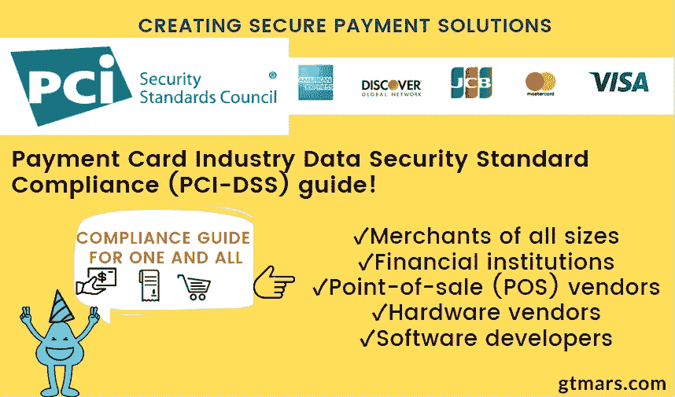

**PCI-DSS 合规性。**

★主要目标是根除现有标准之间的互操作性问题，并逐渐*减少信用卡欺诈*。自 2004 年 1.0 版发布以来。它已在全球得到广泛认可和实施。

★除此之外还有以下团队如 IT 安全管理、网络、服务器、应用开发者、数据库经理、法务、市场、销售、HR、一线经理，以及任何对支付安全感兴趣的人。，也有责任使这一实施获得成功。

> **简介:**
> 
> ★2004 年 12 月，**支付卡行业-安全标准委员会(PCI SSC)** 💳由 4 家**美国**和 **1 家日本** **跨国金融服务公司**组成，如**美国运通、Discover、万事达、Visa Inc .和 JCB International** 。

**Logo 来源:支付卡行业-安全标准委员会(PCI SSC)。**

★突然你在想，到底是什么😇！这些大巨头是如何走到一起的“ ***创造了*** ”、 ***接受了*** ”一个个共同的行业数据安全标准和原则。很好的商业模式的氛围说明了一切，他们的产品&服务都是在底层的金融模式上运作的，原则如最常见的通过 ***礼品卡、*** 借记卡、 ***预付卡、*** 。每个组织都向理事会成员提出自己的目标、原则、价值观和政策。此外，这里应该强调一点“所有创始成员共享 PCI DSS 工作的平等所有权、治理和执行权。
★通过这次金融委员会组建之旅，创建了“ ***【支付卡行业数据安全标准(PCI DSS)】***”合规。

★主要目标是根除现有标准之间的互操作性问题，并逐步减少信用卡欺诈。自从 2004 年**1.0 版**发布以来。它已在全球得到广泛认可和实施。
★以下版本的 PCI DSS 已向公众和组织提供:

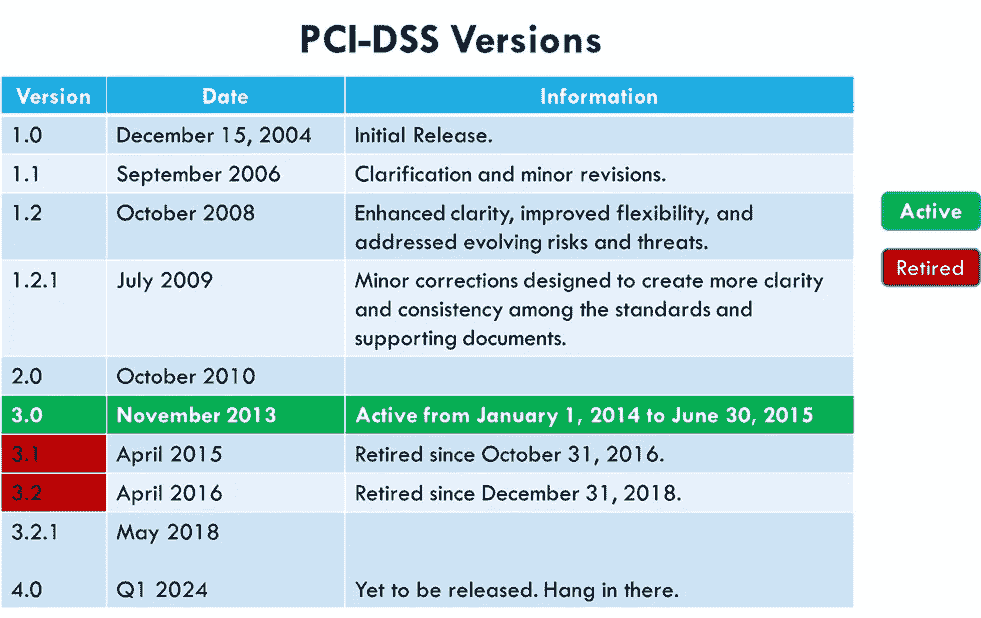

图 1。**支付卡行业数据安全标准**(**PCI DSS**)-版本。

请注意**4.0 版**正处于向公众发布的阶段。这是你理解的时间表，希望它能满足你的兴奋😉。

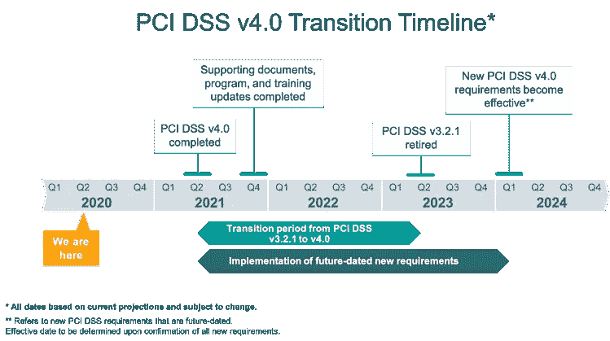

图 2。**支付卡行业数据安全标准**(**PCI DSS**)-4.0 版本。

**PCI-DSS 合规目标:**

★本 PCI DSS 的主要目的是向您介绍合规性要求，并帮助组织了解 PCI DSS 要求如何适应组织的信息安全框架，以及在基准安全控制的帮助下如何有效地实施每个安全指标。除此之外，我们还将关注与以前版本相比的变化、引入的内容以及如何遵守该标准。

***适用受众:*** 谁必须遵守🤔？

★适用于接受和处理电子交易的公司，如通过借记卡、信用卡、商店顾客卡数据或任何其他与支付卡交易相关的个人身份信息(PII)数据。2019 年，超过 19.2 亿人在线购买商品和服务。

***统计咬:*** 为了换取来自全球各地商家的商品或服务，无论是微观还是宏观卖家。根据最近万事达卡在支付安全会议上的介绍，一个有趣的统计数据表明，有超过 37，000，000 (37，000，000)个商户位置存储了支付卡数据。也就是说，Visa Inc .相信他们与全球超过 46，000，000 (46，000，000)家商户合作！VISA Inc .每秒处理 65，000 多条交易消息🤩。

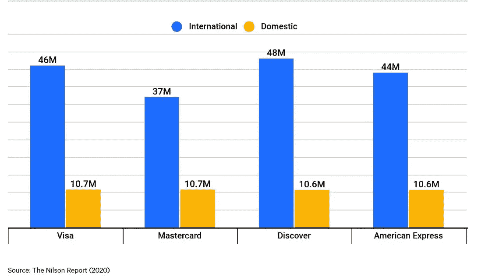

图 3 .按可接受的位置排序。资料来源:尼尔森报告。

来自这些地方的商家可能会将客户的支付卡数据存储几周、几个月或几年，然后入侵者(身份窃取者)也就是黑客就会窃取这些数据。

★同年，电子商务销售额超过 3.5 万亿美元🤑在未来 5 年内，增长速度将会进一步加快。

***商户等级指标:***

PCI 合规性指标 共有 ***4 个级别，这些指标基于您每年处理的交易数量，如图 4 所示。***

图 4。每年总交易量。

★以上每一级别的数字为您提供了关于 PCI DSS 合规性特定流程的信息。当任何一个 ***小微到中小企业再到大企业*** 未能继承，未能遵守 PCI DSS 合规性，未能减少数据上的保护和降低风险。他们可能面临数百万美元的罚款。

***服务商级别指标:***

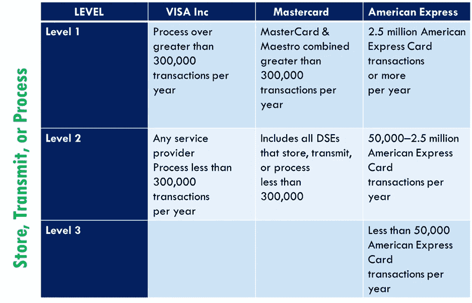

图 5。 ***服务提供商级别指标。***

★本文为您提供了详细的信息，同时也作为一个指南，帮助 IT 经理、金融科技经理、管理执行人员和利益相关者了解如何将 PCI DSS 合规性应用到他们组织与客户的业务交易中。
★除此之外还有以下团队如 IT 安全管理、网络、服务器、应用开发人员、数据库经理、法务、市场、销售、HR、一线经理，以及任何对支付安全感兴趣的人。，也有责任使这一实施获得成功。

***具体来说，你可以按照下面的规定使用:***

了解什么是 PCI DSS，我该怎么做？

了解它如何适用于您和您的组织？

了解如何应对 PCI-DSS 的 12 大主要要求？

学习如何与 PCI 评估员和内部审计员打交道？

学习如何计划和管理您的 PCI DSS 项目？

了解 PCI DSS 引用的所有现有技术和新技术？

从评估和补救流程中获得最佳实践？

***PCI DSS 的目标:***

★通过激励商家和服务提供商保护卡数据来降低支付卡交易的欺诈风险。

★对组织重要的是，PCI-DSS 旨在降低交易的欺诈风险；它试图通过说服全球的商家和服务提供商重视数据安全的许多关键方面来实现这一目标，包括网络安全、系统安全、web 应用程序安全、安全意识和安全策略。
★这是本文的亮点，它鼓励企业商家专门丢弃持卡人数据，并以消除高成本、高风险的数据存储和现场数据处理的方式开展业务。

1.构建和维护安全的网络。

2.保护持卡人数据。

3.维护一个漏洞管理程序。

4.实施强有力的访问控制措施。

5.定期监控和测试网络。

6.维护信息安全政策。

**治理、风险管理和合规** ( **GRC** ):

★好的，在详细讨论 PCI-DSS 合规性之前，建议了解什么是 G ***治理、风险管理和合规性(GRC)*** 。请继续，需要 2-3 分钟来了解 GRC。
★2007 年，对治理、风险管理和合规(GRC)等三个关键组织实践进行了 GRC 研究。GRC 是一种结构化的方法，其主要格言是“实现目标，解决不确定性，诚信行事”。通过处理风险，满足法规遵从性，可以成功地实现 IT 和业务目标。

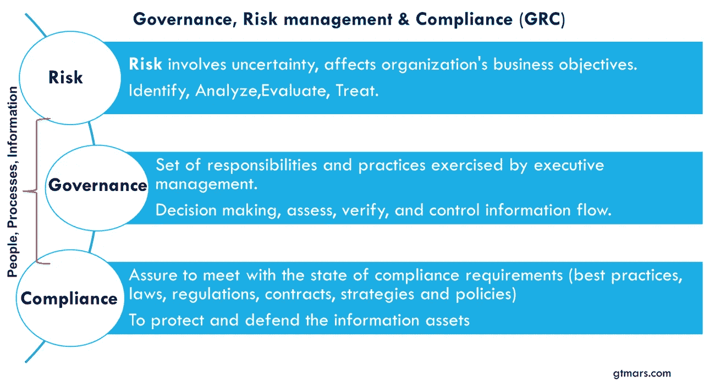

图 6。**治理、风险管理和合规** ( **GRC** )。

★从中小型企业(SMEs)到大型企业，无论其产品和服务如何，安全指标都被认为是在组织内运行的重要计划，以实现特定的安全目标、维护 CIA、满足安全合规性、进行风险管理以及处理本地隐私和安全法。可以使用行业标准基准工具来实施安全指标，以规划安全愿景，确定安全差距(识别/分析/衡量)风险，并由管理层在规定的时间框架内完成。

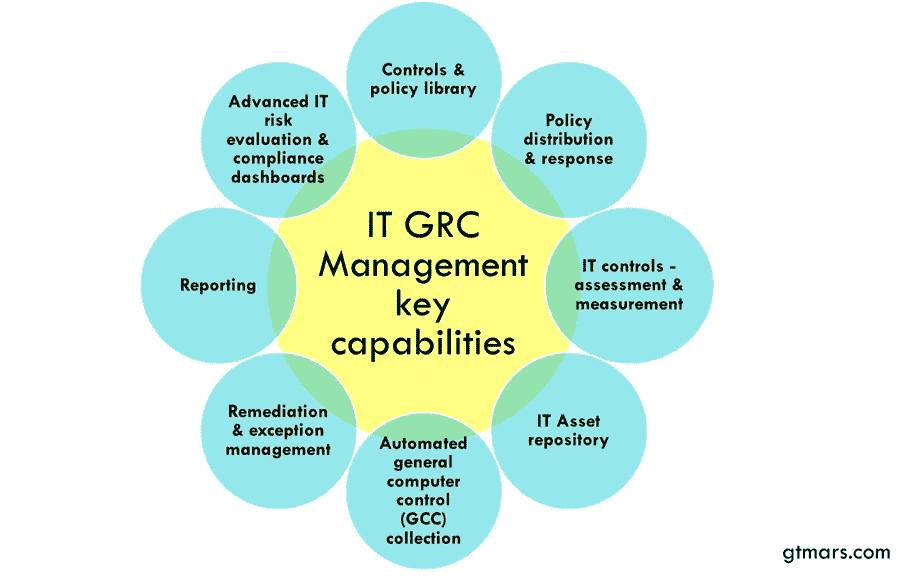

图 7。IT-GRC 管理关键能力。

**数字支付*生态系统:***

这些是参与支付卡系统的实体。

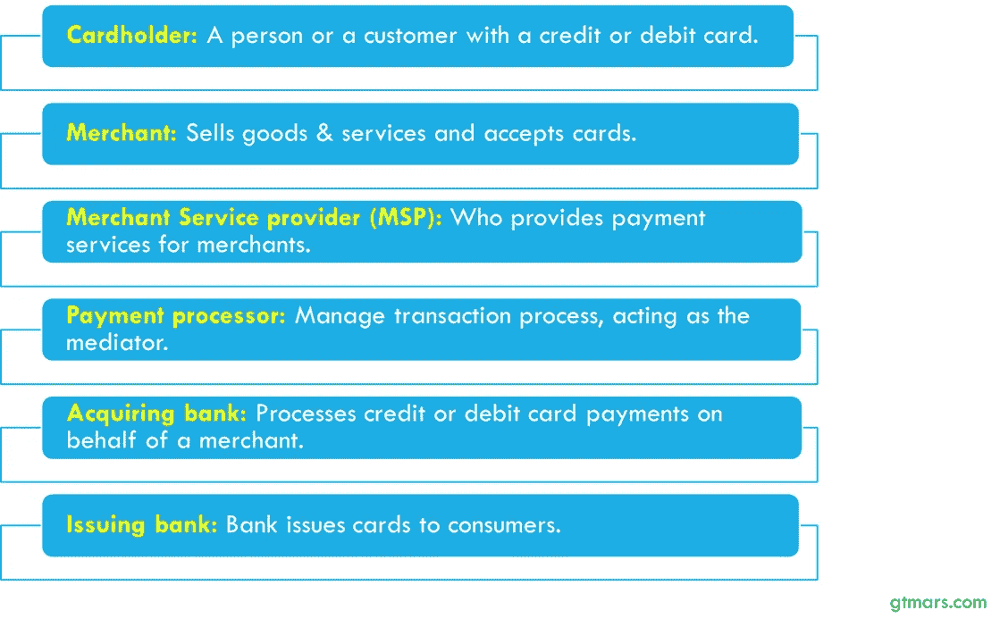

图 8。**数字支付*生态系统。***

# 合规性验证的含义是什么:

★我们在图 4 和图 5 中讨论了合规性评估指标。同样，每个组织都要根据 PCI DSS 建议的数据安全政策，对所有要求的控制和措施进行评估和确认。PCI DSS 评估包含以下实体。

1.  ***合格安全评估员(QSA):***

PCI 委员会的合格安全评估员(QSA)成员可以对数据安全标准的符合性进行现场评估。这种评估要求公司以严格的业务、能力和管理要求来处理申请。在 PCI 委员会[网站](https://www.pcisecuritystandards.org/)上可以找到非常详细的资格和要求信息。现在不要去网站😜，这里继续看。

***1.1 支付申请合格安全评估员(PA-QSAs):***

> ★它是由 ***Visa Inc*** 在 ***支付应用最佳实践(PABP)*** 项目下开展的支付应用数据安全标准(PA-DSS)项目的一部分。
> ***提示:*** 要验证 QSA 员工查询中的 QSA 证件，可以参考这个[网站](https://www.pcisecuritystandards.org/assessors_and_solutions/qualified_security_assessors)。

***1.2 PCI 法医调查员(PFIs):***

★它结合了所有评估程序，并执行法医调查。它不要求任何培训要求，但成员应持有优先资格。

***2。内部安全评估员(ISA):***

★注册内部安全评估员(ISA)是从 PCI 安全标准公司为其发起组织获得证书的个人。他们负责与 QSAs 成员的合作和参与，他们的专长是为他们的组织执行 PCI 自我评估。它旨在帮助 2 级商户达到新的万事达卡合规验证要求。由于 ISAs 得到了 PCI SSC 确认组织的支持，

***3。自我评估问卷(SAQ):***

★自我评估问卷(SAQ)由“是或否”、问卷及其要求组成，要求每年完成并提交给其过渡银行。此外，像一个验证工具，以协助商家和服务提供商实现评估目标。如果给出的回答是“否”，商家应强调并提供有效的理由进行评估。

***4。合规报告(ROC):***

★合规性报告(ROC)是一种填有调查问卷的表格，所有“1 级”商户(无论是谁)都必须填写调查问卷。它用于验证商家是否已经根据 PCI-DSS 标准进行了审计。ROC 审计保证政策、策略、方法和内部工作流程由各自的组织开发和实施。

***12 大 PCI-DSS 需求:***

★建立和维护成功的安全网络和支付系统有 12 项要求。我们将详细讨论每个单独的需求。

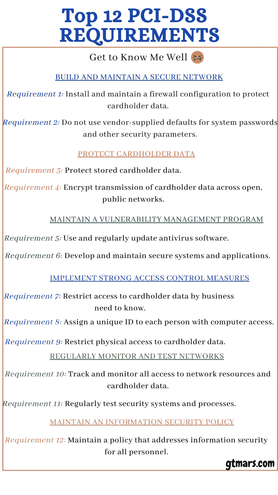

图 9。***12 大 PCI-DSS 要求。***

★有些章节涵盖了技术、政策和原则等广泛的信息领域。因为 PCI-DSS 的创建方式在本质上更全面，并为您提供业务各方面的全面培训。因此，这一点非常清楚，对于必须遵守标准的公司和评估审计员来说，这一点更容易做到。使用 PCI-DSS 的最大好处之一是，您可以满足业务的必要需求，并将其扩展到持卡人数据范围之外。

> 还有一点需要注意的是 ***永远不要把你的子公司*** 当作更低层次的指标，如图 4 所示。每年总交易量。例如， ***您的母公司*** 做“一级-每年超过 7600 万笔交易”，您的子公司处理“二级-每年 100 万到 600 万笔交易”，子公司 ***将客户的支付卡数据共享给母公司*** 。在这种情况下，根据***VISA Inc .***的要求，子公司被 ***视为“1 级*** ”，您必须对母公司和子公司进行“1 级”评估和审计，未能遵守将导致后续金额为美元的罚款。许多组织超过了法规遵从性日期且未通过验证，这些组织面临着巨大的罚款风险和其他与业务相关的不可预见的后果。

***项目快速入门指南:***

事实上，PCI-DSS 对任何个人来说都是一项艰巨的任务。*“不断的练习是每个人给自己的*经历的名字*”之类的格言。您可能想知道从哪里开始，或者快速完成合规步骤，而不会在过程中遇到阻碍。*这一部分将引导您朝着正确的方向前进，并为您的组织实现 PCI DSS 迈出第一步，同时不要忘记查看图 9。***12 大 PCI-DSS 要求。***

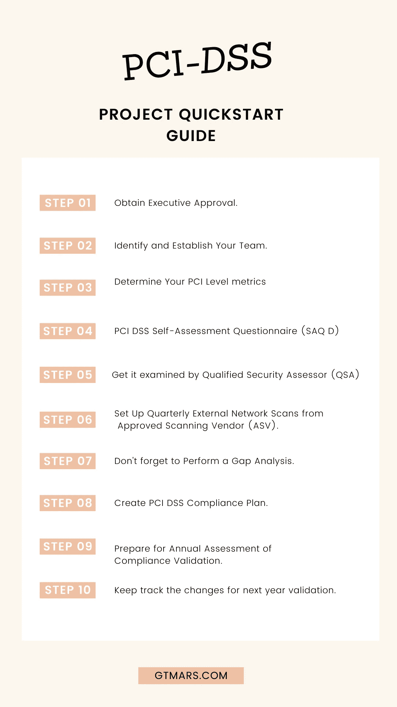

**— — — —构建和维护安全的网络— — —**

***要求 1:*** 安装并维护防火墙配置，以保护持卡人数据。

★学习和理解这一要求非常容易，因为 PCI-DSS 通过指导我们使用什么类型的防火墙、路由器，如何配置、维护和保护它们，使我们变得很容易。纵深防御和分层安全的概念最能代表构建和维护安全网络的理念。

★我们将参考“*的层层安全概念来理解“防火墙”在哪里起作用。防火墙是一种检查所有网络流量并阻止不符合定义的管理员规则的不需要的流量的防火墙。每个系统都必须受到保护，防止网络外部的未授权访问。找出网络中不可信的路径，如内部到外部的信息流、电子邮件、应用程序、web 浏览器、专用连接、B2B、无线网络、过时的协议以及其他要考虑的来源。*

*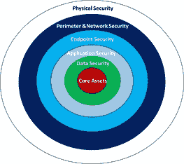*

*图 10。 ***层层保障。****

*★说到物理保护**最外层是最重要的**。**外围和网络安全**层包含构成您内部网络基础设施安全的设备。防火墙、入侵预防和检测系统(IPS/IDS)，甚至具有安全功能的交换机都有助于这一层的安全。*

*★接下来是**端点安全性**您可能已经安装了基于主机的入侵检测和防御、反恶意软件/反勒索软件、应用程序控制和其他安全措施，其中可能包括修补/加固不同的操作系统。
★下一层覆盖**应用安全**。应用程序、访问控制以及文件或目录权限的任何强化在这一层都是必不可少的。
★最后一层是保护**数据安全**。对存储在系统中的“静态数据/传输中的数据/使用中的数据”进行加密是保护和确保 CIA triad 的有效安全措施之一。*

***要求 1 的范围和评估:***

*我们将了解需求列表、测试程序和指南。*

*㈠建立防火墙配置标准。*

*(ii)拒绝来自不受信任的网络和主机的流量。*

*㈢限制连接。*

*㈣个人防火墙。*

*㈤要求 1 的其他考虑因素。*

*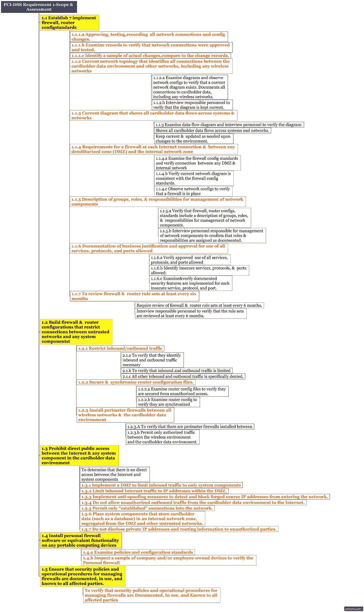*

*图 11。**要求 1 的范围和评估。***

***要求 2:不要使用供应商提供的默认系统密码和其他安全参数:***

*★内部或外部威胁参与者通常使用供应商指定的默认用户名、密码和其他供应商默认参数来危害企业系统。这些默认的密码和参数集是黑客社区众所周知的，并且很容易通过公开的已知信息收集。*

*默认密码。*

*(ii)简单网络管理协议默认值。*

*㈢删除不必要的账户。*

*㈣制定配置标准。*

*㈤实施单一用途服务器。*

*㈥配置系统安全参数。*

*㈦加密非控制台管理访问。*

*(viii)托管服务提供商必须保护共享托管环境。*

*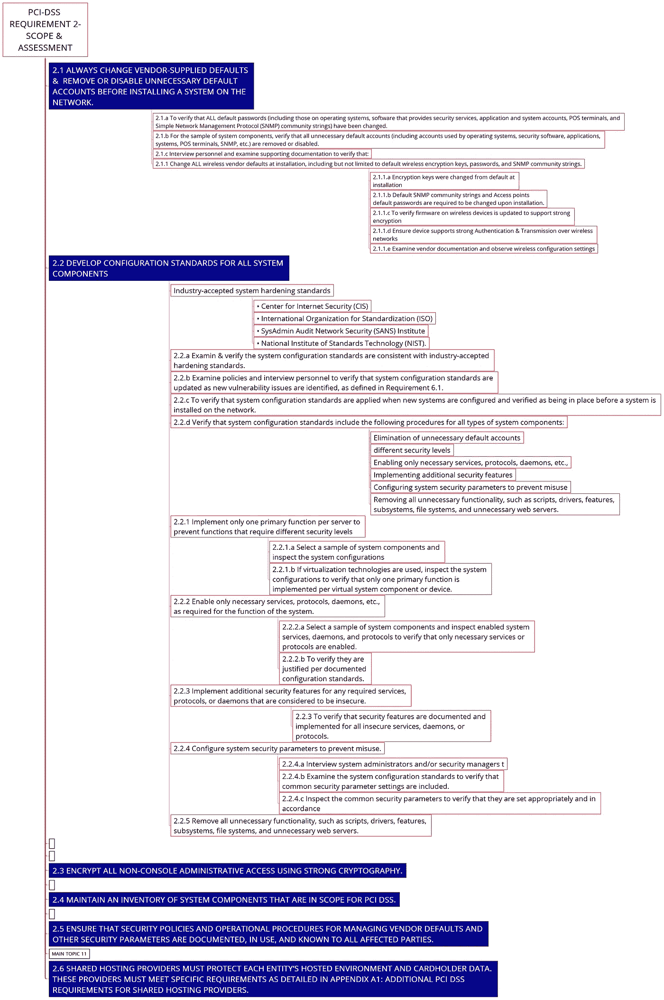*

*图 12。PCI-DSS 要求 2-范围和评估。*

*—— — **保护持卡人数据** — — —*

***要求 3:保护存储的持卡人数据:***

*★在本章中，我们将讨论安全原则的目标(机密性、完整性和可用性)，以及应该在任何系统上实现的方法。一些流行的保护方法，如基于对称/非对称的加密、截断、屏蔽和散列是持卡人数据保护政策的重要组成部分，非常有助于管理网络。一旦您了解了应该如何在组织内实施访问控制，并满足 PCI 合规性。*

****门禁原理:****

*㈠保密性。*

*㈡诚信。*

*㈢可用性。*

*㈣最低特权原则。*

*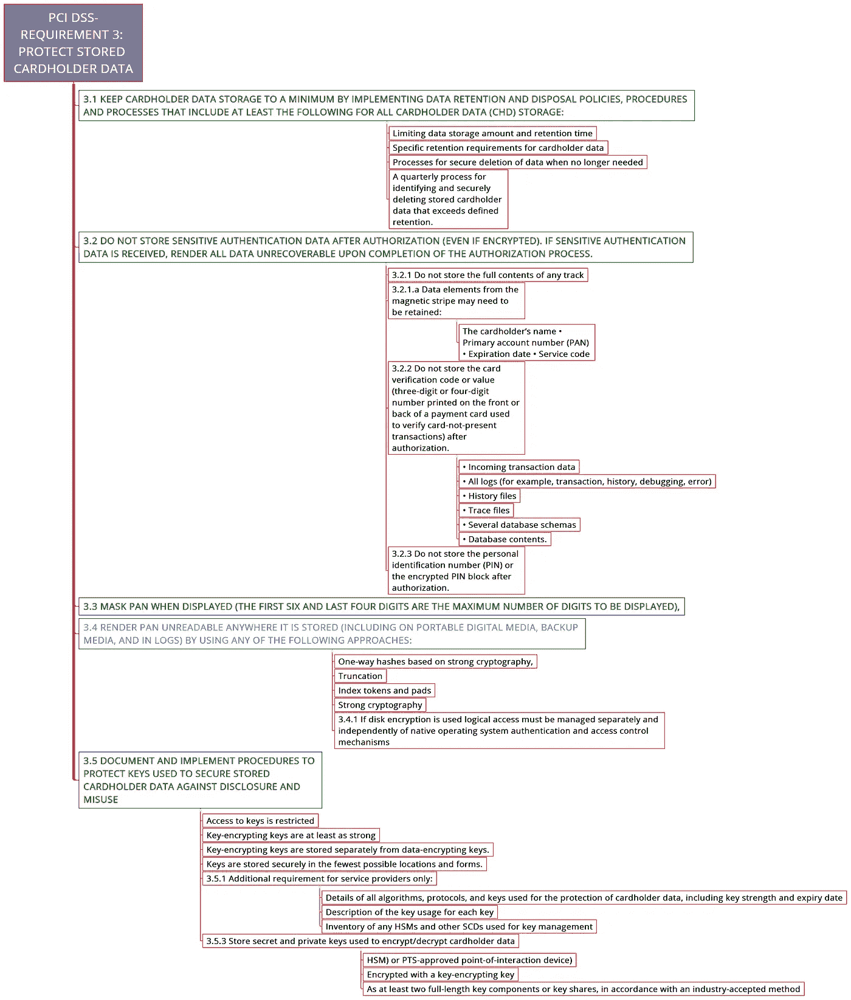*

*图 13。PCI-DSS 要求 3-保护存储的持卡人数据。*

***要求 4:通过开放的公共网络加密传输持卡人数据:***

*★所有类型的敏感信息在通过网络传输数据时都应加密。错误配置的无线网络以及传统加密协议和认证协议中的漏洞仍然是威胁者的一个容易攻击的目标。当这些漏洞被发现并且足够脆弱以获得对持卡人数据环境的特权访问时，就可以进行利用。*

*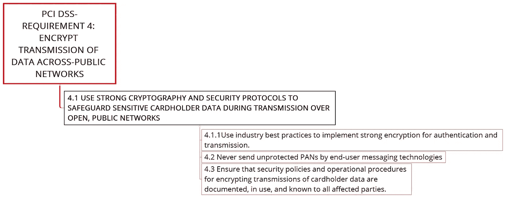*

*图 14。PCI-DSS 要求 4- **加密传输。***

*—— **维护一个漏洞管理程序** — — —*

***要求 5:保护所有系统免受恶意软件攻击，并定期更新防病毒软件或程序:***

*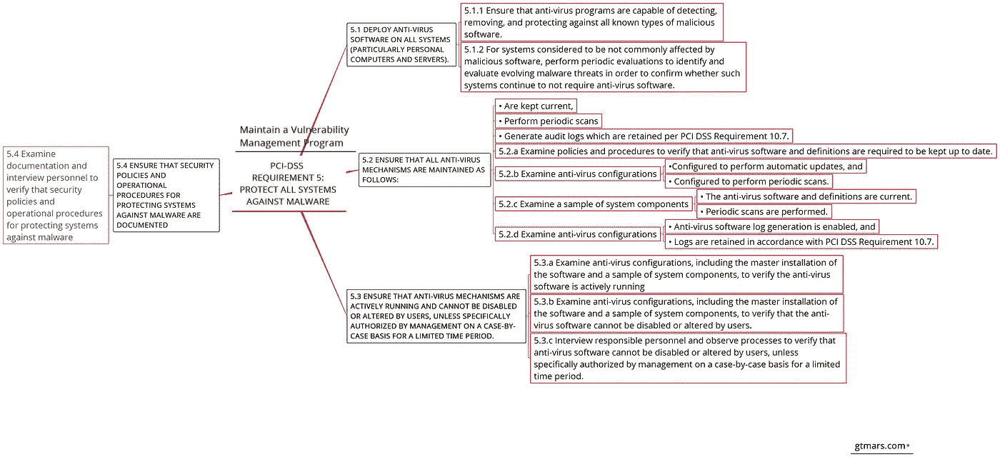*

*图 15。PCI-DSS 要求 5:保护所有系统免受恶意软件攻击。*

***要求 6:开发和维护安全的系统和应用:***

*★当威胁行为者或团体利用应用程序或任何平台上存在的安全漏洞来获得对系统的特权访问时，就会出现安全漏洞。*

****开源的安全风险——(所以，先行动后休息):***
★这些做法建议团队成员应该注意(留意)社区中新发布的模块、更新、通知，以找到补丁并保持更新。当您延迟升级到最新版本时，与此同时，对手可能会对您的环境进行侦察，并发起攻击。所以，先行动后休息。*

*★在公共和私营部门组织中，几乎大多数软件项目都是使用第三方组件和开源工具构建的。★因此，漏洞以前所未有的速度在您的组织中传播，遵循商业和非商业代码，工具对于成功的安全 SDL 至关重要。
★现代软件项目上无法控制依赖，因为从开源软件到操作系统，从后端到前端——用户界面。*

*★如果您不熟悉 [secure SDLC practices](/faun/microsofts-top-12-secure-software-development-lifecycle-ssdl-practices-for-software-developers-f54176667fb5) ，最好花些时间阅读这篇文章，熟悉其中的概念。*

*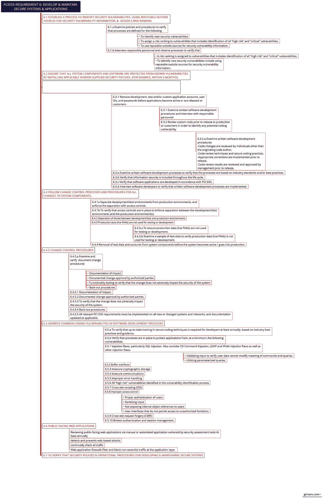*

*图 16。**要求 6:开发和维护安全的系统和应用程序。***

*— — ***实施强访问控制措施*** — — —*

***要求 7:根据业务需要限制对持卡人数据的访问权限:***

*★我们的主要关注点是确保关键数据只能由授权人员访问，所有系统和访问流程必须到位，以基于“*”的“需要知道”和根据工作职责来限制访问。**

**★这一概念主要用于政府和军事行动。适用于标记为“敏感/秘密/绝密”文档的信息的限制，例如，如果某人具有访问政府中某些信息的安全许可，他可能无法访问“需要知道”权限下的受限信息。**

*****需要知道*** 表示只授予最少量数据的访问权限和执行工作所需的特权。**

**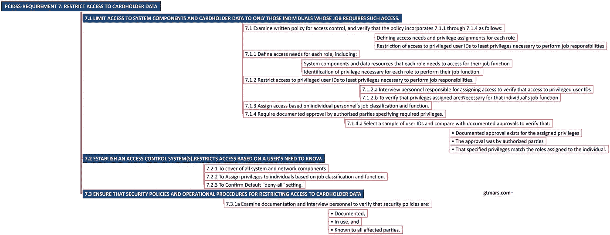**

**图 17。**要求 7:根据业务需要限制对持卡人数据的访问。****

****要求 8:识别和验证对系统组件的访问:****

**★给每个有权限的人分配一个唯一的身份(ID)标签，确保每个人对自己的好或坏行为唯一负责。当这种责任到位时，对关键数据和系统采取的行动由已知和授权的用户和流程执行，并可追踪到这些用户和流程。这在金融科技行业非常重要。**

**★密码的强大功能在很大程度上取决于身份验证系统的设计和实施，特别是确定攻击者尝试密码的频率，以及在进入点、传输中的数据、使用中的数据和静态数据中保护用户密码的安全方法。**

**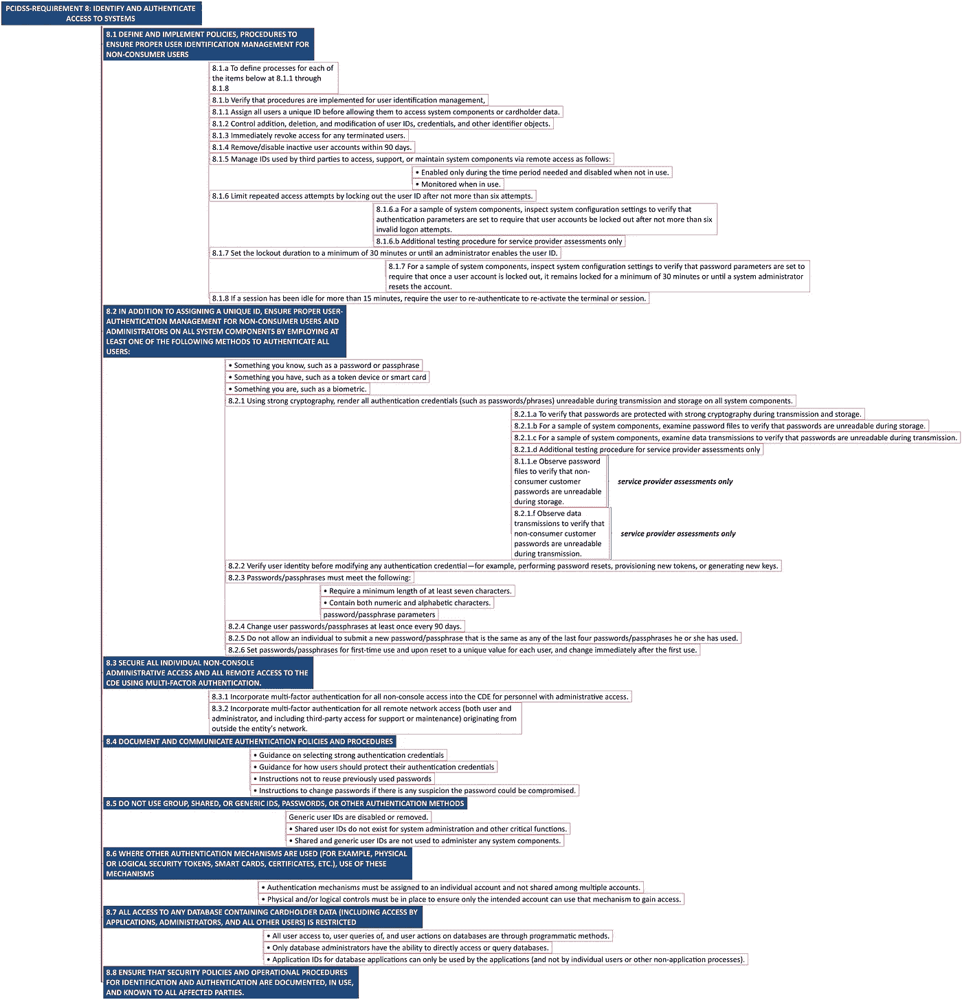**

**图 18。**要求 8:识别和验证对系统组件的访问。****

****要求 9:限制对持卡人数据的物理访问:****

**★在此要求中，主要方面是限制对持卡人存储数据、硬拷贝和设备的物理访问。现场任命的员工的主要责任是保护它。**

**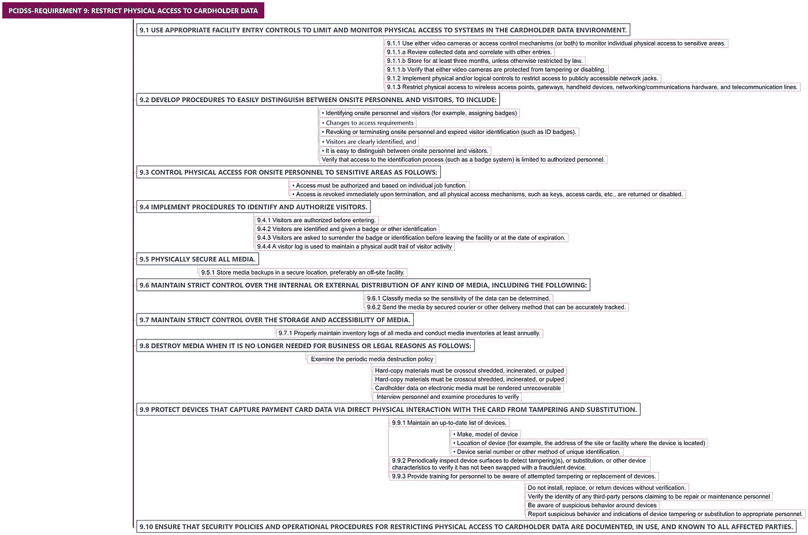**

**图 19。**要求 9:限制对持卡人数据的物理访问。****

**— — **定期监控测试网络****

****要求 10:跟踪和监控对网络资源和持卡人数据的所有访问:****

**★安全信息和事件管理是对 PCI-DSS 进行全面安全管理的实用方法，它将 SIM(安全信息管理)和 SEM(安全事件管理)功能结合到一个安全管理系统中。SIEM 能够跟踪对系统中持卡人数据至关重要的用户一般和异常活动。通过将 SIEM 技术与“ ***”贝叶斯定理*** ”一起使用，可以基于可能与安全事件或安全事故相关的正常/异常情况的先验知识来描述事件的概率。**

****

**图 20。*贝叶斯定理。***

**★我爱“**贝叶斯定理 T17”😎，所以我建议你考虑一下。有理由憎恨吗？我不这么认为。****

**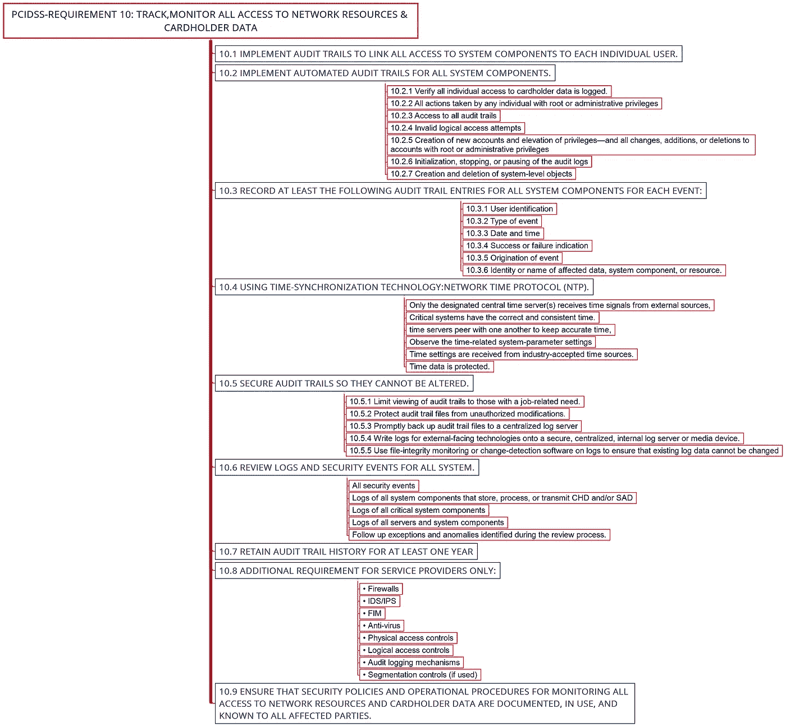**

****图 21。要求 10:跟踪和监控对网络资源和持卡人数据的所有访问。****

****PCI-DSS-要求 11:定期测试安全系统&流程:****

**★渗透测试是一项授权的模拟安全分析任务，通常与您的计算机系统/应用程序/网络一起执行，以评估系统的安全状态。渗透测试实践的目标是发现由编码错误、系统配置错误或其他具有各种漏洞的操作部署弱点导致的现有或可能新的潜在漏洞。**

**项目环境中存在的威胁和漏洞。**

**仔细评估来自其他来源的任何外部代码非常重要。当团队不知道代码可能导致安全漏洞时。**

**高风险(P1)漏洞和隐私预测的审查应与隐私主题专家(SME)讨论。**

**详细的隐私分析，记录您项目的关键隐私方面。**

**(I)收集哪些个人数据？**

**(ii)什么是有说服力的用户价值主张和商业理由？**

**(三)提供了哪些通知和同意的经历？**

**㈣向用户和企业提供哪些控制？**

**㈤如何防止未经授权获取个人信息？**

**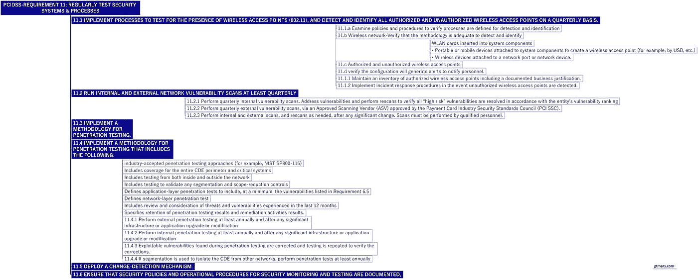**

****图 22。PCI-DSS-要求 11:定期测试安全系统&流程。****

**— — **维护信息安全政策****

****要求 12:维持一项针对所有人员的信息安全政策:****

**★强有力的安全策略对于全球的每个公共和私人实体都至关重要。此要求的主要目的是让每个人都了解持卡人数据的敏感级别和指标以及他们所承担的责任。**

**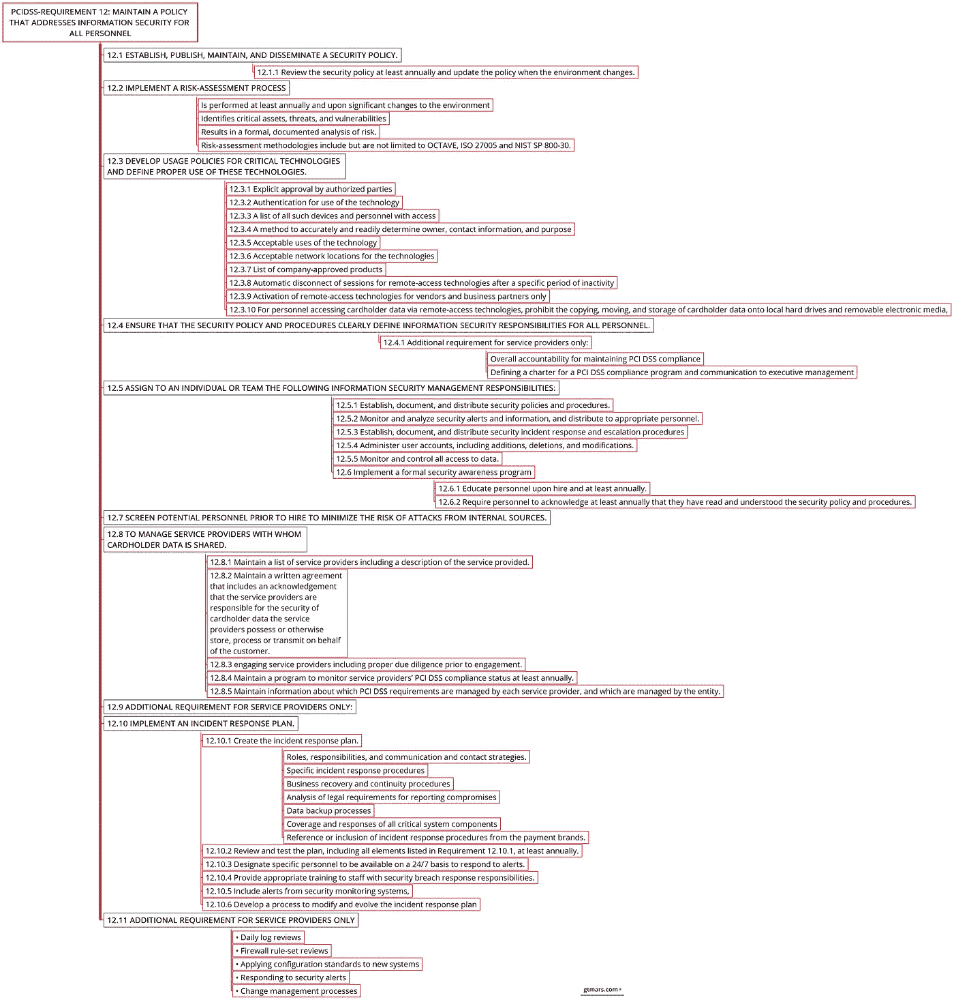**

**图 23。**要求 12:维护一项针对所有人员的信息安全政策。****

*****结论:*****

**这篇文章作为一个简化的指南，给出了为什么创建 PCI-DSS 委员会的一些背景，它描述了最好的目标，并概述了 PCI-DSS 遵从标准中的 12 个要求。请记住，您可能需要调整每个需求实践中的里程碑，以更好地适应您公司当前的 PCI-DSS 遵从计划。
当您开始着手您的合规性规划项目时，请确保查看并跟进 PCI-DSS 委员会的网站及其发布的最新要求版本，并将其应用于您的组织。因为本文没有涵盖整个 PCI-DSS 需求、指南和基于定义的场景。**

*****再见了(adiós por ahora)！！！*****

**— — — — — — — —结尾— — —**

*****Quote of the day:* 已所不欲，勿施于人** (yǐ suǒ bú yù ，wù shī yú rén).**

*****解释:*** 己所不欲，勿施于人。**

**感谢阅读！祝你有愉快的一天！**