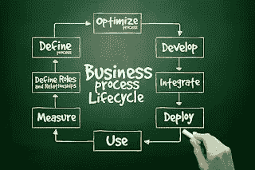

# 什么是产品生命周期？

> 原文：<https://medium.com/nerd-for-tech/what-is-product-lifecycle-6bbe4ab64ca3?source=collection_archive---------11----------------------->

# 描述

产品生命周期是控制产品整个生命周期的过程。它从创造开始，经过工程设计和制造，到工业产品的服务和处理。产品生命周期管理混合了人员、数据、流程和业务系统。这也为公司及其长期企业提供了产品信息支持。现在被称为产品生命周期管理的不断增长的业务流程的动机起源于美国汽车公司(AMC)。

# 方法

**产品生命周期管理**

这种方法定义了产品的工程方面，通过产品的进展和使用寿命来处理产品的描述和属性。它反映了工业企业信息技术结构的四个基础之一。

**产品生命周期管理营销(PLCM)**

这种形式使[在成本和销售措施方面对企业市场上的产品生命周期](https://www.technologiesinindustry4.com/)进行可销售的管理。

**以人为中心的 PLM**

这种形式以设计阶段为目标，而传统的 PLM 工具仅在声明或发布阶段进行组织。

**闭环生命周期管理(CL2M)**

欧盟资助的名为 ICT 开发的 2004–2008 承诺项目允许 PLM 扩展到传统 PLM 之外，并将传感器数据和实时生命周期事件数据纳入 PLM..

# PLM 的优势

*   产品生命周期管理的公认优势有:
*   集中上市时间
*   提高全价销售
*   提高产品质量和可靠性
*   廉价的原型制作成本
*   额外准确及时的报价生成请求
*   快速分类可能的销售机会和收入帮助的技能
*   重新利用原始数据的投资已经结束
*   产品优化概述
*   减少废物
*   通过完全增加工程工作流程获得资金
*   能够向交易生成者提供与中央产品记录的联系
*   常规变化管理
*   更好地预测降低材料成本
*   利用供应链团队合作

# PLM 的组成部分

PLM 有五个主要领域。

**1。系统工程**

这部分集中于收集主要满足客户需求的所有需求，并通过涉及所有相关学科来组织系统设计过程。[生命周期管理是被称为可靠性工程的系统工程的一部分。](https://www.technologiesinindustry4.com/)

**2。产品和组合 m (PPM)**

这一领域的重点是管理储备分配，追逐发展，新产品开发项目的发展战略。它是一种工具，支持管理层开发新产品，并在分配稀有资源时做出权衡决策。

**3。**产品设计(CAx)

这是一个制作新产品的过程，由广告公司卖给客户。

**4。制造过程管理(MPM)**

这是一组用来描述如何制造产品的技术和方法。

**5。产品数据管理**

这集中于在产品和服务的成长和使用寿命期间获取和维护有关产品和服务的信息。变更管理是 PDM 和 PLM 的重要组成部分。

# 产品生命周期阶段和并行技术

## 第一阶段:怀孕

**想象、指定、计划和创新**

第一阶段是产品需求的描述。它基于客户、业务、市场和监管机构的观点。产品的主要技术参数可从本规范中定义。第一个概念设计工作的完成对产品的美学及其主要功能方面很重要。许多媒体被用于这些过程。它们包括从铅笔和纸到粘土模型到 3D CAID 计算机辅助制造设计软件。

调查和选项分析的收入资产可以包含在概念阶段，例如，在一些想法中，使技术达到足够成熟的水平以改变到下一阶段。

## 第二阶段:设计

**描述、定义、开发、测试、分析和验证**

这是产品表单的完整设计和开发开始的阶段。它开始开发原型测试，从试点发布到全面的产品展示。除了战略无用性之外，它还可能包括对当前产品的重新设计和开发倾斜。CAD 是用于设计和开发的工具。这可能是朴实无华的 2D 绘画或草稿。它也可以是 3D 参数化特征构建的实体或曲面建模。

## 第三阶段:实现

**制造、制造、建造、采购、生产、销售和交付**

一旦产品组件的设计完成，就定义了制造过程。这包含 CAD 的任务，例如工具设计。在工具设计方面，除了制作生产零件的精确工具外，还包括产品零件的 CNC 加工指令的形成。[这还包括用于操作过程模拟的检查工具，例如铸造、成型和模压成型。](https://www.technologiesinindustry4.com/)一旦工业方法得到认可，CPM 就开始发挥作用。

## 第四阶段:服务

**使用、运营、维护、资助、承受、淘汰、报废、回收和处置**

生命周期的最后一个阶段包括处理使用中的信息。这可能包括客户和服务工程师，除了废物管理或回收之外，还必须提供维修和维护方面的支持和信息。这可能包括工具的使用，例如维护、维修和操作软件。

# 产品生命周期的六(6)个阶段~类型编写器案例研究

1.  **发展:**在第一台商用打字机推向市场之前的 1575 年，整体构思就已经形成。
2.  简介:19 世纪晚期，第一台商用打字机问世。
3.  成长:打字机成为各种写作形式不可或缺的工具，广泛应用于办公室、企业和私人家庭。
4.  成熟:打字机在近 100 年的时间里一直处于成熟阶段，因为直到 20 世纪 80 年代，打字机一直是打字通讯的主要产品。
5.  饱和:在饱和阶段~打字机开始面临新技术的激烈竞争——20 世纪 90 年代个人电脑的笔记本电脑拥有先进的文字处理软件。
6.  衰落:打字机经不起新兴技术的竞争，最终变得过时。今天，所有的打字机制造公司都倒闭了。

更多详情请访问:[https://www . technologiesinindustry 4 . com/2020/12/what-is-product-life cycle . html](https://www.technologiesinindustry4.com/2020/12/what-is-product-lifecycle.html)