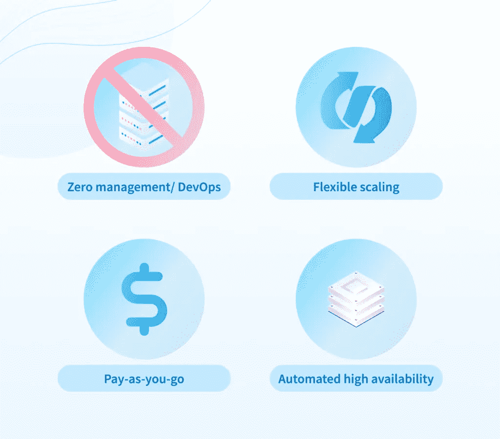
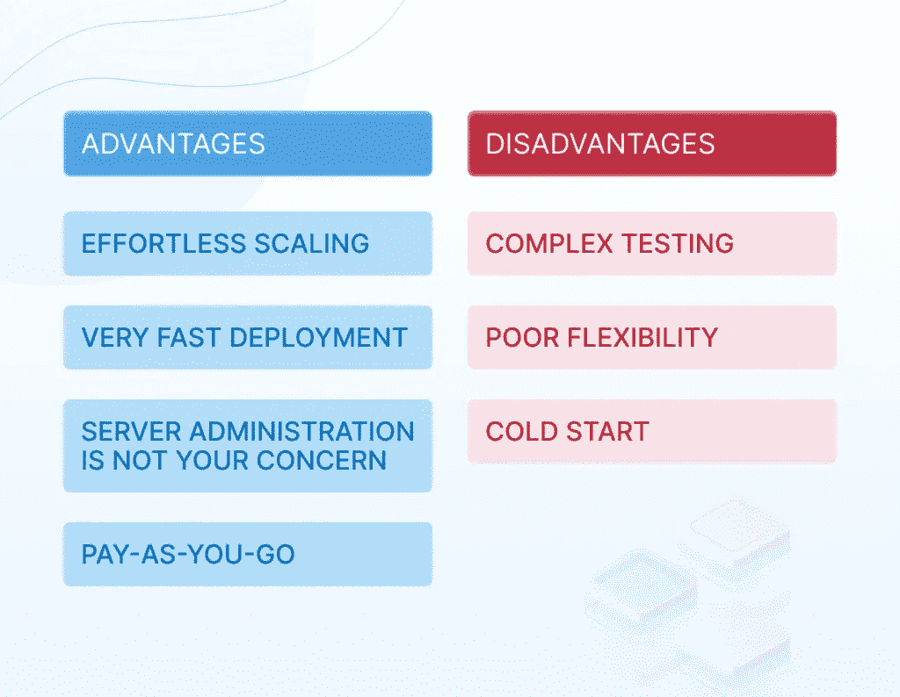

# 什么是无服务器架构，为什么它是应用程序的未来— NIX United

> 原文：<https://medium.com/nerd-for-tech/what-is-serverless-architecture-and-why-is-it-the-future-of-applications-nix-united-690300bb5e18?source=collection_archive---------5----------------------->

开发成本不是软件生命周期中唯一的支出。正如[实践所显示的](https://www.wbdg.org/resources/life-cycle-cost-analysis-lcca)，初始上线后的更新和错误修复占据了项目总成本的 80%。除了软件解决方案的开发之外，无服务器架构能否节省您的资金并帮助您显著降低项目成本？

简而言之，尽管它的名字，这种类型的架构并不完全像它听起来那样工作:应用程序仍然使用服务器来操作。那么什么是无服务器架构呢？它的主要特点是什么？对于哪些应用，它是最佳选择？让我们在文章中找出所有这些。

这项技术使用[云集成服务](https://nix-united.com/services/enterprise-it-integration-and-customization-services/)将后端基础设施转移到云中，使其非常适合无服务器应用。

无服务器架构本质上意味着云提供商——如 Google Cloud、Amazon Web Services (AWS)或 Microsoft Azure——为我们的应用程序提供他们自己的后端基础设施。Kubernetes 等服务有助于它们的流行，因此许多公司很快对通过云服务付费托管其应用程序感兴趣。尽管有很多优势，这种方法也带来了挑战。

# 无服务器架构的起源是什么？

过去的体系结构设计通常是单一的，缺乏可管理性、可伸缩性和灵活性。在此期间，公司必须将完整的程序部署在一台计算机上运行的一台应用服务器上。

有时甚至整个数据库都安装在同一个系统上。即使在完成这一切之后，该设置的单个组件中的问题也可能导致整个系统关闭，并终止所有正在进行的活动。结果，编码、调试和部署形成了一个无休止的循环，这降低了企业的生产力。

但是随着架构理念的改变，行业经历了巨大的变化，产生了两种主要的架构——无服务器和微服务。两者都有充分的理由在可伸缩和灵活的系统中使用。让我们讨论一下无服务器架构的优势和挑战。

# 为什么选择无服务器？

托管软件总是需要某种服务器基础设施。以前，对于大多数公司来说，只能在本地服务器和云提供商的服务之间进行选择，而现在这两种选择已经有了更多高度专业化的分支。

特别是，不幸的是，传统的云部署，即使是来自领先的云供应商，如 AWS、IBM Cloud 或 Microsoft Azure，也没有完全消除本地托管倡导者面临的典型问题(如维护本地服务器、成本效率低下和难以扩展)。因此，当复杂的应用程序随着时间的推移进行了优化并增强了高性能功能时，为云提供商付费会在您的预算中造成巨大的缺口。

然而，对于无服务器架构，情况并非如此，因为它允许公司只为执行单个功能时实际使用的资源付费。也就是说，如果这些功能闲置了一段时间，您不需要为它们付费。

与此同时，无服务器应用程序仍然保留了普通基于云的应用程序的主要特征:服务器管理任务仍然由云供应商负责，公司的 IT 人员仍然只负责应用程序代码及其更新(这不适用于一般安全策略、工作负载平衡、扩展和网络监控的更新，这些都是云提供商的责任，就像在标准云部署中一样)。

请注意，要使您的应用程序无服务器，您不需要完全重新实现您的软件解决方案:您可以只使它的一个单独部分无服务器。作为无服务器架构示例，我们可以更详细地回顾后端即服务(BaaS)和功能即服务(FaaS)解决方案。

# BaaS 和 FaaS 有什么不同？

BaaS 是最新的云模型之一，最常用于部署移动软件、单页面应用程序、聊天机器人和移动友好的 web 应用程序。它提供诸如推送通知、地理定位、与电子邮件服务的交互、认证等功能。特别是，有许多内置的 API 和 SDK 极大地简化了开发人员的工作，并允许他们将主要精力集中在构建业务逻辑上。

BaaS 用现成的服务取代了传统的服务器组件，这使得开发人员可以将系统任务转移到云提供商，只需编写和维护定制的应用程序逻辑。BaaS 解决方案的一个例子是 Google Firebase，这是一个完全托管的数据库，无需额外配置即可在应用程序中使用。

至于 FaaS，这些解决方案实现了与程序代码的单个部分(微服务)的交互，按需调用它们，而 BaaS 与特定软件解决方案的整个程序代码进行交互。

FaaS 提供了一个软件运行时，允许开发人员实现将在触发的沙箱中运行的代码。然而，每个 FaaS 特性通常只对应于整个应用程序的一小部分。函数的执行时间通常是有限的。例如，在 AWS Lambda 中，限制是 15 分钟，这是 FaaS 平台等待函数实例完成处理给定事件的时间。如果处理没有在这个时间限制内完成，该功能被终止。这些事件可以是客户端请求、外部系统中的事件、数据流等。FaaS 提供者负责执行函数所需的水平伸缩，其数量随着事件数量的增加而增加。

FaaS 可作为按行业区分的定制模板提供。为了快速部署和启动软件解决方案，FaaS 使用容器(包含在任何环境中运行的所有必要元素的软件包)来确保项目的高可扩展性和/或同时在多个软件平台上的实施(例如，在 Android、iOS 和 web 版本上)。但是，与 BaaS 相比，FaaS 的功能更加有限。选择一个或另一个 FaaS 的重要标准是易用性和之前选择的云提供商提供的支持的可用性。

这两种型号都适合无服务器部署。

# 什么时候适合使用无服务器架构？

就降低创建和部署软件所需的成本(资金和时间)而言，无服务器架构是最有效的。这也是一种更具成本效益的托管软件的方式，适用于不打算连续运行且其某些功能只是偶尔使用的情况。对触发器的依赖使得这种类型的架构成为实施物联网解决方案的公司的圣杯。

此外，如果你是一家初创公司的创始人，无服务器架构更可能满足你的需求。特别是，您将能够比使用其他方法更快地推出您的产品来构建架构并显著优化预算，因为闲置的服务器不会让您付出任何代价。

# 省时省钱的模式

实施无服务器架构的最大好处是其成本效益。特别是，基础设施和运营管理任务是云服务提供商的责任。这允许产品所有者将他们的精力集中在创建软件特性上。通过这种方式，软件解决方案可以更快地发布，从而从最终用户那里得到更快的反馈，并因此在下一个软件发布周期中得到进一步的改进。

此外，当开发人员不拥有运行应用程序的后端基础架构时，他们就很少担心维护、供应和扩展。因此，使用分散式服务器基础设施的另一个最有说服力的理由是云提供商通过无服务器架构提供的自动化扩展和故障排除。

基于无服务器架构的系统也非常适合事件处理和低资源密集型任务，无需专用基础架构即可自动扩展，从而降低执行成本。

无服务器架构对责任和职责分离也有积极的影响。例如，当应用程序的服务器端出现问题时，解决问题的责任在于云供应商，而不是开发者。因此，开发人员不必在这上面花费任何时间或工具。

# 在什么情况下避免无服务器架构更好？

一般来说，无服务器架构并不总是最佳解决方案。特别是，在下列情况下最好避免这种架构。

*   你的应用有一个不变的架构。特别是，我们谈论的是要求底层架构保持不变的软件。作为有害的无服务器架构示例之一，我们可以想到国防和金融行业中对安全敏感的独立软件。
*   **您的软件解决方案与部署环境紧密耦合。**需要与硬件和 IT 网络低层紧密耦合的用例，如安装某些组件、修补和更改硬编码配置，也可能会受到此次升级的影响。
*   **您的应用程序在处理传入请求时要求低延迟。**尽管无服务器架构的特性旨在提供系统级的速度，但并非所有传入请求和事务性操作都能得到高效处理。
*   您的应用需要更全面的检查。下一个低效的无服务器架构示例是尚未迁移到云的遗留应用程序。在这种情况下，无服务器架构的商业价值有限，因为将代码重构为自包含组件的成本可能会导致巨大的财务成本，超过无服务器的好处。
*   **您的应用不接受性能限制。无服务器功能面临容量、速度和执行时间方面的限制。无服务器功能的性能不得超过无服务器服务的容量限制，如 AWS API 网关或 Microsoft Azure API 管理超时。因此，在具有长执行时间的函数的情况下——例如，在机器学习解决方案中实现的函数——可能会由于超过时间限制而出现问题。**

# 那么无服务器架构值得吗？

尽管有这些优势，无服务器架构还是很难实现，而且它的分散性也会导致一些问题。事实是，这种基础设施的性质并不意味着 IT 团队可以完全访问，这意味着监控他们看不到的所有服务几乎是不可能的。

这种透明性的缺乏阻碍了对应用程序如何工作的全面理解。例如，在性能问题的情况下，关键参数分析可能无效或不会导致优化结果。

无服务器应用程序的另一个重要问题是安全漏洞。事实是，无服务器架构攻击相当普遍。归根结底，这一切都取决于云服务提供商管理风险的能力。因此，在开始云迁移之前进行彻底的研究至关重要。毕竟，众所周知，任何系统的强大程度取决于其最薄弱的环节。

最后，一些应用程序(例如，上面描述的那些)不适合无服务器架构，因为它不仅仅是所有后端问题的通用解决方案。因此，即使您知道上面提到的糟糕的无服务器架构示例，您也无法避免更新的解决方案不符合您的期望。让我们回顾一下。

# 优势

*   **轻松缩放:**服务器自动调高或调低。
*   **快速部署:**您可以快速设计新功能并测试您的想法。
*   **服务器管理与你无关:**你可以专注于应用程序而不是服务器。
*   **按需付费:**你只为你使用的服务器的资源付费；闲置时间不需要付费。

# 不足之处

*   **复杂测试:**即使您可以在本地完全重建无服务器环境，也更容易理解代码一旦部署后将如何工作。
*   **灵活性差:**许多人发现在很长一段时间内将无服务器环境交付给单一提供商是一项挑战。
*   **冷启动:**执行完成后，该函数会保持缓存一段时间，以便快速启动。一旦它被从缓存中移除，新的请求进入，将有一段时间让函数启动。

# 最后的想法

当前走向无服务器架构的趋势是否让我们看到了 web 开发的未来？这会使它更快、更便宜、更可靠、更不容易出错吗？

即使对于持续维护是一种负担的组织来说，无服务器体系结构也是经济高效的。当您希望快速、廉价地部署时，无服务器架构是一个极好的选择。但是，您应该在研究了云提供商是谁、安全措施有多强大，以及无服务器架构是否真的满足了您自己的应用程序的需求之后，再仓促行事。

如果您想为您的数字解决方案实现无服务器架构，并充分利用 Azure 和 AWS 供应商的产品，[联系我们](https://nix-united.com/blog/serverless-architecture-101-what-is-it-and-how-do-you-benefit-from-it/#contact-us)。

*原载于 2022 年 12 月 14 日*[*【https://nix-united.com】*](https://nix-united.com/blog/serverless-architecture-101-what-is-it-and-how-do-you-benefit-from-it/)*。*