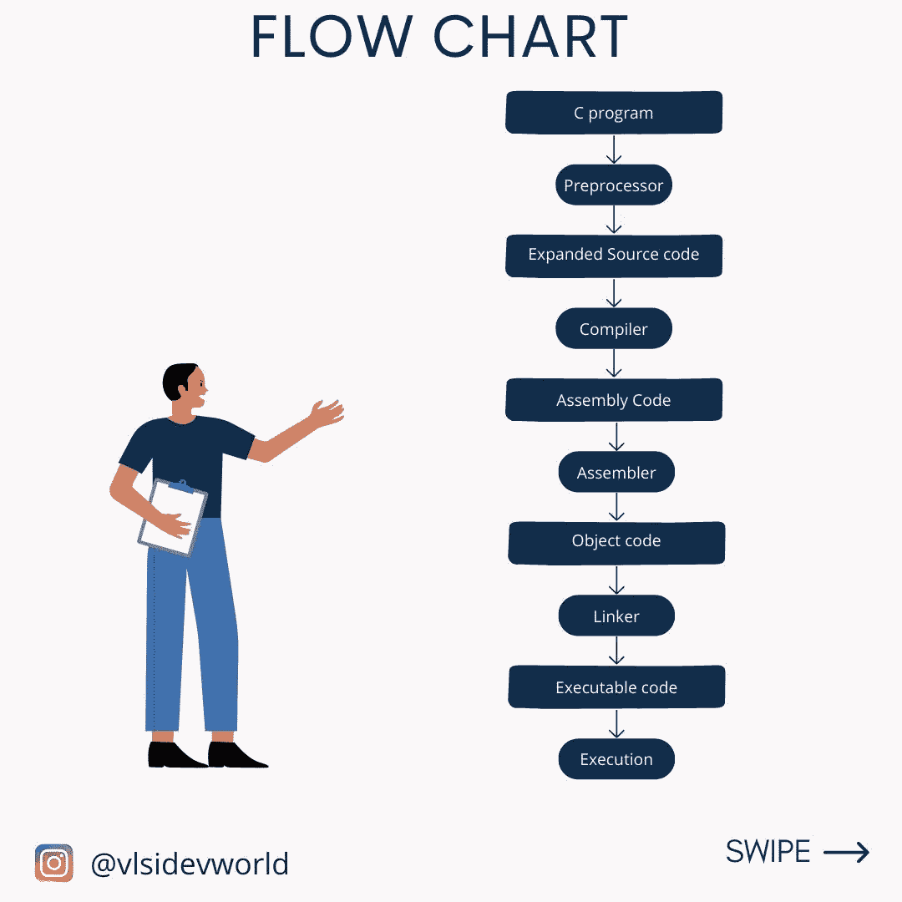

# 硬件工程最难的是什么？

> 原文：<https://medium.com/nerd-for-tech/what-is-the-hardest-part-of-hardware-engineering-ad19ff06710f?source=collection_archive---------1----------------------->

不了解基础知识。

我说的“基础”是指 c 编译过程、构建过程、链接过程、每个阶段的文件生成。我，。s 和。o)。

一旦你掌握了基本知识，它不仅有助于调试。它还有助于理解任何设计规范的代码基础。我很少看到有人对此有清晰的认识。

不管你是前硅还是后硅工程师。在这两个领域中，构建过程有一个共同点。为有兴趣了解这一过程的人提供一个简要的概述。

𝗕𝘂𝗶𝗹𝗱 𝗣𝗿𝗼𝗰𝗲𝘀𝘀 :

1.  预处理
2.  从语法上分析
3.  生成目标文件
4.  链接目标文件
5.  产生最终可执行文件
6.  最终可执行文件的后处理

𝗖𝗼𝗺𝗽𝗶𝗹𝗮𝘁𝗶𝗼𝗻 𝗦𝘁𝗮𝗴𝗲 𝗼𝗳 𝘁𝗵𝗲 𝗯𝘂𝗶𝗹𝗱:

> **。c(源文件)→前置处理器→。I 文件生成→解析器→代码生成器→。s 文件生成→汇编程序→。o 文件生成**

汇编程序将助记符转换成机器代码。

𝗟𝗶𝗻𝗸𝗶𝗻𝗴 𝘀𝘁𝗮𝗴𝗲 𝗼𝗳 𝘁𝗵𝗲 𝗯𝘂𝗶𝗹𝗱:

> **。o 和。生成了一个文件→链接器→调试文件(。elf) → objcopy 工具→。生成 bin 文件(纯二进制可执行文件)**

下面由 VLSI-Dev World 描述的编译过程对于快速参考非常有用。

希望这有所帮助😊。

关注我的[链接](https://www.linkedin.com/in/ayushdixitpage/)，获取关于超大规模集成电路、机器学习、Python、数据科学、成功和灵感的一流资源。