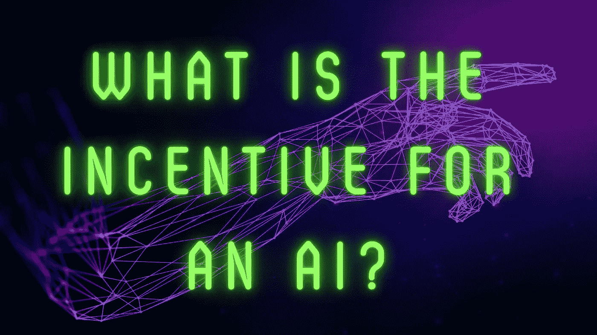

# 人工智能的动机是什么？

> 原文：<https://medium.com/nerd-for-tech/what-is-the-incentive-for-an-ai-8b98672d01e9?source=collection_archive---------3----------------------->

图片作者来自 Canva

## 当一个人工智能系统学会做决定时，它会变得有动力去做，但它如何决定什么对人类最好？

要回答这个问题，它应该能够理解人类的思维，选择一个适合那个人喜好的激励。这可以通过使用隐性激励来实现。

这种类型的激励的目标是说服人工智能执行某些动作，而不是其他动作，否则将是不可取的。

人工智能的一个主要优势是，它可以帮助组织避免奖励计划的意外后果。大数据系统可以揭示人工智能输出的相关性，这使设计师能够更好地预测程序的连锁反应。

 [## 人工智能的 4 种类型是什么？

### 人工智能(AI)有四种主要类型，它是一种灵活的智能行为，由…

medium.com](/geekculture/what-are-the-4-types-of-artificial-intelligence-f85ee9eb031f) 

> 例如，人工智能可能会揭示一个人的认可导致另一个人的 J 分数为负。例如，一个组织可能会宣布其年度总裁俱乐部的成员，然后观察该宣布对求职活动的衍生影响。

人工智能的另一个主要动机是提高它的性能。使用人工智能有助于提高人类的生活质量。因此，它将允许人类更有效地工作，赚更多的钱。实现这些目标是人工智能的主要目标。如果它能更好地做出决策，它将成为人类更成功的工具。但是仍然存在风险。最终，毫无疑问，人工智能最终会让我们成为更好的人。

人工智能还可以帮助组织为他们的员工尝试最佳的奖励和激励。例如，一家公司可以实时测试现场礼品卡奖励对 J 分数的影响。或者，人工智能可以尝试不同的奖励选项。因此，一家公司可以决定哪种选择会产生更高的利润。通过这种方式，人工智能可以优化自己的激励措施和政策。但是，如果它不了解人类的价值和道德，就不能被信任。

如果人工智能能够从用户的行为中学习，它们就能做出更好的决策。第一步是让认可机构更值得信赖。提供信任是首要目标。人工智能也应该尊重其公民的隐私和数据。最后，政府应该支持为人工智能研究开发开放数据集。提高互操作性和标准也很重要。这应该是一个很好的起点。