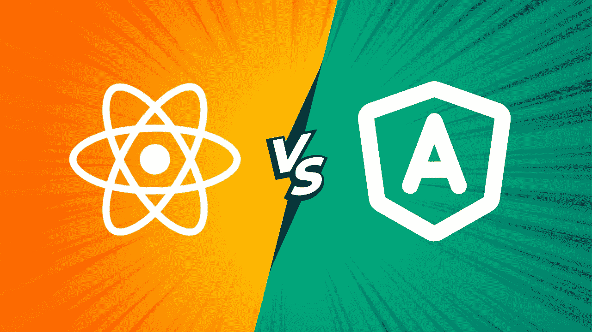
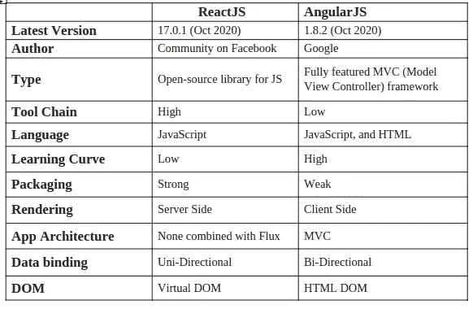

# AngularJS 和 ReactJS 的主要区别是什么？

> 原文：<https://medium.com/nerd-for-tech/what-is-the-key-distinction-between-angularjs-and-reactjs-5c1e2cc623b?source=collection_archive---------1----------------------->

从初创企业到大公司，每个企业都希望尽快构建强大可靠的基于网络的应用程序，并使用具有大量功能的框架。如果你正在用 JavaScript 构建一个应用，AngularJS 或 ReactJS 是最流行的框架。从用户体验和性能到成本和兼容性，ReactJS 和 AngularJS 在很多方面都是你前端开发项目的更好选择。

让我们仔细看看 AngularJS 和 ReactJS 之间的主要区别，以帮助您决定哪一个最适合您。

**AngularJS vs. ReactJS:知道哪个最适合你的项目**

AngularJS 和 ReactJS 在全世界的 web 开发团队中都非常受欢迎。但是做决策的技术人员，比如项目经理和开发经理，必须在两者之间做出选择。众所周知，每个企业都有自己的发展需求。因此，没有一个单一的框架可以用于所有类型的开发。我们试图进行详细的比较，以帮助业务流程。

# **关键特征**

## **1。性能**

*   **Angular js:****Angular 是最佳选择，因为它使用真实的 DOM (* [*文档对象模型*](https://www.w3.org/TR/WD-DOM/introduction.html#:~:text=The%20Document%20Object%20Model%20(DOM,document%20is%20accessed%20and%20manipulated.) *)，是构建内容有时会发生变化的单页应用的最佳方式。**
*   ***React js***:****React 前端库使用的是虚拟 DOM。这有助于提高任何应用程序的性能，无论它有多大或需要多长时间更新一次内容。Instagram 就是一个例子。****

*****2。人气*****

*   *****AngularJS:** *轻松找到现成的解决方案****
*   *****react js*:****同样受欢迎，但合作和贡献较少，可能会有问题。****

*****3。学习曲线*****

*   *****AngularJS:** *学习曲线很陡。它有很多方法来解决它的 IO 框架中的问题。它有一个复杂的系统来管理组件，并且需要很好地理解不同的语言和思想，比如管道和模板。****
*   *****ReactJS *:*** *很好学。这使得在生态系统中制作应用变得很容易。****

*****4。社区支持*****

*   *****Angular js:***Angular 最棒的一点就是它拥有来自世界各地的支持。****
*   *****react js*:****GitLab 和 GitHub 拥有比 git lab 多得多的社区支持。****

*****5。测试*****

*   *****AngularJS:** *因为有内置的功能，所以又快又容易。它还在结构中内置了测试工具和依赖注入，因此组件的测试很容易，不需要太多时间。****
*   *****react js*:****使用 Redux 测试应用程序，并快速记录数据的变化。****

*****6。迁移*****

*   *****AngularJS:** *它有一个改进的命令行界面(CLI)，带有内置命令，可以轻松地将应用程序更新到 Angular 的最新版本。****
*   *****react js*:****允许平滑过渡，但依赖外部库来更新和迁移第三方组件。****

*****7。可扩展性*****

*   *****AngularJS:****因为是内置的，有强大的命令行接口，所以很容易伸缩。*****
*   ******ReactJS *:*** 它可以用一个虚拟的 DOM 和库来支持可伸缩的开发。****

******8。开发生命周期******

*   ******AngularJS:** *让 HTML 和 web 开发代码一起工作，让学习变得不那么重要。无需大量工作即可提供流畅的开发。*****
*   ******react js*:****它的工作原理是把小的部分组合在一起，形成更大的部分，展现整体画面。每个实体都是一个独立的单元，有自己的一套规则。正因为如此，如果你改变了一部分，并不会影响到其他部分。*****

## ******前端 app 开发者 AngularJS 和 ReactJS 哪个好？******

********

****网络和移动应用程序是今天保持技术生态系统运行的动力。ReactJS 正变得越来越流行和广泛使用，因为它工作得很好。但是 AngularJS 仍然是最好的 JavaScript 框架之一，ReactJS 还没有证明它可以处理中等复杂程度到高复杂程度的网站。ReactJS 是一个非常强大的 JavaScript 框架，因为它可以快速渲染并具有 JSX。从这个堆栈出来的工作流当然是完全不同的。因此，比较 AngularJS 和 ReactJS 是没有意义的。****

****选择正确的前端应用程序开发技术取决于最终用户的需求，但以下几点将帮助您提前做出明智的选择。****

********

*******反应 vs .角度:技术概述*******

## *******AngularJS vs. ReactJS:利弊*******

********

## ****有棱角的 JS 有哪些利弊？****

******棱角分明的 JS 的优点:******

*   ****它有很多新特性，比如改进的 RXJS，最新的 HTTP 客户端启动，以及更好的编译(你会发现这不到三秒钟就完成了)。****
*   ****有了模块和模块化，就有了一种注入与组件相关联的特性的依赖关系的方法。****
*   ****这可以在任何浏览器或平台上运行，这意味着它兼容所有设备、操作系统、浏览器和平台。****
*   ****文档对象模型(DOM)易于构建和更改，这是 Angular JS 最棒的地方之一。****

******有角度的 JS 的缺点******

****现在，让我们谈谈使用 Angular JS 的最大问题。****

*   ****Angular 第一版的语法很难理解，很难用。****
*   ****人们说他们在从旧版本切换到新版本时遇到了迁移问题。****
*   ****在与 Angular JS 合作时，开发者与第三方 app 合作并不容易。初学者可能需要一段时间来学习和理解 Angular JS。****
*   ****像 Udemy、PayPal、Google、AWS(亚马逊网络服务)、Crunchbase、YouTube、Freelancer、Nike 等公司都成功使用 Angular JS。****

## ******React JS 有哪些利弊？******

******React JS 的优点:**
以下是 React JS 最棒的地方。看最重要的部分。****

*   ****React JS 易于学习和理解的事实是它最好的特性之一。****
*   ****您可以使用虚拟 DOM，它擅长根据您的需要将 XML、HTML 或 XHTML 格式的文档放入树中。这是 web 浏览器在查看 web 应用程序的各个部分时最喜欢使用的格式。****
*   ****向下数据绑定通常对框架有影响，它防止子数据对父数据进行更改。****
*   ****用户数据可以在被用户使用的同时显示在服务器端。这使得它重量很轻。****
*   ****从一个版本转移到另一个版本很容易，不会引起任何问题。此外，一旦用 React JS 编写了代码，就可以再次使用。****

******React JS 的缺点**
现在，让我们来看看 React JS 有哪些做得不好的地方。****

*   ****JSX，也称为 JavaScript 扩展语法，似乎不是构建 web 应用的有效方法，因为它过于复杂。****
*   ****与其说它是一个框架，不如说它更像一个库，所以我们不能真的把它当成一个框架。****
*   ****总有改变架构的最新更新，让人很难跟上。****
*   ****在 MVC 中使用 React JS 并不容易，因为你总是必须配置它。****

******结论**
简而言之，没有一个放之四海而皆准的框架能让基于网络的应用具备你想要的特性。但是您可以根据项目的特定需求、复杂性和业务目标来选择最佳的库或框架。每个框架都有优点和缺点。最好的办法是找一家知名的 [**可靠的 web 开发公司**](https://jumpgrowth.com/web-apps/?utm_source=medium&utm_medium=d7&utm_id=angularvsreact) 。****