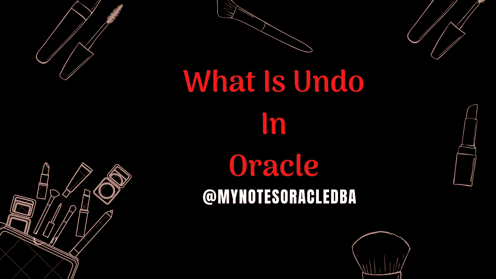
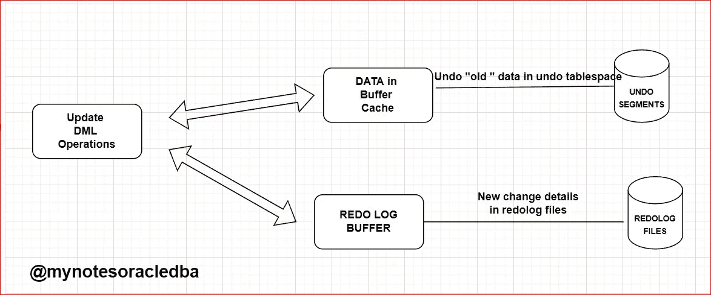

# Oracle 中的撤销是什么？

> 原文：<https://medium.com/nerd-for-tech/what-is-undo-in-oracle-ef07c9c7f4ed?source=collection_archive---------0----------------------->

在这里，我们将了解 oracle 中的撤消概念和操作

oracle 中的撤消概念

**什么是撤销数据？**

*   当事务修改任何数据时，数据库服务器从光盘复制原始数据。它在修改它之前将它存储在存储器中。相关数据的原始副本称为“**撤销数据**”。
*   然后，相关数据的另一个副本也被写入缓冲区缓存，所有更改都在这些块中完成。因此撤消数据保持不变。
*   这有几个原因。第一个是，如果您想要回滚您的更改，或者如果您的更改由于系统故障等原因需要回滚。，撤消块用于回滚。
*   第二个是，提供读取一致性。
*   我们知道，当我们对表进行任何更改时，只有我们能看到这些更改，直到我们提交它们。
*   这由撤消数据提供。服务器为需要获取更改数据的其他用户读取撤消数据。因为它们仍然与原始数据相同，所以其他用户看不到这些变化。
*   他们看到撤销段中写了什么。但是我们可以看到更改，因为服务器从缓冲区缓存中读取您的会话更改的块。
*   然而，这并不总是有保证的。数据库保证操作在 15 秒内完成。
*   因为 DBA 可以通过改变表空间来保证存储所有的更改。
*   第三个原因是，提供闪回功能。有闪回功能。
*   我们可以将数据库恢复到某个时间点，或者您可以查看及时做出的更改。

**当我们做出改变的时候？**

*   当我们提交所有的更改时，撤销数据会存储一段时间。
*   这样做的原因是为了提供闪回特性，并使其他用户能够一致地读取长查询。
*   这意味着，如果我们更新另一个用户仍在读取的行，最好将旧值发送给该用户。所以撤销数据会存储一段时间以提供这种功能。
*   我们可能会看到撤销大部分是由撤销段组成的。

**什么是细分市场？**

*   块是内存或磁盘中最小的逻辑数据组。
*   逻辑数据库空间中较大的一个是范围。较大的一个称为片段。

**结论:**

*   右边的一个包括左边的一个组。因此，我们可以将段视为一个更大的内存区域，其中包含一组区段。
*   包含段的较大内存区域称为表空间。
*   在这篇博客中，我们清楚地理解了撤销的概念。