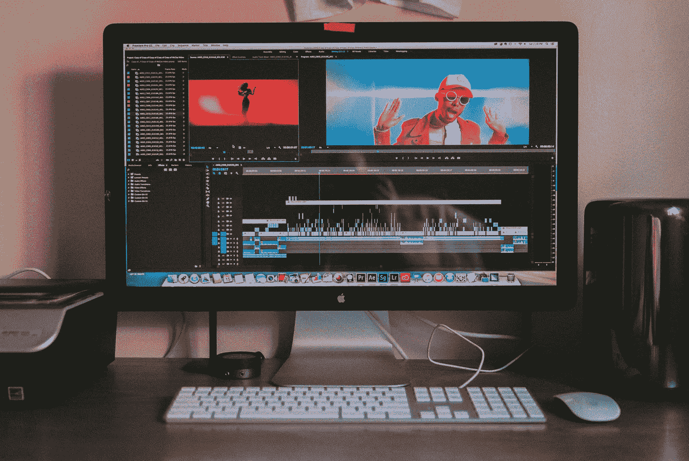

# 什么是视频标注？

> 原文：<https://medium.com/nerd-for-tech/what-is-video-annotation-15cbbc48a7b0?source=collection_archive---------2----------------------->

以帧为单位在一系列图像中定位和跟踪物体，标记后的视频数据将被用作深度学习和机器学习模型的训练数据集。它主要用于训练车辆，行人，骑自行车的人，道路和其他自动驾驶领域的模型。这些预训练的神经网络然后被用于计算机视觉领域。

与图像技术一样，视频数据也可以应用于互联网娱乐、智能家居、智能医疗、新零售、安防、自动驾驶等领域。此外，图像是某一时间点的数据。相比之下，视频数据是一系列连续的图像数据，可以传递更丰富的信息，具有更广泛的应用。

## **比如智能安防的应用场景——视频监控管理**

视频监控系统已经广泛应用于生活中，如道路、银行等。它可以实时监控道路上车辆的状态。当交通事故发生时，它立即作出反应，并确保运输的正常运行。它还可以对违反交通规则的车辆进行详细记录。违章司机的图像也能清晰记录。在路上可以把街上行人发生的事情登记下来，给警察处理。它提供了极大的便利，维护了社会秩序。

## **要注意的信息**

视频中包含的信息可以分为以下三个部分:

1)感知特征信息:除了图像的视觉特征，如颜色、纹理等。该视频还具有表征运动、听觉信息和文本的特征。

2)结构信息:就像一本书通常会有一个目录来帮助人们快速浏览内容一样，一个视频也需要构造一个实用的目录。视频目录可以包括不同级别的结构信息，例如镜头、场景等。

3)语义信息:主要指人们看到某一视频时产生的概念、事件、理解、感知等心理反应。

## **视频标注类型:**

**1)视频跟踪:**

视频跟踪标注的处理方法有两种:分帧处理和连续帧处理。

**分幅处理:**

分帧处理的优点是漏帧率低，逐帧标注保证了准确性，适用于复杂场景标注。

**连续帧处理:**

连续帧效率高，成本相对较低。例如，在每秒 10 帧的视频中，注释器在第一帧标记对象。系统使用对象跟踪算法通过后续帧来跟踪这些对象。它适用于简单的场景注释。

**2)视频分类**

**时间点标注**

根据视频的时间点显示内容，比如在两分钟处设置一个圆点，并配以文字或截图。例如:当鼠标移动到视频播放栏上的小白点时，会显示该点播放的内容。通过该系统，可以标记视频的关键内容点，以便用户可以快速浏览到他们想要观看的内容。

## 对可扩展和定制数据集的高需求

目前，各行业对最优质的 AI 训练数据需求迫切。AI 在各个领域都有实现，比如教育、法律、智能驾驶、银行、金融等。每个领域都有细分和专业化的要求。

其中，尤其是智能转型的传统企业和科技企业，更需要有丰富项目经验的培训数据服务商的协助，帮助整理数据标注指令，获取更合适的数据。在特殊场景下使用高质量的数据，减少研发周期，加速实施过程，帮助企业更快更好地进行智能化转型。

在深入的产业落地过程中，人工智能技术与企业需求仍有差距。企业用户的核心目标是利用人工智能技术实现业务增长。实际上，人工智能技术本身并不能直接解决所有的业务需求。它需要创建可以基于特定业务场景和目标大规模实现的产品和服务。

我们需要明确的是，对于 AI 公司和整个行业来说，数据标注是实现人工智能的重要一环。标注数据的准确性和效率影响着人工智能算法模型的最终结果。

# 结束

将您的数据标注任务外包给[字节桥](https://tinyurl.com/4r484kc2)，您可以更便宜、更快速地获得高质量的 ML 训练数据集！

*   无需信用卡的免费试用:您可以快速获得样品结果，检查输出，并直接向我们的项目经理反馈。
*   100%人工验证
*   透明和标准定价:[有明确的定价](https://www.bytebridge.io/#/?module=price)(包含人工成本)

为什么不试一试呢？

来源:https://www . Sohu . com/a/510398215 _ 518843？SPM = smpc . author . FD-d . 1 . 56756122 r 4 TP 2 sa