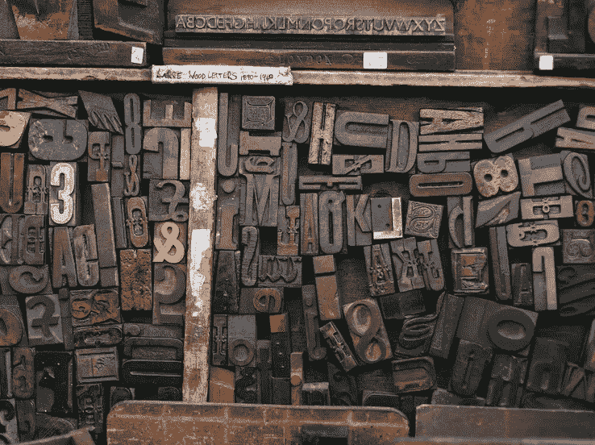
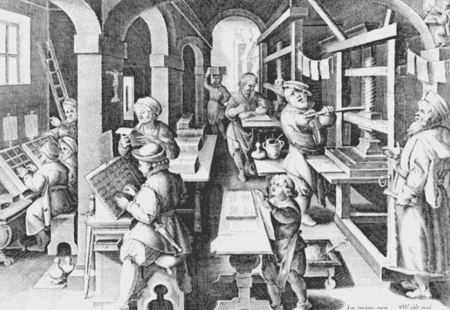

# 互联网和印刷媒体有什么共同点

> 原文：<https://medium.com/nerd-for-tech/what-the-internet-printing-press-have-in-common-68920538141b?source=collection_archive---------0----------------------->

布鲁诺·马丁斯在 [Unsplash](https://unsplash.com/s/photos/printing-press?utm_source=unsplash&utm_medium=referral&utm_content=creditCopyText) 上的照片

当我们想到互联网时，我们不会想到书籍，更不用说印刷机了。然而，如果没有印刷机，我们就不会有互联网。还有一台印刷机，你可能坐在你的书桌旁或房子里的某个地方，或者在办公室走廊尽头的那台。我们认为它是一台打印机，但它是约翰内斯·古腾堡在 1436 年左右第一次迭代的后代。古腾堡的先驱是 9 世纪的中国雕版印刷。在古腾堡之前，甚至韩国人也在摆弄金属活字。

这就是技术祖先。但是印刷机不仅仅是印刷书籍、海报、传单和小册子。它与今天的互联网及其对人类的影响有许多共同之处。事实上，我们甚至可以说，电报、电话、无线电，都只是间隙技术。虽然它们的影响是巨大的，但没有一个像印刷机或使互联网今天工作的技术那样震撼了文明并引起了如此大的变化。

或许我们可以说，互联网是一项和印刷机一样意义深远的技术。或许更是如此。

印刷机对人类的真正影响是什么？历史教授[伊丽莎白·爱森斯坦](https://www.britannica.com/technology/printing-press)，在 20 世纪 70 年代末写了一部开创性的作品，至今仍是人类学家和社会学家的经典读物，《作为变革代理人的印刷机》

*承蒙大英博物馆受托人的好意；照片，J.R. Freeman &有限公司转自* [*大英百科全书*](https://www.britannica.com/technology/printing-press)

在她对印刷术的影响的许多见解中，有一个是书籍的格式和呈现方式，从左到右的扫描，到章节呈现、论点和故事拱门以及事实的安排，可能对读者的思维模式产生了深刻的影响。

《圣经》的印刷导致了基督教的分裂。曾经天主教会通过使用抄写员控制了圣经的生产，路德看到了印刷圣经的价值和随他的版本一起发行的能力。因此路德教。我在这里简化一下，但是你明白了。

今天吗？互联网不仅使数字形式的圣经得以即时复制，也使各种衍生的宗教意识形态得以复制。从新异教到伊斯兰教和基督教原教旨主义(在互联网出现之前就已经存在，但因为互联网的存在而受到了更大的影响。)

她指出，印刷具有“放大和强化”规范、价值观、信仰和意识形态的功能。本质上，印刷是一种传播文化的手段。文化是我们物种为了适应我们的世界而选择的生存机制，而不是基因适应。印刷术使我们能够做人类喜欢做的事情。也就是说，进入彼此的大脑，找到达成社会共识和进化的方法。互联网，在最基本的层面上，是一种文化传播的手段。

印刷机提供了识字的传播，这种传播仍在继续，但也是通过数字手段。从智能手机到电子书和播客。

知识爆炸发生在 16 世纪，通常归因于新大陆的发现或宗教改革，但艾森特森认为，很可能是由印刷术推动的。

今天，互联网也引起了知识的爆炸。使互联网和计算机连接起来的基础计算技术，使我们以更快、更有影响力的速度分享、创造和辩论。抛开抖音视频的愚蠢。

但是当我们看到像抖音或 Snap、Twitter 这样的频道，并认为它们毫无意义时，它们在某种程度上是毫无意义的，但它们也是文化的表达。它们确实有作用。18、19 世纪的印刷版《抖音》和《快照》等。，居然是[小钱小说](https://www.groupdiscussionideas.com/is-social-media-making-us-less-social/)。像《90 天未婚妻》这样的简短故事，在当时和今天的电视真人秀一样有价值。

印刷机也促进了西方个人主义的兴起。在抄写员的时代，由于缺乏书面材料，它需要在教堂或大厅的公共集会来接收信息和信息。书、报纸、传单、小册子，开始打破这种文化活动。

今天，我们谈论很多这样的事实:社交媒体让我们走到了一起，同时也让我们变得孤独。互联网使我们能够前所未有地协调、组织和分享想法和思想，但它也促成了更多的个人主义。当我们过于个人主义时，人类文化往往会受损，表现不佳。这不符合我们的生物本性。它导致了社会纽带的弱化，然而奇怪的是，它可以增强那些围绕意识形态的社会纽带。比如我们今天看到的极右和极左团体。

印刷术也导致了更大的劳动分工。专注于专业化的印刷商，如专门为男性或女性或某些社会群体出版的书籍、商业出版物或支持不断增长的官僚体系。社会变得更加复杂。

正如我之前所写的，互联网也导致了更大的劳动分工。你会如何向 15 世纪的人解释什么是网站管理员、DevOps 工程师或全栈开发人员？更不用说一个程序员或算法伦理学家了。

在印刷机出现之前，我们使用的大多数技术都是为了控制我们的物理环境；农业、铁路、矿山、城市。所有这些都是在我们的脑海中构想出来的。但是沟通我们内心世界的能力相当有限。随着印刷机的出现，突然间，我们的认知世界，我们的思想，可以比以往任何时候都更深入地被探索。我们真的改变了主意。

互联网今天也在做同样的事情。这似乎对人类非常重要，以至于当我们创造数字技术时，我们想要做的一件关键事情就是重新创造我们自己的思想。我们称之为人工智能。也许部分原因是我们想了解对方的想法。

短语“一分钱买你的想法”或“那么，你在想什么？”几千年来，每一种人类文化中的每一个人都可能以不同的方式说出这句话。我们这样问是因为我们无法知道，而且我们直觉地知道，当分享想法时，我们并没有得到完整的事实真相。社会规范和文化行为决定了我们彼此分享的多少和内容，并受到我们亲属关系的影响，无论是工作、娱乐、社区还是家庭生活。尽管我们试图了解我们周围的世界，但我们也试图了解彼此。这是我们开发脑机接口(BCI)的另一个原因，不仅是为了操纵我们的内心世界和外部世界，而且也许是为了进入别人的大脑。

印刷术使我们能够更深入地了解彼此的思想，并在一个实际上对我们相当不利的星球上促进我们人类的生存。互联网让这一切变得更加可能。

因为我们正处于互联网及其所带来的技术的早期，我们也正处于一个开始理解互联网如何改变全球社会文化系统的起点。我们花了几百年才理解印刷机作为一种技术的深远影响。互联网的影响同样深远，甚至更深远。再过十年左右，我们会对它有更多的了解，但再过一百年，我们可能就不会完全理解它的影响了，尽管这看起来很奇怪。大规模、全球性的社会文化变革不会在一夜之间发生…你不会在早上收到智能手表或手机上的通知说“World 3.0 已成功安装”。