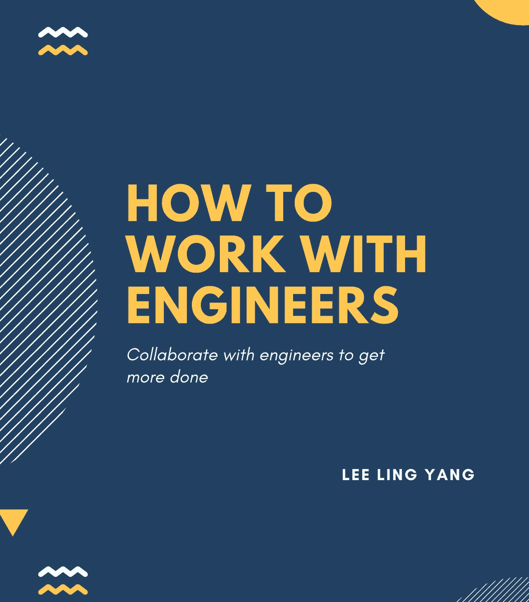

# 作为第一个产品管理人员，你最不期望的是什么

> 原文：<https://medium.com/nerd-for-tech/what-you-least-expected-as-the-first-product-management-hire-6165c523f696?source=collection_archive---------15----------------------->

来自 [Unsplash](https://unsplash.com/photos/qDY9ahp0Mto) 的 [BenWhitePhotography](https://unsplash.com/@benwhitephotography)

成为第一个项目经理令人兴奋。你被承诺可以“建立自己的团队”。你接受这份工作是因为你有更高级的头衔。你可以和创始人一起工作，共同创造愿景。

但是要为惊喜做好准备——特别是如果你的上一份工作是在一家老牌公司——而且这是你第一次在一家初创公司工作。

# 1.证明公司需要一个项目经理，即使你已经被雇佣了

# 误解

因为你是第一任首相，所以在你之前没有人可以和你相比。证明自己的价值一定很容易吧？

# 现实

**你的团队或利益相关者不知道项目经理会带来什么价值**。小公司通常会雇佣那些职业生涯刚刚起步、缺乏科技工作经验的人。你很可能是一些利益相关者(包括首席执行官)合作过的第一个项目经理。在你加入之前，公司运转得很好。他们可能想知道为什么公司现在需要项目经理。

对项目经理应该做什么的不切实际的期望。他们可能从播客和在大公司工作的朋友那里听说过理想的项目经理应该是什么样的。但是对于公司所处的阶段来说，他们的期望可能是不现实的。如果他们在以前的工作中有过与经前综合症打交道的经验，他们也会对经前综合症应该做什么抱有同样的先入之见。

# 做什么

**阐明他们对项目经理角色的期望。**如果他们不熟悉与项目经理的合作，请他们思考在他们之前的工作中与项目经理合作是什么样的。例如，营销部门有一个专门的项目经理，负责就在网站上运行哪些实验提出想法。期待他们要求你也这样做。

问他们喜欢和不喜欢这些经历的什么。这比问“你认为一个好的 PM 是做什么的”更有力。人们更善于反思他们过去的行为，而不是预测他们未来想要什么。例如，他们讨厌每次发布都是惊喜。请确保您安排了演示并传达了功能发布。

根据你的优势发现你最有价值的活动。即使他们从未与经前综合症合作过，也要问他们现在面临什么问题？哪些问题属于项目经理的职责范围，而你擅长解决？采访每个利益相关者后，优先考虑速赢。

**兑现你在面试中的承诺。在面试中反思他们为什么雇佣你。他们选择你是因为你以前的经历证明了你是那个能让事情变得更好的人。**

# 2.以更高级的头衔承担“入门级”工作

# 误解

既然你是这个部门的负责人，你应该专注于战略，而不是细节，比如写故事。

# 现实

期望做更多的战术工作。作为第一个也是唯一一个 PM，你一定会是管理待办事项的人。您还需要填充产品团队没有的空角色——但是发布下一个版本所必需的。你将在一天内成为用户研究员、设计师和 QA。

# 做什么

**把这看作是温习基础知识的机会。**不要认为承担初级项目管理任务是降级，而是成为更好经理的垫脚石。当您使用新的 PM 时，您可以帮助他们避免您所犯的错误，并警告他们基于危险技术构建的功能。这表明你不仅仅是一个健谈者，并赢得了新员工的尊重。

**对构建过程要有战略眼光。由于没有人领导这个部门，所以会有一些可以简化的不完整的流程。这就是你的资历变得有价值的地方。选择你在职业生涯中学到的最适合公司文化的框架。例如，大多数公司采用 scrum，这种方法需要两周的冲刺。考虑到创业公司的快节奏本质，你可以选择使用看板来给你的团队在某一天完成重要任务的灵活性。**

# 3.将产品角色与创始人分开

# 误解

成为第一个项目经理意味着你对产品策略有更多的发言权。

# 现实

**与创始人分享产品决策。在你加入之前，创始人可能是产品经理。所有的产品决策都必须经过创始人，以确保产品是按照他们的设想建造的。他们甚至可能是写故事和排列待办事项的人。**

他们不会放弃他们的旧习惯，立即摆脱杂草。他们需要时间来信任你，给你完全的控制权。在那之前，你会觉得自己被微观管理。在本文中，我已经分享了[更多关于首次项目经理招聘的策略，这些策略可以有效地帮助创始人。](https://medium.datadriveninvestor.com/how-the-first-product-management-hire-can-work-effectively-with-founders-639bf7935327)

# 做什么

**预测创始人何时倾向于加强控制。**当他们倾向于微观管理时，是否有一种模式——让你超越他们？通常，当他们觉得自己处于黑暗中时，他们想要更多的控制权。在主动沟通和每次更新都让他们陷入困境之间找到平衡。例如，当没有新的东西发布时，创始人开始挖掘积压，因为所有的努力都花在了修复 bug 上。我已经学会了在每次冲刺中加入一些小的改进。

确定你的技能可以补充创始人的不足。大多数创始人都很有远见，没有时间考虑细节。我知道我分解复杂场景和管理依赖性的能力将有助于更快地执行他们的愿景。表现出我能很快赢得信任。

**将创始人视为主题专家。**创始人对谁是他们的竞争对手有着丰富的知识，对市场和用户需求有着深刻的理解。向他们请教，以加快你的提升速度。要想在行业中保持领先，问问他们有什么可用的资源。

让他们谈论自己的激情和观点也是与创始人建立融洽关系的好方法。这表明你也关心他们的想法。

# 4.成为唯一的项目经理的时间比你想象的要长

# 误解

在面试中，你被告知你将作为第一个 PM 雇员来建立 PM 团队。你接受这份工作是因为你想指导其他项目经理。

# 现实

**独自管理大型工程师团队。**如果公司处于早期阶段，资金将被投入到雇佣更多的工程师来加快出货速度，并加速寻找产品市场契合度。

一旦公司处于增长阶段，带来更多的线索和交易对底线有更直接的影响。所以预算会分配给销售和营销。当公司不盈利时，很难证明雇佣另一个项目经理是合理的。

# 取而代之做什么

从其他部门发掘有潜力成为产品经理的人才。这可以节省你让他们了解产品知识和用户角色的时间。

例如，我的一位客户支持主管拥有关键的可转移技能。他写了非常详细的问题，使开发人员很容易排除故障。考虑到他与客户的日常互动，他能够利用强大的用户反馈来支持他的功能请求。最重要的是，他拥有最难教授的用户同理心。

通过我们频繁的互动，他一直在间接地做我的影子——这激发了他成为产品经理的兴趣。我能够与他的经理协商分割他的角色，因为她想成为一名支持团队职业发展的优秀经理。这让他“尝试”这个角色，也让我进一步测试他是否可以训练。

# 相关文章

*   [说出这 4 个短语，让工程师立刻爱上你](https://leelingyang.medium.com/say-these-4-phrases-to-make-engineers-love-you-right-away-46752bd50352)
*   [如何避免这些工程师的通病](/swlh/how-to-avoid-these-developer-pet-peeves-70ec0dff3a0d?source=your_stories_page-------------------------------------)

下载我的书[如何与工程师一起工作](https://bit.ly/Howtoworkwithegineers_medium)

