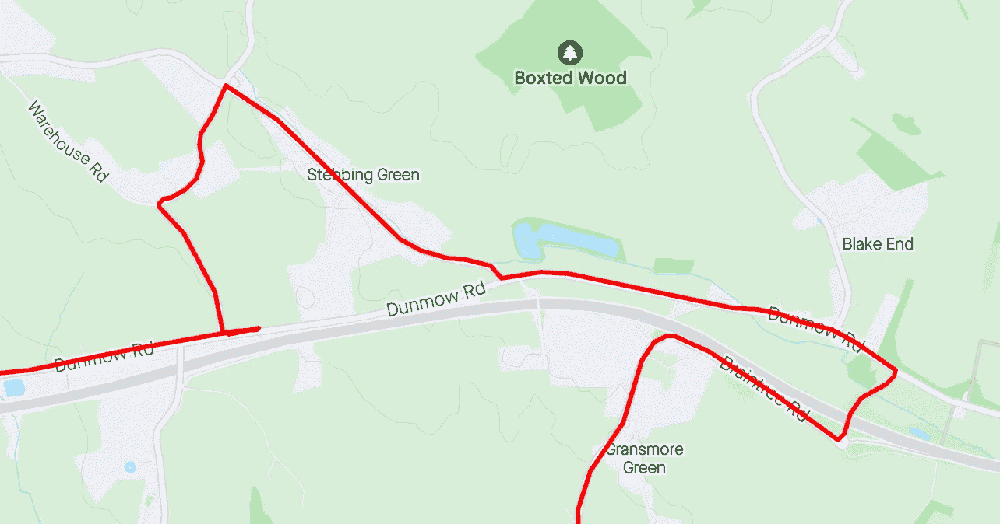

# 优化 pt 5

> 原文：<https://medium.com/nerd-for-tech/when-to-stop-at-near-enough-5f0a0ad6bdd3?source=collection_archive---------1----------------------->

## 何时在足够近的地方停下来

GPXmagic 读写 GPX 文件，这些文件是由经度和纬度对组成的路线的 XML 表示，通常带有高度。



许多运动员用 GPX 档案计划和跟踪活动

显然，我使用 XML 解析器并处理语法树来访问数据，对吗？不。我从没为此烦恼过。当我开始的时候，我尝试正则表达式来让我快速入门。(转义`\`让它看起来比实际情况更糟)。

```
**let
    trkpts** =
        Regex.find (asRegex **"(<trkpt(.|\\s)*?)(trkpt>|\\/>)"**) xml

    **latitude** trkpt =
        Regex.find (asRegex **"lat=\\\"([\\d\\.-]*)\\\""**) trkpt

    **longitude** trkpt =
        Regex.find (asRegex **"lon=\\\"([\\d\\.-]*)\\\""**) trkpt

    **elevation** trkpt =
        Regex.find (asRegex **"<ele>([\\d\\.-]*)<\\/ele>"**) trkpt
```

这很有效，我从来不觉得有必要改变它。直到最近。XML 文件在`trkpt`标签列表之外有一个`trkseg`标签，所以一条路线可以由多个线段组成，每个线段都有许多点，但是路线从来没有。

对即将推出的 RGT 功能的支持改变了这一点。我需要用可选的`<namedSegment>`标签提取片段。

首先，我尝试用外部正则表达式来做这件事。那真的不太顺利。它“有点”起作用，但是太慢了。我想这是因为捕获的字符串大得离谱，伴随着内存抖动。

现在似乎是时候做“正确的事情”并使用一个完整的 XML 解析器了。就编码工作和执行时间而言，这肯定是最简单和最有效的。你会希望。

长话短说，它*似乎*完全没问题。我可以加载高达 84KB 的文件。我的第二大文件 93KB 无法加载。没有错误，什么都没有。几分钟过去了。没什么。没办法知道发生了什么。任何更大的文件——我有一个 22MB 的测试文件——都会以同样的方式失败。

我想这可能仍然是我的代码构建了太多的中间结果，尽管这无法解释灾难性的失败模式。我将所有的代码整理成一个超级高效的单次遍历，只需要最少的数据复制。同样的结果。

这看起来像一个节目停止。不能有低得离谱的文件大小限制，需要保留片段中轨道点的结构嵌套，并保留片段名称。

佩妮掉了。正则表达式匹配结果包括文件中匹配的偏移量。例如，我知道跟踪点标签在偏移量 652、723、781 等处，我可以简单地进行更多的正则表达式搜索:

```
**trackSegmentStarts** =
    Regex.find (asRegex **"<trkseg>"**) xml
        |> List.map *.index* **namedSegments** =
    Regex.find 
        (asRegex **"namedSegment>(.*)<\\/.*:namedSegment"**) 
        xml
```

那么这仅仅是一个建立两者相对位置的问题，我可以推断出结构。整洁，不完美，有点蹩脚，但它快速而稳定。

“够近了”，我爸爸会说。