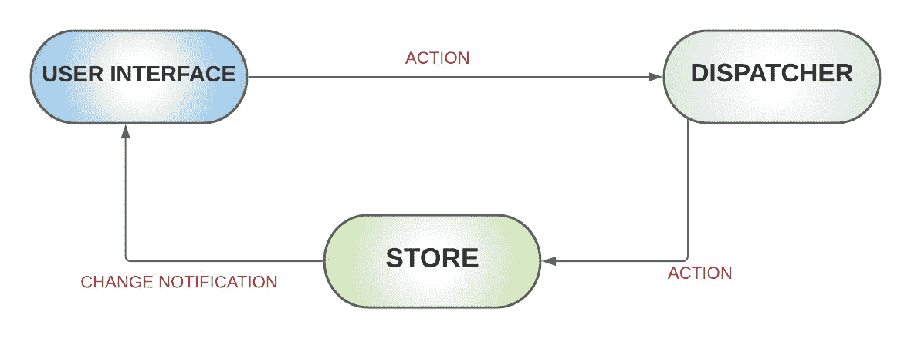
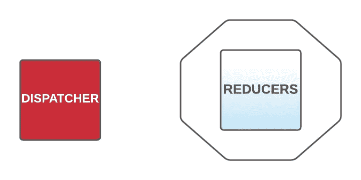
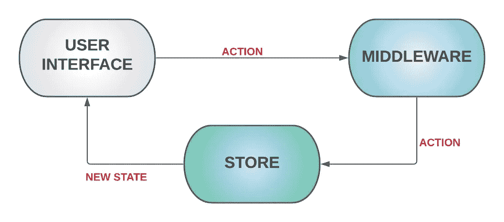
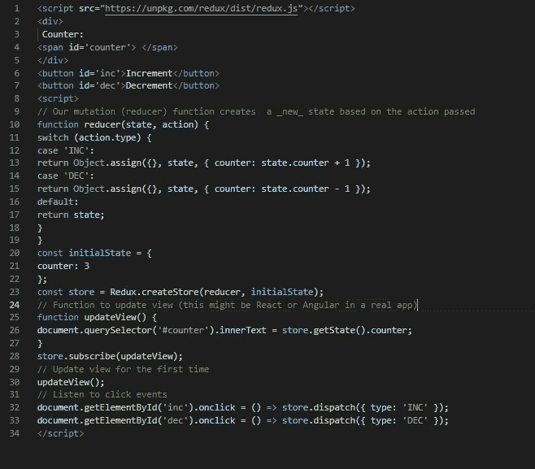

# 何时、为何以及如何使用 Redux

> 原文：<https://medium.com/nerd-for-tech/when-why-and-how-to-use-redux-ee1ce73639f6?source=collection_archive---------7----------------------->

Redux 是 JavaScript 应用程序的可预测状态容器。这意味着您将所有的应用程序状态存储在一个地方，并且可以知道在任何给定时间点的状态。

在深入研究 Redux 之前，我们应该熟悉它的基础和前身 Flux 架构

## 什么是通量？

Flux 是一种通用的架构或模式，而不是特定的实现。**在 Flux 中，**事件在一个循环流中一次管理一个事件，有许多参与者:**调度员、商店和动作**。

## **一个动作**

是描述系统中任何变化的结构:鼠标点击、超时事件、网络请求等等。动作被发送给调度程序

## **调度员**

是系统中的单点，任何人都可以在这里提交操作进行处理。然后，应用程序状态被保存在存储中。

## 商店

持有部分应用程序状态，并对来自调度程序的命令作出反应。

## **简单通量流:**

1.  商店订阅动作的子集。
2.  一个动作被发送给调度程序。
3.  调度程序将该操作通知订阅的商店。
4.  商店根据动作更新它们的状态。
5.  视图根据商店中的新状态进行更新。
6.  然后可以处理下一个动作。

> 这个流程确保很容易推断出动作在系统中是如何流动的，什么会导致状态改变，以及它将如何改变。

在这种情况下，点击事件将产生一个动作，这个动作将改变存储，然后改变视图。在此过程中，由存储或其他组件创建的任何操作都将被排队，并仅在第一个操作完成且视图更新后执行。

## 还原与通量

虽然 Redux 源自 Flux 概念，但这两种架构之间还是有一些区别。

与 Flux 相反，Redux 只有一个单独的存储，它本身没有逻辑。存储直接调度和处理操作，不需要独立的调度程序。反过来，**存储将动作传递给称为 reducers 的状态改变函数，**Redux 添加的一种新的 actor。

## 应用数据

让我们想象一个帮助我们管理移动商店的应用程序。我们的移动商店应用程序的所有数据，包括手机及其附件的列表，都将存储在一个大对象中:商店。最好将这种模式与应用程序前端的数据库进行比较，就像服务器端的数据库一样，可能为每个数据对象保存多个表(或集合)。虽然许多其他框架将数据划分到不同的服务和领域，但在 Redux 中，我们将所有数据保存在一个中央存储库中，UI 的所有部分都可以访问。

## 更改数据

因为我们所有的数据都存放在一个 JavaScript 对象中，所以必须有一种方法以清晰一致的方式修改它。但是允许我们代码中的不同地方直接访问和修改我们的中央存储库将会使跟踪变化和正确更新 UI 变得非常困难。

在 Redux 中，对存储的所有更改都是通过发送一个动作来启动的，这个动作是一个普通的 JavaScript 对象，包含描述所需更改的所有信息。动作被发送(分派)到我们的商店，商店根据动作计算新的状态。

由于 store 是一个通用的实现，在 Redux 中，我们使用另一个概念(reducers)来计算一旦对它应用了一个动作，我们的当前状态将会是什么样子。

例如，添加一个新的移动设备会将旧的状态(比如有三个配方的数组)更改为有四个配方的新状态

## **更新用户界面**

每个 UI 框架使用 Redux (React，Angular，Vue 等。)负责订阅商店收听其“*商店更新*事件并相应更新 UI。

Redux 的**核心理念是我们的 UI 总是反映应用在商店中的状态。发送一个动作将导致我们的商店使用我们的 reducers 来计算一个新的状态，并通知 UI 层相应地更新 UI。**

## 还在想为什么 Redux？

Redux 的其他部分使应用程序更容易构建和管理，比如中间件。每一个动作都通过中间件的管道传递。与 reducers 不同，中间件可以修改、停止或添加更多的动作。示例可能包括日志中间件、检查用户是否有运行操作的必要权限的授权中间件，或者向服务器发送信息的 API 中间件。

## 基本 Redux 实现:

Redux 背后的基本前提是所有应用程序状态都保存在一个地方，即存储区。

**要在应用程序中使用这个想法，我们需要找到一种方法:**

1.作为事件的结果修改状态(用户生成的或来自服务器的)。2.监控状态变化，以便我们可以更新用户界面。

**第一部分可分为两个功能块:**

1.  通知商店发生了一项行动。
2.  帮助商店找出如何根据我们的应用程序的逻辑修改状态。

**使用这个结构，**让我们构建一个实现计数器的简单应用程序。

我们的应用程序将使用纯 JavaScript 和 HTML，不需要任何现代浏览器中的额外库。我们将有两个按钮，允许我们增加和减少一个简单的计数器，以及一个我们可以看到当前计数器值的地方:

让我们为每个按钮创建一个点击处理程序，它将使用 dispatch()函数通知我们的存储需要执行一个操作:dispatch(action)；将点击事件连接到 dispatch() //侦听点击事件

**document . query selector(# Inc)。onclick = () = >调度(' INC ')；document.querySelector('#dec ')。onclick =()=>dispatch(' DEC ')；**

让我们定义一个函数，它将根据作为参数接收的应用程序状态更新 HTML 中的计数器值:

//更新视图的函数(在真实 app 中可能是 React 或者 Angular)**函数 update view(){ document . query selector(' # counter ')。innerText = state.counter}**

因为我们希望我们的视图表示当前的应用程序状态，所以我们需要它在每次状态(和计数器)改变时被更新。为此，我们将使用 subscribe()函数，

该函数的作用是在每次状态发生变化时调用我们的回调函数:

**订阅(update view)；**

在我们的简单示例中，我们的状态将保存一个计数器，它的值将根据动作递增或递减:

**功能减速器(状态，动作){**

**开关(动作){**

**case 'INC ':返回 Object.assign({}，state，{ counter:state . counter+1 })；case ' DEC ':return object . assign({ }，state，{ counter:state . counter—1 })；默认:返回状态；**

**}**

**}**

> 需要记住的一件重要的事情是，reducers 必须总是返回一个新的、修改过的状态副本。他们不应该改变现有的状态。

dispatch()函数调用由应用程序创建者实现的 reducer()，向它传递当前状态和它接收到的动作。这些信息应该足以让 reducer()函数计算出一个新的状态。然后，我们检查新状态是否不同于旧状态，如果不同，我们替换旧状态，并通知所有侦听器这一变化:

**设状态=空；**

**功能调度(动作){**

**const newState = reducer(状态，动作)；**

**if (newState！==状态){**

**state = new state；listeners . foreach(listener =>listener())；**

**}**

**}**

## 使用真正的 Redux

为了完成我们的例子，让我们切换到真正的 Redux 库，看看这个解决方案有多相似。

首先，我们将添加 Redux 库

将 Redux 添加到项目中，然后我们将之前的状态定义更改为一个常量，该常量仅定义状态的初始值:

初始状态

***const initial state = { counter:3 }；***

现在我们可以用它来创建一个 Redux 存储:

创建 Redux 存储

***const store = redux . createstore(reducer，initial state)；***

如你所见，我们正在使用以前的减速器。需要对缩减器进行的唯一更改是在 switch 语句中。我们不仅仅使用 action:Previous reducer condition 开关(action ),而是包含了强制类型属性，它指示正在执行的操作的类型:New reducer condition

***【动作类型】*** 开关

Redux store 还将提供我们之前自己实现的所有功能，比如 subscribe()和 dispatch()。

因此，我们可以安全地删除这些方法。要订阅存储更改，我们只需调用存储的 subscribe()方法:

订阅商店更新

***(update view)；***

因为 subscribe()没有将状态传递给回调，所以我们需要通过 store.getState()来访问它:

通过从存储中读取状态来更新视图

//更新视图的函数(实际应用中可能是 React 或 Angular)***函数 updateView() {***

***document . query selector(' # counter ')。innerText = store.getState()。柜台；***

**T17)}**

***store.subscribe(更新视图)；***

最后一个变化是在 dispatch()方法中。

如前所述，我们的动作现在需要有 type 属性。因此，代替发送字符串“INC”作为动作，

我们现在需要发送 ***{ type: 'INC' }。***

我们简要介绍了 Redux 和 Flux 的历史，以及 Redux 的核心工作原理