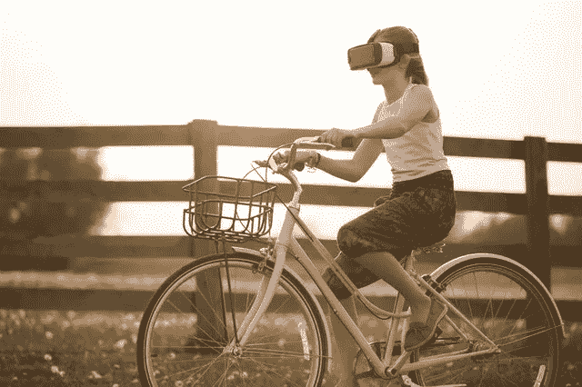
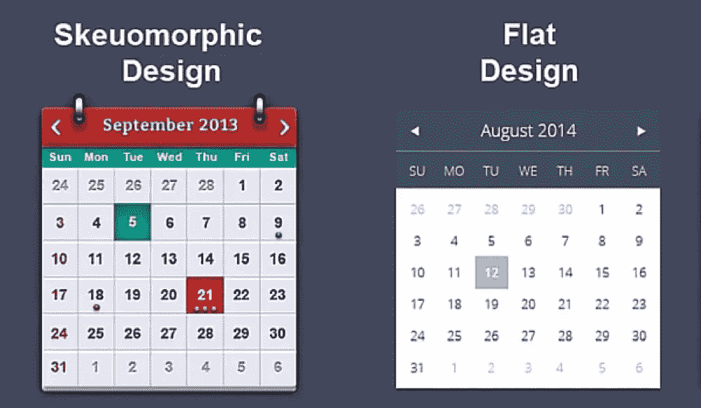

# 人类什么时候才能适应数字世界和生活？

> 原文：<https://medium.com/nerd-for-tech/when-will-humans-become-adapted-to-a-digital-world-and-life-409766be8ce6?source=collection_archive---------15----------------------->

照片由来自 [Pexels](https://www.pexels.com/photo/girl-wearing-vr-box-driving-bicycle-during-golden-hour-166055/?utm_content=attributionCopyText&utm_medium=referral&utm_source=pexels) 的 [Sebastian Voortman](https://www.pexels.com/@sebastian?utm_content=attributionCopyText&utm_medium=referral&utm_source=pexels) 拍摄

当你读这篇文章时，你可能正在使用智能手机、笔记本电脑或平板电脑。如果你不是在手机上阅读，你的手机可能离你很近。可能在三英尺以内？也有可能你有一个最喜欢的风格或品牌的笔，你有一个纸质笔记本的偏好。或者任何旧报纸都可以。你可能是一个追求工作流程终极完美的生产力呆子。在你的数字世界里，你有你喜欢的电子邮件应用程序，而不是 Evernote、OneNote 或 Bear(这篇文章是用 Bear 写的。我用熊来写我所有的帖子。)

在过去的几年里，我为一些组织做了一些人种志和网络志的研究。大部分是大型企业，一些政府和非营利组织。人种学研究是指我深入工作场所，在一段时间内采访和观察员工。 [Netnography](https://en.wikipedia.org/wiki/Netnography) 是数字版，我会花时间在网上论坛和社交媒体上为各种客户进行研究，主要是与品牌声誉和产品洞察力相关的营销。这是为了背景和上下文。

我们世界和生活变得越来越数字化。我们基本上每天都在两个世界之间波动。自从疫情以来更是如此，在那里我们花了很长时间进行视频会议，使用协作和生产力工具，如 Slack、opinion、Monday、Trello 等。一天下来，我们筋疲力尽。由于整天盯着蓝色屏幕，我们的眼睛疼痛和头疼。我们的手指因打字而麻木。所以我们在现实世界中寻找模拟活动。

在加拿大，疫情期间，印刷杂志的销售额上升了 32%,而印刷书籍的销售额也增加了。美国和英国经历了类似的上升。实体笔记本的销售也随着艺术和工艺用品、拼图和棋盘游戏的增加而增加。我们可以在后院使用的娱乐用品的销售也是如此。我们寻求非数字活动，因为我们需要休息。它仍然是人类搜索和导航我们周围世界的基本方式。你不能用笔记本电脑做饭。

人类通过我们的五种感官体验世界。几年前，这通过[外形设计](https://www.interaction-design.org/literature/topics/skeuomorphism)反映在数字世界中。苹果在 iPhones 的前几代 iOS 中就很好地做到了这一点。其他人纷纷效仿。外观设计的目标是使数字“物体”看起来与现实世界相似。现在，这种设计语言似乎很古老，并且已经转移到平面设计语言。外形设计在帮助我们适应参与数字世界方面发挥了重要作用。既然我们已经适应了我们的大脑，平面设计是可以接受的。很难说这是否必要，但有人怀疑这是必要的。我们通过集体认知来进化我们使用的设计语言。在未来几年，我们很可能会看到 UI/UX 设计的另一次转变。目前来看，趋势是平稳的。

图片来自[今日苹果世界](https://appleworld.today/)

苹果比任何其他科技公司都更早理解物理和数字设计的数字//模拟以人为中心的方法。谷歌几年前终于明白了这一点，微软也终于明白了这一点。这三家公司都在他们的实体产品的设计上投入了更多的精力。惠普、戴尔、宏碁、三星等第三方制造商仍然明显落后，但他们正在努力。联想仍在设计野兽派 1999 年时代的笔记本电脑，惠普混合笔记本电脑//平板电脑仍显得笨重和令人困惑。工程师非常擅长解决问题，但他们不太擅长设计。

当谈到我们的数字生活时，我们正处于一个过渡阶段。是的，我们在那里花了更多的时间，但我们仍然寻求身体上的。因为计算机已经变得无处不在和“看不见”，我们不再需要像 90 年代末到 21 世纪初那样“去互联网”访问它，我们一直被数字世界包围着。那么，我们什么时候才能真正实现无纸化，更全面地融入数字世界呢？

可能永远不会。也许吧。归根结底，我们还是动物。我们需要真正的食物，我们必须锻炼，我们渴望人与人、人与猫、狗和其他宠物的接触。找到你认识的最“数字化”或最技术化的人，他们很可能有一些他们喜欢并寻求的现实世界的活动或爱好。即使只是做饭。

人类变得更加数字化的下一个阶段是增强现实( [AR](https://www.investopedia.com/terms/a/augmented-reality.asp) )。更有可能是通过我们的智能手机，最终，AR 眼镜将变得更加为社会所接受。我们的车窗屏幕将会比现在显示更多的信息。后视镜也是，可能还有侧窗。已经有一些镜子上面显示了信息。这一切成功的部分关键是让信息与我们一起移动…从浴室镜子到冰箱屏幕到汽车屏幕和眼镜。这将是世代相传的，需要时间。

我们的大脑需要适应处理这种信息流，能够将它放入上下文并进行处理，这样我们才能做出决定并采取行动。多年来，我一直试图让我自己的父亲停止从网飞订购 DVD，买一台 AppleTV 或者其他任何东西，他是一个非常进步的思想家，喜欢他的 iPhone 和 iPad。没有。他喜欢他的 DVD。他 81 岁了，达到了他的数字舒适水平的顶峰。技术转型受到文化、社会和人口统计的影响。

在一段时间内，也许是很长很长的一段时间内，我们将在数字世界和现实世界之间混合和匹配我们的游戏和工作方式。