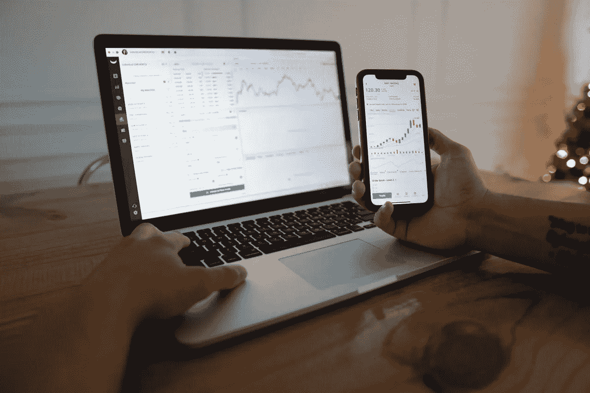

# 外汇数据从哪里来？

> 原文：<https://medium.com/nerd-for-tech/where-does-forex-data-come-from-1a784d243829?source=collection_archive---------4----------------------->

如果你是新手或不熟悉外汇市场，确定外汇数据的来源、可靠性和准确性可能会令人生畏。这是因为没有一个中央交易所可以在任何给定的时间点核实外汇汇率。外汇交易市场是分散的，有多个场外交易参与者，如银行、交易和经纪公司买卖货币。

## 柜台交易

场外交易是通过交易商-经纪人网络买卖证券的过程，交易对手不是中央交易所。现在已经清楚了一种货币是如何买卖的，让我们看看价格是如何得出的。价格主要来自报价驱动的市场。在我们继续之前，让我们看看什么是报价驱动的市场。

## 报价驱动

报价驱动型市场是指交易商/做市商对他们买卖证券的价格进行报价，也称为买卖价格。现在你可能会问经销商如何报价。交易商和经纪人通过反向交易为市场提供流动性，所以他们在你卖的时候买，在你买的时候卖。他们通过收取差价(也称为买卖差价)，低买高卖来做到这一点。在现代，交易商获得银行提供的流动性池，以提供最低的出价，并询问他们能提供的价格(这有点过于简单)。这些报价产生的数据是外汇数据的来源。外汇交易是在交易商/经纪人和交易商之间进行的，交易商间网络(流动性提供者)提供流动性。

## 提供不一定交易

很可能，大多数人都知道报价和交易价格之间的区别，但这仍然值得一提。外汇数据馈送代表买卖汇率，即经纪人提供的买卖货币的汇率，不一定是货币交易的汇率。

## 质量数据

任何人都可以提供外汇价格，例如，您的朋友可以设定一个汇率，从您这里购买美元以换取英镑，但该汇率可能并不真正代表市场上的美元英镑汇率。得出美元英镑汇率的一个可靠方法是将交易大量美元英镑的交易商、经纪人和外汇专家的买卖报价汇总起来(要理解“量”的意义，请阅读我们在伦敦下午 4 点定价的博客)。这是大多数高质量数据提供商所做的，也是为什么依赖一个单独的经纪人数据提要并不总是一个好主意。一个高质量的外汇馈送是一个低延迟的数据从多个交易商和经纪人，因为它确保了最新的利率。

如果你喜欢这篇文章，请订阅并鼓掌。希望这篇文章能帮助你更好地了解外汇汇率。如果你喜欢我们的工作或对未来的文章有建议，请留下评论。我们希望收到您的来信。