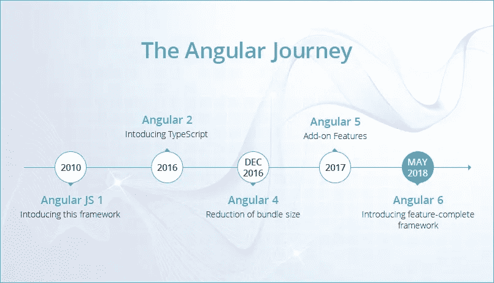
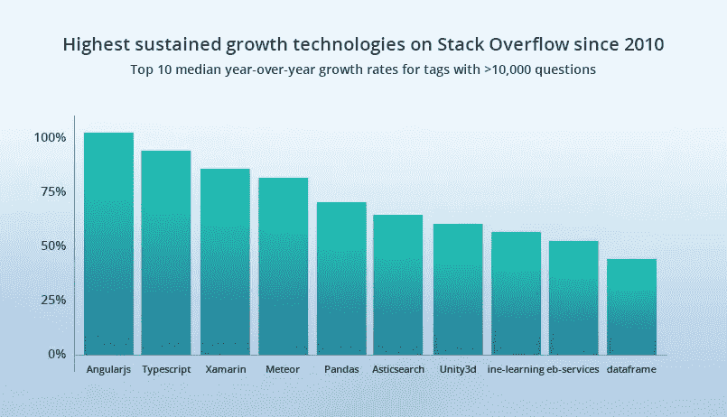
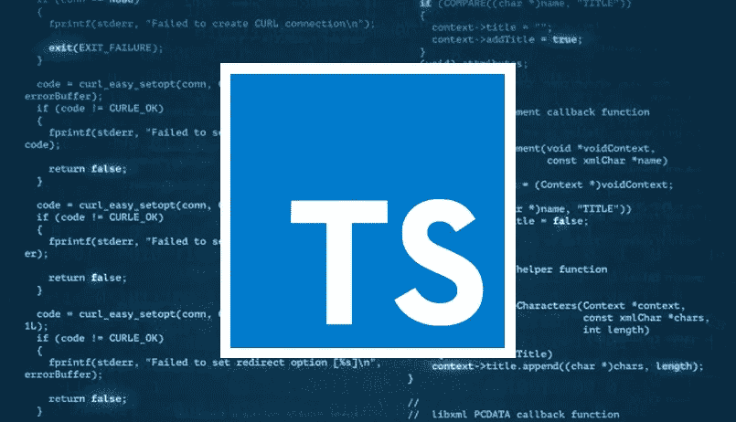
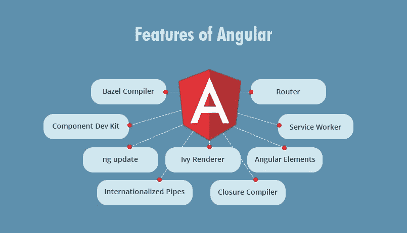
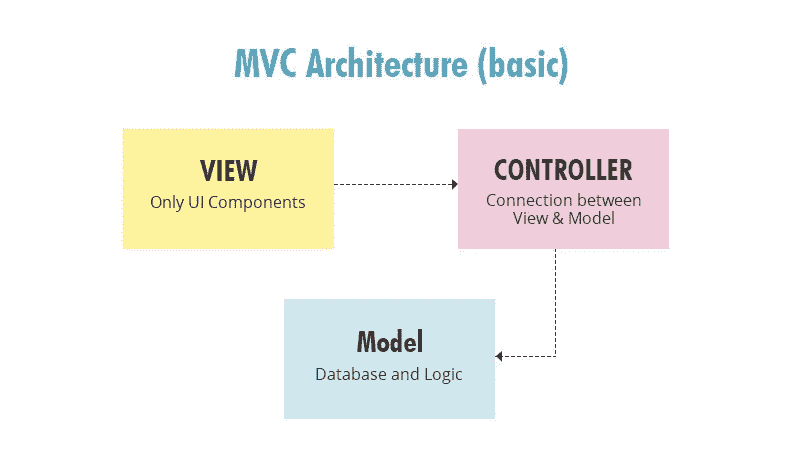

# 为什么 Angular 在开发者中得到最高的偏好？

> 原文：<https://medium.com/nerd-for-tech/why-angular-is-getting-the-highest-preference-among-developers-ce964d6a401d?source=collection_archive---------0----------------------->

Angular 是 Google 开发的一个开源前端框架，用于创建动态的现代 web 应用。该框架于 2009 年首次推出，多年来在消除不必要的代码和确保更轻更快的应用程序方面获得了巨大的吸引力。

从 2010 年的 AngularJS 到 2017 年的 Angular 5，前端框架迅速发展，如今超过 44.3%的软件工程师使用它来创建用户界面

Angular 以其引人注目的特性，包括模板、双向绑定、模块化、RESTful API 处理、依赖注入和 AJAX 处理，帮助构建交互式动态单页面应用程序(SPAs)。设计者可以使用 HTML 作为模板语言，甚至可以扩展 HTML 语法来轻松传达应用程序的组件。

用 Angular 构建动态应用不需要依赖第三方库。在您的项目中使用这个框架，您可以获得多种好处。我们列出了以下原因:

# 由谷歌支持

Angular 最大的一个优势就是支持 Google。最棒的是谷歌的长期支持(LTS)。这揭示了谷歌坚持下去并进一步扩大 Angular 生态系统的计划。

Google apps 也使用这个框架，他们的团队非常看好 Angular 的稳定性。其他 Angular 开发者也获得了向认证专家学习的黄金机会。

# 以打字打的文件

Angular 应用程序是使用 TypeScript 语言构建的，这是 JavaScript 的一种上标，它支持类型(原语、接口等),从而确保了更高的安全性。).它有助于在编写代码或执行维护任务时尽早发现并消除错误。

与 CoffeeScript 或 Dart 不同，TypeScript 不是一种独立的语言。使用 TypeScript，您可以轻松地获取现有的 ES5 或 ES2015+ JS 代码，它会根据您的配置进行编译。它完全支持核心 ES2015 和 ES2016/ES2017 功能，如 decorators 或 async/await。

如果在构建时创建了适当的映射文件，则可以在浏览器或编辑器中直接调试 TypeScript 代码。这种语言确保了改进的导航、重构和自动完成服务。需要时，您甚至可以退出其内置功能。

# 声明式用户界面

Angular 使用 HTML 来定义应用程序的 UI。与 JavaScript 相比，HTML 是一种不太复杂的语言。HTML 也是一种声明性和直观的语言。

有什么帮助？你不需要在程序流程和决定先加载什么上花费时间。明确你需要什么，Angular 会帮你搞定。

# 波乔

使用 Angular，您不需要任何额外的 getter 和 setter 函数。因为它使用的每个对象都是 POJO(普通旧 JavaScript 对象)，它通过提供所有常规 JavaScript 功能来支持对象操作。您可以从对象中删除或添加属性，同时还可以根据需要在这些对象上循环。

# 易于测试

在 Angular 中，测试极其简单。Angular.js 模块有应用部分，很容易操作。通过模块分离，您可以加载必要的服务，同时有效地执行自动测试。如果遵循“一个文件一个模块”的原则，你甚至不需要记住模块的加载顺序。

# 简化的 MVC 模式

angular 框架嵌入了原始的 MVC(模型-视图-控制器)软件架构设置。但是，并不是按照既定的标准。Angular 并不要求开发人员将一个应用程序分割成不同的 MVC 组件，并构建一个可以将它们联合起来的代码。

相反，它只要求划分应用程序，并负责其他一切。因此，Angular 和 MVVM(模型-视图-视图-模型)的设计结构非常相似。

Angular 确保了简单的开发，因为它消除了对不必要代码的需求。它有一个简化的 MVC 架构，这使得编写 getters 和 setters 变得不必要。指令可以由其他团队管理，因为它们不是应用程序代码的一部分。总的来说，开发者被承诺编写更少的代码，以及更轻更快的应用。而且据[亚马逊](https://blog.qburst.com/2017/05/make-your-apps-load-faster-with-angular-2/)称，页面加载速度每提高 100 毫秒，收入就会增加 1%。

# 模块结构

Angular 将代码组织成*桶*，无论是组件、指令、管道还是服务。熟悉 Angular 的人把这些桶称为模块。模块使应用程序的功能组织变得容易，将它分成特性和可重用的块。模块还允许延迟加载，这为在后台或按需加载应用程序特性铺平了道路。

Angular 使得在不同的团队成员之间分配工作，同时确保有组织的代码成为一个可实现的目标。当你对这些有了正确的理解，你就可以充分利用这些模块。开发人员可以通过构建适当的模块来提高生产率。

# 代码一致性

任何代码库都需要一致的编码。作家知道内容的一致性有多重要。我们知道，如果内容不能在任何接触点与读者产生更深层次的共鸣，我们就处于潜在转化的下坡路上。编码也不例外。

不一致的编码增加了推迟发布或提高成本的风险。与 it 不同，一致的编码有几个好处，比如它使网站更容易使用，并支持使用模板或预定义的代码片段。

Angular 框架是基于组件的，组件以相同的样式开始。例如，每个组件将代码放在一个组件类中，或者定义一个@Component decorator(元数据)。这些组件是相互独立的小界面元素，因此为您提供了多种好处，包括:

*   复用性
*   Angular 基于组件的结构使得组件在整个应用程序中高度可重用。您可以构建带有活动部件的 UI(用户界面),同时还可以确保开发人员的顺利开发过程。
*   简化的单元测试
*   这些组件相互独立，使得单元测试更加容易。
*   提高可读性
*   编码的一致性使得阅读代码对正在进行的项目的新开发人员来说是小菜一碟，这增加了他们的生产力。
*   易于维护
*   去耦组件可以用更好的实现来替换。简而言之，它支持高效的代码维护和更新。

## 想让你的网站更智能更快捷？[取得联系。](https://www.linkedin.com/in/maniyasagar/)