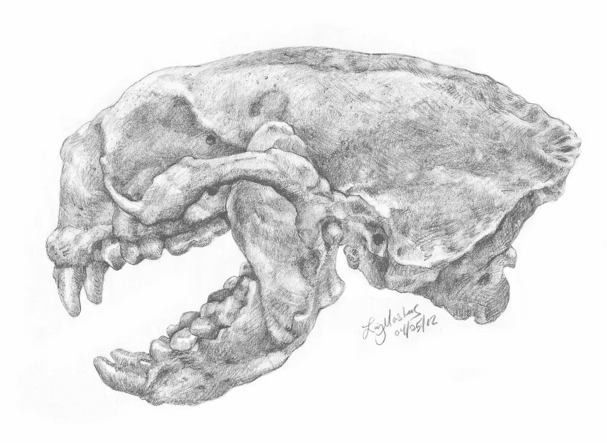
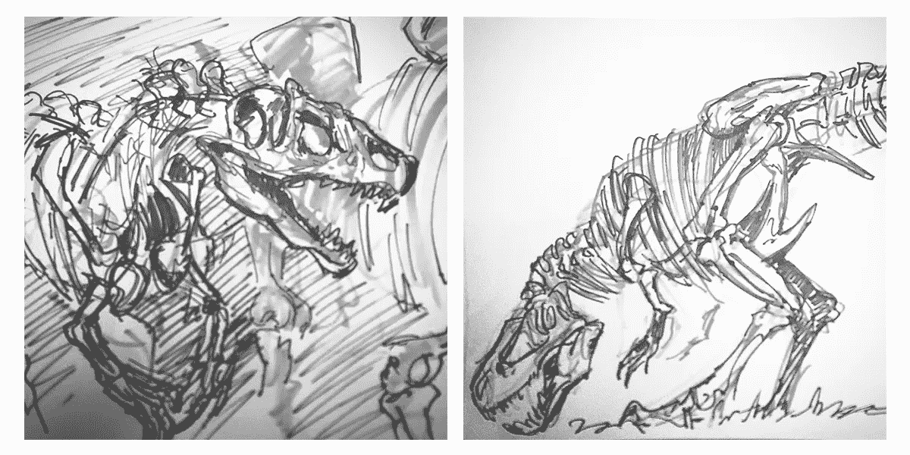

# 为什么艺术家应该参观自然历史博物馆

> 原文：<https://medium.com/nerd-for-tech/why-artists-should-visit-natural-history-museums-5e83baba52b3?source=collection_archive---------12----------------------->

海獭头骨，俄勒冈动物园，2012 年伊丽莎白·丘吉尔大师

我最喜欢的消遣之一(作为一个对生物设计充满热情的插画师)是参观自然历史博物馆。我喜欢在巨大的恐龙展示下舒适地抱着我的素描本，研究它们的骨骼结构、巨大的头骨、牙齿、角和可怕的爪子。更准确地说，我喜欢从化石中写生。化石不再是骨骼。曾经生活过的生命的痕迹，化石是被掩埋的遗骸，然后通过石化的过程，变成了石头。画恐龙形状的石头是我能做的最接近检查史前动物骨骼的练习了，所以我接受了。

研究活着的恐龙祖先也非常有益。例如，画活跃的动物园动物是学习描绘活的生物的无价部分。根据你最近的博物馆收藏的广度，可能会有一些小动物展示给你写生。蝴蝶、蜘蛛、两栖动物，甚至蜥蜴都被安置在透明的围栏里，这些围栏被设计用来复制它们的自然栖息地。不幸的是，生活在笼子里的动物通常对他们的困境不太满意。或者，捕捉在社区上空翱翔的当地鸟类，甚至是你在家里玩耍的宠物，也是一件快节奏、精力充沛且有回报的事情。

但也许，你并没有准备好每天接受这样的挑战。有时你想放松一下，平静地描绘一只摆好姿势的动物，仔细地描绘表面纹理。在这种情况下，博物馆是一个完美的位置。

摄影参考是可以接受的，有其目的。作为一名专业艺术家，我每天都在利用照片。但是，没有什么比写生更好的了(尤其是在自然光下)。通过在现实生活环境中绘制三维生物和物体，你会惊讶于你表达体积、皮毛、羽毛、鳞片和精确解剖的能力的提高速度。

在博物馆，你不仅有大量的保存标本可供选择，而且每件展品都有准确的信息。我做笔记，给博物馆的信息板拍快照，以便和我的草图搭配。尽可能多地了解你要画的动物。最终，通过理解你的生物一天的生活可能需要什么，你将能够为你的插图构建一个更好的叙述。这种动物是掠食者还是猎物？你的动物会把寒冷的苔原当成家吗，或者这种动物更喜欢茂盛的雨林？为人父母呢？虽然关于史前动物的育儿方式有很多争论，但我们可以根据活着的动物的行为来推测。

摆姿势标本的丰富选择也将为你提供一系列机会来记下姿势草图。使用这些快速研究为未来插图的构成提供信息。通过反复观察，你会对动物解剖学有更深刻的理解。

你甚至可以考虑一点飞行中的人物绘画。尽量不要盯着看(那显然是不礼貌的)，但如果你勾画他们经过，很多人不会注意到(甚至不会介意)。当你穿过博物馆大厅，停下来到处写生时，如果你收集了一小群着迷的聚会，不要惊讶。一群群孩子可能会聚集在你周围看你工作，对自己画恐龙很兴奋。人类是一个好奇的物种。

当你在博物馆研究三叶虫、猫鼬标本和本土猛禽时，为什么不顺便参观一下宝石和矿物呢？在自然花园里安静地散步怎么样？自然历史博物馆是对科学情有独钟的热情艺术家的灵感源泉。

姿态草图，洛杉矶自然历史博物馆伊丽莎白·丘吉尔大师

通过在你能画的任何地方画草图来快速扩展你的艺术技能。然而，就在我写这篇文章的时候，为了保护每个人，许多机构都关门了。在我们能够再次安全地享受博物馆之前，为什么不尝试一下虚拟旅行，比如洛杉矶自然历史博物馆的恐龙馆呢？[https://nhm.org/stories/virtual-tour-dino-hall-english](https://nhm.org/stories/virtual-tour-dino-hall-english)尽情享受！