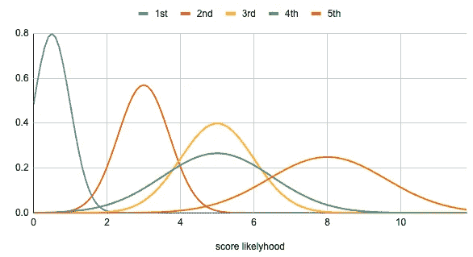
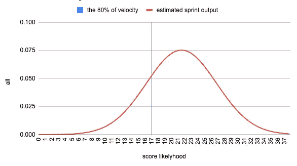

# 为什么承诺更少的故事点会提高你的速度

> 原文：<https://medium.com/nerd-for-tech/why-committing-to-less-story-points-will-increase-your-velocity-d821380c6c5?source=collection_archive---------2----------------------->

规划扑克和冲刺计划是棘手的领域，我们可以通过只投入团队能力的 80%来提高团队速度。原因如下:

可悲的是，没有人能准确地估计，而且由于人类的偏见，对故事点的估计将会变成货币。当团队开始篡改评估时，许多事情都会出错。原因可能很多，比如*“我不想这样做，我会估计得更高”，*或者*“让我们把这个分数降低，这样它就可以和其他重要的部分一起进入下一个 sprint”。*故事点按定义是..估计。而且很远…

> …因为我们知道，有已知的已知；有些事情我们知道自己知道。我们也知道**有已知的未知**；也就是说，我们知道有些事情我们不知道。但是**还有未知的未知数**——我们不知道我们不知道……—[唐纳德·拉姆斯菲尔德](https://en.wikipedia.org/wiki/Donald_Rumsfeld)，美国国防部长

让我们看一个例子:比方说，你已经为 sprint 估计了几个故事，分别是 3、5、5、8 个点，你的速度是 22:

这些点的总和是 21.5，所以这低于团队的速度，并且由于没有假期，或者预期的特别训练，这应该很好地适合你的 sprint backlog，对吗？我们来分析一下:

即使在理想的估计中，故事点值也是如何统计预期的:，3，5，5，8

这个例子和分布是虚构的，但是基于 Erik Bernhardsson 的一篇文章，高斯曲线是这个问题的一个很好的代表性模型。

所以请注意这张图表:首先，因为我们在谈论估计，它们的值可能更高或更低，而且很可能是这样。同样由一些故事的性质，未知的未知，你可以有越来越多的偏差。这可以通过风险发现 [Cynefin 框架](https://en.wikipedia.org/wiki/Cynefin_framework)在一定范围内进行管理。此外，您还可以看到如何更低的估计应该更准时，提倡适当的切片，这也是在规划中使用斐波纳契数列的原因。虽然这可以应对人类在猜测未知方面的糟糕表现，但也增加了额外的偏差。你也可以看到同样的 5 个指针故事可以有不同的偏差。这里我想指出的是，我在计算中使用了标准正态分布来帮助理解我的观点。实际上，近峰更平坦，远峰应该更少见。此外，可能会有一些不对称，因为工作往往变得更长而不是更短，而且这也是不可估量的，因为点代表复杂性。

如果数学上的期望值保持不变，在整个冲刺阶段，你会有一个巨大的偏差(所有故事的总和将会有每个估计偏差的平方和)，换句话说，当致力于你的精确速度时，你将有 50%的机会在冲刺阶段失败，没有任何意外！如果你把中断因素考虑在内，比如生病、系统停机、紧急的生活问题，你已经很难完成你的 sprint 待办事项了。

这就是为什么如今冲刺目标是计划的重要组成部分，因为它“有助于在‘情况变得艰难’时设定优先事项”——【scrum.org】定义[。当事情变得困难时，Scrum 确实需要一个围栏。因为他们经常这样。事实上很多时候，我们应该总是以预防为目标。](https://www.scrum.org/resources/blog/11-advantages-using-sprint-goal)

这个 21.5 分的估计给了你冲刺的信心吗？80%怎么样？

当然，评估的准时性取决于工作类型、团队成熟度和许多其他因素。好的团队会有较窄的钟形曲线，而其他团队会有较宽的钟形曲线。

我的建议是少犯！如果你将 80%的速度投入到冲刺中，这意味着你只有 19%的机会没有完成冲刺(我做了[数学](https://introductorystats.wordpress.com/2011/10/15/the-middle-80-is-not-80th-percentile))，这意味着你可以同意将更安全的工作负载分配给你的 PO，从而做出更安全的长期评估，改善业务关系和团队信任。你会问，如果我们提前完成 sprint 会发生什么？嗯，有很多方法可以利用额外的时间，我可以推荐以下任何一种:

*   **庆祝！**没有哪家公司想要精疲力竭的团队，尽管我们应该庆祝我们的失败，但我们也应该庆祝我们的成功！这将为未来提供额外的动力，帮助团队团结，并确保环境健康。心理健康极其重要，在下一次冲刺前喘口气也有助于专注和奉献。正如【2019 年发展状况报告所述，倦怠是影响生产力的因素之一。
*   **帮助他人:**当承诺减少工作量[时，你可以支持](/the-reading-challenge-2018/dont-let-planned-work-ignite-with-incandescent-fury-efa161a83fb6)其他团队或其他团队成员，而不必为必须完成的冲刺工作感到内疚。这绝对不是一个零和游戏，如果你帮助了别人，企业会感激你，别人也会更有可能在你需要的时候帮助你。花“空闲”时间分享知识会让每个人走得更远。
*   **投资自我:**执行你的学习、培训活动，或者只是错过的代码评审..你可以利用挣来的时间来提高自己，因此从长远来看，进一步提高冲刺速度。
*   **还清科技债务:**我更喜欢科技债务的贷款比喻，就像抵押贷款一样，如果你有额外收入，你会从中偿还，所以利率会变低。科技债务也是如此。但是要注意，不要去解决你认为肮脏的事情，而要去解决能给团队带来好处的事情。你知道路线图，商业计划应该与团队保持一致。确定什么能提高你的配速。技术债务也会影响生产率，见[2019 年发展状况报告](https://services.google.com/fh/files/misc/state-of-devops-2019.pdf)。
*   **开始为即将到来的故事做准备**:一些团队落后于待办事项列表整理，所以这些空闲的时间可以用来清理待办事项列表，为依赖项或未知项做准备，这样当你真正在做工作或评估时，你会有更好的理解和更多的信心。
*   **继续前进:**有时，业务是雄心勃勃的，或者团队想要推出一部史诗般的作品。开始下一次冲刺总是受欢迎的，让故事进行下去，开始工作。但是不要把它带到当前的 sprint backlog 中，因为它从来没有被提交过。只要确保 backlog 是整洁的，那么这个故事就有可能进入冲刺阶段。

如您所见，所有这些选项都将帮助您的团队长期提高速度。请记住，在这种方法中，你的速度将不再基于已完成的故事点，因为复利会很难咬。那么如何调整团队的速度呢？和往常差不多:两周冲刺中 80%的承诺意味着你有很好的机会提前两天完成。如果团队通常提前一天多完成冲刺，你可以慢慢调整。如果你的团队通常不能及时完成，你当然需要降低期望值。我确实认为有 1 天的时间进行上述非冲刺改进是理想的。

所以总结一下，如果你不在 sprint 中投入 100%的精力，团队会的

*   获得一致性
*   有积极的感觉
*   不会烧坏
*   在业务中提供更多帮助
*   能够提高自己的速度并投资未来
*   更加可预测
*   为意外做好准备
*   更加成功
*   提高了生产率

*如果你觉得这个有用，* ***请考虑订阅*** *！我打算很快就写类似的主题！感谢所有的掌声:)*

#敏捷# scrum #规划扑克#评估# lessismore #心理健康#生产力

感谢我的朋友们对本文的评论和建议:Miguel，Francisco，Heorhiy。