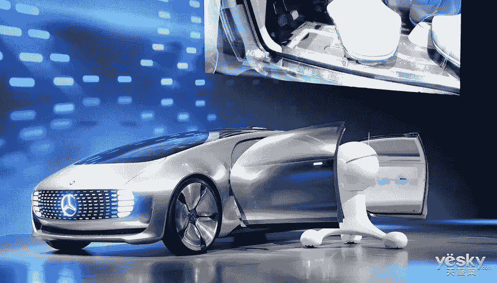

# 为什么德国和奔驰一起给 L3 自动驾驶开绿灯？-第二部分

> 原文：<https://medium.com/nerd-for-tech/why-did-germany-and-mercedes-benz-give-the-green-light-for-l3-autonomous-driving-together-part2-a2e8ae3aaaf9?source=collection_archive---------3----------------------->

http://wap.yesky.com/news/458/44305458.shtml

如今，自动驾驶的水平已经成为一系列讨论中被广泛接受的说法。德国和中国已经基本接受了美国汽车工程师协会(SAE)对智能驾驶的五级分类标准。

授予奔驰的牌照之所以被视为历史时刻，是因为 **L3 智能驾驶功能能够实现严格意义上的自动驾驶。**然而，出于严谨的考虑，包括中国在内的世界各国都将自动驾驶视为有条件的驾驶辅助。

L3 级别一个比较形象易懂的描述就是，在这个阶段，你完全可以不用随时把手放在方向盘上来驾驶汽车。

意思是如果在自动驾驶功能开启的情况下发生事故，奔驰要承担法律责任。

所以我们理解德国监管部门有勇气将行为准则合法化，奔驰敢于为自动驾驶事故承担责任。

但两者也都为自己设立了免责条款。那就是“有条件自动驾驶”。

目前，我们可以看到的主要有三点:

**1。限速，目前最高限速 60 km/h，如果超过这个速度，在发生事故的情况下，司机还是要承担责任的。**

**2。场景限制:德国全境 13191 公里高速公路或交通密度高的拥堵路段。**

**3。不睡觉，不连续向后看或离开驾驶座，仍然做好随时接管车辆的准备。**

看到这三个条件是不是有点不爽？

德国目前对 L2 部分自动驾驶功能的条件非常宽松，允许司机以高达 210 公里/小时的速度在路上“奔跑”

如果这是真的，那就意味着只要驾驶员把手放在方向盘上，就可以随意调节自动驾驶车辆的速度。但一旦时速超过 60 公里，奔驰就具备了免责条件。从这个角度来说，有一定的模糊性。

这让我们想起了一个业内争议多年的话题——L3 级是否有实际意义。

**如果有必要在乘用车领域保留这一技术过渡阶段，可能会引发更多的交通事故。**

最大的风险是人类驾驶员如何在紧急情况下快速进入接管车辆的状态，因为人类驾驶员需要时间回到高度专注的驾驶状态。

我们也可以理解为什么自动驾驶速度一定不能高于 60 公里，这就给了人类接管车辆的反应时间。

**目前 L3 级自动驾驶在道路上最直观的理解是，开车时使用或看手机不再是危险驾驶行为，不会因为被拍照而受到处罚和罚款。**是德国给的绿灯，这对于无法摆脱看手机的车主来说，无疑是一个福音。

## 只有贴好标签，数据才有意义

自动驾驶的主流算法模型主要基于有监督的深度学习。它是一种算法模型，推导出已知变量和因变量之间的函数关系。需要大量的结构化标记数据来训练和调整模型。

在此基础上，要想让自动驾驶汽车变得更加“智能”，形成可在不同垂直落地场景下复制的自动驾驶应用商业模式闭环，模型需要有海量、高质量的真实道路数据支撑。

在自动驾驶领域，数据标注场景通常包括变道超车、通过路口、无红绿灯控制的无保护左右转弯，以及一些复杂的长尾场景，如车辆闯红灯、行人过马路、路边以及违规停放的车辆等。

现在的人工智能也叫数据智能。在这个发展阶段，神经网络的层数越多，需要的标记数据量就越大。

# 结束

将您的数据标注任务外包给[字节桥](https://tinyurl.com/4rae2x2u)，您可以更便宜、更快速地获得高质量的 ML 训练数据集！

*   无需信用卡的免费试用:您可以快速获得样品结果，检查输出，并直接向我们的项目经理反馈。
*   100%人工验证
*   透明标准定价:[有明确定价](https://www.bytebridge.io/#/?module=price)(含人工成本)

为什么不试一试呢？

来源:https://k . Sina . cn/article _ 5140861246 _ 1326 b 513 e 001014 foi . html？ab = qiche & _ rewrite time = 1639319502386 & http = from http