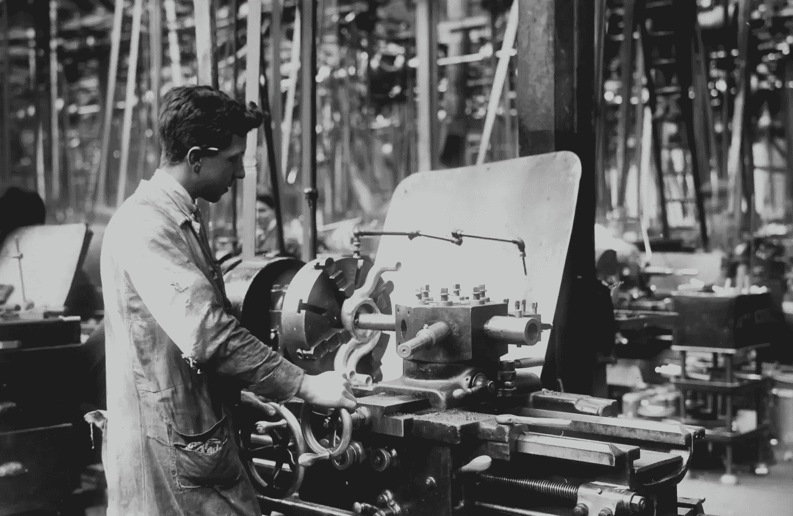

# 为什么传统行业这么难得到 AI 加持？—第三部分

> 原文：<https://medium.com/nerd-for-tech/why-is-it-so-difficult-for-traditional-industries-to-get-ai-blessings-part3-1804b79353c?source=collection_archive---------6----------------------->

## 高质量的数据是应用程序的先决条件

在过去的十年中，大多数人工智能的研究、开发和应用都是“以软件为中心”的。在海量数据支持下，软件和算法不断优化，以获得更高的准确率。在传统行业无法提高数据质量和数量的情况下，人工智能专家吴恩达认为，传统行业应该采用“以数据为中心”的模式。在这种思路下，传统行业已经出现了一些很好的应用案例。比如医疗领域的图像识别 AI 系统，可以帮助医生检查 CT 图像，识别肿瘤等病变，辅助医生做出判断。

更多阅读:[数据训练如何加速 AI 进入医疗行业？](https://tinyurl.com/5eehr37e)

天津大学副教授朱鹏飞介绍，一些人工智能产品的数据相对准确，人工智能算法模型在学习过程中取得了快速进展。目前很多图像识别系统的准确率可以达到 90%以上。由于他们的工作就像一个助手，医生最终需要做出医疗决定，但这种程度的准确性大大降低了工作强度。

“虽然传统行业也有一些 AI 技术的成功案例，**如果想更好地与 AI 结合，还得在提高数据质量上下功夫**。”朱鹏飞建议，首先，积累了海量数据的传统行业应该在保证数据安全的前提下，积极发布数据。把隐藏在数据中的价值挖掘出来，和需求联系起来，就会有很大的发展空间。其次，对于新兴行业，比如新能源汽车，在建设智能工厂时，要考虑数据采集等因素。

然而，朱鹏飞强调，在传统行业使用人工智能技术的同时，我们应该避免人工智能的滥用。在实际应用之前，应该仔细评估它。**如果生产效率不能提高，盲目使用 AI 技术就是浪费资源。**

比如一些应用场景，需要 AI 算法达到 99%以上的准确率才能使用。通过评测，现有的模型算法只能达到 90%的准确率，这种场景下不需要强行使用 AI 技术。“总而言之，对于 AI 技术的应用，数据必须是第一位的。没有好的数据，很难有好的应用。”朱鹏飞说。

## 定制数据集

随着 AI 商业化进程的加快，以及辅助驾驶、客服聊天机器人等 AI 技术在各行各业的应用，人们对特殊场景下的数据质量的期望越来越高。高质量的标签数据将是人工智能公司的核心竞争力之一。

如果说之前的算法模型使用的一般数据集是粗粮，那么算法模型目前需要的是定制的营养餐。如果公司想要进一步提高某些模型的商业化，他们必须逐步从通用数据集向前发展，以创建独特的数据集。

# 结束

将您的数据标注任务外包给[字节桥](https://tinyurl.com/y9w2f67y)，您可以更便宜、更快速地获得高质量的 ML 训练数据集！

*   无需信用卡的免费试用:您可以快速获得样品结果，检查输出，并直接向我们的项目经理反馈。
*   100%人工验证
*   透明标准定价:[有明确定价](https://www.bytebridge.io/#/?module=price)(含人工成本)

为什么不试一试呢？

资料来源:https://baijiahao.baidu.com/s?id = 1713944602772076382 & wfr =蜘蛛&for=pc