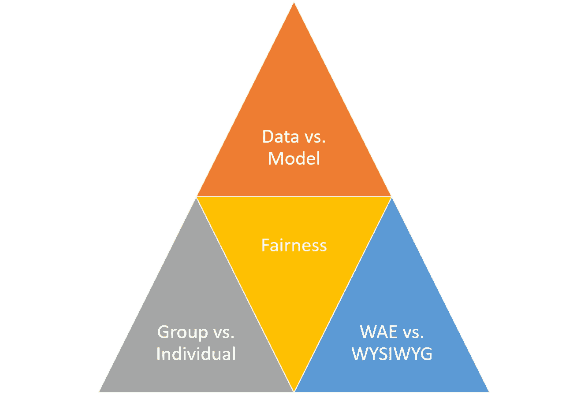

# 为什么机器学习模型的公平性和准确性一样重要？

> 原文：<https://medium.com/nerd-for-tech/why-it-is-just-as-important-for-machine-learning-models-to-be-fair-as-being-accurate-3ba1f0e62123?source=collection_archive---------17----------------------->

机器学习模型需要公平

我们听说机器学习是当今的一个时髦词，我们看到它如何在金融、贸易和社交媒体等不同行业获得快速发展。

有新的算法被创建，并且人们必须调整不同的超参数以使机器学习算法表现良好。我们看到各行业如何走向新的人工智能时代，以及各种行业的商业价值如何在机器学习和深度学习的帮助下不断增加。

一般来说，机器学习包括将全部数据分成两部分，即训练数据和测试数据。我们将使用训练数据来训练机器学习算法，训练后，我们将使用测试数据来测试它们，以分别获得模型在看不见的数据(测试数据)上的准确性。

当我们查看这些机器学习模型的性能时，我们有某些指标可以帮助我们了解模型在测试集中的表现。我们采用一些指标，如准确度、精确度和召回率。因此，我们对不同的机器学习模型及其性能有了很好的直觉。基于这些结果，我们将分别决定是否实时部署它们。我们还将采取措施来确保我们提高模型的准确性或召回率，直到我们得到在问题的上下文中被认为是好的期望输出。

然而，人们经常忘记的一个关键问题是，机器学习算法也有可能不公平。换句话说，可能会分别出现某些群体任职人数过多，而某些其他群体任职人数不足的情况。

测试公平性的不同方法

# **机器学习模型可能不公平的不同场景**

考虑一个预测一个人患心脏病几率的问题。为了预测患心脏病的几率，人们必须考虑一些重要的特征，如血压、心率和血糖水平。有时，位置也会起作用，并且是一个人是否会有心脏病的决定因素。因此，我们会在数据中使用所有这些特征，然后将这些值提供给机器学习模型进行预测。一旦我们用正确的超参数训练了机器学习模型，我们就会使用我们的测试集来测试它们，看看它们在新的未知数据下的表现如何。

一旦我们了解了机器学习算法在测试集上的性能，我们就会使用该指标，看看是否有其他表现良好的模型。此外，我们将替换模型，直到我们分别在几个度量方面获得最佳模型。

要考虑的一件事是，模型是否公平，是否代表整个人口，或者它们是否代表某些群体，而不代表其他人。考虑一个场景，其中机器学习模型能够在测试集上表现得非常好，它们分别获得了 95%的准确率。我们还必须看看 95%的准确率是否适用于所有不同的人群。例如，对于住在纽约的人来说，准确率约为 98%,相比之下，加州人的准确率为 90%。尽管该模型表现良好，准确率达到 95%，但我们看到加州居民无法获得正确的预测，并且经常被机器学习模型误诊。我们还看到，95%的准确率虽然不错，但这是由于纽约地区居民的准确率较高，而加州居民的准确率分别为 90%。我们看到，在对加利福尼亚居民的心脏病预测进行诊断时，该模型不是很公平。

这只是一种情况。机器学习模型可能有多种不公平的方式。考虑机器学习模型可能不公平的不同场景。例如，考虑一下面部识别技术，当在机场使用时，它正确地识别了某一组人，而不准确地预测了其他组。这可能会对机器学习模型的运行方式产生严重影响。当使用标准指标进行测试时，人脸识别技术可能已经在测试集上给出了良好的准确性(比如 95%)。然而，当我们观察一组特定的组时，我们有时可以对某些组获得非常高的准确度，而对其他组获得较低的准确度，分别导致整体测试数据的良好准确度。

另一个例子是，当机器学习模型用于根据工作申请和简历筛选候选人时。在训练阶段，机器学习模型可能分别获得了良好的准确度、召回率或 F1 分数。让我们考虑一个机器学习模型 M1 获得了大约 90%的准确度，而另一个机器学习模型 M2 获得了 85%的准确度。然后，我们将愿意在生产环境中部署模型 M1，因为它具有更高的准确性。然而，我们还必须看到第一个机器学习模型与另一个相比有多公平。例如，考虑 m1 机器学习模型能够对一组获得大约 95%的准确性，而对其余组仅获得 80%的准确性。或者，考虑一下机器学习模型，M2 对所有组都有 85%的准确率。如果我们不仅考虑准确性，还考虑公平性，我们会看到第二个机器学习模型以相似的准确性平等地代表不同的人群。如果我们在现实世界中部署 M1 模型，我们可以很容易地看到，它对一组人来说表现很好，而对另一组人来说实际上表现不一样。因此，最好部署 M2 模型，因为它平等地代表所有人群，尽管与 M1 模型相比，它的整体准确性较低。因此，我们还必须将公平性视为一种度量，并确保机器学习模型在预测中保持公平。

# **结论**

考虑到上述所有情况，我们看到除了准确性、精确度和召回率等其他指标之外，公平在机器学习模型的部署方面是多么重要。我们已经看到一些场景，机器学习模型可以是准确的，但同时也是不公平的。我们看到一些优秀的高性能模型往往不能代表某一组人，而分别代表其他人。因此，除了准确度、精确度和召回率等标准指标之外，我们还考虑人工智能的公平性和道德性，以理解和部署用于生产的机器学习模型，这真的很重要。希望这篇文章能让你更好地理解人工智能中的公平性，以及当你考虑是否部署这个模型时，公平性也是一个重要的因素。如果你觉得这篇文章有帮助，请随意评论和鼓掌。谢谢！