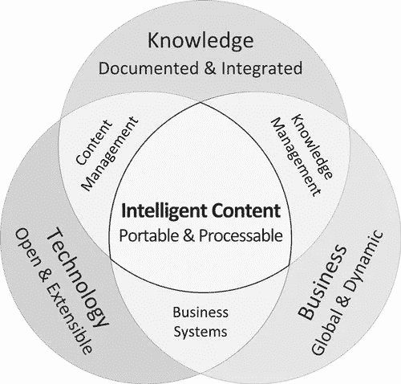

# 为什么大型组织需要智能内容

> 原文：<https://medium.com/nerd-for-tech/why-large-organisations-need-intelligent-content-45c1f2643e36?source=collection_archive---------18----------------------->

智能内容是可重用的、可发现的、可重新配置的和可适应的。

你有没有研究过你的公司是如何创建、发布和分发所有用于销售和服务你的产品的内容的？很有可能，这是一个相当复杂的过程，尤其是如果你是一个大型组织。如果您的内容开发系统效率低下，可能会对员工的工作效率和内容投资回报产生负面影响。

低效的内容开发系统的症状包括创建内容的部门之间的孤岛。它还包括过时的做法，如一次为一个输出通道制作内容。这些方法不仅不可扩展，还会浪费时间和金钱。

这些听起来熟悉吗？如果你的答案是肯定的，你并不孤单。事实上，很容易陷入低效内容工作流程的陷阱，这是我通过内容策略硕士项目学到的。

作为项目的一部分，我的同事们模拟了为复杂环境开发内容的过程。他们被分成 8 个“部门”每个部门必须为一个产品创建一种内容类型——涵盖从营销内容到用户指南、用户界面字符串和聊天机器人脚本的所有内容。在项目结束时，所有内容都必须合并，以便在多个输出中重用。

为了更好地理解我的同事们面临的挑战，我进行了一项调查，发现了一些突出的主题。不用说，这不是一个容易完成的项目:

*   大约 63%的学生认为这项任务“困难”到“非常困难”。
*   在这些学生中，大约有一半的人说他们最大的挑战是不知道他们到底需要做什么。T4 的另一半人认为合作是他们最大的挑战。
*   任务的难度与各部门在创建内容时需要协调的程度之间似乎存在联系。
*   例如，一名来自“技术内容”部门的学生说，他们“正在处理确凿的事实，因此与其他团队的沟通相当容易。”
*   82%的学生说，他们后来发现，他们对任务的理解和任务真正包含的内容不匹配。
*   例如，一名学生说:“自己创造这些部件是不够的，还必须遵守某些规范和准则。并且这些还必须与其他组协调。”
*   另一名学生解释说:“我们的团队努力定义 5 个内容片段，因为与其他团队相互依赖。我们定义了一些主题，因为其他团队还没有提出他们的主题。当他们这样做时，我们调整了我们的内容。所以，协调是需要的主要因素。这还包括详细制定样式指南，这花了一些时间”。
*   当被问及他们的主要收获是什么时，大多数学生将沟通和协调列为这类项目成功的关键，尤其是在最开始的时候。

# 是什么让内容开发变得如此复杂？

这个实验揭示了跨多个部门同时开发内容有多困难。

首先，你需要确保每个人都知道其他人在做什么，以及每个部门的工作如何影响其他部门的工作。其次，你需要管理截止日期和可交付成果。第三，你需要分配负责人，以使产出更加合理和协调。

因此，很明显，为复杂环境开发内容有一个重要的项目管理组件。

然后就是内容本身。在复杂的环境中，您可能要处理由不同部门制作的不同内容类型，以及不同的输出。为了做到正确，内容需要一致、真实和相关。它还需要听起来像来自同一个组织。毕竟，您的客户不知道(或不关心)部门 A 创建了一个内容，而部门 B 创建了另一个内容。

从商业角度来看，内容制作应该尽可能高效和有效。这意味着如果需要，它应该易于管理、更新和重用。

在本文中，我提供了一种为复杂环境开发内容的高级方法。内容项目管理和治理是另一篇文章的大主题。

# 提示智能内容

想象一下，开展一项营销活动，只需要创建一个内容，就可以适应您的每个渠道和平台。或者开发可以在产品页面、用户指南和常见问题部分重复使用的内容。这是智能内容。

内容策略专家安·洛克利解释说:

> *“智能内容被设计成模块化的、结构化的、可重用的、无格式的、语义丰富的，因此是可发现的、可重新配置的和可适应的。”*

Rockley 的定义涵盖了智能内容的几个特征。为了理解什么是智能内容，让我们更详细地研究一下这些特征。

智能内容支持多种功能。来自 woorank.com[的插图](https://www.woorank.com/en/blog/b2b-intelligent-content)

# 智能内容的特点和优势

## 结构化、语义丰富且易于发现

如果您已经创建了内容，您会熟悉我们用来给出文档结构的一些最常用的标签:

内容页面上的一个标题。

内容

一段。

无序列表…

…等等。

但是，如何赋予这些内容意义，以便机器能够理解 h1 中的内容和段落中的内容呢？智能内容通过提供更具体的标记和语义分类使这成为可能。

通过向标签添加特定的元数据，您可以确保内容易于查找。元数据赋予信息意义，并使机器能够更具体地处理内容:

对电脑来说没什么意义。

然而，语义标签<productlisting title="“ProductName”">提供了额外的信息。</productlisting>

通过赋予内容更多的结构和意义:<heading>，软件系统现在有了更多的信息来查找内容。</heading>

即使在不同的上下文中，智能内容也是可发现的。

试试谷歌搜索“披萨”。您的大多数搜索结果很可能会涵盖您可以吃披萨的地方。但是当你选择“购物”标签时，你开始看到制作比萨饼的产品列表，如比萨饼烤箱或托盘。

同样的搜索会产生不同的结果，这取决于你在寻找什么。这是智能内容发挥作用的一个例子，因为多亏了语义元数据，谷歌能够根据上下文理解你的请求意味着什么。

弗里皮克的插图—[www.freepik.com](http://www.freepik.com)

## 模块化和可重复使用

为了使内容高效，它需要易于重新调整用途并跨多个渠道交付。智能内容必须是可重用的。

回想一下您上次为产品页面创建内容的情况。你可能有不同的内容片段，比如事实、数字、产品描述、图片和用户界面字符串。你能在不做额外工作的情况下重复使用这些物品吗？

模块化内容使您能够做到这一点。模块化内容由独立、自包含信息的小块或组件组成。您可以使用自己开发的各种内容组件作为构建块，根据需要创建不同的内容体。

使用模块化内容的最大优势之一是它是可重用的，这意味着您最终会节省时间和金钱，尤其是在翻译方面。

## 格式自由且可重新配置

如果你在网上购物，你很可能会碰到同一种产品在不止一个平台上销售。但是每个平台通常都有自己的外观和感觉。

那么，如何确保您交付给多个平台的内容能够按照平台的显示标准显示呢？

智能内容是可重新配置的，因为它不受格式的限制。事实上，格式完全独立于内容，只应用于输出级别。因此，像字体大小、颜色和间距这样的东西不是内容的一部分，这使得重新配置变得很容易。

## 适合的

智能内容可以适应其正在显示的媒体。因此，如果你发表的文章既能让读者在桌面浏览器上阅读，也能在移动设备上阅读，那么内容也应该相应调整。你可能会在桌面上看到整篇文章，但在手机上只是一个片段或摘要。适应性是智能内容的一个非常重要的方面，因为这意味着您不必为每个频道或平台手动创建内容。

# 让您的内容智能化

有几种技术可以用来优化你的内容。除了像前面讨论的那样增加结构和使内容语义丰富之外，尝试使用编辑技术来增加内容的可重用性和可伸缩性。

## 编辑技术

1 —开发一个**风格指南**，内容创建者可以用它来反映一致的语气和声音、术语和编辑标准。从你的品牌的语气和声音，到你的内容写作、格式和设计的标准，风格指南都是事实的来源。如果坚持使用，风格指南可以确保您的内容在所有平台和渠道中保持一致，无论是哪个部门创建的内容。

2 —使用**通俗易懂的语言**精心制作模块化内容。通俗易懂的语言消除了僵化和复杂，这种僵化和复杂使得很难将你的内容分解成可以跨多个渠道重用的小块。普通语言也更容易翻译和本地化，使您的内容更具可扩展性。

*   写出**结构简单的短句**。开门见山，确保每句话都集中在一个信息上。
*   避免使用行话和习语，因为它们对不同的人可能有不同的含义。此外，行话和习语会增加翻译和本地化的难度。
*   使用**主动语态**让你的信息更加清晰。

# 最后

内容通常是产品开发难题中需要考虑的最后一块。也许这就是为什么如此多的大型组织拥有过时、低效、不灵活的内容开发方法和工作流程。但是如果你算一算，你会很快发现这些低效率每天会让你付出多少代价。

当内容可重复使用、适应性强、可重新配置且易于查找时，创建、管理和交付就变得容易多了。这为您节省了时间和金钱，并降低了跨多个部门创建内容的复杂性。

智能内容也能让你取悦你的用户。想象一下，如果您的内容在您的生态系统中的任何渠道或平台都是一致的、可发现的和可适应的，那么您可以创建所有无缝的用户体验。

注意:我非常感谢我的导师 Rahel Anne Bailie，她为我提供了大量关于智能内容的知识，我在这篇文章中大量引用了这些知识。

参考书目:

洛克利、库珀和阿贝尔，*智能内容*

Rahel Anne Bailie，*“为复杂环境开发内容专题讲座 1”*