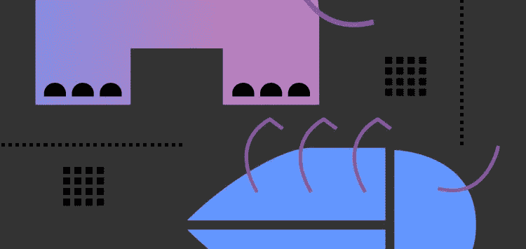
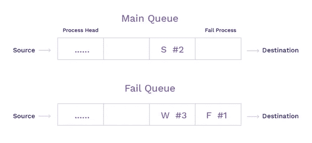

# 为什么 RudderStack 使用 Postgres 而不是 Apache Kafka 作为流引擎

> 原文：<https://medium.com/nerd-for-tech/why-rudderstack-used-postgres-over-apache-kafka-for-streaming-engine-cccfa2dda0f2?source=collection_archive---------10----------------------->

# 概观

在这篇文章中，我们回答了一个非常重要的问题——“为什么我们不喜欢 Apache Kafka 而不是 PostgreSQL 来构建 RudderStack。”我们讨论了在使用 PostgreSQL 的已实现解决方案上使用 Apache Kafka 的一些挑战。

# 方向舵堆栈是一个队列

RudderStack 的核心是一个排队系统。它从多个来源获取事件，持久化它们，然后将它们发送到不同的目的地。持久化事件是至关重要的，因为 RudderStack 需要能够处理不同类型的故障。

让我们来看一个例子—由于某种原因，目标可能会停机任意长的时间。在这种情况下，RudderStack 应该理想地保留事件，然后在目的地再次运行时重试发送事件。

**方向舵堆栈——一个事件队列**

自然，构建这种排队解决方案的工具的流行选择是 Apache Kafka。Kafka 提供了持久性、有序性、去杜平、极致性能、横向可伸缩性等特性。任何排队系统都需要的。

一个简单的基于 Kafka 的系统看起来像这样:

**一个简单的基于卡夫卡的系统**

在我们的排队系统中，我们需要为每个目的地创建一个单独的主题。来自源的事件可以排队到特定于目的地的主题中，而一个消费者使用来自目的地主题的事件。消费者本身可能会将发送事件的工作分散到多个线程中进行并行处理。

每个目的地有一个单独的主题是理想的，因为如果一个特定的目的地不可用(例如停机)，我们不想阻止其他目的地的事件。然而，正如我们将在下一节中看到的，失败可能是其他类型的，这导致了这个设置的复杂性。

虽然这种架构看起来很简单，但 Apache Kafka 有它自己的一系列挑战，我们将在下面的部分中重点讨论这些挑战。

# 管理挑战

Apache Kafka 不是最容易部署和分发的产品。此外，它对 Apache Zookeeper——一种分布式配置和同步服务——的依赖使它成为一个相当大的[管理挑战](/@anuradha.neo/kafka-is-not-the-best-anymore-meet-pulsar-9eb435c9fc0b)。

我们不想运输和支持我们自己都不是专家的产品。

# 许可问题

许可是阿帕奇卡夫卡的另一个问题。我们希望在开源许可(AGPLv3)下发布全部代码。但是，由 Apache 基金会管理的 Apache Kafka 的核心是在 [Apache-2 许可](https://www.apache.org/licenses/LICENSE-2.0)下发布的。此外，由合流积极管理的版本仅在非 OSI 许可(合流社区许可)下可用。

一些特定的 Kafka 特性，比如 kSQL(对于调试作业非常有用)，在 Apache 许可下是不可用的。

我们构建的排队系统的一个关键特性是能够查看未决事件，并更新它们的状态，即，将它们的失败状态设置为重试。使用 OSS 许可证不可能实现这一点。

# 处理多个客户

在我们的托管、多租户产品中，我们在同一个 RudderStack 实例上有多个客户。虽然他们可以使用与上述相同的架构，每个目的地有一个主题，但这可能会导致一个客户的大量事件阻塞来自另一个客户的事件，如下图所示:

**来自多个客户的事件**

理想情况下，我们希望将客户分开，以提供每个客户的 QoS 保证。

方法是为每个目的地/客户组合创建一个单独的 Kafka 主题。不幸的是，卡夫卡与主题的数量不相称。这最终会阻碍我们客户群的增长。我们在 Segment 的朋友面临着类似的问题，并就此写了一篇[博客](https://segment.com/blog/introducing-centrifuge/)。

# 错误处理

对于 Kafka 中的数据，错误处理变得复杂。如果某个事件未能交付，我们希望采用以下工作流程:

*   记录一些元数据，如错误代码、失败次数等。
*   将它放回队列的顶部，以便随后重试。
*   阻止来自该用户的进一步事件，以保留订单，直到事件成功交付(或中止)。

下图显示了系统在任一点的“逻辑”状态示例:

**系统的逻辑状态**

事件#1 已失败，必须重试。除了事件之外，我们还想记录重试的次数、失败错误代码等。事件#3 来自同一个终端用户，因此在事件#1 成功或中止之前，它不能被发送。然而，事件#2 是不相关的，应该被处理并成功。

如上图所示，队列正在处理事件，并将它们标记为成功、失败或等待。一个单独的过程(或主过程的一次扫描)可以从顶部开始。队列总是一致的，所以如果发生崩溃，我们总是可以从头开始。

不幸的是，使用 Apache Kafka 实现上述逻辑语义并不简单。Kafka 不允许更新事件，所以我们不能将顶层事件标记为失败，也不能将任何元数据与它相关联。

移除事件并将其排队返回(在最后)也不起作用，因为这将打破排序约束—事件#3 将在事件#1 之前结束，如上面的示例所示。

# 使用两个队列

另一个解决方案是使用两个队列——主队列和失败队列。主队列中失败的作业和跳过的作业(来自同一用户 ID)可以放入失败队列中。下图演示了这一点:

**使用两个队列**

这种方法的问题是它只对第一次失败有效。我们如何处理失败队列中发生的失败？我们仍然需要更新元数据并对事件重新排队，因此我们需要第二个失败队列来存储第一个失败队列中的失败事件。

我们希望在事件过期之前重试事件几十次，所以这不是一个很好的解决方案。

# 可调试性

能够在事件在队列中等待时查询事件和/或更新元数据(围绕故障)以强制立即重试是我们在 RudderStack 构建的一个很好的调试功能。拥有一个类似 SQL 的持久化事件查询接口对此很有帮助。

虽然 Kafka 的 SQL 提供了查询接口，但它不允许更新。此外，正如我们前面提到的，SQL 还存在许可问题。

# 最后

在这篇文章中，我们探讨了为什么我们决定构建自己的队列库，而不是采用基于 Kafka 的解决方案。我们会写一篇关于实现的博客，但是如果你好奇，你可以在 [GitHub](https://github.com/rudderlabs/rudder-server) 上探索实现。

有了 PostgreSQL 支持的排队系统，我们可以很容易地改变事件排序和调试的逻辑。此外，我们只需运行一个 SQL 查询，就可以完全了解来自源、用户或目的地的所有事件——这是 Apache Kafka 无法做到的。

# 免费注册并开始发送数据

测试我们的事件流、ELT 和反向 ETL 管道。使用我们的 HTTP 源在不到 5 分钟的时间内发送数据，或者在您的网站或应用程序中安装我们 12 个 SDK 中的一个。[上手](https://app.rudderlabs.com/signup?type=freetrial)。

**本博客最初发表于**[**https://rudder stack . com/blog/why-rudder stack-used-postgres-over-Apache-Kafka-for-streaming-engine**](https://rudderstack.com/blog/why-rudderstack-used-postgres-over-apache-kafka-for-streaming-engine)**。**