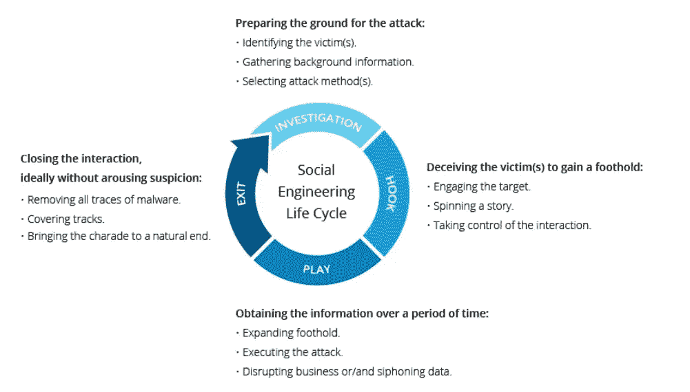
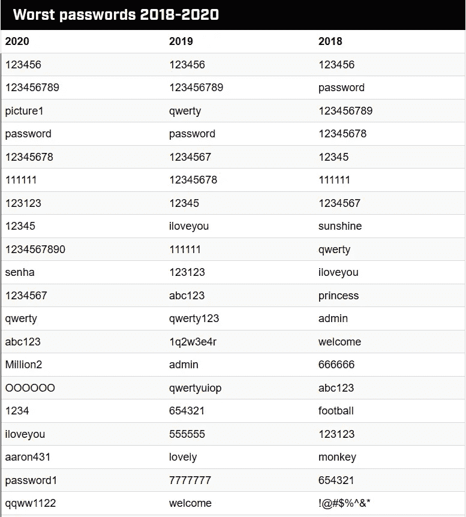
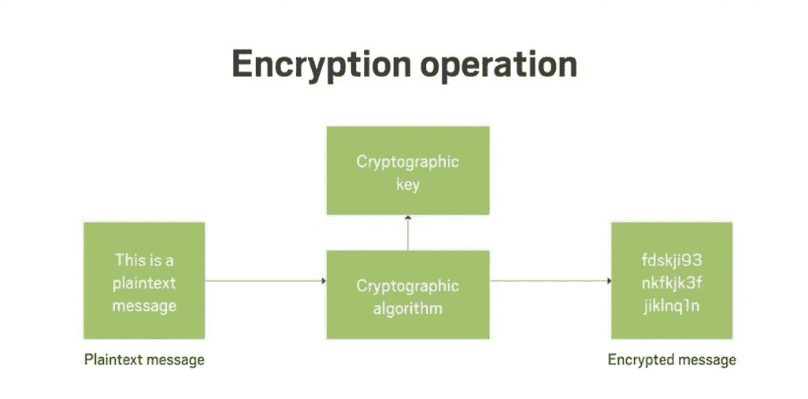
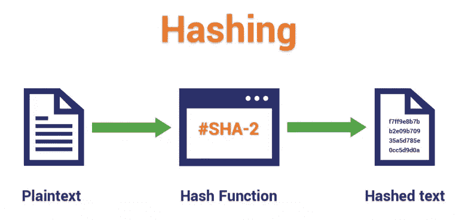

# 为什么安全性很重要？

> 原文：<https://medium.com/nerd-for-tech/why-security-is-important-556c0bdc81b2?source=collection_archive---------23----------------------->


(图片:[https://www . capacity media . com/articles/3822826/juniper-networks-launchs-new-security-products-for-enterprise-market](https://www.capacitymedia.com/articles/3822826/juniper-networks-launches-new-security-products-for-enterprise-market))

比方说，你正在使用脸书，突然有人发布了一个关于应用程序的帖子，说你可以通过使用这个应用程序或类似的东西赚钱，所以你突然去了 play store 并安装了那个应用程序。首先，你认为它合法吗？，您知道您给了该应用程序什么样的排序权限吗？。为什么计算器应用程序需要知道你的图库里有什么？？？？。哈哈。我不知道该说什么，但这就是现实，你已经接触了这个世界。安装应用程序时从头到尾阅读隐私政策的人，大多数应用程序都有供应商，这些应用程序会将我们的东西共享给他们，以便在中间显示广告，这非常烦人。当人们的生活着火时，他们总是想窥探别人的私生活。

所以在 IT 行业，如果你是一名开发人员，你必须意识到在项目中的安全问题。项目是大是小无关紧要。如果你在做一个没有任何安全顾虑的项目，那就像在疫情期间戴了一个时尚面具。假设你在一家大公司工作，你做了一个大项目，并成功启动，一周后你得到一个消息，说你帮助建立的系统被黑客攻击了！！！。首先，公司的声誉将不复存在，客户的信任将不复存在，敏感数据将被泄露，其后果可能是对公司提起诉讼。所以一个软件工程师必须有一个适当的安全知识。

有一种东西叫做**非技术黑客**，我们来谈谈其中的一些，

# 翻垃圾箱

这基本上是潜入垃圾箱寻找有价值的信息。你知道，我们大多数人把我们认为是不需要的文件扔进垃圾箱，但是那些收集的人可以从这些文件中获得有价值的信息。你可以放电话账单、银行发票、保险账单，也许还有公司相关的纸质文件等等。如果黑客调查了那些箱子，你可能会在那之后陷入危险的境地。这就是翻垃圾箱的意思，没有任何技术可以获取你的所有细节。那么如何才能避免这种情况呢？首先，提高对垃圾重要性的认识。用横切碎纸机切碎文件。

# 社会工程

黑客测试一项技术，看他是否能从中获得开发者没有预料到的有价值的成果。Social Engineer 使用心理技巧来说服用户犯安全错误或泄露关键信息。为了实施攻击，攻击者首先检查目标受害者以获得相关的背景信息，例如潜在的进入途径和薄弱的安全机制。然后，攻击者试图获取受害者的信任，并刺激其做出违反安全协议的行为，如泄露敏感信息或允许访问关键资源。



(图片:[https://www . imper va . com/learn/application-security/social-engineering-attack/](https://www.imperva.com/learn/application-security/social-engineering-attack/))

## 调查

在这个阶段，攻击者将准备地面。在这种意义上，确定受害者和收集一些背景资料，最后选择方法的做法。

## 钩

这是他或她试图与受害者交谈的地方，并开始讲述他或她如何在他们的车库里建造火箭的故事(LOL😂我是说那些假故事。)并控制交互。

## 玩

这是从受害者那里收集信息的地方，通过引起他们的注意，然后他们开始执行攻击。

## 出口

在这一阶段，攻击者会删除所有痕迹，并在不引起怀疑的情况下离开对话。

让我们看看它在现实生活中是如何发生的，

你知道 99%的人会把他们的答案放在离他们很近的安全问题上。比如说，一个在公司工作的社会工程师想进入这个系统。所以他选择这个员工作为受害者，并试图与他取得联系。过了一会儿，攻击者继续漫不经心地问一些私人问题，比如“那么，你喜欢猫，对吗？”然后受害者像“不，我是爱狗人士”一样回答。这样继续下去，攻击者得到了他想要的细节。他通过重置受害者的密码并给出他之前回答的安全问题的答案来侵入系统。这是社会工程。

有许多方法可以进行社会工程，下面列出了五种最流行的数字社会工程攻击。

## 下料

诱饵袭击通过做出虚假承诺来引诱受害者的贪婪或好奇心。他们诱骗消费者落入陷阱，导致他们的个人信息被窃取或他们的计算机感染了恶意软件。通常他们会在受害者可以看到的地方留下一个物理介质，如受感染的 USB 驱动器。那个 USB 可能标有公司标志什么的。受害者出于好奇选择诱饵，并将其放在工作或家用电脑中，导致恶意软件自动安装。诱饵可以发生在网上，例如使用点击诱饵广告。

## 稀缺软件

恐吓软件的受害者受到虚假警报和虚假威胁的攻击。用户被欺骗，认为他们的系统感染了恶意软件，鼓励他们安装没有目的(除了为犯罪者谋利)或恶意软件的软件。这就是所谓的欺骗软件。最常见的例子是，当你在网上冲浪时，横幅出现在你的浏览器标签中，它以诸如“你的计算机感染了有害的间谍软件”之类的文字说明

## 托辞

攻击者通过讲述一系列精心编造的谎言来收集信息。犯罪者可能会通过声称需要受害者的敏感信息来完成重要任务，从而开始骗局。攻击者通常从冒充同事、警察、银行和税务机关或其他有知情权的人开始，以获得受害者的信任。伪装者提出的询问显然是为了验证受害者的身份，但实际上是用来获取敏感的个人信息。

## 网络钓鱼

网络钓鱼诈骗是一种最常见的社会工程攻击类型，它是电子邮件和短信活动，旨在给受害者造成紧迫感、好奇心或恐惧感。然后，它迫使人们透露个人信息，访问欺诈网站，或打开受恶意软件感染的附件。例如，向在线服务的订户发送电子邮件，通知他们违反了政策，需要他们立即采取行动，如更改必要的密码。它包含一个非法网站的链接，看起来与官方版本几乎相同，并提示粗心的用户输入他们当前的凭据和新密码。当提交表单时，信息被传递给攻击者。

## 鱼叉网络钓鱼

这是网络钓鱼诈骗的一种更集中的变体，其中犯罪者以特定的人或企业为目标。然后，他们根据受害者的特征、工作头衔和联系人来个性化他们的通信，以使他们的攻击不那么明显。对于攻击者来说，鱼叉式网络钓鱼需要做大量的工作，可能需要几周或几个月才能完成。它们明显更难被发现，如果做得正确，它们有更高的成功率。

# 我们如何防止社会工程

*   每个员工都必须接受适当的安全协议培训
*   不要打开来源可疑的电子邮件和附件，并且必须核实。
*   使用多因素身份验证
*   员工不得将任何未知的物理介质连接到他们的系统
*   保持您的防病毒/防恶意软件软件更新

# 口令保护

大多数人把他们的社交媒体密码放在离自己很近的地方，有趣的是，他们对所有账户都使用相同的密码，比如 gmail、在线账户甚至办公室邮箱。你认为有那个密码足够安全吗？



(图片:[https://www . csoonline . com/article/3526408/most-common-passwords . html](https://www.csoonline.com/article/3526408/most-common-passwords.html))

以上是 2018-2020 年常用的最差密码。作为最佳实践，一个人应该每 3 到 6 个月更改一次所有密码。但是不可能记住所有的事情。人们必须使用不同的密码，他们的帐户，它必须超过 9 个字符长的密码。所以破解密码的可能性很低。因此，要有一个好的密码，它应该包含数字，大写和小写字母，有时还包括特殊字符，如“@，#”，或者最好有一个密码管理器。外面有很多应用程序。最好用随机的单词做一个密码，而不是用你熟悉的名字和数字，比如出生年月日或者你周围的人的名字。但不是每个人都会遵循这些原则。所以作为开发者，我们必须保护用户的凭证。有两种方法可以保护用户凭证，

1.  加密
2.  散列法

## 加密

加密是以这样一种方式对数据进行加密的过程，即只有拥有适当密钥的人才能解密和读取数据。加密是一个双向过程。当你加密任何东西时，你都希望以后能破译它。要加密和解码数据，您可以使用密码，这是一种算法(一系列明确定义的阶段，可以遵循程序)。

下图将展示对加密过程的基本理解，



(图片:【https://searchsecurity.techtarget.com/definition/encryption】T2)

让我们来看看使用移位密码的加密，其中双方确定 1-25 之间的一个数，并将字母移位字母表中的空格数。班次编号作为密钥。所以如果班次号是 **3。**我要加密“Hello World”，

```
Plaintext: Hello World
```

这将成为，

```
Ciphetext: Khoor Zruog
```

## 散列法

哈希是使用算法将任意大小的数据映射到定义长度的过程。这就是所谓的散列值(或者散列码、散列和，或者甚至是散列摘要，如果你想用技术术语的话)。哈希是单向函数，而加密是双向函数。虽然对任何东西进行反向散列在技术上是可能的，但所需的计算能力使其不切实际。哈希是一条单行道。每个哈希算法以固定长度输出。每个哈希值都是独一无二的。当两个单独的文件给出相同的唯一哈希值时，就会发生冲突，从而使该技术无法使用。

**MD4、MD5** 和 **SHA** 是目前使用的一些常见哈希算法。从下图中你可以得到一个基本的概念，散列是如何工作的。



(图片:[https://www . thesslsstore . com/blog/difference-encryption-hashing-salting/](https://www.thesslstore.com/blog/difference-encryption-hashing-salting/))

## 什么是腌制？

Salting 是一个用来描述密码散列过程的术语。它是一个唯一的值，可以附加到密码的末尾以生成不同的哈希值。
这为哈希过程提供了一层额外的保护，防止暴力攻击。暴力攻击是指计算机或僵尸网络尝试所有可能的字母和数字组合，直到发现密码。这种额外的价值被称为“**盐**”。基本上，通过添加盐和散列将降低破解密码的可能性。

# 参考

视频由 [Krishantha Dinesh](https://medium.com/u/26403c4bd160?source=post_page-----556c0bdc81b2--------------------------------)

[](https://www.imperva.com/learn/application-security/social-engineering-attack/) [## 什么是社会工程|攻击技术和预防方法| Imperva

### 社会工程是一个术语，用于描述通过人类互动完成的各种恶意活动…

www.imperva.com](https://www.imperva.com/learn/application-security/social-engineering-attack/) [](https://www.thesslstore.com/blog/difference-encryption-hashing-salting/) [## 加密、散列和加盐的区别

### 快说，你知道加密和哈希的区别吗？你知道什么是盐吗？你认为盐腌…

www.thesslstore.com](https://www.thesslstore.com/blog/difference-encryption-hashing-salting/) [](https://searchsecurity.techtarget.com/definition/encryption) [## 什么是加密，它是如何工作的？

### 加密是将信息转换成隐藏信息真实含义的密码的方法…

searchsecurity.techtarget.com](https://searchsecurity.techtarget.com/definition/encryption) [](https://searchsqlserver.techtarget.com/definition/hashing) [## 哈希是什么？-WhatIs.com 的定义

### 散列是将字符串转换成通常较短的固定长度的值或密钥…

searchsqlserver.techtarget.com](https://searchsqlserver.techtarget.com/definition/hashing)