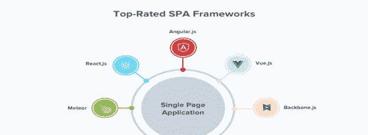

# 为什么单页面应用程序(SPA)架构如此受欢迎？

> 原文：<https://medium.com/nerd-for-tech/why-single-page-application-spa-architecture-is-so-popular-141b85400204?source=collection_archive---------2----------------------->

由于简化和现代化的用户体验，单页面应用程序(SPA)架构目前正成为一种趋势。由于数据是使用多个并行调用加载的，SPA 提供了具有减少“点击”的高速应用程序。SPA 与使用微服务架构将任何单一应用程序分解为轻量级应用程序的策略结合得非常好，从而缩短了上市时间。然而，任何流行的和广泛成功的方法，总有人走得太远。单页应用程序非常适合某些用例，但它不能取代所有类型的 web 应用程序。为了使 SPA 成功，项目需要关键的利益相关者——用实际用户测试新 ui 以通过早期反馈验证改进的体验的用户体验团队，了解 SPA 力量的架构师，可以将想法变为现实的经验丰富的开发团队，以及支持转型的长期愿景。

如果我们回顾历史来理解它是如何发展的，Web 应用程序开发是一个古老的(20 世纪 70 年代)概念，它始于使用软件应用程序解决各种行业问题的数字化。以前，我们使用基于桌面的应用程序，然后 trend 开始使用客户端-服务器技术将它们迁移为基于 web 的应用程序。随着技术的进步和更多的过程自动化的需要，大多数公司继续增强现有的应用程序，导致“胖”单片应用程序。这在很大程度上要归功于微服务架构，它启动了批判性思维处理，将应用程序分解为 API 和易于管理的组件。它还改革了将基于网络的应用程序分解为单页应用程序的需求，使脸书、谷歌、Linkedin、Twitter 和网飞等公司的成功故事成为可能，这也有助于在行业中推广 SPA 概念。SPA 彻底改变了行业中设计现代 web 应用程序的基本思想，导致了基于 JavaScript 的现代框架的发明，并得到了社区的广泛支持。

# **为什么单页面应用？**

SPA 技术的一大优势是，它允许公司将胖的内部/云应用移植到轻量级原生应用，而无需对 UI 或已建立的工作流进行大的更改。流畅熟悉的桌面般的用户体验无疑是一个 SPA 最大的优势。此外，很容易将应用程序移植到云中。以下是采用 SPA 的几个有力理由

***推进整体式复杂应用程序现代化的途径*—**SPA 被认为是将整体式应用程序分解为 SPA 以满足业务需求的一种方法。大部分业务领域都在尝试开发针对特定细分用户和相关工作流的 SPA。

***简化而现代的用户体验* —** SPA 提供丰富的 UI 内容和简单而现代的用户体验，易于跨平台移植

***需要最少的用户培训*** —通常，组织会在培训新员工方面投入大量资金，包括环境设置和基础设施成本等。根据研究，SPA 不需要或只需要很少的培训，因为屏幕是根据广泛的 UX 研究和调查设计的。

***简化的部署和高速交付的回滚* —** SPA 提供轻量级应用程序，这些应用程序易于打包和部署到生产中。与整体式应用程序相比，SPA 缩短了上市时间。

***减少点击量* —** SPA 通过并行进行多次调用，在一个视图中呈现所有重要信息，与胖 web 应用程序相比，大多数操作只需更少的点击即可完成。

***使用浏览器轻松调试* —** SPA 使用网络选项卡和检查选项轻松调试应用程序代码。

***无需等待整个应用程序加载* —** 应用程序数据采用异步方式并行加载，因此用户无需等待应用程序完全加载，因为数据会在第一次响应时显示。

***更简单的状态跟踪——无需使用 cookies、表单提交、本地存储、会话存储等。* —** 通常情况下在任何多页面应用程序中，总是存在跨页面共享数据的挑战，如果我们利用像 HTTP 会话这样的解决方案，那么会话管理也是一个巨大的挑战。这种挑战在 SPA 应用中是没有的。

***每页上的样板内容(页眉、页脚、徽标、版权横幅等。)每个典型的浏览器会话仅加载一次—*** 这是基于 SPA 的应用程序的主要区别之一，因为每个浏览器会话仅加载一次应用程序，因此样板代码始终可用，并且节省了应用程序渲染的时间。

*****DevOps 和自动化—*** 与多页面或单片应用程序相比，基于 SPA 的应用程序的持续集成/持续交付和自动化更容易，因此交付速度更快。**

# ****SPA 方法—设计和开发考虑因素****

**作为标准实践，在开始任何开发工作之前，团队需要研究和考虑工具、技术、架构、方法和平台。以下几点考虑:**

*****技术考虑* —** 如果一个团队已经决定构建一个最适合项目需求的 SPA，那么就必须在一个强大的框架上构建它。这也取决于你是否使用 OSS、COTS 或 SAS 产品。**

**以下是一些顶级的 SPA 框架，但在我看来，Angular 在竞争中领先，原因如下:**

****

**社区支持——截至目前，超过 50 %的开发人员社区正在使用 Angular for SPA，并积极为 Angular 的扩展和改进做出贡献**

**MVC 架构——如果需要将一个单一的应用程序分解成一个更轻的应用程序，如果我们需要执行大量的数据操作和 API 调用，那么 Angular 非常适合这样的需求**

**培训——与其他客户端框架相比，使用 Angular 很容易提升我们现有团队的技能，也很容易从市场上找到并雇佣 Angular 开发人员。**

*****架构考虑事项* —** 设计 SPA 应用时，以下是关键考虑事项:**

**利用 **12 个因素云原生**应用架构原则设计未来**

****API 优先方法**保持应用的模块化和可扩展性，以适应未来的交互**

****灵活的&可扩展 UI** 实现，改善客户体验。**

**使**快速发展**因**发展合作**而丰富，以加快上市速度**

**设计符合 **WCAG 2.0 标准**的用户界面，使内容可感知、可操作、可理解。**

****响应式设计**兼容主流浏览器**

*****平台考虑事项* —** 这一点非常重要，因为解决方案必须支持任何组织的总体目标。因此，选择正确的平台 OSS、COTS 或 SAS 应该符合长期愿景。**

# ****结论****

**使用单页应用程序的好处是多方面的。虽然 web 应用程序领域出现了新的趋势，改进了 SPAs，如 Progressive Web Apps (PWAs ),但是 SPAs 无疑是朝着未来 Web 应用程序开发的正确方向迈出的一步。尽管水疗有许多优点，但也有一些缺点。SPAs 的一些问题是——它在搜索引擎优化方面表现不佳，消耗大量浏览器资源，多个并行调用可能会导致性能问题。然而，有各种方法来应对这些挑战，水疗的优势大于劣势。此外，SPA、微服务架构和 DevSecOps 的结合使其成为一个独特的解决方案，并有可能解决许多行业问题。微前端架构在服务支持和解耦方面也是 SPA 的补充。**

**总体而言，它有助于改善用户体验，降低维护成本，并缩短上市时间。**