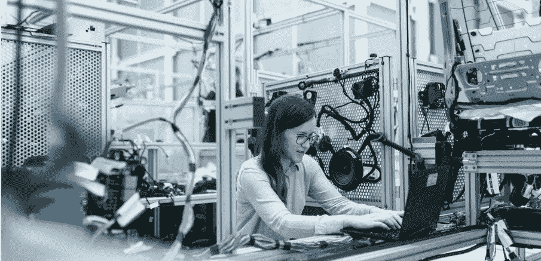

# 为什么技术不会取代你的工作。大部分是。

> 原文：<https://medium.com/nerd-for-tech/why-technology-likely-wont-take-your-job-mostly-841cfdaa3584?source=collection_archive---------9----------------------->

在 [Unsplash](https://unsplash.com/s/photos/technology?utm_source=unsplash&utm_medium=referral&utm_content=creditCopyText) 上拍摄的 [ThisisEngineering RAEng](https://unsplash.com/@thisisengineering?utm_source=unsplash&utm_medium=referral&utm_content=creditCopyText)

这是我们经常从商业媒体和许多书籍和播客中听到的叙述。像人工智能和机器人这样的数字技术将会消灭很多工作。数百万人将会失业。这句老话经常被用来推动全民基本收入的争论([。)虽然我们无法确切知道实际上会发生什么，但一些工作岗位肯定会流失。许多新的角色将会被创造出来，其中一些将会进化成一个混合的人机角色。但在我对这个话题的研究中，有一个方面没有得到太多的考虑，如果有的话，那将对这个论点产生重大影响。](https://www.investopedia.com/news/history-of-universal-basic-income/)[人口下降](https://www.sciencedaily.com/releases/2020/07/200715150444.htm)。

你可能像世界上许多人一样，相信或认为地球人口将在未来几十年翻一番。这是一个神话。一些国家的人口在增长，但在许多国家，尤其是中产阶级强大的国家，人口在下降。随着发展中国家变得更加稳定，经济更加强大，它们的人口也会下降。联合国预测，到本世纪末，我们将有 110 亿人在地球上闲逛。许多其他人不同意，认为到 2070 年人类数量将达到 97 亿，然后会大幅下降。虽然我们不能确定，但证据表明人类数量较少。事实上，我们现在的衰退速度可能比我们知道的更快。

像日本、德国、英国、加拿大和美国这些非常富裕的国家人口增长率都很低。他们已经不再用死亡来代替出生。所有这些国家都面临着快速老龄化的人口。连中国都有这个问题。在日本，情况变得如此糟糕，以至于这个国家越来越依赖于像机器人这样的技术来照顾老人。许多工作都是空着的，因为没有足够的人来填补这些空缺。西方国家已经预料到了这一点。

如果你想知道人工智能？是的，它会取代一些工作。但在很大程度上，在可预见的未来，人工智能将提升大多数工作岗位。这实际上可以使工作更愉快，因为人工智能可以做大多数人不喜欢做的平凡、例行公事。我们会有很长一段时间的狭义 AI，可能永远达不到通用 AI(即终结者级别。机器人也将取代一些工作，但不是全部。

甚至早在 19 世纪末，随着发电量的增加和汽车速度的提高，制造工厂开始上线(是的，双关语)，预测的大规模失业从未出现。

但最大的事情是人口下降。此外，婴儿潮一代已经开始大规模退休。很多编码工作会流失到低/无代码，但是会开发出新产品。信息管理领域也将呈现一个全新的规模，这将意味着就业。

我们可能会经历一个人员变动的时期，在 15-20 年的时间里，大量的工作岗位确实会流失。对技能再培训和升级的需求也很大。政府将不得不介入。自由市场自由主义者将会发现这确实是一个非常尴尬的时期。不可避免的是，将需要更多由政府管理的公共服务。

所以，是的，一些工作将会失去。我远非经济学家，但我在理解工作场所文化转变以及技术如何影响组织和这些新兴技术方面的工作表明，失业人数将比有时公布的要少。

说了这么多，做一些技能提升也不错。但不仅仅是技术和代码。艺术和创意将在数字社会中扮演越来越重要的角色。你可能也需要搬到另一个国家，但是 hye，那可能是令人兴奋的。但那是另一个话题了。