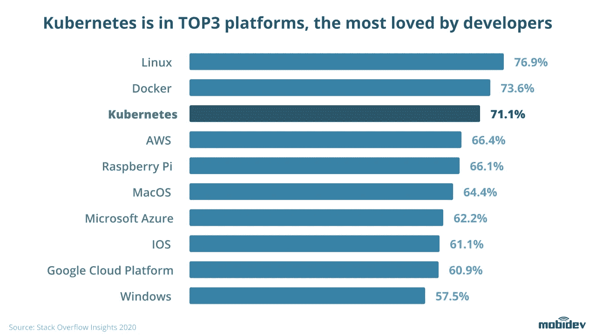
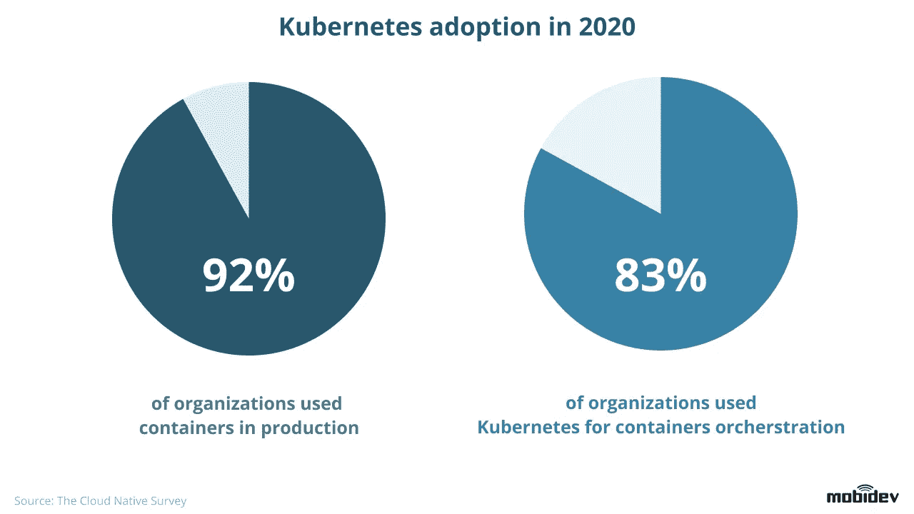
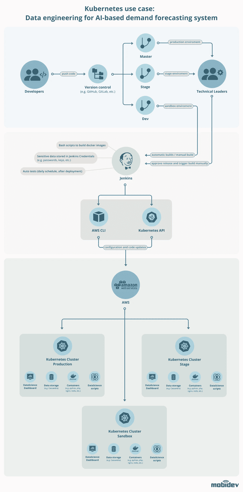

# 为什么、何时以及如何使用 Kubernetes 进行应用程序开发

> 原文：<https://medium.com/nerd-for-tech/why-when-and-how-to-use-kubernetes-for-application-development-8657d805dcea?source=collection_archive---------4----------------------->

Tinder、AirBnB、Pokemon Go、Pinterest 有什么共同点？它们都运行在 Kubernetes 平台上。这篇文章解释了为什么 IT 主管应该评估使用这项技术，它如何帮助企业，以及它不应该在什么情况下使用。

我们将看看现实世界中的企业 IT 用例，以及这项技术面临的一些挑战，以及如何正确地利用 Kubernetes 来充分利用它。

# 什么是 Kubernetes？

对于那些紧跟网络发展最新趋势的人来说，Kubernetes 似乎突然遍地开花，变得越来越受欢迎。Kubernetes 于 2015 年首次向开发者推出，逐渐成为一个几乎受到开发者普遍喜爱的平台。

但是 Kubernetes 同样适合科技高管吗？如果是，为什么？

Kubernetes 是谷歌开发的开源平台，允许用户在一系列多种设备或机器上协调和运行容器化的应用程序。Kubernetes 的目的是集中于对容器化应用程序的整个生命周期的全面控制，用方法提供改进的可用性和可伸缩性。

Kubernetes 用户能够管理他们的应用程序如何与 Kubernetes 平台之外的其他应用程序进行交互，并控制这些应用程序如何以及何时运行。

用户可以根据需要轻松地缩小或扩大规模，无缝地部署更新，并通过在应用程序的多个版本之间切换流量来测试功能和排除困难部署的故障。

# Kubernetes 和 Docker 有什么区别？

通常，关于 Kubernetes 和 Docker 的讨论会采取这样的形式——“我应该选择使用 Kubernetes 还是 Docker？”但是这是一个有点误导的框架，因为这两个平台不是严格的替代品。没有 Docker 完全可以运行 Kubernetes，反之亦然。但是 Docker 经常可以从并发使用 Kubernetes 中受益，反之亦然。

[Docker](https://www.docker.com/) 是关于容器的，经常用来帮助应用程序的容器化。请注意，Docker 可以作为独立的应用程序安装在任何机器上。

容器化的核心是以一种将应用程序与系统的其他元素完全隔离的方式运行应用程序的概念。本质上，应用程序的行为就好像它有自己的操作系统实例一样，即使在大多数情况下，多个容器在同一个操作系统上。Docker 充当这个过程的管理者，在给定的 OS 中处理这些容器的创建和运行。

现在，假设您在多台主机上使用 Docker。这就是 Kubernetes 的用武之地。每个主机或节点可以是虚拟机或物理服务器。Kubernetes 能够自动化和管理负载平衡、扩展和安全等元素，以及容器的供应，通过单个仪表板或命令行链接所有这些主机。我们将 Docker 主机(或任何节点组)的集合称为 Kubernetes 集群。

下一个逻辑问题是:为什么有必要创建多个主机或节点？有两个主要原因。

1.  首先，让你的应用程序可伸缩。如果应用程序上的工作负载增加，您可以创建更多的容器，或者增加 Kubernetes 集群中的节点数量。
2.  第二，提高基础设施的稳健性。即使任何节点或节点的单个子集离线，您的应用程序仍保持在线。

Kubernetes 能够自动移除、添加、管理和更新容器。事实上，Kubernetes 也许可以被认为是一个编排容器的平台。同时，Docker 允许在较低的级别创建和维护容器。

# 何时以及为何使用 Kubernetes

从一系列 Docker 创建的容器开始，Kubernetes 为这项服务管理流量和分配资源。

这样，它使得管理面向服务的应用程序基础设施的许多方面变得更加简单和容易。结合最新的 [CI/CD](https://www.atlassian.com/continuous-delivery/principles/continuous-integration-vs-delivery-vs-deployment) (持续集成/持续部署)工具，Kubernetes 可以扩展这些应用程序，而无需大型工程项目。

我们可以更仔细地看看其中的几个例子。

# 容器编排

真空中的容器非常棒，它提供了一种简单的方法，通过轻量级的创建过程来捆绑和部署您的服务。这允许积极的属性，如资源的有效利用、不变性和进程隔离。

然而，当你在生产中实际实现你的项目时，很有可能你最终会处理几十到几千个容器，特别是随着时间的推移。如果这项工作是手工完成的，很可能需要一个专门的容器管理团队来更新、连接、管理和部署这些容器。

仅仅运行容器是不够的。您还需要能够完成以下任务:

*   根据需求的变化缩小或扩大规模
*   编排和集成各种模块化部件
*   跨集群通信
*   确保你的容器是容错的

人们很自然地认为，容器应该能够处理所有这些，而不需要像 Kubernetes 这样的平台。但现实是，容器本身是在较低层次的组织中运行的。为了获得用容器构建的系统的显著优势，有必要使用像 Kubernetes 这样的容器编排工具，这些工具位于容器之上并管理容器。

# 微服务管理

微服务的概念远不是一个新的想法。几十年来，软件架构师一直致力于将大规模应用程序分解成可广泛重用的组件。微服务提供了多种优势，从更大程度的弹性到更快、更灵活的部署模型，再到更简单的自动测试。

微服务还让决策者为任何单个任务选择最佳工具。您的应用程序的一部分可能从 PHP 这样的高级语言的生产率提升中受益更多，而另一部分可能从 Go 这样的高速语言中受益更多。

但是 Kubernetes 如何适应这种微服务概念呢？的确，将你的大规模应用程序分解成这些更小的、连接更少的微服务将允许更多的行动自由和独立性。但是，在利用所有这些独立部分运行所使用的基础设施时，您的团队仍然有必要进行协调。

有必要预测这些部分将需要的资源数量，以及您的需求在负载下如何变化。您需要在基础设施中为各种微服务分配分区，并相应地限制资源使用。

这就是 Kubernetes 能够提供帮助的地方，它提供了一个通用的框架来描述您的基础架构，允许您检查和解决资源使用和共享问题。如果你计划创建一个依赖微服务的架构，Kubernetes 会非常有用。

# 云环境管理

难怪容器和管理容器的工具变得越来越受欢迎，因为许多现代企业正在转向基于微服务的模型。这些微服务模型允许轻松地将应用程序拆分为离散的部分，并分配到通过单独的云环境运行的容器中。这使您可以在每种情况下选择完全符合您需求的主机。

Kubernetes 旨在部署在任何地方，这意味着您可以在私有云、公共云或混合云上使用它。无论用户身在何处，您都可以通过这种方式与他们保持联系，同时增加安全性。Kubernetes 允许您回避“[供应商锁定](https://www.cloudflare.com/learning/cloud/what-is-vendor-lock-in/)”的可能问题。

# 何时不使用 Kubernetes

虽然 Kubernetes 功能强大且灵活，但它并不适合所有用例或项目。请记住，创建 Kubernetes 是为了解决某些潜在的问题和挑战。如果你没有真正面对这些挑战，Kubernetes 很可能会变得更加笨拙而不是有用。

如果您的项目似乎达到了扩展和部署需要专用资源的程度，那么编排就开始成为一个可行的选择。

编排和自动化的概念往往是相辅相成的。自动化通过提高效率、减少人类与数字系统的互动而使企业受益。用软件来处理这些交互，我们看到错误和成本的减少。

一般来说，自动化意味着自动化一个离散的任务。相比之下，流程编排指的是自动化由多个步骤组成的整个工作流或流程，通常是多个系统。首先，您将自动化构建到工作流中。然后，如果复杂性增长到一定程度，编排就会接管管理它们，并使它们协同工作。

kubernetes**不是以下情况的最佳选择**:

1.  简单或小规模的项目，因为它相当昂贵和过于复杂。
2.  项目的特点是用户基数小，负载低，架构简单，并且没有增加这些的计划。
3.  开发一个 MVP 版本，因为最好从更小更简单的开始，比如 Docker Swarm。然后，在你对你的应用程序如何运行有了一个清晰的认识之后，你可以考虑转而使用 Kubernetes。

# Kubernetes 是如何实现安全性的

对于运行在 Kubernetes 上的系统，应该提供通用的 web 应用程序安全措施，以防止恶意攻击和意外损坏。

# Kubernetes 将如何影响 2021 年的企业 IT

调查技术/软件组织的云本地调查[报告](https://www.cncf.io/wp-content/uploads/2020/11/CNCF_Survey_Report_2020.pdf)称，生产中容器的使用比上一年增加了 84%，达到 92%。Kubernetes 的使用率比上一年增长了 78%，达到 83%。

大公司是如何使用 Kubernetes 的？

口袋妖怪 Go [使用 Kubernetes 在 GKE(谷歌容器引擎)上工作](https://cloud.google.com/blog/products/containers-kubernetes/bringing-pokemon-go-to-life-on-google-cloud)，允许它编排一个跨越全球的容器集群。这使得它的团队可以更有效地为超过 2000 万日活用户的活跃玩家群发布实时变化。

Tinder [从他们的传统服务过渡到 Kubernetes，这是一个由 1000 多个节点和 200 个服务组成的集群，有 15000 个 pod 和 48000 个容器。这将 EC2 实例的等待时间从几分钟减少到几秒钟，从而显著降低了成本。](/tinder-engineering/tinders-move-to-kubernetes-cda2a6372f44)

# Kubernetes 用例#1:基于人工智能的需求预测系统的数据工程

## 项目描述

我们一直在开发一个 POS 软件&场地管理[系统](https://mobidev.biz/case-studies/pos-application-development)，被很多酒吧和餐馆采用。随着时间的推移，积累了大量的历史 POS 销售数据，我们的技术专家想出了一个主意，将人工智能(AI)算法应用于这些数据，以找到以前销售的模式，并对每个场地的下一期进行预测。开发了一个基于人工智能的需求预测系统，作为一个独立的模块集成到系统中。

## 要解决的问题

由于人工智能计算需要大量资源，最初，AWS EMR 云服务中的虚拟机被使用。采用该系统的场馆越多，基础设施就变得越昂贵。AI 模块的高 CPU 负载发生在一夜之间，当时机器学习算法正在处理每天的销售数据，白天处于空闲状态。为了降低基础设施成本，借助 Docker Swarm 实现了对计算资源的手动管理。

在 MVP 开发阶段，使用 Kubernetes 没有意义，因为它需要大量的研究和采用时间。然而，随着场馆数量的增长，需要一种新的数据工程方法来提供自动化和可扩展性以及成本优化。

## Kubernetes 解决的技术任务

1.  基于计划的历史数据收集脚本
2.  在 Kubernetes 内部运行的数据库中的数据存储
3.  历史数据更新成功后的人工智能脚本
4.  与人工智能仪表板交互的 API
5.  显示人工智能脚本结果的人工智能仪表板

## Kubernetes 解决的业务任务

Kubernetes 允许我们实现自动扩展，并提供实时计算资源优化。

**性能和成本优化**

人们注意到，在 Kubernetes 上，为相同数量的数据计算相同逻辑的人工智能脚本比 AWS EMR 返回结果快得多，同时消耗的计算资源也比 EMR 少。在 Kubernetes 上，与之前的 EMR 生产环境相比，相同数量的场馆运行 AI 模块脚本所需的平均时间减少了 10 倍。

**可靠性提高**

系统稳定性是我们从 AWS EMR 转向 Kubernetes 的关键原因。在 EMR 上，脚本启动有时会因为未知原因而失败，并且日志没有给出任何有用的信息。

**可扩展性提升**

而在 Amazon EMR 上，项目开发受到未来要添加的新场馆的最大数量的限制。Kubernetes 取消了限制和自动化扩展，这对快速增长的项目至关重要。

## 项目摘要

Kubernetes 上的系统可以更快地提供结果，消耗更少的计算资源，使客户能够降低 AWS 计费的成本，并确保稳定和可预测的产品交付。

# Kubernetes 用例 2:人工智能视频监控系统的数据工程

我们参与的 Kubernetes 的另一个真实业务用例是一个智能计算资源自动缩放，用于视频监控系统中的面部模糊功能。该系统由以下应用程序组成:前端，后端，后端队列，以及基于人工智能的人脸模糊功能。Kubernetes 被用作所有这些应用程序的协调器。

当出现新的视频处理请求时，后端会在 Kubernetes API 的帮助下自动伸缩，并自动添加更多的工作人员来处理这些请求。

# 库伯内特的未来

Kubernetes 的分布式架构和可扩展性与机器学习和人工智能配合得很好。随着这些技术的不断成熟，2021 年将是这一领域的增长年。

企业应该记住，工具支持业务目标，而不是目的。2020 年是几乎所有企业都被迫应对意外变化的一年。Kubernetes 能够通过利用云原生生态系统构建的解决方案来加速应用开发服务，同时允许应用和数据的可延展使用，以便公司能够通过其平台和应用的现代化取得成功。

由 [MobiDev 的 PHP 团队负责人 Anton Logvinenko 撰写。](https://mobidev.biz/services/web-application-development)

*全文原载于*[*https://mobidev . biz*](https://mobidev.biz/blog/when-why-how-use-kubernetes-app-development)*，基于 mobi dev 技术研究。*