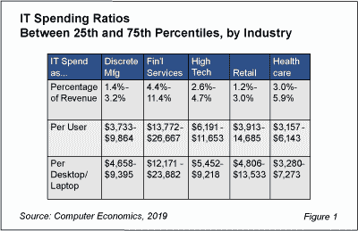
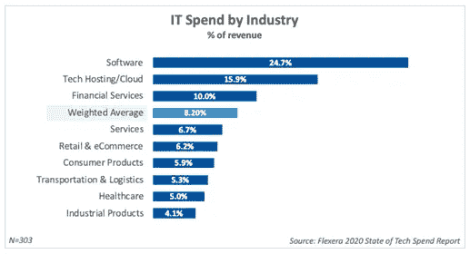
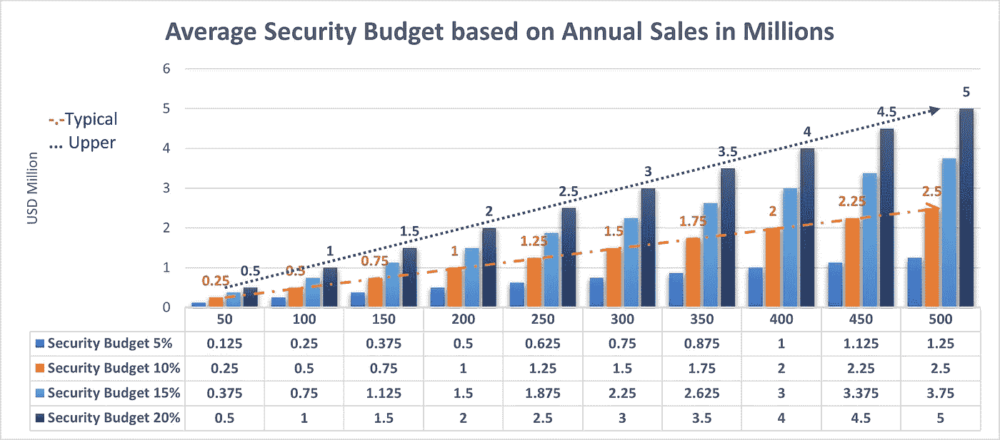
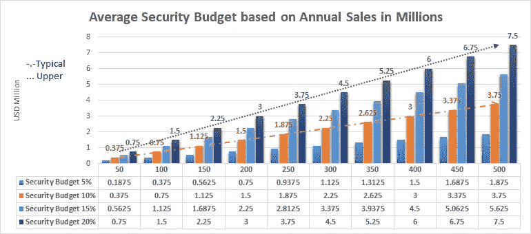

# 为什么您对安全解决方案的定价可能完全错误

> 原文：<https://medium.com/nerd-for-tech/why-you-are-probably-pricing-your-security-solution-all-wrong-77e1021a71a9?source=collection_archive---------19----------------------->

尤其是我在 Gartner 担任分析师期间，我听到了许多关于 TAM 和 IT 安全预算以及相关定价策略的荒谬说法。有人告诉你，他们应该向中型企业销售产品，但他们的解决方案最低标价为 50 万美元，这让人难以置信。有些人夸大其词来愚弄分析师，但根据最终用户的反馈和看到的定价，围绕什么是现实的问题似乎有很多困惑。

我的主要观察是，在许多情况下，这些假设是基于供应商想要得到什么，而不是什么是现实的。无论是对供应商、用户还是投资者而言，一般定价都是最大的重复话题之一，数据可用性和信息不对称是各方战略规划者产生摩擦的主要原因。

由于安全预算通常按 IT 预算的百分比计算，我们首先需要获得典型 IT 支出和预算的数据。

**平均 IT 支出**

首先，没有全面、准确的 IT 预算数据。如果您花一点时间阅读可用的报告类型，您会发现基于一组非常不同的假设，甚至是对 it 支出构成的定义，存在着非常不同的估计。我遇到的一个例子是，报告很少澄清数据是否包括估计中的人事费。明智的分类数据，如按公司人口统计进行的细分，也经常不可用。最后，许多可用的数据来源，特别是免费的和 OSINT，要么有一个隐含的偏见，如供应商或行业报告，要么参与者数量太低，不具有统计代表性。

将大多数可用数据归类为“轶事”是公平的。在我们看来，所需的信息是不可知的。没有哪一方或哪一种方法可以获得可靠的数据。然而，作为现实主义者，我们也是实用主义者，如果我们不能达到精确，我们将追求准确。毕竟，你不需要精确地知道温度下降了多少来决定是否穿外套——你需要知道天气是变冷了一点还是冷了很多。

让我们来看看一些可用的数据。Computer Economics 是一家商业研究公司，自 1979 年以来一直提供有关 IT 支出比率和员工指标的数据。Computer Economics 发布了一份关于 IT 支出比率的年度报告，通常量化为收入的百分比。

【https://www.computereconomics.com/article.cfm?id=2626 号

我遇到的一个更全面的供应商报告是 Flexeras 的技术支出报告，其参与者总数为 303。隐含的偏见是参与者是供应商的潜在或活跃客户，但这是我们可以包括的进一步的数据点。

该数据集显示了基于行业领域的 IT 预算的巨大差异。一个有用的关联是，两份报告显示，金融服务业的比例相似。

flexera 2020 年 IT 支出状况报告

您可以在此处获得 Flexera [的最新报告，但需要提供您的详细信息。](https://info.flexera.com/SLO-REPORT-State-of-Tech-Spend)

如果你回顾一下其他一些可用的数据，IT 预算似乎在 2.5%到 10%之间，科技领域的异常值接近 20%。

**安全预算**

有很多报告提供了网络安全预算的数据，数据点分布很广。

[例如，IDC](https://www.csoonline.com/article/3432138/how-much-should-you-spend-on-security.html) 指出，企业应该将 7%-10%的 IT 预算用于网络安全。

另一份有趣的报告是 CIO 的“[2019 CIO 状态](https://www.cio.com/article/3335497/winter-2019-state-of-the-cio.html)调查。CIO 询问了全球 683 名 IT 主管，IT 安全在他们公司的总 IT 预算中占多大比例。平均应答率为 15%。近四分之一的组织(23%)将 20%或更多的 IT 预算投入到安全性上。

德勤对金融服务业进行了一项调查，金融服务业表示他们在网络安全上平均花费了 10.9%的 IT 预算。该报告还提供了关于支出去向的有用的细分数据。

回顾现有数据，典型范围取决于行业和公司规模，但在网络安全方面的范围在 5%到 20%之间。

**那么我能拿多少呢？**

让我们把所有这些放在一起:

-平均 IT 预算在年收入的 2.5%到 10%之间，通常在 5%到 7.5%之间。

-平均安全支出占 IT 预算的 5%到 20%，平均为 10%到 15%

我们现在可以将这些假设应用于不同的年收入类别。我们将计算收入在 5000 万至 5 亿美元的企业的网络安全预算:

网络安全预算，假设 IT 预算为收入的 5%

IT 预算假设收入的 7.5%

以下是从调查结果中得出的一些基本结论:

-中型企业，基本上是任何年收入低于 5000 万美元的企业，其平均网络安全预算只有 25 万至 37.5 万美元。

-每年百万美元的网络安全预算在年收入达到 2 亿至 4 亿美元之前不会自然产生，具体取决于业务的开展情况。

现在，在你松一口气，想到“这还不算太糟，我可以用 25 万美元工作”之前，请记住这不是可用的预算。它通常已经包括基本的安全组件、端点保护、防火墙/UTM 和中小型企业的电子邮件安全，以及 SIEM、EDR、SOAR 和任何其他大型公司已经部署的组件。

如果你有一个新兴的产品，这个问题会变得更加尖锐。在这一点上，你在预算分配方面排在队列的后面。如果在典型的信息安全管理系统、风险管理或监管框架中没有固定的分配预算，您要么首先必须解决一个非常紧迫的小问题，依赖大约 5%-10%的早期采用者，要么从已建立的市场获取预算。因此，终端检测和响应供应商增加了防病毒和终端保护(EPP)功能，或者用户实体行为分析供应商增加了更多类似 SIEM 的功能。

如果您解决了一个小问题，或者补充了任何附加技术，例如基于用户首先要测试安全控制的入侵和攻击模拟，那么您的可用预算将会更少。

当你决定瞄准哪个细分市场以及如何为你的产品定价时，所有这些都是重要的考虑因素。无论你的解决方案有多好或多耀眼，你最终的销量都会下降，这是一个无法承受的临界点。问题往往是，你是想以 5 万的价格把某样东西卖出 1000 倍，还是以 1.5 万的价格卖出 1 万倍。

但最重要的是，向那些即使想卖，也买不起你的产品的企业推销是徒劳的。

*最初发表于*[*【https://www.linkedin.com】*](https://www.linkedin.com/pulse/why-you-probably-pricing-your-security-solution-all-wrong-rochford)*。*