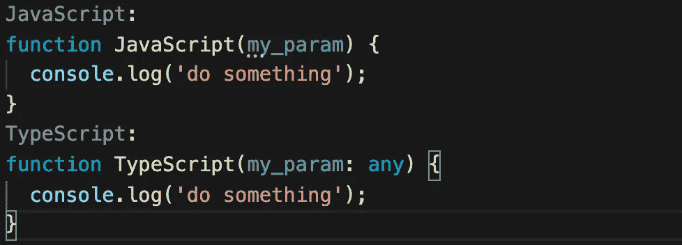

# 为什么应该对 NodeJS 后端使用 TypeScript，而不是 JavaScript

> 原文：<https://medium.com/nerd-for-tech/why-you-should-use-typescript-not-javascript-for-a-nodejs-backend-28eb92a3e44e?source=collection_archive---------18----------------------->

如果你像我一样，那么你会发现用 JavaScript(而不是 Java)实现一个想法是多么容易😊).它是一种解释型、命令型、弱类型语言，使得启动项目和开始运行变得容易，在程序运行之前不会在控制台上看到多个错误。

但是当我们的代码库增长、变得更大、更复杂时会发生什么呢？对于 JavaScript 之类的东西来说，这变得有点麻烦，尤其是在使用 Java 构建 API 的传统背景下🙃。Java 是一种强类型的编译语言，它为我们提供了构建服务器端应用程序所需的结构，因为这允许我们在运行代码之前可靠地构建代码。

幸运的是，TypeScript 可以给我们 Java 的感觉，看起来更像 JavaScript。TypeScript 是 JavaScript 的超集，这意味着用 JavaScript 编写的“任何”有效代码也可以在 TypeScript 中工作(任何都用引号括起来，因为语法可能略有不同)。这意味着您可以编写 JavaScript 代码，一种解释型语言，同时获得 TypeScript 提供的好处，TypeScript 的行为类似于编译型语言(因为它被反编译为 JavaScript)。这给了我们一些我们非常怀念的特性，让我们在从编译型编程语言到解释型语言 JavaScript 的编码过程中变得更加轻松，比如使用类型注释、接口、枚举类型等的静态类型。我们习惯于在任何编译语言(如 Java)中看到这些特性，但在解释语言(如 JavaScript)中根本看不到。

下面我们将讨论一些在使用 Typescript 时变得可用的特性。

# 键入注释

在上面的简单代码片段中，我们可以看到参数 **my_param** 后跟一个冒号，然后是关键字 **any** 。这将函数定义为期望向其传递任何类型的参数，可以是字符串、数字、布尔值或 Typescript 固有的任何其他原始类型。我们可以很容易地看到，在声明函数时为参数定义一个类型是多么有用，因为这可以防止我们在代码的其他地方使用函数时猜测它需要什么类型的参数。

# **编译时的类型检查**

这两种语言之间的解释与编译的差异，本质上造成了所有的差异。当在 Typescript 中遇到错误时，您会在编译期间立即获得所有错误的列表。然而，在 JavaScript 中，每个错误都是一个接一个发现的，因为它在运行时执行每一行代码，一次一行，并且当遇到第一个错误时就会崩溃，如果遇到就遇到*。*

以此类推；假设我们想做一顿饭，我们知道我们需要的所有配料:我们可以在做饭前做好准备，确保我们有所有需要的配料，随时可用。如果我们遗漏了什么，我们会在 开始做饭之前知道 ***，并且可以在再次开始做饭之前通过获得必要的配料来纠正这一点。这将是我们的**在 Typescript 编译的代码。*****

现在，我们可以举同样的例子，但这次不是在开始烹饪前检查我们是否有所有的配料，而是在需要时逐一检查每种配料**，在开始烹饪时检查**。现在，如果我们错过了什么，我们不会知道，直到我们需要那种成分的时候，但是在那个时候，我们可能已经开始准备了一半的食物，并且将不得不重新开始。如果我们在纠正缺失的成分后从头开始，如果我们继续并且另一个成分缺失，我们必须重新开始。这将是我们在 JavaScript 中的代码。

— — —

这并不是说仅仅因为您使用了 Typescript，您所有的运行时错误问题都会消失，而是说现在许多错误会在编译时被发现，从长远来看，这会为您节省大量时间。

随着 NodeJS 运行时在未来越来越受欢迎，我相信我们将开始看到更多使用 NodeJS 完成的服务器端项目，就像我们已经开始看到的那样，而不是像 Java 这样的东西。在这种情况下，当构建后端应用程序时，TypeScript 可能是介于 JavaScript 和 TypeScript 之间的事实上的语言，因为它节省了我们大量的时间和精力，并向我们展示了一种我们在服务器端更习惯的编程方式。