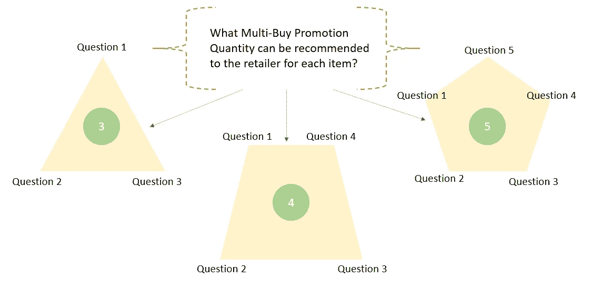
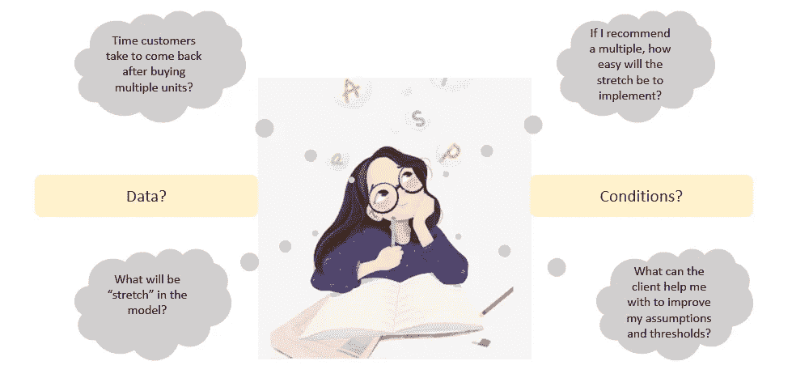
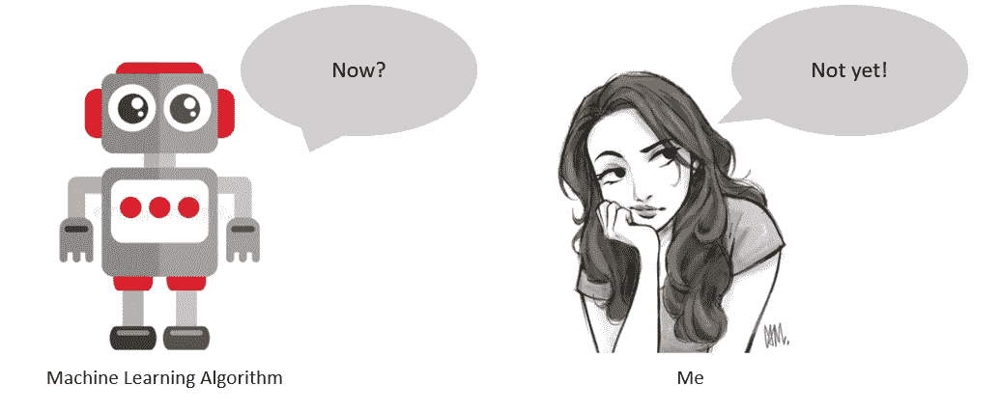
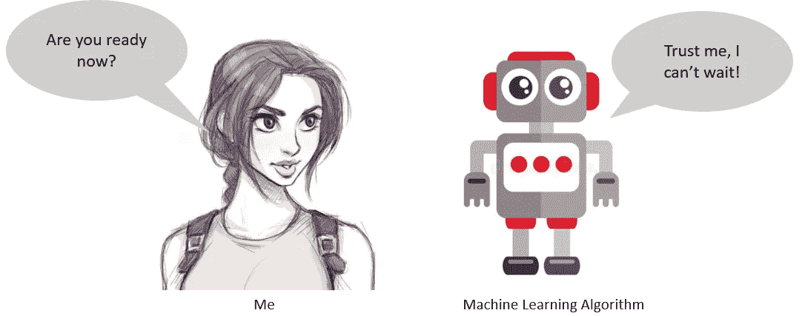
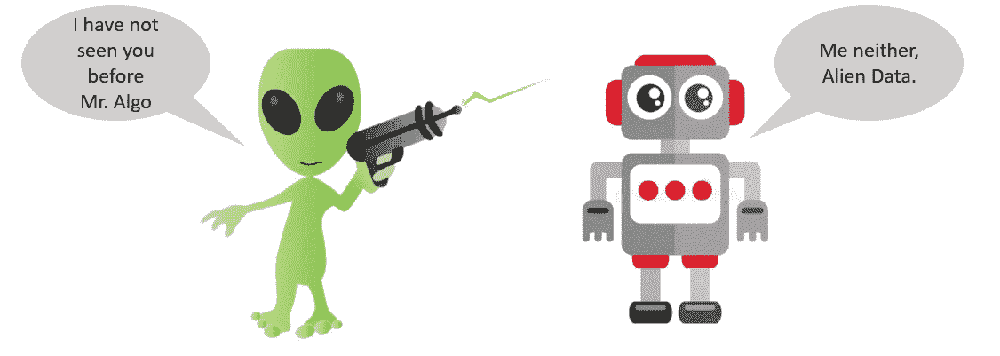
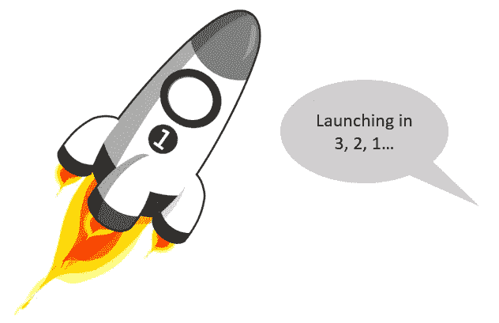

# #WhySeries | Why“你用的是哪种算法？”这不应该是你向数据科学家提出的第一个问题

> 原文：<https://medium.com/nerd-for-tech/whyseries-why-which-algorithm-did-you-use-fbd0f485cba1?source=collection_archive---------16----------------------->

> “真正的数据科学家实际上是数据艺术家。”— Anushree

我成为数据科学家已经 4 年多了，让我感到难过的问题总是——*当另一位数据科学家展示他们努力完成的一项杰出工作时，提出了一种创新的方法，最重要的是，更有效地回答了一个问题，或者是以前没有回答过的问题，然后从观众中出现的第一个问题是**“你用哪种算法解决了这个问题？”。*

**这不仅仅是别人演讲时的情况，也是我们选择是否参加演讲时的思维方式。**

*我一次又一次地看到，在实际日期之前流传的演示文稿的描述，以及当天的参与率，高度受制于“数据科学家将谈论哪种算法”，以及* ***而不是*** *“数据科学家尝试回答了什么问题，他们的方法的结果是什么？”。*

# 在回答主要问题之前，我们先一起试着搞清楚。

想象一个场景-

你被分配了一项任务，要回答一个业务问题，你开始在笔记本上记下你将采取什么方法来达到你想要的结果。

你是做什么的？

我个人创造了这样一个**流程**并继续在这些问题下粗略地记下我的笔记——

## 1.我能把寻找未知的路径分解成子路径或问题吗？

将你的问题陈述分解成不同的子问题并逐一回答，可以帮助你更好地理解和解决问题。

如果我想找到上述问题的答案，我会试着**把它分解成**几个问题，比如“哪些商品可以受益于或倾向于多购买促销？”“什么定义了从当前销售单位到客户满意的数量范围？”，“我如何计算出一件商品因数量增加较小或较大而容易被提货的概率？(即能不能一起卖两包薯片或者 3 罐可乐或者 2 罐可乐显示被捡的几率更大)”等。

此外，我还会考虑是按顺序回答会更有帮助，还是可以单独考虑？

在这个阶段，机器学习是我脑子里甚至还没有冒出来的东西。

## 2.什么样的数据是相关的，预期应用什么样的条件才能达到结果？

我想(或记下)的下一件事是什么样的**变量**对回答每个问题很重要。

像这样的问题—

什么能帮助我决定哪些商品更容易在不延长下次购物时间的情况下大量购买，哪些不会？我该如何定义拉伸？如果我想到一个不同的目标，定义会改变吗？会有怎样的改变？如果我能够以小倍数或大倍数获得要购买商品的敏感度的强度或偏斜度，我将如何获得每件商品的最终推荐多购买数量？

我还会考虑在定义模型或阶段时，哪些**条件**很重要，需要应用或牢记。例如，企业是否已经考虑了倍数在拉伸方面的大小？零售商目前使用的拉伸定义是什么？多重购买结构目前在商店中是如何运作的？对于零售商来说，什么水平的实施是可行的？你不会想给一些他们甚至不能实现的东西，对吗？

我需要客户提供什么信息？

因此，在这个阶段，也没有想到我会使用哪种模型(也许有一点——只是以一种梦幻的方式，但是)。

## 3.每个问题的结果如何与其他问题联系起来？

在这个阶段/问题中，我考虑如何将每个问题的**结果用作另一个问题的输入或与另一个问题的结果一起使用。**

像这样的问题—

一旦我弄清楚哪些商品适合多次购买或更容易以多种数量购买，结果是否可以用来完善我想要考虑的“延伸”范围？

每件商品的偏度，对于多重购买的敏感性，是否可以用于计算最终推荐，如何使用？

所以不，即使是现在，ML 算法也没有同步进来，只是开始在我的后脑勺形成一些想法。

## 4.什么会出错或被遗漏？每个阶段/问题可以实施哪些检查？

在这个阶段/问题，我试着去想所有的事情都可能出错。*墨菲定律*是我最喜欢的定律之一。

**“任何可能出错的事情，都会出错”。**

这也是我随着时间的推移所学到的，当我试图建立一个模型时，总是要考虑的。

由于这是一个多购买问题陈述，我的“单位”指标在各个项目中的一致性如何？可以互相比较吗？它们是同一个维度吗？如果不是，如果我把它们放到同一个维度，我的输出会是什么样的？我如何向客户传达这些结果？

我还试着想出可以在每个阶段实施的**检查**。

检查可以是直观的，也可以是正式的/算法的。

找到符合多买条件的商品后，如何确保我的数据有意义？我能让客户参与进来并确认这些项目对他们是否有意义吗？我需要改变门槛吗？

在模型开始时就考虑这些因素是很重要的。

## 5.在哪个问题/阶段我需要 ML 算法？我将如何评价它？评估的哪些因素对我更重要？我想考虑验证哪些数据集？

是的，这是我通常开始考虑的阶段—

*   我拥有的数据类型，
*   我想弄清楚的结果/未知的类型，
*   如果我能把未知变得更简单，
*   我将如何评估我的模型并进行比较，
*   如果根据我问题陈述，评估指标比其他指标更重要，
*   我将如何划分数据集来验证我的模型，
*   我的数据中存在什么样的相互关系，
*   变量如何与未知联系起来，
*   有哪些机型可以考虑比较。

当然，这不是完整的列表。但关键是，这是我开始考虑我的选择和测试各种模型以及我想要实现的方式/目标时感到舒服的地方。

## 6.我的模型有多适合新数据？我能从哪里得到新的数据？

这是一个非常有趣的阶段。这个阶段告诉我并验证我构建模型的努力是否成功。

在这里，有数不清的事情需要处理，也可能出错-新数据可能完全来自新的分布，或者模型可能表现不佳，即使它来自与您的训练数据相似的分布-这可能是痛苦的，但尽管如此，这是一个非常非常关键的阶段。

这是大多数迭代和重新考虑发生的地方。

我的模型在新数据上的表现如何，我可以从哪里获得这些新数据，客户能否提供这些新数据等等。—是我现阶段思考的问题。

## 7.企业是否能够直接实施最终结果？

这就是为什么你首先开始建立模型，所以这必须是你计划的一部分，不能失败！！

考虑结果/输出是否需要一些修改，或者新数据何时进入，客户何时向您反馈新结果—您获得新数据的难易程度，或者它是否是您将构建的可直接使用的即插即用仪表板。

这是你应该提前计划和讨论的事情。

## 8.当我回头看计划和完成的模型时，我会有什么不同的做法？

这是我在最终确定我想使用的模型后做的事情。完成模型后，再次访问它是一个好习惯，可以帮助你将学到的东西带给其他人，并与你一起在下一个项目中实施。

当然，还有其他事情，比如让你的团队成员参与讨论，与客户/客户线索保持联系等等。，可以帮助进一步完善您的模型和假设。

# 为什么我在上面提到这些步骤/阶段，而不是马上回答这篇文章的问题？

只是为了帮助你理解，如果建立一个模型有这么多方面，并得出一个结论，即一个人在他们的项目中使用哪种算法，那么被另一个人的兴趣拒绝或没有机会与他人互动就太不公平了——如果使用的算法是传统的或非常常见的。请记住，帮助你回答问题的不是算法，而是你从头到尾的整个模型。

综上所述，**它的“在哪里”和“如何”你在你的模型中使用一个算法，这使得一切都不同，** *比你使用哪个算法更重要。*

相信我，除了从自己的经历中学习，最好的学习方法就是从别人的经历中学习。

**因此，如果你真的想知道数据科学家使用的是哪种算法，可以问“你是如何想出这种算法或模型的？”相反。**

**这是真正的数据科学家的工作。这才是真正的数据艺术家该做的！**

如果你喜欢阅读这篇文章，并想与我互动——在 LinkedIn 上与我联系。

当然，也欢迎评论！

像往常一样，继续唱，继续笑，继续笑:)