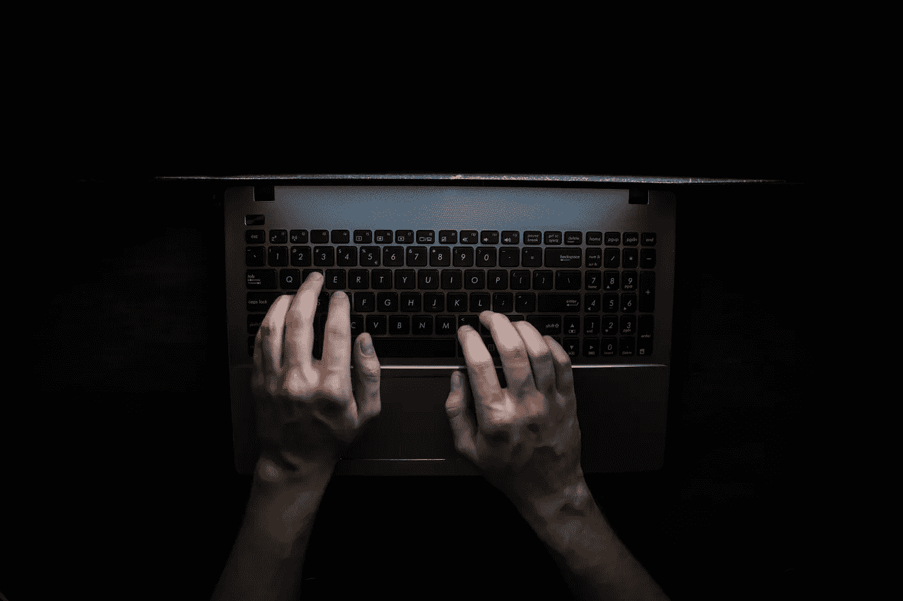

# 禁止黑客受害者玩羞耻游戏会改善网络信息共享吗？

> 原文：<https://medium.com/nerd-for-tech/will-banning-the-shame-game-on-hacking-victims-improve-cybersecurity-acee62a1feef?source=collection_archive---------1----------------------->

每个人都喜欢被羞辱。这就是为什么，在生活的许多领域，它本质上是被禁止的。尤其是当事情在很大程度上超出人们的控制时，比如体型或成瘾。这没有任何可取之处或建设性——它只是残酷和具有破坏性。你可能会因此被解雇。

但在网络安全等领域，界限就不那么明确了，在这些领域，组织确实可以控制自己面对网络攻击者的脆弱性。如果它们被黑客攻破，它们是无助的受害者，只值得同情吗？或者，如果他们未能实现他们多年来听说的安全基础，他们是否应该承担一些责任并受到一些批评？

也许羞愧，或者害怕羞愧，可能会让他们做他们一直应该做的事情。

在这一点上没有广泛的共识。一些组织认为，他们的网络安全是否严格并不重要，因为无论他们做什么，坚定的黑客或敌对的民族国家最终都会通过。他们认为，避免重大入侵更多的是一种运气，而不是一个人是否实施了业内宣扬了几十年的“分层安全”。

事实上，[《国会山》](https://thehill.com/blogs/pundits-blog/crime/295677-stop-victim-shaming-in-cyber-attacks/)五年多前的一篇文章认为，期望组织免受网络攻击就像期望你当地街角的杂货店有“一个设防的周界——铁丝网、坦克和警卫塔隐约可见，而直升机和战斗机在头顶呼啸而过。”

相反的观点是，虽然没什么能让你在网上刀枪不入，但它有可能成为一个更难对付的目标。

约翰·霍普金斯大学信息安全研究所的高级安全工程师约瑟夫·t·卡里根(Joseph T. Carrigan)表示，将类比推向极端会失去意义——没有人会指望街角的杂货店会有军事存在来保障安全，但他们也不会指望每晚都不锁门。

“在损失预防方面有最佳实践，它们不涉及战斗机，”他说。“网络安全方面也有一些最佳实践，大多数公司都可以负担得起。”

**破坏社区**

但另一个论点是，羞耻，即使是导致违规的安全失败，也会破坏社区意识和信息共享，而这种意识和信息共享可以提高整体安全性。

在最近接受 TechRadar Pro 采访时，网络安全管理软件产品首席执行官 Sudhakar Ramakrishna 呼吁结束网络攻击“受害者羞辱”,因为这使得公司不愿意与其他潜在易受攻击的组织分享关于违规的重要情报。

鉴于网络安全管理软件产品是 2020 年最臭名昭著的网络攻击之一的受害者，罗摩克里希纳有理由对这个话题比大多数人更敏感。据信由俄罗斯情报部门 SVR 指挥的黑客能够将恶意软件植入该公司名为 Orion 的 IT 性能监控系统的更新中。

因此，除了正常更新带来的常见“漏洞修复、性能增强和其他改进”，在 2020 年 3 月至 6 月期间，被破坏的更新向估计 18，000 名网络安全管理软件产品客户传播了恶意软件，当时他们正在做专家永远告诉他们要做的事情:保持你的软件最新！

这是[脆弱的软件供应链](https://armerding.medium.com/supply-chain-security-needs-more-than-15-minutes-of-fame-or-shame-536cddd7b9dc)风险的鲜明例子。攻击者不必单独侵入成千上万个组织，只需攻破一家供应商，让供应链连接来处理其余的，让他们能够访问那些网络安全管理软件产品客户的数据和网络。

下游的受害者包括科技巨头微软、英特尔和思科。受影响的联邦机构包括国务院、司法部、商务部和财政部；加上美国国家航空航天局、美国联邦航空局、国家卫生研究院和国家核安全局。

该名单甚至包括国土安全部下属的网络安全和基础设施安全局，其工作是保护联邦计算机网络免受网络攻击。

**责备游戏**

那么，这是安全薄弱的结果，还是没有人是防弹的？显然两者都有。攻击者非常老练，使用了一种前所未有的技术，这让一些事后寻求分析的专家不知所措。一位将其描述为“非凡的商业技巧”

黑客攻击发生时，罗摩克里希纳并不在网络安全管理软件产品负责——它始于 2019 年 9 月，并在 2020 年年中造成了大部分损失，他直到 2021 年 1 月才成为首席执行官。但他告诉 TechRadar，受害者感到羞愧的结果是“公司往往最终解决了问题，却对此只字不提。肯定有犹豫要不要说出来。”

“我们每个人都在防御攻击者。但一边是有着单一目标的协同作战的军队，一边是一群支离破碎的士兵。发生事故时，利用社区的帮助很重要，”他说。“我们需要让人们更快地意识到问题；这种心态需要在软件安全领域站稳脚跟。”

但是卡里根说，让组织承担责任并不是无端的羞辱。“如果你向联邦政府的大部分部门出售网络管理工具，该产品的安全性必须是首要考虑的问题，”他说，并指出在漏洞被披露后,[纽约时报](https://www.nytimes.com/2021/01/02/us/politics/russian-hacking-government.html)和[彭博](https://www.bloomberg.com/news/articles/2020-12-21/solarwinds-adviser-warned-of-lax-security-years-before-hack?sref=zFmdEBXN)都报道了网络安全管理软件产品在 2017 年被其内部专家警告其松懈的安全可能会导致灾难性的网络攻击。

此外，该公司显然不急于与“社区”分享攻击的细节，至少当它被发现时。[美国国家公共广播电台(NPR)2021 年 4 月](https://www.npr.org/2021/04/16/985439655/a-worst-nightmare-cyberattack-the-untold-story-of-the-solarwinds-hack)报道称，该公司的第一项举措是聘请律师。

“在网络攻击后，公司倾向于做的第一件事就是雇佣律师，并让他们负责调查，”NPR 报道。“他们这样做有一个特定的原因——这意味着他们找到的一切都受到律师/客户特权的保护，通常不会在法庭上被发现。”

卡里根补充说，在该公司的辩护中，当攻击公开时，“网络安全管理软件产品对事件非常透明。这种透明度有助于识别受影响的人。”

尽管如此，他说，他怀疑如果受害者羞辱停止，更多的组织将分享有关被入侵的信息。“我认为许多公司完全愿意永远不披露任何类似的事件，”他说。“我还认为，有许多事件没有被报道，因为该公司要么成功地保持沉默，要么不知道有事件发生。”

这将表明，让公司不愿分享攻击细节的原因，与其说是公开羞辱的威胁，不如说是品牌受损的风险、潜在的法律责任和安全失败的监管制裁。

**单行道**

罗摩克里希纳没有回复置评请求。但几十年来，网络攻击的信息共享一直是一个有争议的问题，大多数投诉都与羞辱无关。

相反，隐私倡导者多年来一直在重大安全会议上辩称，政府版本的信息共享是一条“单行道”，他们被期待共享，而政府没有。

可以理解的是，私人组织不愿意分享任何关于成为网络攻击受害者的事情，因为这可能会给他们带来比试图从攻击中恢复更大的痛苦——负面宣传和法律责任。

对于一个组织被入侵(即使其安全措施非常严格)和一个组织因疏忽而被入侵，在应对这两种情况时存在(或者应该存在)重大差异。2017 年，信用报告巨头 Equifax 发生了臭名昭著的[违规事件，原因是该公司未能安装一个已经发布了几个月的补丁。](https://www.forbes.com/sites/taylorarmerding/2018/09/11/equifax-breach-catastrophic-but-no-game-changer-yet/#6e788dcd51d7)

在那次惨败之后，当时任首席执行官的理查德·史密斯因言辞激烈而被国会委员会传唤时，没有人对他抱有多少同情。

Synopsys Software Integrity Group 的高级安全顾问约翰·塔普(John Tapp)表示，无论发生什么样的羞辱和指责，“当受害者似乎落后于形势，并且无法从被动状态重新设定安全姿态时，情况会变得最糟糕。”

卡里根说，一些羞辱或批评可以服务于一个有用的目的——更好的安全性。媒体对网络安全管理软件产品安全松懈的报道“导致了一场内部变革，将安全融入了网络安全管理软件产品的企业文化。我认为，如果该组织没有受到指责，没有被问到棘手的问题，这种情况就不会发生，”他说。

**没有更多的选择**

不管羞辱是否会抑制信息共享，至少在关键的基础设施行业，关于它的辩论似乎正在变得无关紧要。信息共享正在成为强制性的。从 5 月 1 日开始，[银行组织及其服务提供商](https://armerding.medium.com/feds-are-ordering-not-asking-banks-to-share-cyber-incident-info-1648662cf37a)将被要求在 36 小时内通知联邦监管机构任何特定严重性的计算机安全事故。

是，必需—不推荐。这是去年 11 月由联邦存款保险公司、美联储和货币监理署联合发布的规定。

虽然这些机构监管金融行业的不同组成部分，但对于上升到“通知事件”级别的攻击，所有这些机构的规则本质上是相同的。

这意味着任何已经“严重破坏或降低，或有理由可能严重破坏或降低”银行组织运营或交付其产品和服务的能力的事件。

通知事件的例子包括“重大计算机系统故障；与网络相关的中断，如分布式拒绝服务或勒索软件攻击；或其他类型的重大操作中断。”

此外，拜登总统上个月签署了一项立法，在互联网历史上首次要求美国关键基础设施的运营商向联邦政府报告“重大”网络事件和任何勒索软件付款。

《2022 年关键基础设施网络事件报告法案》作为 3 月份批准的 2741 页、1.5 万亿美元[综合支出法案](https://rules.house.gov/sites/democrats.rules.house.gov/files/BILLS-117HR2471SA-RCP-117-35.pdf)的一部分获得通过。过去曾有过信息共享举措，但都是自愿的。这个不是。它涵盖 16 个 CI 部门，包括食品和农业、信息技术、能源、医疗保健、供水、金融、核能和交通。

因此，虽然规则制定过程可能需要三年多的时间才能完成，但看起来网络攻击信息共享将不再是可选的。

卡里根说，这是理所应当的。“社区乐于助人很重要，”他说。“总的来说，我认为我们网络安全领域的所有人都愿意尽我们所能。这并不能阻止我们对遭遇违规的公司感到沮丧。”