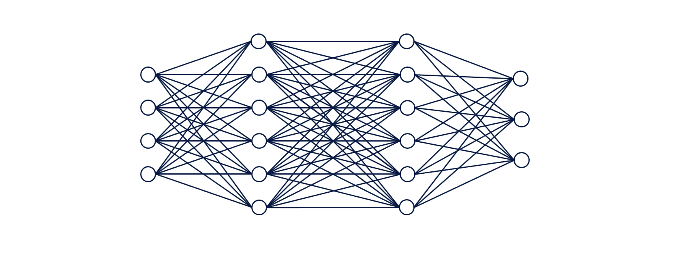
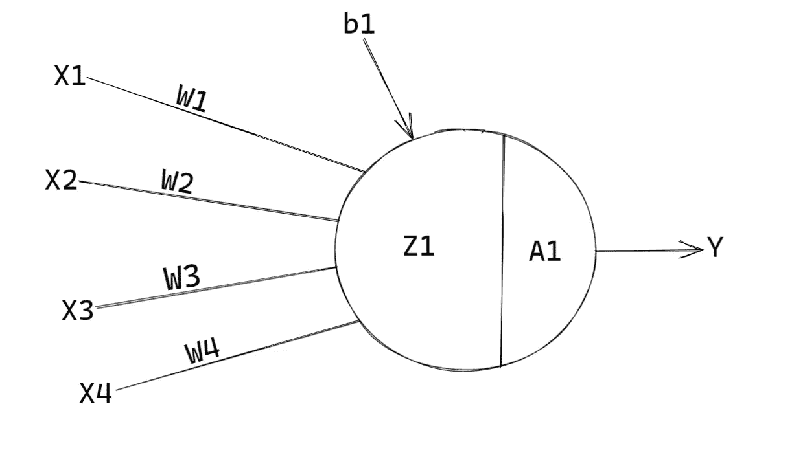
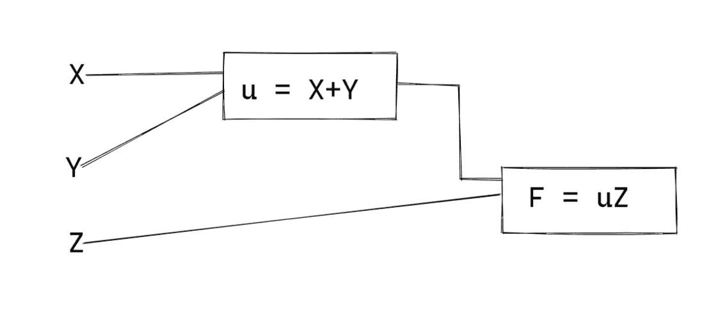
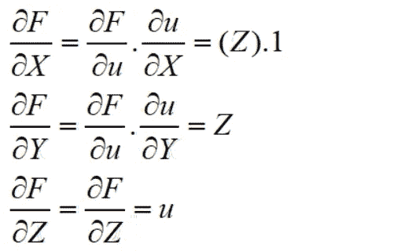

# 神经网络的工作

> 原文：<https://medium.com/nerd-for-tech/working-of-neural-networks-bfc6a80d0104?source=collection_archive---------12----------------------->

在我以前的博客中，我讨论了一种与人脑相似的网络，它如何工作以及它如何与人脑相似，还讨论了神经网络的各种特征——权重、总和以及非线性，并通过对一些重要类型的网络进行分类来结束。现在让我们了解神经网络的完整工作过程。

来源:这很容易:神经网络介绍~ [SydneyF](https://community.alteryx.com/t5/user/viewprofilepage/user-id/17210)

神经网络基本上在三个阶段或三个不同阶段中工作:向前传播、损失计算或最小化成本以及向后传播。这些是神经网络工作背后的主要根源。现在，让我们一个一个来看。

# 正向传播

众所周知，左侧有一些特定的输入，通过网络中的一些节点到达输出端，因此信息从左侧向右侧输出的这种移动称为正向传播。

网络中的单个节点

这是蚂蚁网络中隐藏层的单个节点，这里你可以看到 X1，X2，X3，X4 作为信息输入或输入特征向量，在乘以各自的权重并加上偏差后，输入到节点中。现在，通过执行这个操作，我们得到 Z1，它是一个部分输出，通过激活函数。激活函数在神经网络中非常重要。本质上，它们将输入信号转换为输出信号——这就是为什么它们也被称为*传递函数和*对 Z1 进行非线性变换。

正向传播方程

这些是正向传播的基本方程，这里 g1 是用于 Z1 的激活函数。还要记住，权重和输入信息是矩阵格式的，因此大小应该能够产生点积，然后它们应该具有与偏置矩阵相同的大小，以便进行相加。

# 损失函数

在机器学习算法中，我们希望在学习过程中最小化每个训练样本的错误。这是使用一些优化策略完成的，并且误差来自损失函数。

到目前为止，我们已经预测了输出 Y，现在我们需要检查这个预测的误差，这个预测实际上有多准确。对于一个好的预测，我们应该具有最小的误差，这是通过尽可能最小化成本函数来实现的，这是在下一阶段反向传播中完成的。为此，我们有不同的算法，如梯度下降、随机梯度下降等。

均方误差

例如，如果我们将均方误差作为损失或误差函数，这里 Y 是实际输出，Y 是预测输出。上面提到的是特定模型的误差或损失函数。我们的最终目标是优化模型，这是通过最小化成本函数来实现的，这可以通过获得成本函数曲线的最小值的全局最小值来实现。因此，让我们通过理解反向传播来看看这是如何做到的。

# 反向传播

我们已经在前向传播中完成了网络的路径，现在站在输出值处，从这一点开始反向传播，我们必须在学习时从输出侧移回到输入侧。在这种情况下，我们必须将信息从输出端传递回输入端。在这种情况下，我们调整网络中存在的权重和偏差。我们计算所有后退步骤的损失偏导数，并在使用这些梯度时更新参数。这实际上告诉我们，当我们改变权重和偏差时，成本变化有多快。

通过反向传播更新权重

我们向后传播以更新我们的权重矩阵。如上面梯度下降中所示，我们通过对我们网络中的权重(W)取损失函数的部分梯度来做到这一点。偏差矩阵也以这种方式更新，其中α是整个网络的学习速率。在反向传播中，最重要的元素是偏导数，没有这些，反向传播就不会发生。

用于解释反向传播概念的示例网络

为了更好地理解反向传播的过程，把上面的例子看作一个网络，这里 X，Y，Z 是输入向量，但是在这个例子中把它们的值分别看作 1，2，3，u 是节点，F 是输出。现在，我们必须为这个网络执行反向传播，因此我们必须计算 F 相对于 X，Y 和 Z 的偏导数，并更新它们以获得更好的结果。因为 F 与 X 和 Y 都不直接相关，所以我们必须遵循链式微分法则来得到各自的导数。下面是应用链式法则的这个问题的导数方程。

用链式法则求偏导数

计算完这些方程后，你将得到偏导数(记住，在偏导数的情况下，微分只对一个特定变量进行，其余的都被视为该特定偏导数的常数)，偏导数也在上述方程中计算。因此，我们通过这三条路径的反向传播从输出端到达输入端，直到 X、Y 和 Z，现在我们可以使用更新等式更新这些值，然后再次向前传播以获得更好的结果。所有这些计算都由动态库 Tensorflow、keras 和 Pytorch 的复杂框架负责。但是作为一个有抱负的深度学习爱好者，你应该总是知道后端发生了什么，并且应该深入了解。

我们讨论了损失函数的概念，这对于反向传播是必不可少的，因为在上述示例中，我们实现了函数(F)的整个过程，基本上 F，而反向传播是在不同节点处的损失，其被向后携带并计算每个可能的不同路径的各种偏导数，直到输入向量。

# 结论

这就是深度学习的美妙之处，进行强大的实验，解决巨大的现实生活场景，但背后有基本的数学。在这一章中，我们介绍了神经网络如何工作，它有哪些不同的阶段，以及每个阶段是如何高效工作的。我们也看到了神经网络每个阶段背后的数学，希望你们理解它。我只通过普通的数学表达式解释了这些概念，但它以矩阵或主要是向量的形式输入，所以方程是相同的，只是你必须注意矩阵乘法的性质，特别是你必须检查它们的形状。

我试图深入探讨神经网络，并希望你们理解其工作背后的直觉和实际数学。我们现在将实现它们，在即将到来的博客中，我将实现神经网络，我们将尝试解决一些现实生活中的分类问题。通过 python 编程可视化分类输出和理解整个网络将会很有趣。此外，我们将在神经网络常用库 TensorFlow 和 Keras 的帮助下实现。

希望这能帮助你更好地理解神经网络，请留下你的疑问，祝你学习愉快！！