# WSO2 Identity Server 使用 CA 签署的证书与 Office365 连接

> 原文：<https://medium.com/nerd-for-tech/wso2-identity-server-run-with-ca-signed-certificate-for-office365-4cba32c60896?source=collection_archive---------2----------------------->

要使用本地 IAM 提供程序(如 WSO2 Identity Serer)连接到 office365 帐户，我们需要一个 CA 签名的证书。但是在阅读本文之前，您需要为自己创建一个域，并将该域添加到 Office365 域中。所以要在 Office365 中添加你的域名先遵循这个 [***链接***](https://maneeshaindrachapa.medium.com/add-domain-to-office-365-865ec65943af) 。

当您运行 WSO2 identity server 时，您将获得一个 URL '*https://localhost:9443/carbon '*，当您尝试使用浏览器访问它时，您必须浏览如下页面。

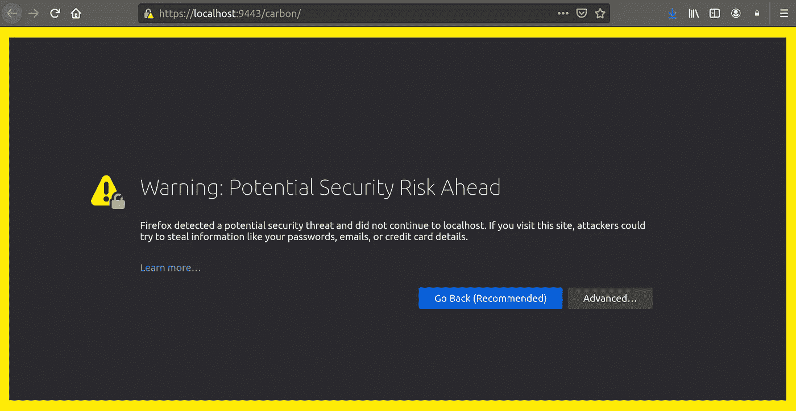

实际上，当身份服务器试图通过 *HTTPS* 浏览器访问*本地主机*时，需要验证身份服务器是否拥有本地主机，浏览器将要求身份服务器提供一些证明，然后身份服务器将提供其拥有的公共证书，但问题是公共证书是自签名证书。因为它是自签名浏览器，所以会警告用户，如果用户信任身份服务器，访问站点是不安全的。因此，我们可以在浏览器中转至“高级”,并访问 identity server admin 登录页面。

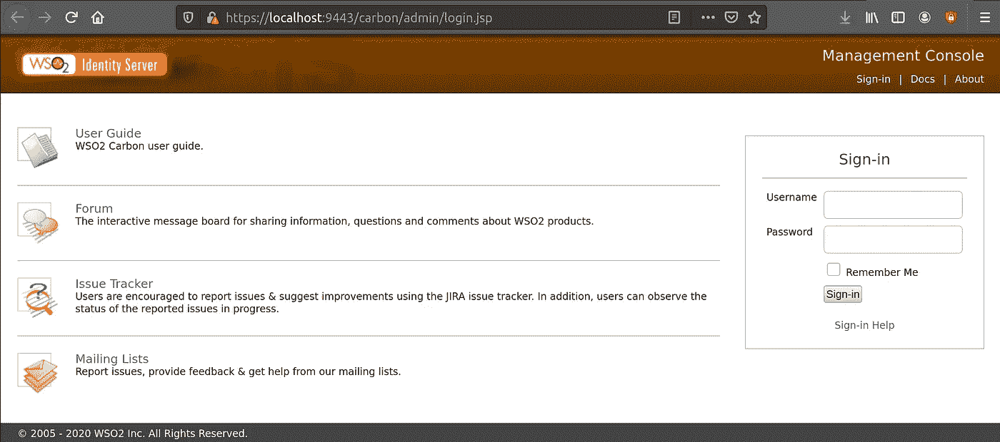

但问题是，当我们试图从我们的 *localhost* 认证一个微软登录时，微软无法将 *localhost* 视为一个可信的 *URL* ，因为它只会信任证书，而不会提示用户信任 *localhost。所以登录最终会失败。为了避免这种情况，我们需要一个 CA 签名的证书。*

# 在 WSO2 身份服务器中配置 CA 签名的证书

## 生成新的密钥库

因此，要用自签名公共证书创建一个新的密钥库，让我们创建一个文件夹，然后继续，我在这里使用的文件夹将被称为<ca_keystore></ca_keystore>

```
keytool -genkey -alias wso2carbon -keyalg RSA -keysize 2048 -keystore newkeystore.jks -dname "CN=<your_domain_name>, OU=Home,O=Home,L=SL,S=WS,C=LK" -storepass wso2carbon -keypass wso2carbon
```

上面的命令将创建一个名为`*newkeystore.jks*` *的密钥库。*如果 keytool 命令在 ubuntu 中不起作用，您需要检查是否正确设置了 *$PATH* 和 *$JAVA_HOME* 环境变量。如果我们偷偷看一下我们执行的 keytool 命令，就会发现

*   *CN-Common name*:Common name 是服务器身份，因此在某种程度上这个密钥库告诉我们，“我代表这个域”。所以这是你想放域名的地方。
*   *storepass -* 该密钥库的密码。
*   *keypasss -* 私钥的密码。
*   别名是将你的私钥和公钥绑定在一起的东西
*   *2048* -这意味着私钥长度为 2048 个字符

如你所见，我使用了 *wso2carbon* 作为*别名*、 *keypass、*和 *storepass* 。这是为了轻松地更新我们的 WSO2 IS Keystore 证书。如果您想对 *keypass* 和 *storepass* 使用不同的密码，请[参考本文](https://is.docs.wso2.com/en/5.9.0/administer/configuring-keystores-in-wso2-products/#!)。

## 生成证书签名请求(CSR)

所以现在我们有了一个包含公钥和私钥-值对的密钥库。对于域名，我用我的域名***CN = maneeshatest 39 . tk****指定了***CN =<your _ domain _ name>***。你可以看到我们为我们的 CN 添加了任何名称。我甚至可以为我的 CN 添加“[](https://www.facebook.com/)*”字样，但是没有人会相信我们拥有这个域名，对吗？所以问题是我们如何向每个人表明我们才是这个域名的真正拥有者？**

*答案是我们需要从创建的密钥库中获取一个公共证书。这将包含安全通信所需的加密公钥，以及 CN 名称。然后我们证明我们拥有这个 CN 给一个著名的家伙，并让他在这个证书上签名。用技术术语来说，这个著名的家伙被称为认证中心(CA)。*

*为了首先对证书进行签名，我们需要为我们的密钥库创建一个证书签名请求(CSR)。这将提交给 CA 以获得签名证书。为此，请在终端中运行以下命令。它将要求密钥库密码提供您在创建密钥库时使用的密码。*

```
*keytool -certreq -alias wso2carbon -file newcertreq.csr -keystore newkeystore.jks*
```

## *从证书颁发机构(CA)获取签名证书*

*现在我们需要向 CA 展示我们的 CSR，并获得 CA 签名的证书。有像许多 CA，你需要支付金钱，并得到一个 CA 签名的证书，也有一些免费的。我尝试了 https://www.sslforfree.com 的[](https://www.sslforfree.com/)**，它将免费提供一个 90 天的 CA 签名证书。***

***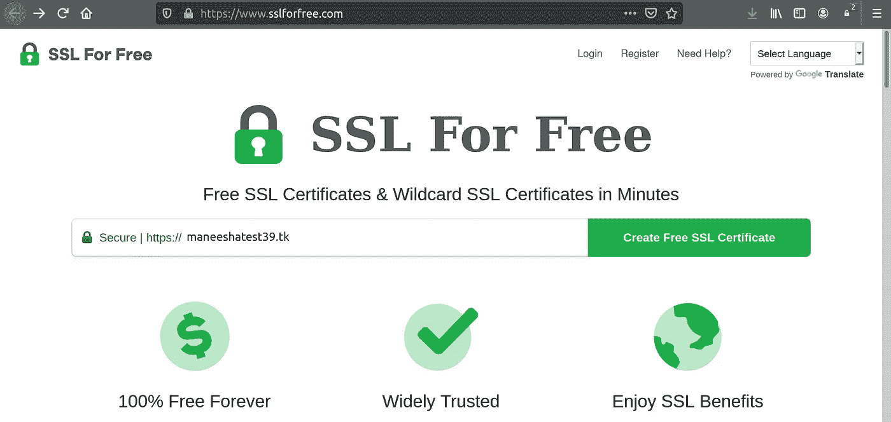***

***请转到这里，输入您的域并单击“创建免费 SSL 证书”,然后您需要创建一个帐户，然后他们会提示您进入您的控制面板，在那里您可以完成证书签名过程。但是在签署域名之前，你实际上需要为你自己拥有那个域名。有一个叫 [***freenom***](https://www.freenom.com/en/index.html?lang=en) 的网站在那里可以有一个*。tk 域名*免费。您需要将该域添加到 Office365 域中，因为我们将使用该域连接到 Office365。因此，要将域添加到 Office365，请遵循此 [***链接。***](https://maneeshaindrachapa.medium.com/add-domain-to-office-365-865ec65943af)***

****

**Ok 在[***SSL forfree***](https://www.sslforfree.com)*您可以通过提供您拥有的域名继续 CA 请求。***

***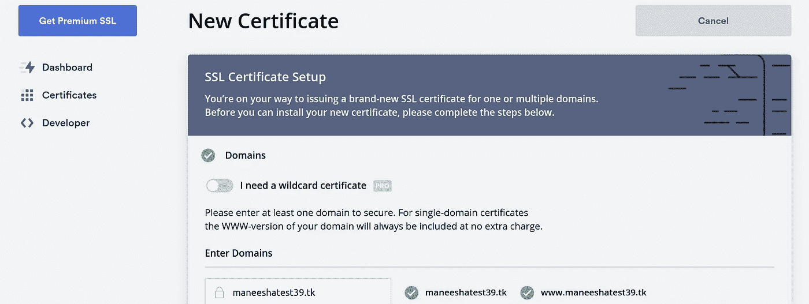***

***然后他们会给你看那个证书的有效期。***

******

***然后对于 CSR 和联系人，需要选择 ***粘贴已有的 CSR*** 选项。我们需要在文本框中输入“pem”格式的 CSR。***

**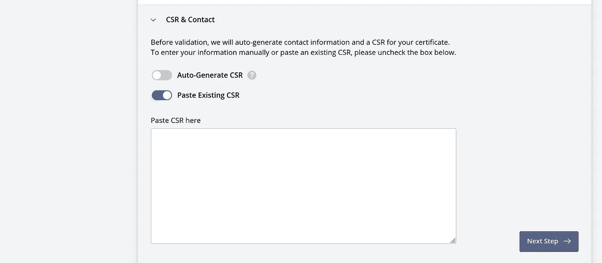**

**从这里开始，我将切换到 [***Keytool GUI 版本***](https://keystore-explorer.org/) 。对于其余的任务，与命令行键工具相比，它是一个更容易的工具。使用 Keytool GUI 打开上面创建的`*newcertreq.csr*` 文件。现在点击 *PEM* 按钮。**

**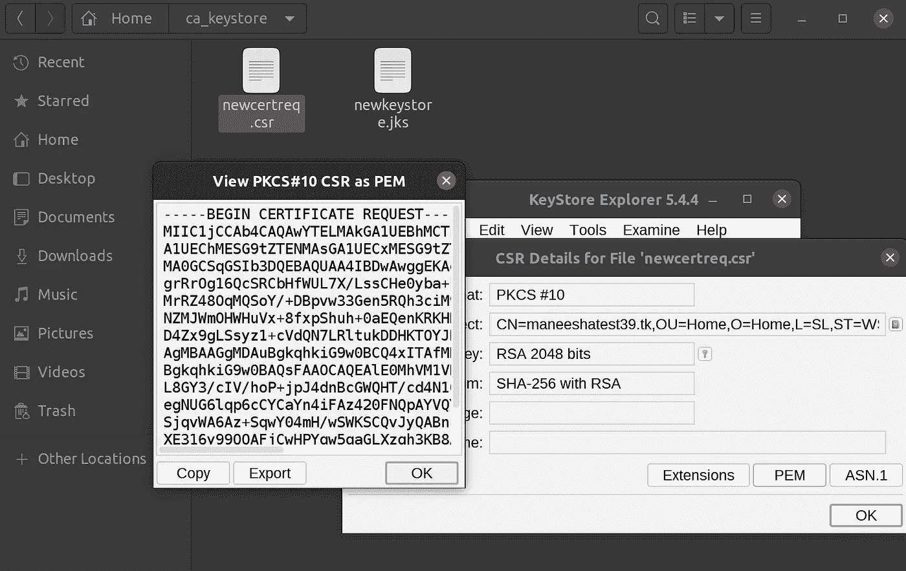**

**将该值粘贴到请求 CSR 的文本框中，然后单击下一步。然后，他们会要求您的计划再次选择免费的 90 天版本，并单击完成。**

**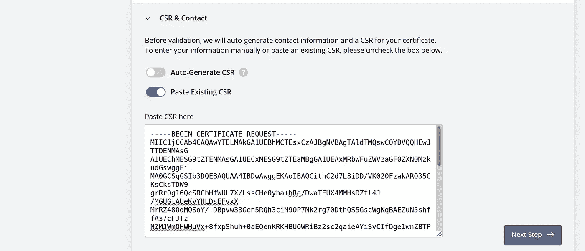**

**然后他们会要求你验证你的域名。因为他们实际上想知道你真的拥有这个域名。所以他们会要求你验证你的域名。最简单的方法是将 CNAME 记录添加到您的 DNS 中。**

**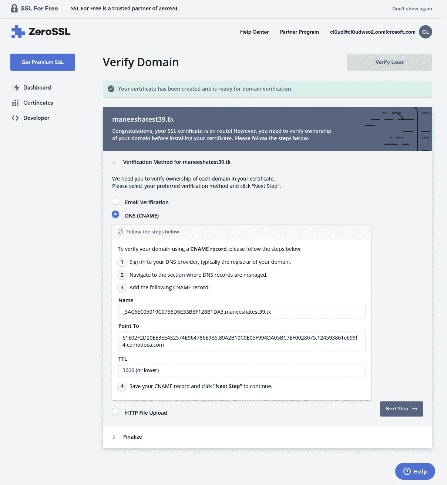**

**所以我们将这个***maneeshatest 39 . tk***作为域名添加到我们的 Office365 中，并将我们的 freenom 域名服务器改为微软域名服务器。因此，要添加记录，您需要登录 Office365 管理面板，转到“域”部分，选择该域，然后单击“添加记录”，然后添加 CNAME 记录。**

**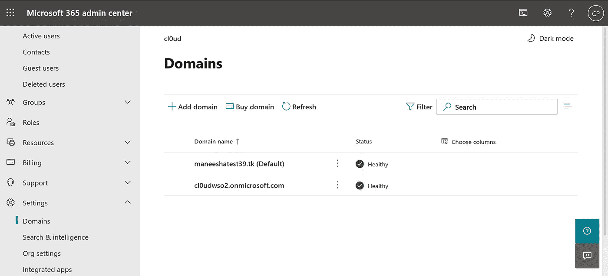****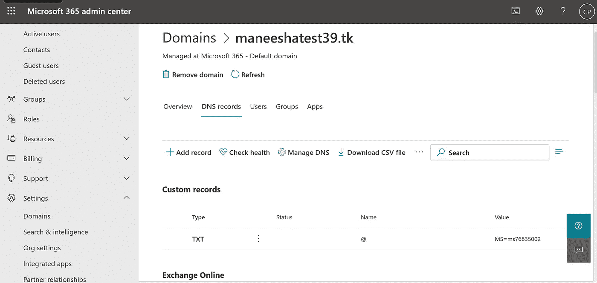****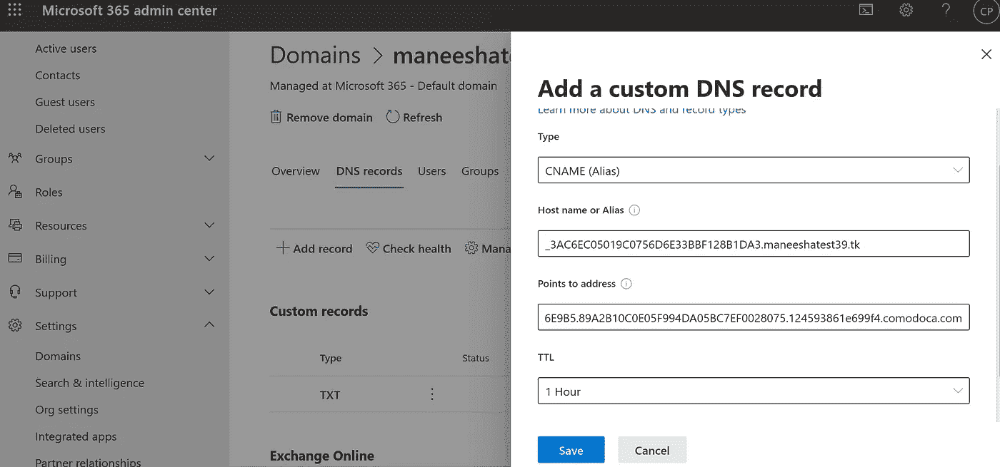**

**如果一切顺利，并且您等待了足够的时间来使用我们添加的 DNS 属性，服务器将会意识到该域实际上是由您拥有的，并给您 CA 签名的证书。**

**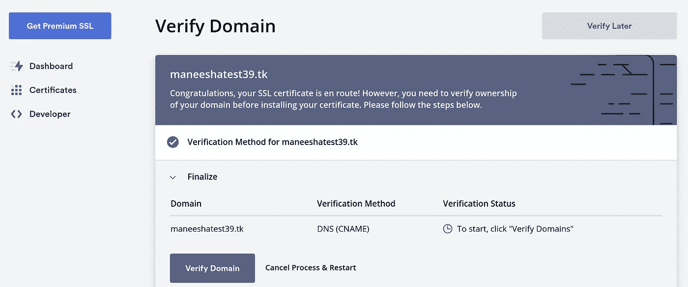****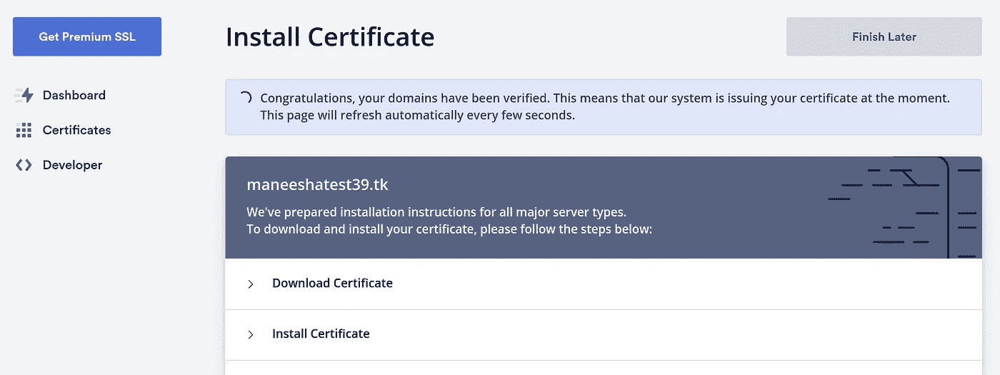****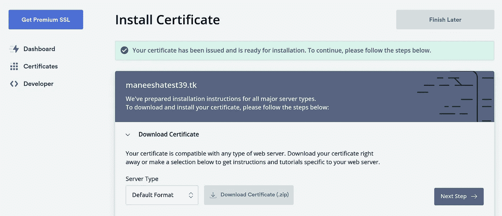**

**证书已经颁发，可以安装了。现在，您可以下载您的 CA 签名证书，我们解压缩 zip 文件，查看其中的文件，将有两个文件。**

****

*   **ca_bundle.crt - CA 签名的证书**
*   **certificate.crt -一组中间证书**

**现在带着这些文件回到<ca_keystore>文件夹。使用 Keytool GUI 打开`*newkeystore.jks*` 文件，导入上面收到的`*ca_bundle.crt*` 文件，使用 ***工具* - > *导入可信证书*** *。使用不同于 *wso2carbon 的别名。**</ca_keystore>**

*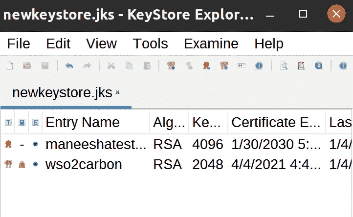*

*现在，您可以在密钥库中看到一个名为 wso2carbon 的密钥对。在新添加的证书旁边。这是私钥+自签名公钥对。*

*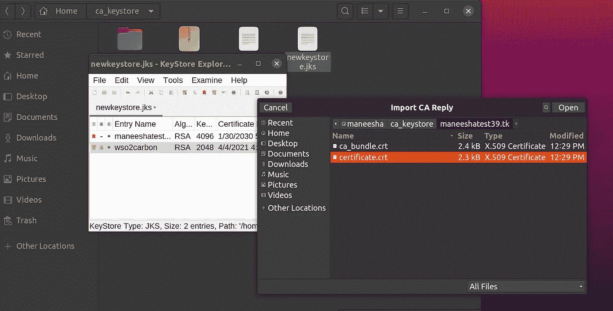*

*现在我们需要添加我们的 CA 签名证书。它将替换该密钥对中的现有公钥。为此，右击 *wso2carbon* 并点击 *Import CA reply。选择从 FreeSSL 接收的 CA 签名证书。**

*现在，我们已经成功地向`newuserstore.jks` 密钥库中添加了一个 CA 签名的证书。双击 WSO 2 碳密钥对。它将显示公共证书的详细信息。上面写着这是由**用户信任 RSA 认证机构**签署的。*

*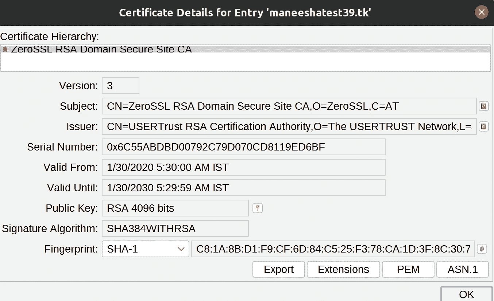*

*现在让我们将这个公共证书添加到 WSO2 身份服务器的信任存储中。首先，导出公共证书。再次右键单击 wso2carbon 密钥对。选择*导出*->-*导出证书链。*获取导出的 ***x.509.cer*** 文件。*

****

## *替换 WSO2 身份服务器密钥库*

*现在转到`*<IS_HOME>/repository/resources/security/*` 你会看到下面的文件。*

**

*移除`*<IS_HOME>/repository/resources/security/wso2carbon.jks*`文件并将`*<CA_KEYSTORE>/newkeystore.jks* file there. Rename *newkeystore.jks*`复制为 *wso2carbon.jks* 。*

*使用 keytool GUI 打开`*<IS_HOME>/repository/resources/security/client-truststore.jks*` ，通过*工具- >导入可信证书，导入我们之前从`*newkeystore.jks*` 导出的 x.509 公共证书。**

*并且还打开`*<IS_HOME>/repository/conf/deployment.toml*` 文件并将`*<HostName>*` 值更改为 *maneeshatest39.tk.* ，因为这将是 WSO2 身份服务器的主机名。*

**

*现在一切都完成了，启动您的 WSO2 IS 实例(如果它已经在运行，您需要重启它)*

*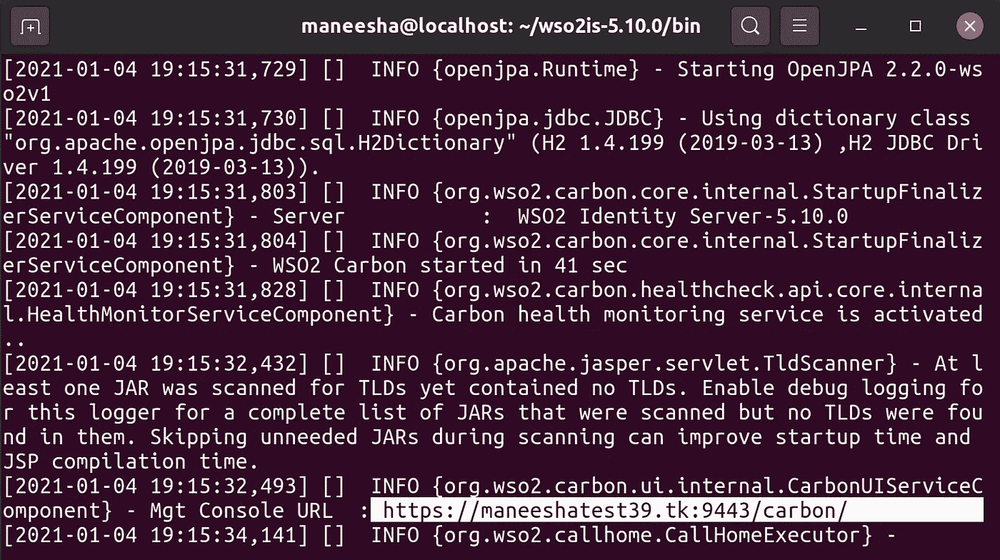**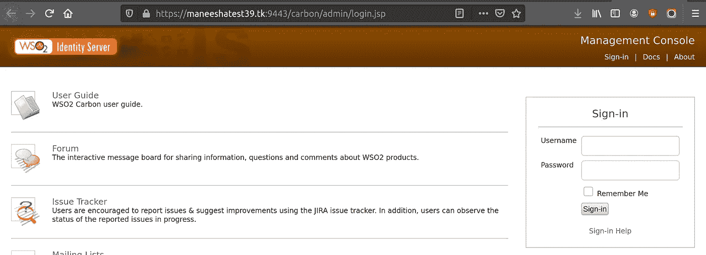**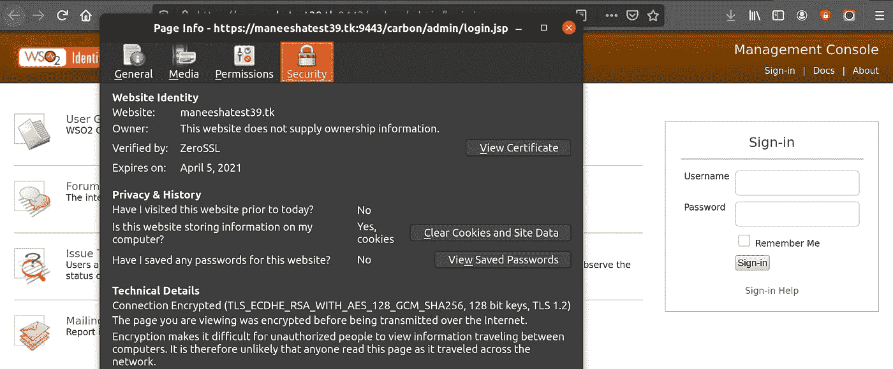*

*现在，如果我们通过浏览器查看证书，它会显示我们现在有一个可信的证书。*

*从[https://wso2.com/identity-and-access-management/](https://wso2.com/identity-and-access-management/)了解更多关于 WSO2 身份服务器的信息*