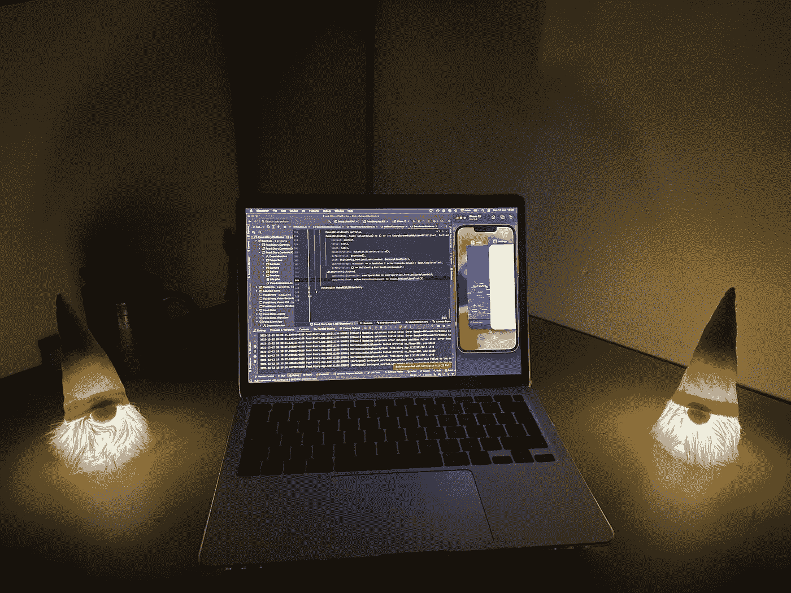

# Xamarin。表单和可拖动视图。新年故事

> 原文：<https://medium.com/nerd-for-tech/xamarin-forms-and-draggable-view-the-new-year-tale-446632aa18d9?source=collection_archive---------0----------------------->

## 这是一个关于如何在 Xamarin 中制作可拖动视图的新年故事。表单应用程序。

从前，一个新的要求来到了童话世界。*“我们需要在一些控件的内部区域创建一个可拖动的按钮，”——*它说。“这没什么大不了的，”——一个开发者想道，但他不知道魔多的黑魔王并没有睡着。

*“我想让它在不同的项目和场景中可重用”——*他说——*“这就是为什么它应该允许放任何* `*View*` *进去！”*

最后，新的可拖动视图的实现需求如下:

*   创建从`ContentView`继承的新自定义控件，以提供放置任何内容的可能性。
*   由某个限制区域(他的父区域)进行拖动限制

工作开始了…

# 旧的好的自定义控件

通常，实施始于众所周知的四个字:`public class DraggableView : ContentView {}`。但是我们需要定义哪些可绑定的属性呢？多亏了`ContentView`，我们已经可以设定任何的`Content`。`LimitArea`—我们需要限制我们的控制在家长控制内的转换！为此，我们需要一个新的模型— `DraggableArea`模型。

# 双塔- Android 和 iOS 平台渲染器

众所周知的自定义渲染器的基础已经完成，开发人员开始考虑如何通过父视图限制其转换。

*“我们需要处理一个长点击来开始拖动控件”——开发者说*。

*“我们没有物业被设置新的临时位置”* —一位开发商说。

# 阴影之地—拖动自定义控件的逻辑

回到`DraggableView`，开发者不确定我们是否需要创建像 Bindable 这样的新属性。喝着啤酒沉思了很长时间后，他想到了一个解决方案— *“这应该是可绑定的属性，因为允许开发人员绑定和修改它们，而不需要修改定制的呈现器。”*

之后，我们需要识别移动手势，以便在转换控件本身之前设置正确的`NewX`和`NewY`。

*“只剩下元素的翻译”* —开发者认为。

开发人员对完成的所有工作很满意，并开始测试他的控件内部的一个按钮…

# 怀疑和巨大的恐惧笼罩着刚铎城——按钮指令在两个平台上都不太好用。

开发人员心中充满了恐惧和怀疑，但解决方案是显而易见的。在阐明需求之后，他知道内部可能只有一个可点击的元素，不会更多。
*“在那种情况下”——*他喊道*——“我们可以在我们的 DraggableView 中添加命令可绑定属性，只有当放置在其中的内容必须在用户点击它时做出响应时才使用。”*

# 现在一切都很顺利，希望永远变得更好…

> 这是我们新年故事的快乐结局。特别感谢 [**Andrii Kharechko**](https://www.linkedin.com/in/andrii-kharechko-760356ba/?originalSubdomain=pl) 。

下面你可以找到 XF & Android & iOS 的所有代码😉

 [## Andrii Kharechko -高级 Xamarin 软件开发人员- Nexio 管理有限公司| LinkedIn

### 在世界上最大的职业社区 LinkedIn 上查看 Andrii Kharechko 的个人资料。安德里有 3 份工作列在…

www.linkedin.com](https://www.linkedin.com/in/andrii-kharechko-760356ba/?originalSubdomain=pl)