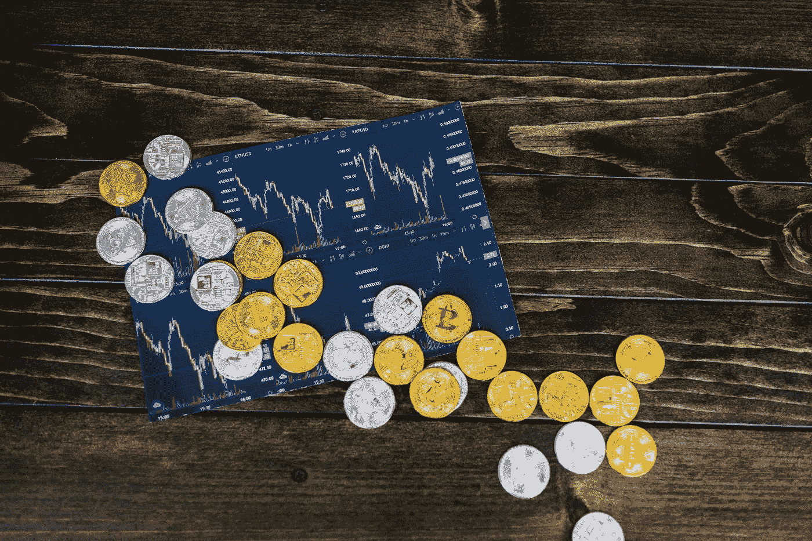

# 产量耕作与打桩:哪个更好？

> 原文：<https://medium.com/nerd-for-tech/yield-farming-vs-staking-which-is-better-a5556e07cdb?source=collection_archive---------2----------------------->

来自 Pexels.com

随着最近对加密货币的兴趣增加，人们正在寻找替代选择，以获得被动收入，而不是主动交易。尤其是在活跃交易的高风险下，投资者会利用其他策略来赚取额外收入。在密码市场赚取额外收入的各种方式中，主要的争论是产量农业和赌注农业。

产量农业和赌注是两个 deFi 投资策略。DeFi 的意思是分散金融。区块链网络上的全球金融系统，通常是以太坊。然而，每种解决方案都为投资者提供了不同的方法来以 Dapps 抵押他们的加密货币。

在这篇文章中，我们将看看*产量农业和*打桩，他们的差异，以更好地了解哪个解决方案最适合你。

## 什么是产量农业？

产量农业，也称为流动性开采，是一个新概念，在 2020 年复合引入时开始流行。

产量农业是一种从你的加密资产中赚取更多的方法。它包括通过 DeFi 借出协议(如 Compound、MakerDAO 或 Aave)向其他人临时借出令牌。或者，您可以直接在 Uniswap 和 PancakeSwap 等分散式交易所(DEX)平台上提供流动性。

## 产量农业是如何运作的？

DeFi Yield 使用智能合约或自动市场标记(AMM)来简化交易。在这里，收益农民(LP)将代币添加到流动性池中，供其他用户借出、借入、购买和出售加密货币。

因为产量养殖池是有竞争力的，他们也有很高的投资回报。

然而，更高的利率是否涵盖了高产农业的风险和波动性？也许是，也许不是。

让我们看看下一个:赌注。

## 什么是赌注？

类似于把钱锁在银行里当“定期存款”。赌注包括锁定一部分加密货币来支持区块链网络，作为回报，赚取利息。

赌注是一个伟大的方式来使用加密产生被动收入。此外，限制代币的流通会增加代币的价值。

Staking 使用工作证明(PoW)和利益证明(PoS)来确认区块链平台上的交易。staking 使用 PoS 来验证交易，而不是使用高能耗的 PoW 方法来挖掘加密货币。

## 赌注是如何运作的？

首先，赌注者将他们的代币抵押给加密货币协议。然后，协议随机选择验证器来确认事务块。您锁定的令牌越多，您被选为验证者的机会就越高。

在区块链，押币铸造新的方块，方块的验证者会因此获得奖励。赌注仅适用于使用 PoS 系统的加密货币。例如，比特币属于战俘区块链，因此不能被下注。

然而，这里有一些可以下注的加密货币:

*   卡尔达诺
*   多边形
*   以太坊
*   泰佐斯
*   希腊字母的第八字

带回家，赌注的目的是确保区块链网络。赌注越高，区块链就越分散和安全。

## 产量农业与赌注

在前面的章节中，我们介绍了产量耕作和打桩，以了解它们是如何工作的。

在这里，我们将看看他们的不同之处。我们走吧。

考虑到这两种策略，利用代币农场似乎是被动收入的最有利可图的选择，也可能是高风险的。

就盈利而言，产量农业不像跑马圈地那么简单。但有限合伙人的收益率可能会超过 100%。另一方面，下注奖励(APY)的范围在 5% — 15%之间，具体取决于下注令牌。

考虑到风险水平，产量农业极易受到“拉地毯”和黑客的攻击。当一个项目的开发商关闭项目并带着资金消失时，就会发生“拉地毯”事件。但是说到赌注，这是可以管理的。赌注遵循严格的政策，因此，拉地毯不太可能发生。

与产量农业不同，赌注允许投资者长期锁定他们的代币，以增加回报(或 APY)。

现在你已经看到这两种策略是不一样的。产量农业旨在获得有史以来最高的利润，而赌注为区块链网络提供安全，同时也赚取回报。

## 哪个更好？

根据你的密码知识、承担的风险和目标，在产量耕作和赌球之间选择被动收入的最佳选择。

如果你是一个新手，下注就可以了，因为一旦资金锁定，就不需要那么多关注了。

然而，如果你对自己的技能很有信心，并且你的目标是在短期内获得额外收入，那么高产农业是一个不错的选择。否则，加入赌注池或不强制执行时间锁的区块链会更好。