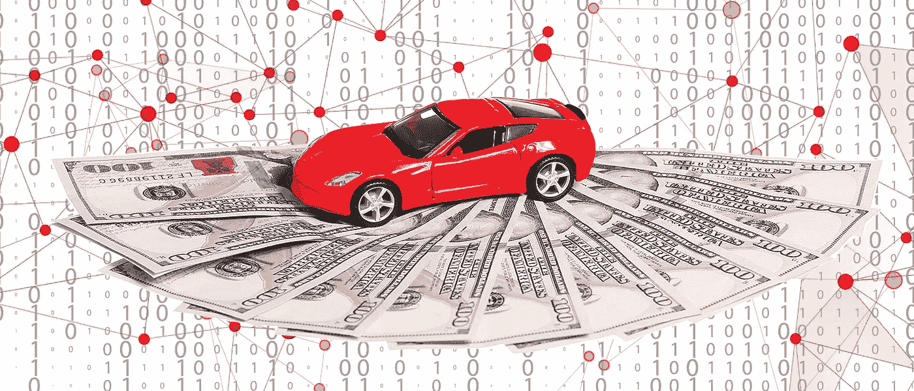

# 你的互联汽车:大哥的小帮手？

> 原文：<https://medium.com/nerd-for-tech/your-connected-car-an-agent-for-big-brother-9ec3269a2558?source=collection_archive---------1----------------------->

如果你还没有注意到，你的现代汽车只是另一个数字设备。实际上，一个设备由几十个到 100 多个其他设备运行——传感器和称为电子控制单元的控制模块。

它们监控或控制从油压到气流、冷却液、发动机操作、油门、刹车、燃油压力、信息娱乐等一切。

哦，他们中的许多人也监视你。

有时这可能是一件受欢迎的事情，比如如果你在事故中被撞得不省人事，你的车会拨打 911。

但是正如[标记最近记录的那样](https://themarkup.org/the-breakdown/2022/07/27/who-is-collecting-data-from-your-car)，你的“智能”车辆也在收集“一大堆敏感数据”,这些数据与在紧急情况下帮助你毫无关系，然后将它们传输给数十家公司。有些是主要的保险或电信品牌，但许多是“几十个你从来不知道存在的商业生态系统”的一部分。

的确，你肯定听说过威瑞森、美国电话电报公司、Geico、Liberty Mutual、LexisNexis 等品牌，但 CCC-X、Otonomo、Mojio、Samsara、Verisk、Wejo 和 Zeliot 又如何呢？还有更多——标记列出了 37 个，它说这是一个不完整的列表。大多数非保险公司或电信公司都属于“车辆数据中心”和“车辆远程信息处理”的范畴。这意味着他们收集、分析、组织和出售数据。你的数据。

根据标记，“大多数司机[不知道从他们的车上传输了什么数据，更不用说到底是谁在收集、分析和分享这些数据，以及与谁分享。”](https://www.documentcloud.org/documents/22120767-capgeminiinvent_vehicledatamonetization_pov_sep2020#document/p10/a2130251)

Synopsys 软件完整性小组的首席科学家萨米·米格斯(Sammy Migues)表示，即使车主确实知道，这些数据“对许多人来说也没有任何意义，即使那些理解这些数据的人也可能想不出所有可能被滥用的方式。”

**没有选择**

除此之外，即使是那些理解和反对它的人“除了不买车之外也无能为力——目前，除非二手车市场枯竭。”

这就是未来。“未来将不会有非遥测发电汽车，”米格斯说。

事实上，虽然所有这些公司都在主流意识的雷达下飞行(可能是因为他们很少或没有做公共广告)，但他们是新兴但不断增长的联网汽车数据行业的一部分，据估计，从现在起不到八年，到 2030 年，这个行业的价值将达到 3000 亿至 8000 亿美元。

根据麦肯锡&公司的说法，对从车辆数据中获利感兴趣的公司生态系统包括文具贸易和休闲、政府、广告和营销、内容提供商、第三方市场、金融服务、科技公司、充电和加油提供商以及基础设施公司。麦肯锡补充道，这份清单“并不详尽”

换句话说，信息不仅仅是权力。是钱——很多钱。

但显然，车辆信息也是个人的。也就是说这涉及隐私。或者更确切地说，侵犯隐私的含义。标记指出，车辆数据收集从司机进入汽车的那一刻开始。数十个传感器收集数据并将其发送到汽车的计算机，涵盖从车门是否解锁到是否有乘客、内部温度和天窗状态的所有信息。

一旦行程开始，传感器还会收集和传输位置和速度、刹车、大灯、雨刷的使用、轮胎压力、娱乐系统正在播放什么、油位是否低、车辆是否需要定期维护等等。

一些数据收集产生了我们觉得方便的信息，比如高速公路上的那些标志告诉我们接下来的 12 英里需要多少分钟。“他们”是怎么知道的？通过 GPS 跟踪你的车辆和你周围的其他车辆。这也是为什么你的智能手机方向应用程序可以告诉你在你将要走的路线上是否有交通堵塞。

**这么多用途**

但这只是数据的一小部分，它从汽车制造商到联网汽车数据市场的旅程，正如他们所说的那样，“货币化”

在某些情况下，公司会主动使用数据收集进行监控。多家保险公司为同意在汽车上安装传感器的投保人提供折扣，该传感器将监控他们的驾驶情况——行驶多远、何时、去哪里；他们的速度；他们如何使用刹车和油门；更多——更多。年度保险费的折扣可以达到 150 美元或更多。当然，从另一个角度来看，想要维护个人隐私的司机必须支付 150 美元或更多的罚款。

但总的来说，汽车数据中心和远程信息处理行业的人坚持认为不存在个人隐私风险——他们收集、整理、分析和出售的数据是聚合和匿名的，他们说这意味着车主不必担心被识别或监控。

他们认为，收集和分析这些数据有很大的好处——从交通管理到电动汽车基础设施规划、车队管理、广告、地图绘制、城市规划和位置智能，这些数据都很有用。

**没那么简单**

隐私专家对此有不同的看法。

身份盗窃资源中心的首席运营官·李中清说，这些说法通常是真实的，车主的隐私已经得到了法律的保护。“有 17 个州的法律可以追溯到 2003 年，要求消费者同意，还有一个 2015 年的联邦法律(在[修正美国地面运输法案](https://www.goodwinlaw.com/~/media/6C54B1C03E6849FBB0D0E2755E4FFEB7.pdf)内)禁止在没有车辆所有者或承租人明确许可的情况下共享车辆数据，”他说。

他承认这些数据的网络安全至关重要。但他说，如果严格的安全保护与知情同意和匿名化一起到位，“那么正确使用和保护数据的所有要素都到位了。”

但是隐私与安全智囊团的首席执行官丽贝卡·赫罗尔德说事情没那么简单。她同意数据被聚合和匿名是有价值的，但她说这并不能使个人隐私变得无懈可击。

虽然从理论上来说，聚集大量数据将消除任何将特定数据点与特定个人联系起来的方法，“使用人工智能(AI)和机器学习(ML)工具，甚至长期使用的基本排序算法，这并不能保护隐私，”她说。“他们经常可以梳理所有这些数字数据，以解开假设的混乱，创建‘重新识别’的数据，从而产生特定个人的非常清晰的视图，”她说。

Herold 补充说，即使是匿名化——从数据集中剥离个性化数据——也会被不断发展的技术破坏。“人工智能/人工智能算法正在提高和降低这种有效性，”她说。“当匿名数据与其他数据集结合在一起时，有效性会进一步降低，甚至会暴露更多与个人的联系。”

**隐私地狱**

电子前沿基金会(EFF)的技术人员 Bennett Cyphers 走得更远。他告诉 Markup，美国大多数州出售的数据量和缺乏监管的情况是“隐私地狱中的一对”，并补充说“位置和移动数据的独特性增加了侵犯用户隐私的可能性。”

他说，“在你的车中，你被测量的方式越多，就越有可能有人能够[……]利用所有这些不同数据点的特征来识别特定用户或特定车辆的指纹。”他补充说，“人们的位置痕迹是极其独特的。”

米格斯也对匿名的承诺表示怀疑。虽然他同意有些人可能会努力保持匿名的承诺，但“建议所有的收集者和聚合者在获得数据的那一刻就从伦理和道德上识别所有数据，并且永远不允许它与特定的汽车或人联系在一起，这意味着我甚至不用买票就能赢得下一个百万，”他说。

这是否意味着这个行业的预期增长只是在隐私的棺材上多加了一颗钉子？

如果以历史为鉴的话，是可以的。

是的，有一些联邦立法努力要求公司在收集和分享(出售)数据之前必须得到肯定的同意。除了李引用的 2015 年司机隐私法案，更多的立法正在等待批准，包括[2022 年健康和位置数据保护法案](https://www.congress.gov/bill/117th-congress/senate-bill/4408/actions?r=20&s=1)和[美国数据隐私和保护法案](https://www.congress.gov/bill/117th-congress/house-bill/8152)。然而，这两项法案都没有接近通过。

Herold 最近发表了一篇[博客](https://www.isaca.org/resources/news-and-trends/isaca-now-blog/2022/changes-needed-to-us-federal-privacy-proposal-for-effective-implementation)批评这两项法案，他说，虽然它们“有许多伟大而有效的想法散布其中，包括同意要求”，但它们也有许多缺陷。她说，涵盖健康和位置数据的法案“不会阻止许多组织对健康数据的隐性销售，这些组织声称他们不属于书面的‘数据经纪人’定义。”

**更精细、更个性化**

而且，像数字世界中的一切一样，数据收集继续变得更加详细，正如他们所说的那样，“精细”，测量从心率到司机疲劳的一切。这意味着它更加个性化和侵入性。

Migues 说，即使数据是匿名的，它也可能被滥用。“想象一下，如果我将所有离开投票站的汽车的所有数据匿名，但我仍然知道有多少辆、什么时间等等。我可以用这些数据来扰乱投票站吗？或者如果我知道有多少车/司机超速/酒后驾车/等等。离开某个体育赛事后的门票。我会利用这一点进行某种活动，甚至对城镇/团队提起诉讼吗？或者有多少人去宗教中心？还是堕胎诊所？”

“即使是匿名数据也有很大的价值和很多被滥用的方式，”他说。

Lee 同意个人数据可能被误用和滥用——他指出,“匿名远程信息数据如果被盗，可能会揭示某些品牌或型号更有可能需要某些维修。将这些信息与被盗车辆所有权数据结合起来，就像 2021 年在德克萨斯州发生的那样，可能会使拥有这些汽车的消费者面临潜在的基于身份的欺诈。”

但他认为，尽管美国需要更强有力的数据保护、数据隐私和身份管理法律，但“目标不应该是因为害怕监控状态而终止数据共享。在知情同意的情况下，为许可的目的适当收集数据，可以带来有益和宝贵的好处。”

Herold 说需要更严格的隐私法是至关重要的。“有一些令人兴奋和侵犯隐私的数据收集产品正在想象、计划和测试中，但尚未向公众推出，”她说。

**挡在它前面**

但这意味着政府需要做得更好，她说，并认为目前各州和联邦法律的大杂烩不会做到这一点。

“我们需要建立一个联邦数据管理监管机构，而不是制定非常针对具体情况的法律和法规，”她说，“为任何类型的数据收集、导出、处理、分析、使用、共享、出售、修改、归档和删除制定管理护栏、安全和流程的规则和法规。”

她说，这可能有助于“将那些车辆隐私马的很大一部分放回马厩。”

但她指出，这不仅仅是联网汽车的问题，因为有几十到几百个商业部门参与了数据收集。“电信、技术、公用事业、学校、零售商、制造商和几乎无限多的其他类型的组织可以将他们收集的数据打包到产品和服务中，”她说。

米格斯表示同意。即使车辆的数据收集受到限制或控制，“如果我将一些收集硬件——蜂窝电话、车牌阅读器、废气分析仪等——放在车上会怎么样？—在交通信号、路灯和视频门铃中，然后出售这些数据？或者我简单地游说政府，说我提供数据的公共服务——交通控制、银行劫匪追踪、帮助发布黄色警报——然后我又是一个可行的收集者了？”